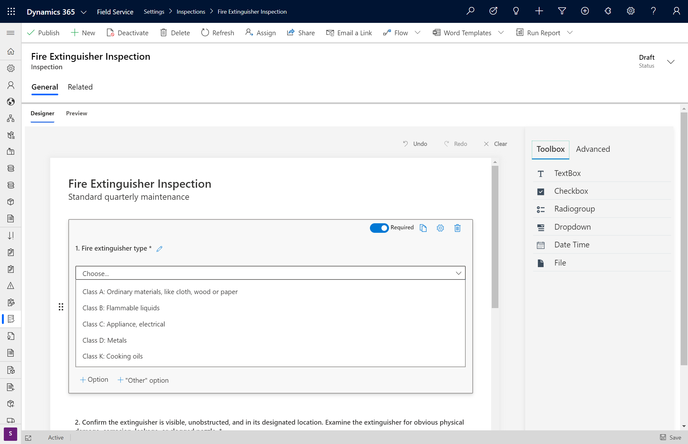
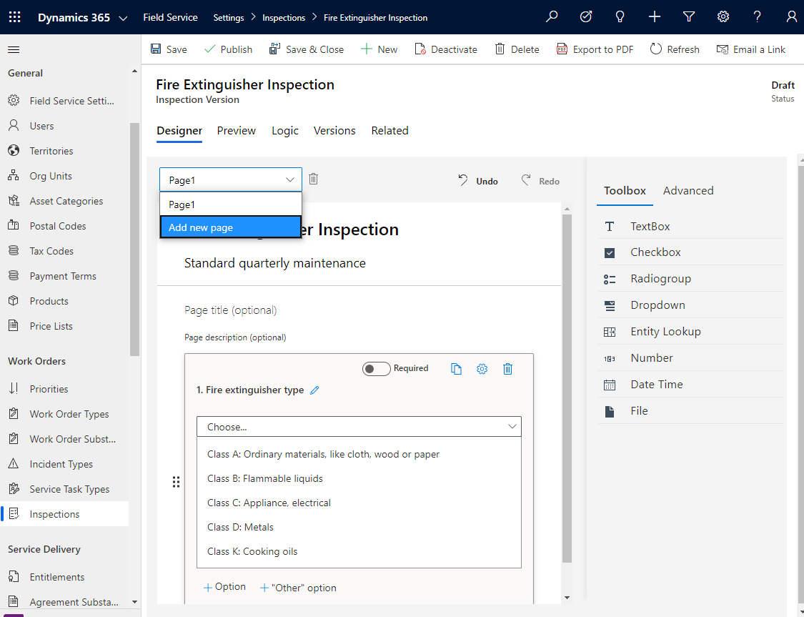
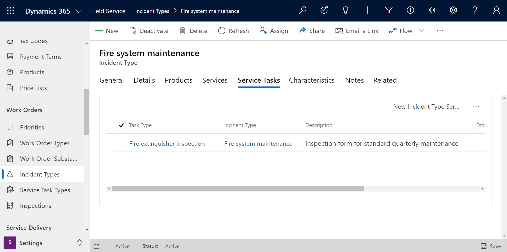
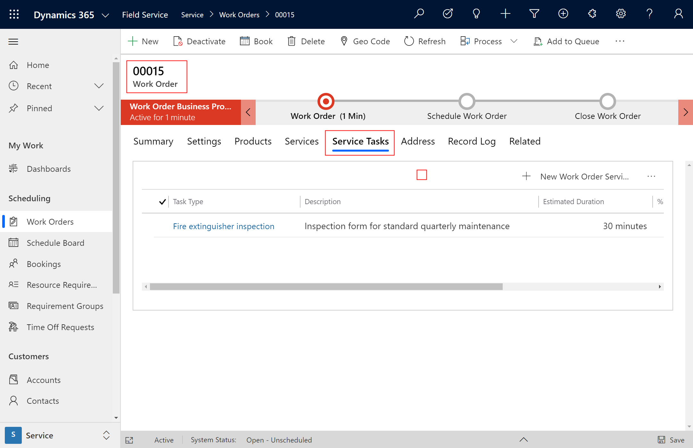
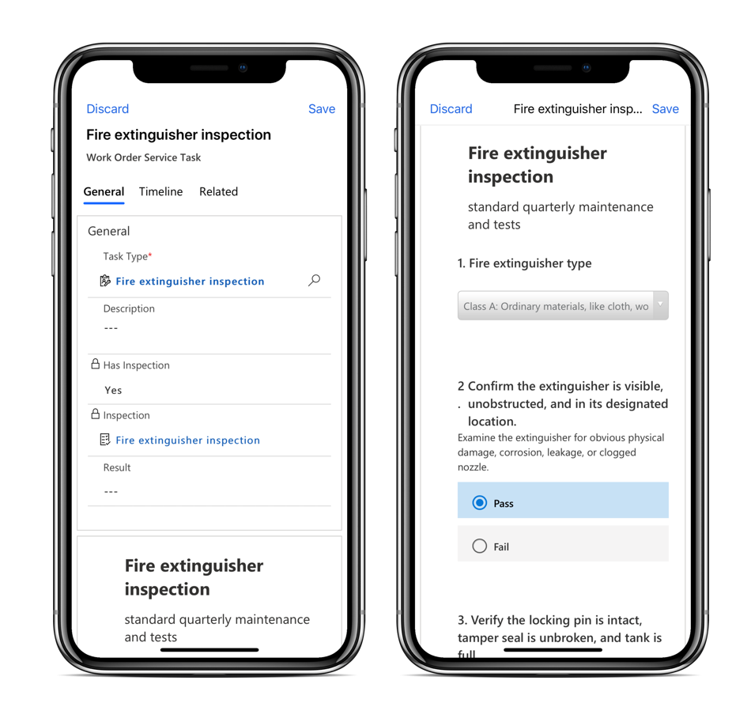
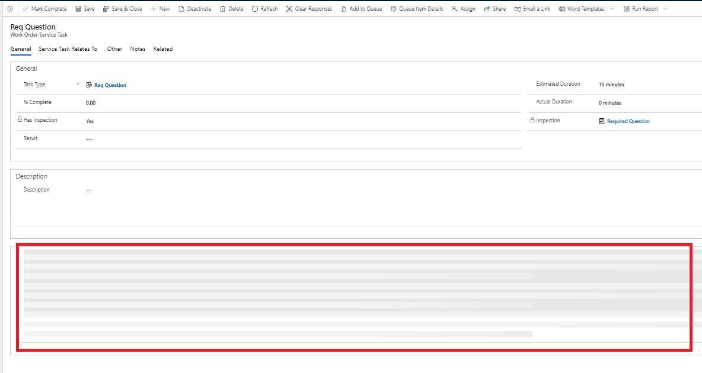

# Add inspections to work orders in Dynamics 365 Field Service

Field Service inspections are digital forms that technicians use to quickly and easily answer a list of questions as part of a work order. The list of questions can include safety protocols, pass-and-fail tests for a customer asset, an interview with a customer, or other audits and assessments performed before, during, or after a work order.

With a drag-and-drop interface, inspections are easy to create, and are easier for technicians to fill out compared to paper forms. Inspection answers are [stored in Microsoft Dataverse](./inspections-reporting.md#understand-view-and-report-inspection-responses), making it easy to report on results and fit inspections into your automated business processes.

Inspections in Field Service also provide: 

1. **Offline support**: Technicians can view and fill out inspections on their mobile phones or tablets without internet access. Answers are synced when connectivity is restored (cellular or WiFi). 
2. **Customer assets**: Inspections can be associated with assets, allowing users to see a history of all inspections for a particular piece of equipment. 
3. **Version management**: Administrators can continuously update and publish inspections to accommodate changing processes and evolving business needs.

Inspections are easy to create and use, involving the following steps: 

1. Administrator creates an inspection template.
2. Administrator associates the published inspection to a **Service Task Type**.
3. Dispatcher adds the **Service Task Type** to a **Work Order**.
4. Technician completes the inspection.
5. View the inspection results.

In this article, we'll walk through an example of setting up an inspection using a maintenance checklist on a customer asset.

For a guided walkthrough, check out the following video.

> [!VIDEO https://www.microsoft.com/videoplayer/embed/RE4Hy8U]

## Prerequisites

- Dynamics 365 version 9.1.0000.15015+.

- Knowledge of work order [incident types and service tasks](configure-incident-types.md) is encouraged.

- Inspections became generally available in the 2020 Wave 2 Field Service update. If you do not see inspections in your Field Service environment, [upgrade to the latest version of Field Service](upgrade-field-service.md). 

## Create inspection

First, create an inspection that can be reused and added to multiple work orders.

From the Field Service app, go to **Settings** > **Inspections** > **+New**.

> [!div class="mx-imgBorder"]
> 

Name your inspection and add a description.

### Question types

Add a question to the inspection by double-clicking or dragging-and-dropping a question type from the right side.

> [!div class="mx-imgBorder"]
> 

- **Textbox:** Allows technicians to enter text from their keyboard for a free form response. There is an option in the advanced panel to make the text box bigger to allow for multiline responses. In early access opt-in release, a text box can be input with a default value and can also be made as read-only.

> [!div class="mx-imgBorder"]
> 

- **Checkbox**, **radiogroup**, **dropdown**: Allows technicians to choose an answer from predefined options. The question types **Checkbox**, **Radiogroup**, and **Dropdown** are similar, except the **Checkbox** question type is multi-select, whereas **Radiogroup** and **Dropdown** allow for a single answer. The difference between **Radiogroup** and **Dropdown** is cosmetic and should be used based on desired user experience.

- **Entity lookup:** Allows technicians to choose a Dynamics 365 record. In the inspection designer interface, admins must select an entity and a field to display. For a chosen entity, the **Name** field and mandatory fields are the entity attributes that can be displayed in the lookup. Entity lookup respects security roles of signed-in user, meaning some entities and records may not be displayed.

  - Add filters to filter the records displayed in the entity-lookup options. For example, if an entity-lookup inspection question was created for the bookable resource record type, you can further filter the list of bookable resources to ones with resource type set to *User* to remove subcontractors and machines from the list.

> [!div class="mx-imgBorder"]
> 

> [!div class="mx-imgBorder"]
> 

- **Number:** Restricts input to numeric value or returns an error. Typically represents a measurement or numeric rating value.

- **Date Time:** Allows technicians to enter a date and time.

- **File:** Allows technicians to upload a file, take picture, or choose picture from their camera roll.

- **Barcode scan:** Allows technicians to populate the field with the barcode number by scanning a barcode with their device's camera. Choose "Textbox" question type, then select **Barcode** for input type in the **Advanced** section.

- **Matrix (Dynamic):** Adds a grid of questions. More rows can be added dynamically while performing the inspection. See the following screenshot for an example.

> [!div class="mx-imgBorder"]
> 

Use the **Required** toggle to make the inspection question mandatory.

> [!div class="mx-imgBorder"]
> 

By selecting the **Gear** icon, you can add more details for an inspection question.

### Compact question view

Before selecting an individual question, go to the advanced pane to edit the look and feel of the inspection.

Inspection creators can show or hide the title and description of the inspection when inspection performers are viewing it.
Also, the auto numbering of the questions can be disabled to assign custom numbering.

> [!div class="mx-imgBorder"]
> 

Choose layout density.

**Comfortable** layout displays answer areas underneath questions.

**Compact** layout displays answer areas to the right of questions as seen in the following screenshot. Use the preview pane to see the layout from an end user's perspective. 

> [!div class="mx-imgBorder"]
> 

### Pages

Add pages to your inspection in order to:

1. Group questions together to organize them in a logical way by type, phase, and so on.
2. Make it easier to add logic to multiple questions at one time. For more information, see the section on branching and conditional logic further into this article.

> [!div class="mx-imgBorder"]
> 

Select the page dropdown in the top left of the designer to add one or more pages. Then add a page title and a page description, if needed.

### Review and publish

Use the **Preview** section to see the inspection from a technician's perspective.

> [!Note]
> Once you publish the inspection, you can't edit it in the preview version.

> [!div class="mx-imgBorder"]
> 

When finished creating the inspection, select **Publish** at the top.

## Associate inspection to service task type

Next, associate the inspection to a **Service Task Type**. This association is necessary because inspections are not added directly to work orders; they're added as part of **Work Order Service Tasks**.

In the same **Settings** section, go to **Service Task Types**.

Select an existing service task type or create a new one.

Set **Has Inspection** to **Yes**.

In the **Inspection** field, select the inspection you created.

The inspection form will appear below.

> [!div class="mx-imgBorder"]
> 

It's common to add service task types to incident types in order to bundle work together. However, this isn't required because you can add individual service tasks to work orders as we'll see later on. In the following image, the "Fire extinguisher inspection" service task was associated to the "Fire system maintenance" incident type.

> [!div class="mx-imgBorder"]
> 

> [!Note]
> In the April 2020 preview, an inspection can't be added or removed from a service task type that already has work order service tasks or incident type service tasks associated to it. If you try to change **Has Inspection** and **Inspection** fields in the service task type, you'll see an error.  Also, a published inspection cannot be deleted if it is associated to a service task type or any work order service task.

## Add inspection to work order

After creating a work order, go to the **Service Tasks** section and add the **Work Order Service Task** you created that has an associated inspection.

Then **Save**. The inspection cannot be filled out until the Work Order Service Task is saved.

Alternatively, your inspection service task can be added to the work order via a work order incident type.

> [!div class="mx-imgBorder"]
> 

An inspection completed by a technician will be visible on the bottom of the work order service task form.

> [!div class="mx-imgBorder"]
> 

## Perform inspections on mobile

You can view and complete inspections on the [Field Service (Dynamics 365) mobile app](mobile-2020-power-platform.md). This requires no mobile project or any further setup other than upgrading to Field Service v8.8.22+.

Sign in with your Dynamics 365 URL, username, and password, and go to the assigned work order.

Select the **Work Order Service Task** that has the related inspection.

> [!div class="mx-imgBorder"]
> 

Find the inspection form and enter answers.

> [!div class="mx-imgBorder"]
> 

Technicians can upload files, take pictures, or upload pictures from the phone's camera roll. When uploading a file or image, select the caption icon to add a comment. 

> [!div class="mx-imgBorder"]
> 

When finished, the technician can select **Mark Complete** or set **Complete %** to 100.

Enter a **Result** to report on the overall inspection:

- Pass
- Fail
- Partial Success
- NA

> [!div class="mx-imgBorder"]
> 

**Actual Duration**: Enter an actual duration the work order service task took to complete that can be compared to estimated duration.

If an inspection question is required, the technician will not be able to mark **Complete** or set **% Completed** to 100 until it is answered.

**Clear Responses**: If needed, a technician can select  **More** > **Clear Responses** to start over. This will permanently delete all responses for this service task inspection.

Inspections can also be viewed and completed on the Field Service Mobile (Xamarin) app. For more information, see the end of this article.

## View responses

Back in Dynamics 365, a dispatcher will see inspection responses.

> [!div class="mx-imgBorder"]
> 

## Inspections on Field Service Mobile (Xamarin)

After the work order is scheduled to the appropriate technician, they can see and complete the inspection from the work order on the [Field Service Mobile](field-service-mobile-overview.md) app.

> [!Note]
> You must download and import a new mobile project template into the mobile configuration tool (Woodford) to use inspections on Field Service Mobile during public preview. [Download the mobile project template for inspections](https://aka.ms/fsmobile-project). For more information on mobile project templates, see the topic on [importing the mobile project template](./field-service-mobile-app-user-guide.md#step-3-import-the-mobile-project-template).

> [!div class="mx-imgBorder"]
> 

Sign in with your Dynamics 365 URL, username, and password, and go to the assigned work order.

Select the **Work Order Service Task** that has the related inspection.

> [!div class="mx-imgBorder"]
> 

Find the inspection form and enter answers. Technicians can upload files, take pictures, or upload pictures from the phone's camera roll.

> [!div class="mx-imgBorder"]
> 

When finished, the technician can select **Mark Complete** or set **Complete %** to 100.

> [!div class="mx-imgBorder"]
> 

Enter a **Result** to report on the overall inspection:

- Pass
- Fail
- Partial Success
- NA

**Actual Duration**: Enter an actual duration the work order service task took to complete that can be compared to estimated duration.

If an inspection question is required, the technician will not be able to mark **Complete** or set **% Completed** to 100 until it is answered.

**Clear Responses**: If needed, a technician can select  **More** > **Clear Responses** to start over. This will permanently delete all responses for this service task inspection.

## Configuration considerations

> [!Note]
> During the inspections preview period, Microsoft may make schema changes that may render inspections and related records to enter a state where they can no longer be used. As of August 2020 inspections are no longer in preview, and are available as early access before general availability in October 2020. 

- Only single responses are supported and a technician cannot fill out the same inspection twice for a single work order service task. If the responses are cleared or answered again, the original responses are deleted and only the latest responses are saved.

### Security roles needed to use inspections

- **Field Service-Administrators** can create inspection templates and associate them to service task types.
- **Field Service-Dispatchers** can add service tasks with inspections to work orders.
- **Field Service-Resources** can view work orders they are assigned to, along with work order service tasks and the related inspections.

## Additional notes

- New inspections cannot be created or designed from small form factors like mobile devices.

- Inspections cannot be exported and imported to other environments.

- Inspections cannot be embedded into Power Apps portals.

### Known issues

- Marking a work order service task as complete from the grid view does not work unless the work order service task is opened at least once.

> [!div class="mx-imgBorder"]
> 

- Dispatcher can't delete individual attachments in an inspection response. The out-of-the-box **Field Service-Dispatcher** role doesn't have ability to delete inspection attachments; they can, however, **Clear responses** and **Clear files**, which will clear all attachments. If a dispatcher wants to be able to delete individual attachments from an inspection, they'll need to be given delete privileges for the **Notes** entity. 

- If a resource has trouble seeing an inspection on the work order service task form (as seen in the following screenshot), deactivate and reactivate the related bookable resource booking. 

> [!div class="mx-imgBorder"]
> 

- Inactive inspections and work order service tasks are not available in offline mode. 
- Inspections do not load in Internet Explorer. Microsoft Edge or Chrome is recommended. 
- The question type "Entity lookup" shows inactive records.
- If an inspection contains a large (50+) number of files, users may encounter errors while loading the inspection form. 

### Field Service inspections or Power Apps inspections

Here are a few reasons customers choose to use Field Service inspections. 

1. **Offline support**: Technicians can view and fill out inspections on their mobile phones or tablets without internet access. Inspections and answers are stored locally on the mobile device and then synced to the server when connectivity is restored (cellular or WiFi). 
2. **Version management**: Administrators can easily republish or change inspections to accommodate changing processes and evolving business needs.
3. **Easier to create and use**: Field Service inspections require no further training to use and are designed to be easy for business users. For example, if you can create a survey with Microsoft Customer Voice, you can create an inspection. This is different from Power Apps inspections, which require extensive knowledge of the Power Apps platform and may require coding. 
- **More scalable**: If your organization has many different inspections, it's easier to create Field Service inspections with a drag-and-drop interface and with dynamic branching. Power Apps inspections require creating new entities and forms for each inspection, which is more time consuming. 
- **Better integrated with Dynamics 365**: Field Service inspections are built into the work order and asset servicing capabilities. 

### Field Service inspections or work order service tasks

Compared to work order incident types and service tasks, inspections have more benefits:

- **Easier to create**: Administrators can quickly create an inspection with a drag-and-drop interface without needing to create new entities and fields.
- **Easier to fill out**: Technicians can quickly enter responses for each inspection question and save all of them at once, rather than having to open and close multiple work order service task records.
- **More flexible and robust**: Field Service inspections have many question formats and validation options, such as multi-option select, mandatory fields, images, attachments, and more.

[!INCLUDE[footer-include](../includes/footer-banner.md)]
