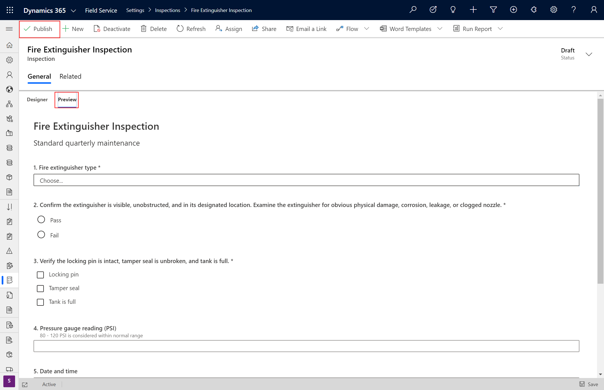
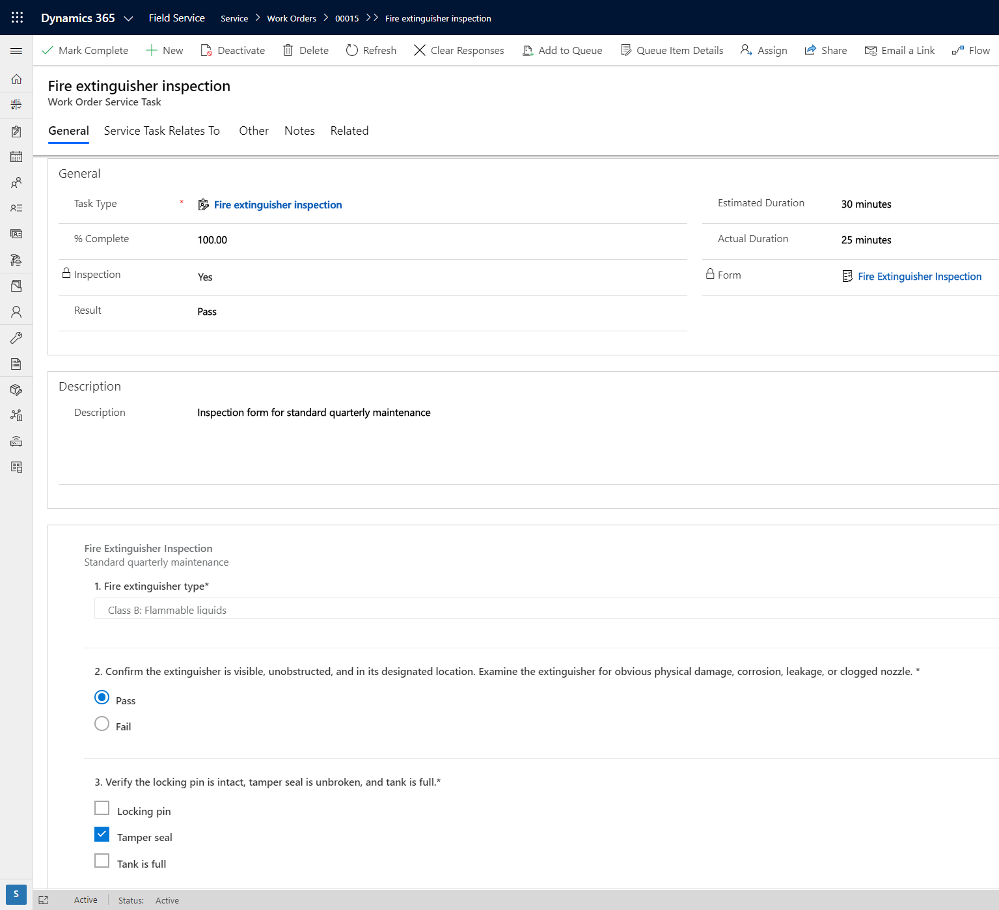

# Add inspections to Work Orders

Field Service inspections are a digital form that technicians use to quickly and easily answer a list of questions as part of a work order. The list of questions are often a safety protocol, pass and fail tests for a customer asset, an interview with a customer, or other various audits and assessments that are performed before, during, or after a work order.

Compared to using Work Order Incident Types and Service Tasks, using Inspections has the added benefits of:

- **Easier to create** - administrators can quickly create inspection questions with a drag and drop interface without the need to create new entities and fields.
- **Easier to fill out** - technicians can quickly enter answers for each inspection question and save all of them with one click rather than having to open and close multiple records.
- **More felxible and robust** - Field Service Inspections have many options for question formats and validations such as multi-option select, mandatory fields, images, attachments, etc. 

Creating and using Inspections is simple and involves the following steps: 

1. Administrator creates an inspection template
2. Administrator associates the inspection template to a Service Task Type
3. Dispatcher adds the Service Task Type to a Work Order
4. Technician completes the inspection
5. View inspection results

In this article we will walk through an example of setting up an inspection using an maintenance checklist on a customer asset as an example.

## Prerequisites

Inspection capabilities are released in April 2020 as part of a Public preview. Register at the [Insider portal](https://nam06.safelinks.protection.outlook.com/?url=https%3A%2F%2Fexperience.dynamics.com%2Finsider%2F&data=02%7C01%7Cdaclar%40microsoft.com%7Cf2fcec37b6da46c81e4d08d7c48437ad%7C72f988bf86f141af91ab2d7cd011db47%7C1%7C0%7C637193944500083444&sdata=5HYsnA1J3S%2BkkL%2BDFb%2F0L4jzbeQERtKO1GNRQu5Yj60%3D&reserved=0) for access. Once added, you will be notified via email and will see "Private Preview for D365 Field Service Inspections" under 'my programs' on your Insider Programs Page. Please use “Forums” and “Program Feedback” to give us your inputs and feedback.

Dynamics 365 version 9.1.0000.15015+

Knowledge of work order [incident types and service tasks](.configure-incident-types.md) is encouraged.

## Create inspection template

First create an inspection template that can be reused and added to multiple work orders.

From the Field Service app go to **Settings > Inspections > +New**.

> [!div class="mx-imgBorder"]
> 

Name your inspection and drag and drop question types from the right side.

> [!div class="mx-imgBorder"]
> 

Use the **Required** toggle to make the inspection quesiton mandatory in order for the technician to sae the inspection later on.

Question types Checkbox, Radiogroup, and Dropdown are similar except the Checkbox question type is multi-select whereas Radiogroup and Dropdown allow for a single answer. The difference between Radiogroup and Dropdown is a cosmetic and user experience difference.

> [!div class="mx-imgBorder"]
> 

By selecting the Gear icon you can add more details for an inspection question. As an example, we specified the Pressure gauge reading (PSI) question must be a number format.

> [!div class="mx-imgBorder"]
> 

Use the Preview section to view the inspection from a technician's perspective.

> [!Note]
> Once you publish the inspection you cannot edit it. 

When finished creating the inspection, select Publish at the top. 

> [!div class="mx-imgBorder"]
> 

## Associate inspection to service task type

Next associate the inspection template to a Service Task Type. This has to be done because inspections are not added directly to work orders, they are added as part of Work Order Service Tasks.

In the same Settings section, go to Service Task Types.

Select an existing Service Task Type or create a new one.

Set **Inspection **to **Yes**.

In the **Inspection Form** field, select the Inspection template you just created.

The inspection form will appear below.

> [!div class="mx-imgBorder"]
> 

It is common to add service task types to incident types to bundle work together. However this is not required because you can add individual service tasks to work orders as we'll see later on. In the image below, the "Fire extinguisher inspection" service task was associated to the "Fire system maintenance" incident type.

> [!div class="mx-imgBorder"]
> 

You only need to create an inspection and associate it to a service task once for each inspection template.

## Add inspection to work order

After creating a work order, go to the Service Tasks section and add the Service Task Type to your work order.

Alternatively, your inspection service task can be added to the work order via a work order incident type. 

> [!div class="mx-imgBorder"]
> 

The inspection form that will be completed by technicians will be visible on the bottom of the work order service task form.

> [!div class="mx-imgBorder"]
> 

## Perform inspection 

After the work order is scheduled to the appropriate technician, he or she can view and complete the inspection two ways:

1. On his or her mobile phone or tablet using the **Microsoft Dynamics 365** mobile app. This is different than Field Service Mobile.
2. Logging in to Field Service in a web browser on a mobile device or PC.

For the first option, go to your devices app store and download the **Microsoft Dynamics 365** mobile app

> [!div class="mx-imgBorder"]
> 

Then log in with your Dynamics 365 URL, username and password and go to the assigned work order.

> [!div class="mx-imgBorder"]
> 

Click on the Work Order Service Task (and not the Service Task Type).

> [!div class="mx-imgBorder"]
> 

Find the inspection form and enter answers.

> [!div class="mx-imgBorder"]
> 

When finished, the technician can enter a **Complete %**, **Result**, and an **Actual Duration**.

> [!div class="mx-imgBorder"]
> 

If an inspection question is required, the technician will not be able to Mark Complete until it is answered.

> [!div class="mx-imgBorder"]
> 

If needed a technician can select Clear Responses to start over. This will permanently delete all responses.

> [!div class="mx-imgBorder"]
> 

## View responses

Back in Dynamics 365, a dispatcher will see inspection responses.

> [!div class="mx-imgBorder"]
> 

## Inspections for Customer Assets

To relate the inspection to a customer asset to build service history, enter the customer asset in the **Service Task Relates To** section of the Work Order Service Task that holds the inspection.

> [!div class="mx-imgBorder"]
> 

Doing so will allow the technician to see which customer asset to perform the inspection for and from the customer asset can see all related inspection history.

> [!div class="mx-imgBorder"]
> 

> [!Note]
> If you relate a work order incident type to a customer asset, the related work order service tasks will be related to the customer asset automatically.

## Configuration considerations

- Only single responses are supported and a technician cannot fill out the same inspection twice for a single work order service task. If the responses are cleared or answered again, the original responses are deleted ad only the latest responses are saved.

### Security roles needed to use inspections

- **Field Service-Administrators** can create inspection templates and associate them to Service Task Types. 
- **Field Service-Dispatchers** can add Service Tasks with Inspections to Work Orders.
- **Field Service-Resources** can view work orders they are asigned and work order service tasks and the related inspections.

### Using inspections vs. Service Tasks vs. PowerApp

The main advantage of inspections is they are easier to create and easier to fill out compared to work order service tasks or a custom powerapp, as both may require creating additional fields and entities; and in the case of work order service tasks, the technician must open and save each one. If you find yourself adding more than 10 service tasks to a work order, or creating a powerapp with more than 10 questions, it is worth considering using inspections instead. 

### Inspecting X number of assets at a location

Let's say a technician needs to inspect 10 customer assets at a customer's location. To accommodate this scenario, administrators can create one inspection with 10 questions, one for each asset and associate the single inspection to a single service task; or create 10 work order service tasks each with one inspection. When deciding, keep in mind work order service tasks can be associated to customer assets to build service history that is viewable on the customer asset record. This means creating 10 service tasks each related to a different customer asset has the advantage of helping you build service history. The advantage of utilizing a single service task with multiple questions has the benefit of being easier to add to a work order and quicker to fill out. 

## Additional Notes

- Support for Field Service Mobile is not part of the April 2020 public preview and is **planned**.
- The ability to **create reports based on specific inspections responses** is not part of the April 2020 public preview and is **planned**.
- The ability to create **branching logic** where inspection questions hide and appear based on other inspections responses is not part of the April 2020 public preview and is **planned**.
- Each inspection template and inspection question is stored in the Common Data Model, storing and retreiving each inspection response in the Common Data Model is not part of the April 2020 public preview and is **planned**.
- The ability to have an inspection approved before being published is not part of the April 2020 public preview and is **planned**.
