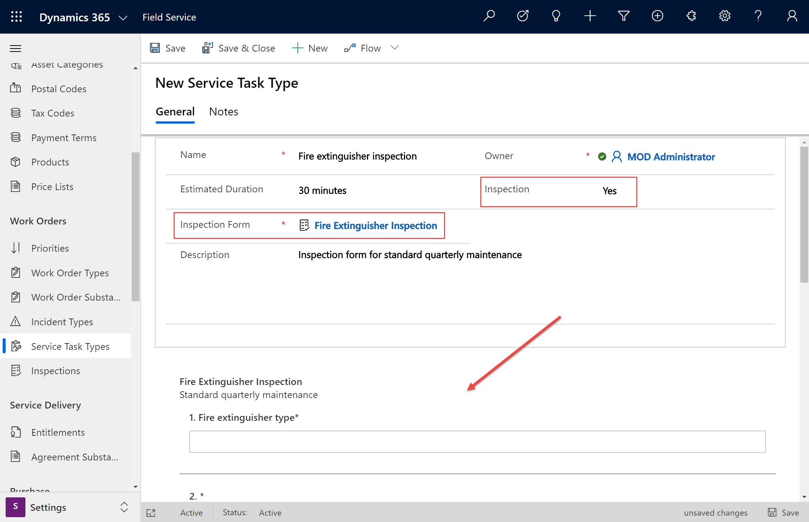
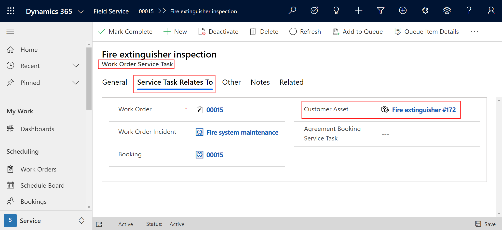
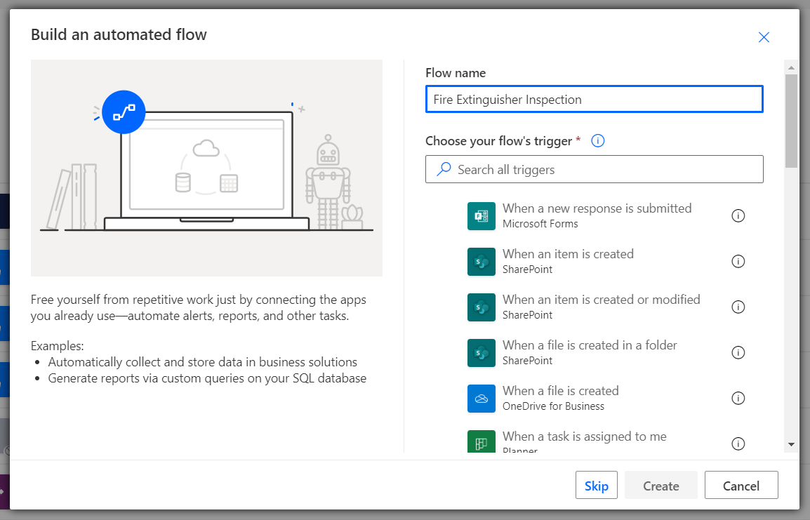
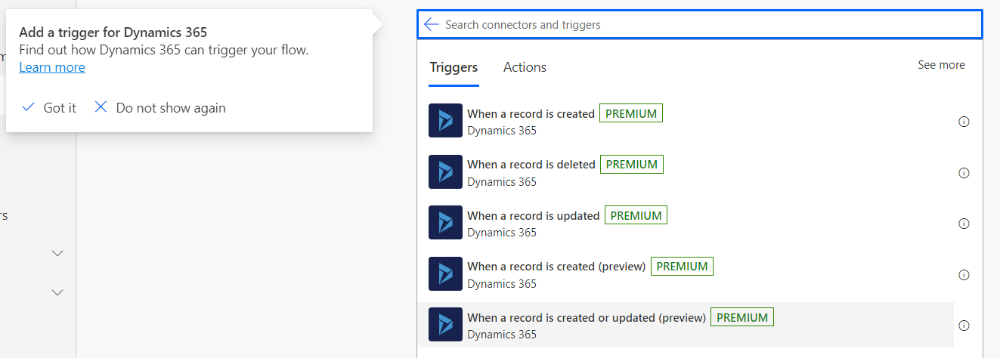
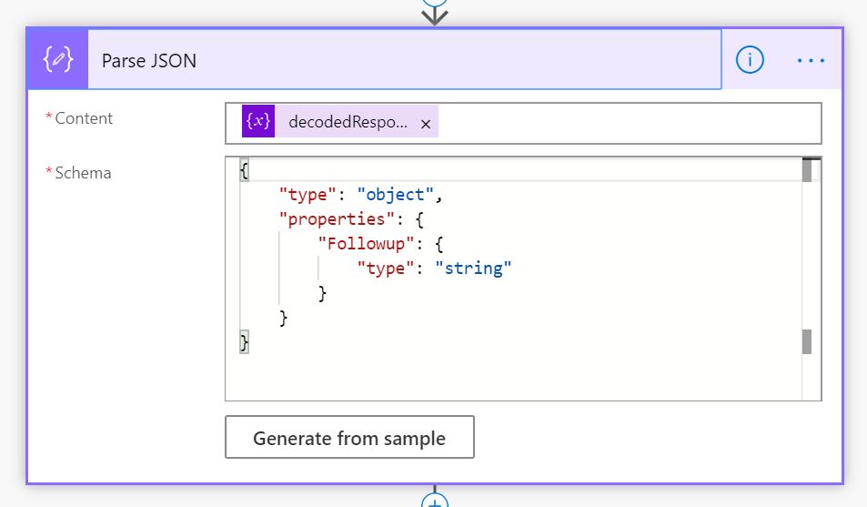
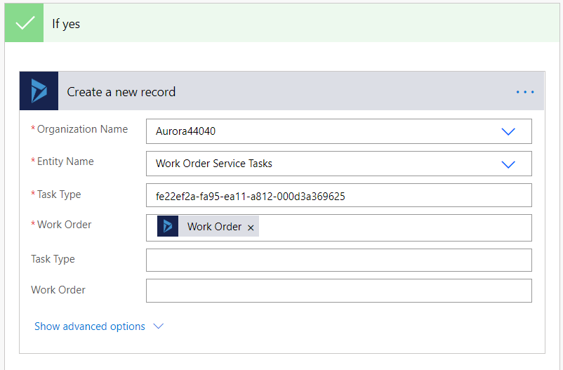
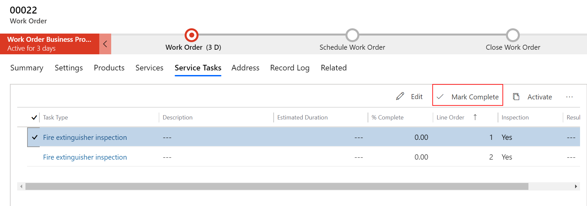

# Add inspections to work orders in Dynamics 365 Field Service

Field Service inspections are digital forms that technicians use to quickly and easily answer a list of questions as part of a work order. The list of questions can include safety protocols, pass and fail tests for a customer asset, an interview with a customer, or other audits and assessments performed before, during, or after a work order.

Compared to work order incident types and service tasks, using inspections has additional benefits:

- **Easier to create**: administrators can quickly create an inspection with a drag-and-drop interface without needing to create new entities and fields.
- **Easier to fill out**: technicians can quickly enter responses for each inspection question and save all of them with one click, rather than having to open and close multiple records.
- **More flexible and robust**: Field Service inspections have many question format and validation options, such as multi-option select, mandatory fields, images, attachments, and more. 

Inspections are easy to create and use, involving the following steps: 

1. Administrator creates an inspection template.
2. Administrator associates the published inspection to a **Service Task Type**.
3. Dispatcher adds the **Service Task Type** to a **Work Order**.
4. Technician completes the inspection.
5. View the inspection results.

In this article, we'll walk through an example of setting up an inspection using a maintenance checklist on a customer asset.

## Prerequisites

> [!Note]
> Inspection capabilities are released in April 2020 as part of a public preview. Follow the process in the article on [installing or upgrading preview features](field-service-preview.md). In Step 6, look for the preview flight with the display name **FieldService_April2020_PreviewFlight**.

- Dynamics 365 version 9.1.0000.15015+.

- Knowledge of work order [incident types and service tasks](configure-incident-types.md) is encouraged.

## Create inspection

First, create an inspection that can be reused and added to multiple work orders.

From the Field Service app, go to **Settings** > **Inspections** > **+New**.

> [!div class="mx-imgBorder"]
> 

Drag-and-drop your first question type from the right side. Then name your inspection and add a description.

> [!div class="mx-imgBorder"]
> 

Use the **Required** toggle to make the inspection question mandatory.

The question types **Checkbox**, **Radiogroup**, and **Dropdown** are similar except the **Checkbox** question type is multi-select whereas **Radiogroup** and **Dropdown** allow for a single answer. 

The difference between **Radiogroup** and **Dropdown** is cosmetic and should be used based on desired user experience.

> [!div class="mx-imgBorder"]
> 

By selecting the **Gear** icon, you can add more details for an inspection question. 

Use the **Preview** section to see the inspection from a technician's perspective.

> [!Note]
> Once you publish the inspection, you can't edit it in the preview version.

When finished creating the inspection, select **Publish** at the top. 

> [!div class="mx-imgBorder"]
> 

## Associate inspection to service task type

Next, associate the inspection to a **Service Task Type**. This association is necessary because inspections are not added directly to work orders; they're added as part of **Work Order Service Tasks**.

In the same **Settings** section, go to **Service Task Types**.

Select an existing service task type or create a new one.

Set **Has Inspection** to **Yes**.

In the **Inspection** field, select the inspection you created.

The inspection form will appear below.

> [!div class="mx-imgBorder"]
> 

It's common to add service task types to incident types in order to bundle work together. However, this isn't required because you can add individual service tasks to work orders as we'll see later on. In the following image, the "Fire extinguisher inspection" service task was associated to the "Fire system maintenance" incident type.

> [!div class="mx-imgBorder"]
> 

> [!Note]
> In the April 2020 preview, an inspection can't be added or removed from a service task type that already has work order service tasks or incident type service tasks associated to it. If you try to change **Has Inspection** and **Inspection** fields in the service task type, you'll see an error.  Also, a published inspection cannot be deleted if it is associated to a service task type or any work order service task.

## Add inspection to work order

After creating a work order, go to the **Service Tasks** section and add the **Work Order Service Task** you created that has an associated inspection.

Then **Save**. The inspection cannot be filled out until the Work Order Service Task is saved. 

Alternatively, your inspection service task can be added to the work order via a work order incident type. 

> [!div class="mx-imgBorder"]
> 

An inspection completed by a technician will be visible on the bottom of the work order service task form.

> [!div class="mx-imgBorder"]
> 

## Perform inspection 

After the work order is scheduled to the appropriate technician, they can see and complete the inspection by logging in to Field Service in a web browser on a mobile device or PC.

Sign in with your Dynamics 365 URL, username, and, and go to the assigned work order.

Select the **Work Order Service Task** (*not* the **Service Task Type**).

Find the inspection form and enter answers.

> [!div class="mx-imgBorder"]
> 

> [!div class="mx-imgBorder"]
> 

When finished, the technician can select **Mark Complete** at the top or set **Complete %** to 100. 

Enter a **Result** to report on overall inspection:
- Pass
- Fail
- Partial Success
- NA

Optionally, enter an **Actual Duration** that can be compared to estimated duration.

If an inspection question is required, the technician will not be able to mark **Complete** or set **% Completed** to 100 until it is answered.

If needed, a technician can select **Clear Responses** to start over. This will permanently delete all responses for this service task inspection.

## View responses

Back in Dynamics 365, a dispatcher will see inspection responses.

> [!div class="mx-imgBorder"]
> 

## Inspections for customer assets

To relate the inspection to a customer asset and build out service history, enter the customer asset in the **Service Task Relates To** section of the work order service **Task** that holds the inspection.

> [!div class="mx-imgBorder"]
> 

Associating a customer asset allows the technician to see which customer asset needs the inspection. From the customer asset, they can see all related inspection history.

> [!div class="mx-imgBorder"]
> 

> [!Note]
> If you relate a work order incident type to a customer asset, the related work order service tasks will be related to the customer asset automatically.

## Run workflow on inspection responses

When a technician fills out an inspection, the answers to each inspection question are stored as JSON in the **Inspection Response** entity.

> [!div class="mx-imgBorder"]
> 

Use a Power Automate flow to run a workflow on inspection responses.

In the following example, if a technician responds "Yes" to the inspection question "Is a follow up required?" then a new follow up work order service task is added to the related work order.

#### Create a flow

Go to [https://flow.microsoft.com](https://flow.microsoft.com) sign in, choose your environment and create a new flow.

Choose **Automated-from blank**

> [!div class="mx-imgBorder"]
> 

Provide a name and click on ‘Skip’ to choose the trigger on the Flow Editor page.

> [!div class="mx-imgBorder"]
> 

 
#### Create a trigger 

Search for ‘Dynamics 365’ in Connectors and choose the trigger as **When a record is created or updated**

> [!div class="mx-imgBorder"]
> 
 
This flow will relate to the Work Order Service Task entity because technicians view and respond to inspections from this entity. Choose **Work Order Service Tasks** for the Entity Name. 

> [!div class="mx-imgBorder"]
> 
 
#### Fetch the response from the database

Next we need to retreive the inspection responses.

Add a step using the **Get record** action in ‘Dynamics 365’. 

Choose **Inspection Responses** as the entity to get and **Inpection Response Id** in the Item identifier because this field has the inspection answers. 

> [!div class="mx-imgBorder"]
> 
 
#### Extract the JSON

Add **Initialize Variable** action to retrieve the response from ResponseJsonContent field.

> [!div class="mx-imgBorder"]
> 
 
#### Decode the response

Next we need to put the JSON of the response in a usable format.

Add **Initialize Variable** action to url decode and base 64 decode the response json.

      decodeUriComponent(decodeBase64(variables('responseJson')))

> [!div class="mx-imgBorder"]
> 

 
#### Update the schema
Provide a the schema with the name of the question you want to run a workflow on:

In our example the schema is: 

    {
        "type": "object",
        "properties": {
            "Followup": {
                "type": "string"
            }
        }
    }

> [!div class="mx-imgBorder"]
> 

If you are having trouble generating the schema you can select the **Generate from sample** option and enter the Name and sample answer of your inspection question and response.

In our example we can enter 

    {"Followup":"Yes"}

Where "Followup" comes from the Name value of the inspection question as seen in the image below.

> [!div class="mx-imgBorder"]
> 

#### Condition based action

Next we want to add a condition and action based on the response to the inspection question.

In this example we will create a Work Order Service Task with another Service Task Type in the same Work Order when the "Followup" inspection question has ‘Yes’ as the answer.

> [!div class="mx-imgBorder"]
> 
 

> [!div class="mx-imgBorder"]
> 
 

## Configuration considerations

> [!Note]
> During the preview Microsoft may make schema changes that may render inspections and related records to enter a state where they can no longer be used.

- Only single responses are supported and a technician cannot fill out the same inspection twice for a single work order service task. If the responses are cleared or answered again, the original responses are deleted and only the latest responses are saved.

### Security roles needed to use inspections

- **Field Service-Administrators** can create inspection templates and associate them to service task types. 
- **Field Service-Dispatchers** can add service tasks with inspections to work orders.
- **Field Service-Resources** can view work orders they are assigned to, along with work order service tasks and the related inspections.

### Using inspections vs. service tasks vs. Power Apps

The main advantage of inspections is they are easier to create and easier to fill out. Both service tasks and custom Power Apps require creating additional fields and entities; for work order service tasks, the technician must open and save each one. If you find yourself adding more than 10 service tasks to a work order, or creating a Power App with more than 10 questions, consider inspections instead.

### Inspecting X number of assets at a location

Let's say a technician needs to inspect 10 customer assets at a customer's location. To accommodate this scenario, administrators can:

- Create one inspection with 10 questions - one for each asset - and associate the single inspection to a single service task, or
- Create 10 work order service tasks, each with one inspection. 
 
When deciding, keep in mind work order service tasks can be associated to customer assets to build service history, viewable on the customer asset record. This means creating 10 service tasks each related to a different customer asset has the advantage of helping you build service history. The advantage of utilizing a single service task with multiple questions has the benefit of being easier to add to a work order and quicker to fill out. 
### Inspections in Common Data Model

There are three entities stored in Common Data Model:
1. Inspection: the set of questions.
1. Inspection question: each individual question entry in the inspection.
2. inspection response: overall answer containing answers to all the questions in the overall inspection.

Storing and retrieving each inspection response in Common Data Model is not part of the April 2020 public preview.

## Additional notes

- New inspections cannot be created or designed from small form factors like mobile devices.

- Support for Field Service Mobile is not part of the April 2020 public preview and is **planned**.
  
- The ability to create **branching logic** where inspection questions hide and appear based on other inspections responses is not part of the April 2020 public preview and is **planned**.

- The ability to add version numbering to inspections is not part of the April 2020 public preview and is **planned**.

- Inspections cannot be exported and imported to other environments

### Known issues

- Marking a Work Order Service Task as complete from the grid view does not work unless the Work Order Service Task is opened at least once.

> [!div class="mx-imgBorder"]
> 
