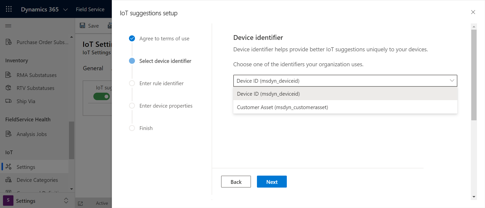
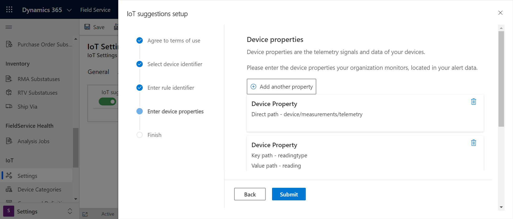
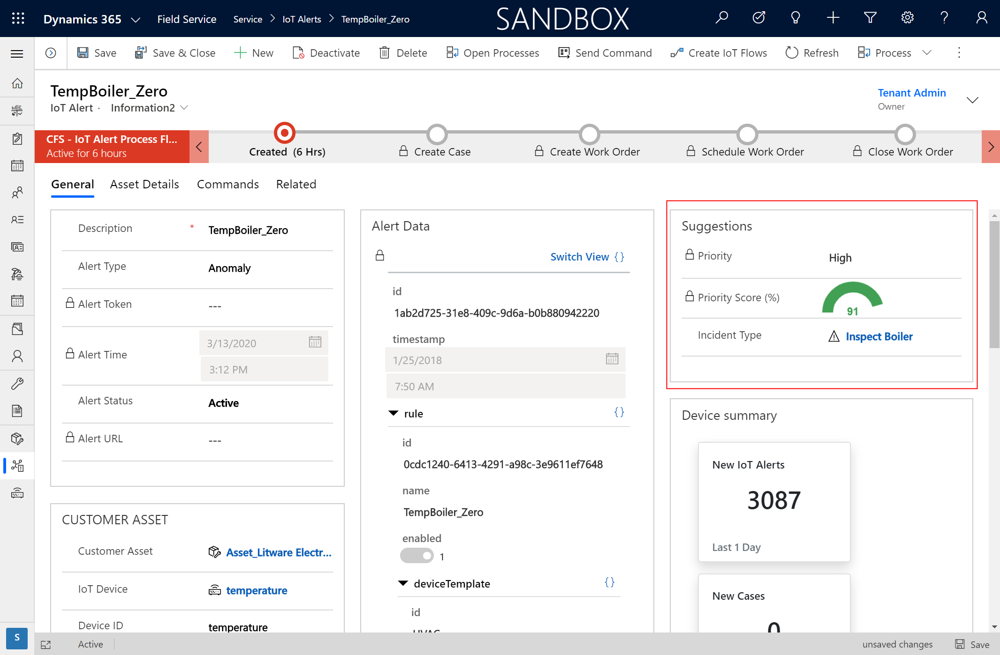

# IoT alert AI suggestions

Connected Field Service "makes IoT data actionable" by allowing an organization to convert IoT alerts into cases and work orders to be inverstigated by the appropriate people. Over time, AI can learn from actions taken on IoT alerts and begin to make recommendations of which IoT alerts are most important and what should be done.
 
**IoT alert AI suggestions** tag IoT alerts with a suggested priority or incident type by learning from previous service history. For example, imagine it is common for your organization to receive an IoT alert when the tmeperature of a machine exceeds the acceptable threshold by 10 degrees and your organization frequently converts these IoT alerts into work orders. The AI model will learn from these actions and the next time a new temperature alert arrives that is 15 degrees over the threshold, the AI will suggest it as high priority and suggest recalibration as the incident type.

> [!div class="mx-imgBorder"]
> 

As a reminder:

- An [incident type](../configure-incident-types.md) is the main issue of a work order and can dictate related details like work order type, products, services, and service tasks. 
- **Priority** in this feature represents the priority to the business generally measured by financial impact or customer satisfaction. As an example, imagine an IoT alerts notifies the organization that a building's heating is broken, and this could have a large impact on an event and customer satisfaction. This would represent a _high_ priority because of the large business impact.

The AI-based suggestions are made possible by a machine learning model that is continuously learning as more data enters the system in the form of IoT Alert records and as more actions are executed by dispatchers that converts an alert into a case or work order. 

Here are the top benefits to enabling AI for IoT Alerts:  
- Understand which IoT alerts are higher priority 
- Become more proactive at handling issues that are potentially high impact 
- Better allocate limited resources to IoT alerts that become cases and work orders
- Use AI to scale out and learn from the experienced personnel who know how to respond to issues surfaced by IoT telemetry.

## Prerequisites

Public preview April 2020

Connected Field Service with either
-	Azure IoTHub 
-	Azure IoTCentral 
-	Custom IoT provider (requires additional configuration)

## Instructions

From the Field Service app go to **Settings > Settings (in IoT section) > IoT Suggestions section**

Set the IoT suggestions setting to **Enabled**. 

> [!div class="mx-imgBorder"]
> 

### Agree to terms of use

First agree to the terms of service and select **Next**.

### Select device identifier

Select how your organization primarily uses IoT alerts in relatioon to devices and customer assets. As a reminder, there is a 1:Many relationship, where many devices can be related to one customer asset.

> [!div class="mx-imgBorder"]
> 

- Select **Device ID** if your organization primarily manages the IoT alerts from individual devices. Example: you have internet-connected thermometers that send temperature readings.
- Select **Customer Asset** if your organization primarily manages the IoT alerts from devices related to customer assets. Example: you have customer assets that represent rooms in a building and each room has multiple devices sending telemetry. When work orders are created from these IoT alerts, they are related to a customer asset.

> [!Note]
> If you are unsure of which option to choose or if your organization manages IoT alerts at both the device level and customer asset level equally, then leave this as the default: **Device ID**.

### Enter rule identifier

Choose the rules that you defined in IoTCentral or IoTHub that trigger IoT Alerts. The rule paths can be found in the IoT Alert JSON.

> [!div class="mx-imgBorder"]
> 

An example of the rule path for IoTCentral is **rule/id**.

> [!div class="mx-imgBorder"]
> 

An example of the rule path for IoTHub is **ruleoutput**.

> [!div class="mx-imgBorder"]
> 

### Enter device properties

Choose the device properties that should be considered by the AI model to make suggestions. This the telemetry and signals coming from the devices is typicallyreading along with other device variables and characteristics. As an example, an internet-connected thermometer may give a temperature reading of 72 degrees and this temperature output should be considered. 

> [!div class="mx-imgBorder"]
> 

By default, the **Telemetry** field in IoTCentral and the **Reading Type** and **Reading** fields in IoTHub are used as device properties. However you can add custom fields that you may have added. As an example, you may have a model that associates a financial cost to each temperature reading and this can be added here as a device property to be considered by the AI model.

### Finish

After entering the initial information you are finished and the model will take 24 hours to begin making recommendations. It will look at historical data as well as data going forward.

You'll know the AI based suggestions are working when there is a suggested priority and incident type in the "Prioritized IoT Alerts" view. ii.	You can add the Suggested Priority and other AI fields to the default ‘Primary IoT alerts’ view or any of your custom views.

> [!div class="mx-imgBorder"]
> 

The priority and suggested incident type is also displayed on the IoT alert form.

> [!div class="mx-imgBorder"]
> 

## Configuration considerations
- If the model needs to be reconfigured based on changes to the system or evolving business needs, you can go through the set up again by going to **Settings > Settings (in IoT section) > IoT Suggestions section** and selecting **Reconfigure IoT suggestions** in the top ribbon. 
- When applicable the model will return "No suggestions" if there is no recommendation. 
- Suggestions are updated every 24 hours.
- It is recommended to have at least 50 IoT alerts converted to cases or work orders to give the model enough data to make suggestions. 
- Suggestions work whether IoT alerts are converted in to cases or work orders because both have incident types. 
### Use Power Automate flows to:
1. Convert IoT Alerts with suggested high priority to a new case or work order with the recommended incident type.
2. Send and display the AI suggestions in Azure IoTCentral or Azure IoTHub.

