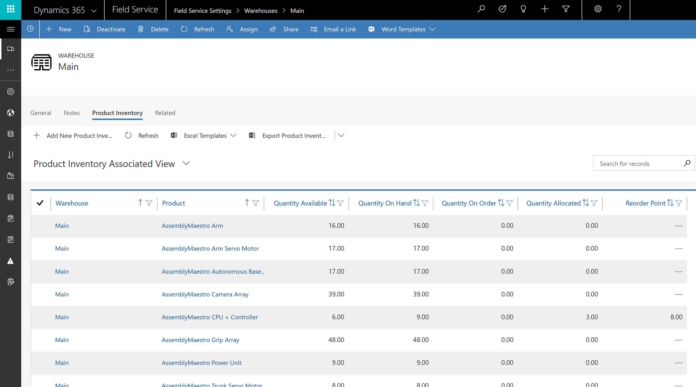
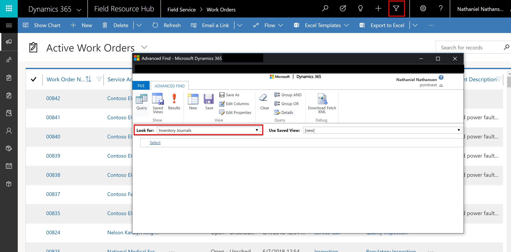
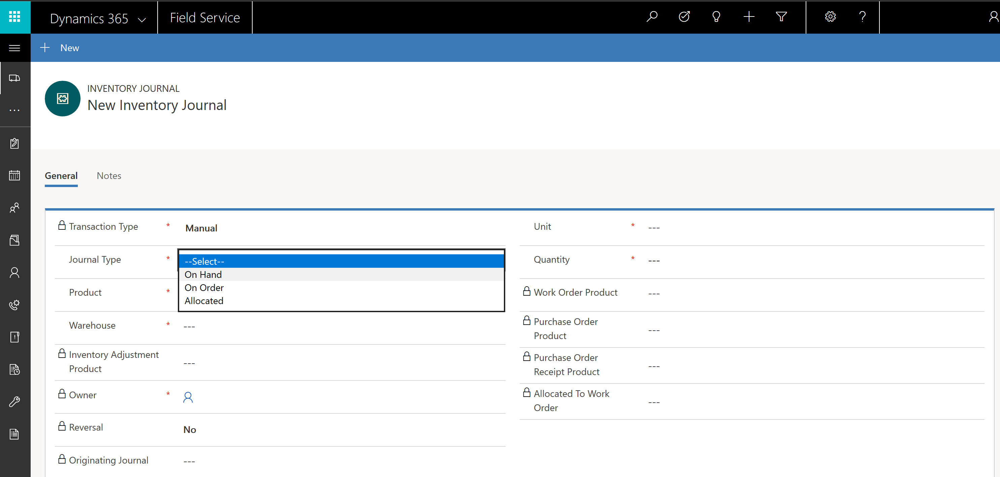
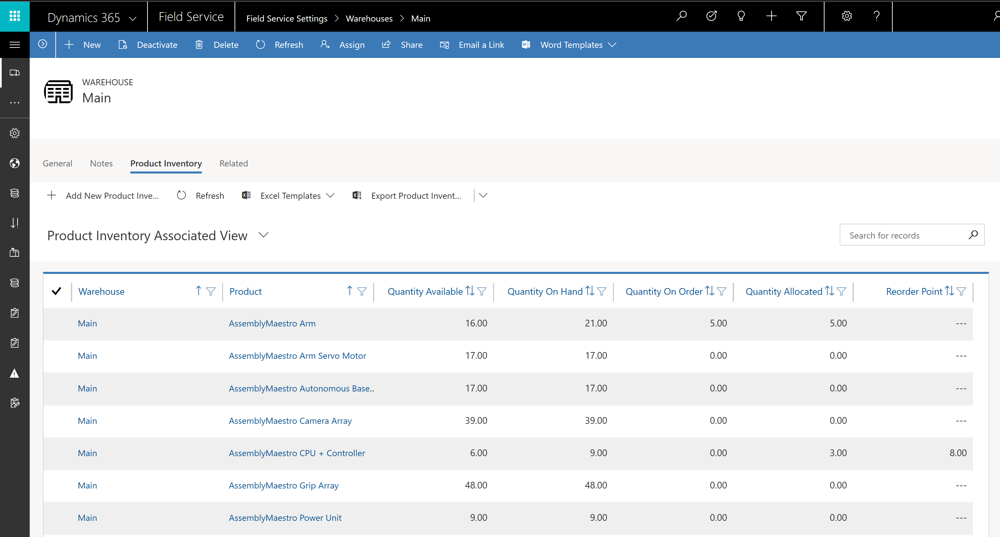

# Manual Inventory Journals

In Dynamics 365 for Field Service, an organization can track their Product Inventory.
 
For a given warehouse and product, an organization can track **Available**, **On Hand**, **On Order**, and **Allocated** inventory.

> [!div class="mx-imgBorder"]
> 

Inventory Journals is a field service entity that serves as a ledger for all inventory changes related to field service warehouses and products. 

As an example, when a field service purchase order is fulfilled, an inventory journal is created that documents an increase in inventory for the receiving warehouse. As another example, when a field service inventory transfer is completed, two inventory journals are created: one decrementing inventory from the **source warehouse** and another incrementing inventory for the **receiving warehouse**.

## Using manual inventory journals

**Manual inventory journals** allow inventory administrators to manipulate inventory levels without the associated field service processes. An example would be to manually add inventory without creating and fulfilling field service purchase orders or transfer inventory without creating inventory transfer records.

**The main purpose of manual inventory journals** is to make field service inventory easier to integrate with external inventory systems such as Dynamics 365 for Finance & Operations.

Other use cases include:

- documenting inventory that is lost, stolen, or destroyed
- allowing extensibility scenarios to utilize field service inventory 

## Prerequisites

Field Service v8.2+

Warehouse records must exist in the system

Products with Field Service Type = Inventory must exist in the system

**Field Service - Inventory Purchase** security role

## Instructions 

### 1. access inventory journals

Inventory journals are a field service entity that can be accessed via Advanced Find and are not part of the sitemap by default.

Navigate to Advanced Find and select the Inventory Journals entity

> [!div class="mx-imgBorder"]
> 

then choose **results** to view all inventory journals.

### 2. create manual inventory journal

Select New Inventory Journal

> [!div class="mx-imgBorder"]
> 

Alternatively, manual inventory journals can be created via the Dynamics workflow interface.

Set **Transaction Type** field to manual

> [!div class="mx-imgBorder"]
> 

Many fields on the inventory journal form are locked because they relate to field service inventory processes such as the purchase order process. However, manual inventory journals are designed to work outside of field service inventory processes making the locked fields irrelevant. 
 
Select a journal type for your manual inventory. This will determine how the inventory is incremented or decremented.

Creating an **On Hand** journal will increase **On Hand** and **Available** product inventory.

Creating an **On Order** journal will increase **On Order** product inventory.

Creating an **Allocated** journal will increase **Allocated** product inventory and reduce **Available** inventory.

> [!div class="mx-imgBorder"]
> 

> [!Note]
> Quantity value can be negative to decrement inventory.

### 3. view inventory changes

Navigate to **Field Service > Warehouse > Product Inventory** to view inventory changes

> [!div class="mx-imgBorder"]
> 

## Additional notes

- Inventory Adjustments can be used to increment/decrement Available inventory for a given warehouse. This is an entirely field service related process and only applies to adjusting Available and On Hand inventory. In contrast, manual inventory journals can edit any type of inventory levels and is more flexible and better suited for integration scenarios.
- Both manual inventory journals and inventory adjustments products can have negative quantity values to decrement inventory
- Manual inventory journals are used in the solution to integrate Dynamics 365 for Field Service and Finance & Operations. 

### See also
  [Install Field Service and Finance & Operations integration solution](https://appsource.microsoft.com/en-us/product/dynamics-365/mscrm.p2cfieldserviceintegration?tab=Overview)

  [Configure Field Service and Finance & Operations integration](https://docs.microsoft.com/en-us/dynamics365/unified-operations/supply-chain/sales-marketing/field-service)