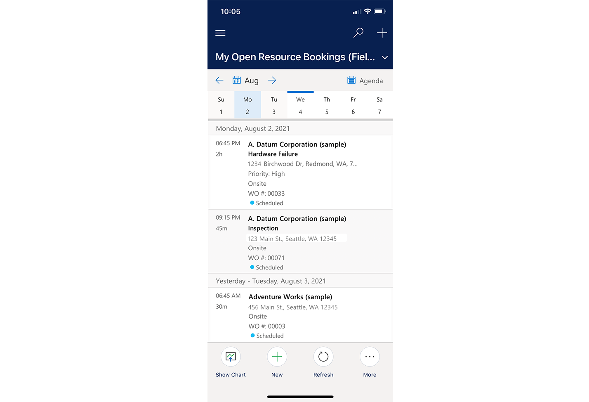

# Customize the mobile app

Administrators can customize how the Field Service (Dynamics 365) mobile app looks and functions for technicians.

## Edit Sitemap entities on home screen

Sign in to Dynamics 365 as a system administrator.

To see your list of apps, go to:

```https://[YOUR-ENVIRONMENT-NAME].crm.dynamics.com/main.aspx?forceUCI=1&pagetype=apps```

Find the Field Service Mobile app and go to the **App Designer**.

> [!div class="mx-imgBorder"]
> 

Select the edit icon to edit the site map.

> [!div class="mx-imgBorder"]
> 

The groups  **My Work**, **Customers**, and **Other** correspond with the home screen of the Field Service (Dynamics 365) mobile app and you can rearrange, delete, or edit the display names.

Rearrange the entities displayed within each group with the drag and drop interface, or add new entities by adding new **Subareas**.


> [!div class="mx-imgBorder"]
> 

You can even create entirely new groups with more subareas to display different entities.

> [!div class="mx-imgBorder"]
> 

> [!Note]
> For every entity you display in the sitemap, you can choose the views available on mobile in the App Designer.

## Edit the booking and work order form

You can add and delete fields displayed on the Field Service (Dynamics 365) mobile app; because the app is built with Power Apps, you can use the Power Apps Control Framework to display different field controls like toggle buttons and sliders.

Administrators who want to customize the booking and work order forms must know they are combined in the mobile app where work order forms are displayed within the booking form. That means when a technician views a booking form, they're also viewing the related work order form. In the following screenshot, the **General** section displays **Bookable Resource Booking** ("Booking") fields and the **Customer**, **Service**, and **Notes** sections display work order fields.


> [!div class="mx-imgBorder"]
> 

To edit the work order portion of the form, go to **Settings** > **Customizations** > **Customize the System** and find the **Work Order** entity in the Power Apps admin console.

> [!div class="mx-imgBorder"]
> 

In the **Form** section, there are three forms that correspond to the three sections of the combined Booking-Work Order form.

1. Work Order - Customer
2. Work Order - Service
3. Work Order - Notes

Edit each form as needed and publish. The changes will display in the Field Service (Dynamics 365) mobile app.

> [!div class="mx-imgBorder"]
> 

To edit the **Booking** part of the form, go to the **Bookable Resource Booking** entity in the Power Apps admin console.

> [!div class="mx-imgBorder"]
> 

Find the **Booking and Work Order** form, as seen in the following screenshot.

> [!div class="mx-imgBorder"]
> 

Add and delete booking fields as needed.

> [!div class="mx-imgBorder"]
> 

Another way you can add work order information to the booking form is to add a [quick view form](../customerengagement/on-premises/customize/create-edit-quick-view-forms.md) that displays work order fields. Quick view forms are read-only, but you can go to the related work order form from there.

>[!TIP] 
> The combined _Booking and Work Order_ form is made possible by a PCF control called "Form component control." For more information, see the article on
[editing related table records directly from another table’s main form](/powerapps/maker/model-driven-apps/form-component-control) for more details.

For more general information, see the article on [customizing entity forms](/powerapps/developer/model-driven-apps/customize-entity-forms).

## Edit the bookings calendar control

By default, the booking calendar control shows the following details associated with the booking:

- **Account**
- **Incident Type**
- **Address**
- **Booking Status**
- **Start Time and Duration**

You can customize this control to include up to three more fields with optional labels, in addition to changing the incident type, which is referred to as "Primary Custom Field." The new fields can be modified to show data from any column in a view of the **Bookable Resource Booking**.

To customize the control, create a new view or edit an existing view with data you want to expose on the booking calendar control.

To setup your view, go to **Field Service** > **Settings** > **Customization** > **Customize the System** > **Entities** and select **Bookable Resource Booking**.

Select **Views**, then select the desired view. In the following screenshot, we updated the **Active Bookable Resource Bookings** view.

From the view, you can then add any column from tables that have a relationship to the bookable resource booking. For example, if you wanted to show **Work Order Priority**, select **Work Order**, then add the **Priority** column to the view. Note the name of the column, as the name will be used later when customizing the field. In our example, the name is *msdyn_priority*.

> [!div class="mx-imgBorder"]
> 

Once the view has desired columns, return to **Customizations**. Select the bookable resource booking, then select **Controls** and **Booking Calendar Control**. Here you'll see the control properties that can be configured.

> [!div class="mx-imgBorder"]
> 

To configure fields, select the **Edit icon** next to the field. Input the reference to the field as an attribute of bookable resource booking, or as `linkedEntity.attribute`. In this example, we added the work order priority (`msdyn_workorder.msdyn_priority`) as **Custom Field 1**.

You can also configure the optional custom field label associated with the custom field. This label is displayed as entered, with an added colon after the field and before the value. In our example, we entered *Priority*.

If a field has no data, it is hidden. For example, in following screenshot, the first booking has a set **Priority**, and the second booking does not. In our example, the control is configured with:

- Custom field 1: Work order priority
- Custom label 1: *Priority*
- Custom field 2: Work location
- Custom label 2: empty
- Custom field 3: Work order number
- Custom label 3: *WO #*

> [!div class="mx-imgBorder"]
> 

Custom fields are also shown on the calendar's day view when the booking duration is long enough to support the extra text. Custom data is also shown when opening booking details from the map view.

> [!div class="mx-imgBorder"]
> 

> [!div class="mx-imgBorder"]
> 

> [!Note]
> If you're using the mobile app offline, be sure the record types from which attributes are included on the calendar are also included in your mobile offline profile.

## Edit views

- [Create and edit public or system model-driven app views](/powerapps/maker/model-driven-apps/create-edit-views-app-designer) 

- [Customize entity views](/powerapps/developer/model-driven-apps/customize-entity-views)

> [!Note]
> Currently, the booking calendar view is not editable. You cannot edit the fields displayed in the time slots on the calendar.

### See also

- [What are model-driven apps in Power Apps?](/powerapps/maker/model-driven-apps/model-driven-app-overview)
- [Model-driven apps developer documentation](/powerapps/developer/model-driven-apps/)
- [Enable entities for mobile offline synchronization](../mobile-app/setup-mobile-offline-for-admin.md#step-1-enable-entities-for-mobile-offline-synchronization)
- [Editing related table records directly from another table’s main form](/powerapps/maker/model-driven-apps/form-component-control)

[!INCLUDE[footer-include](../includes/footer-banner.md)]
