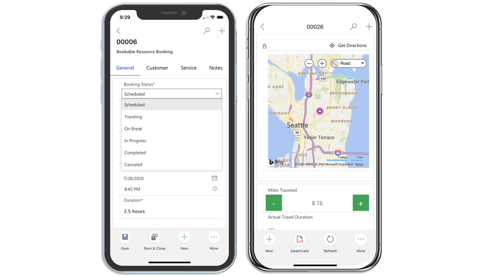
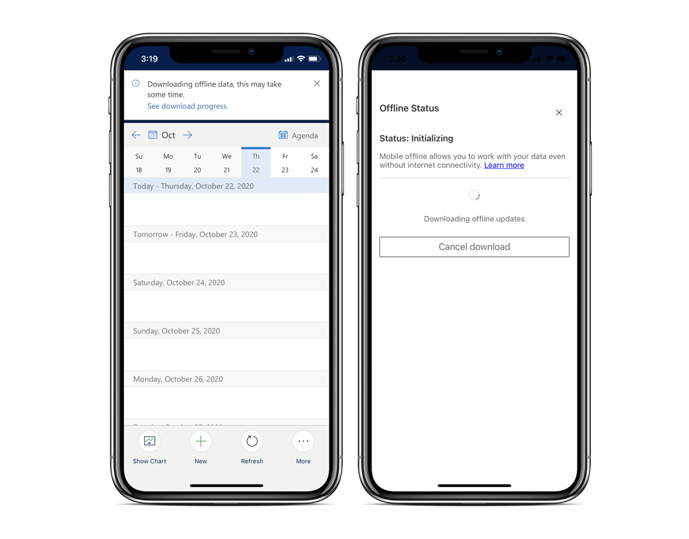
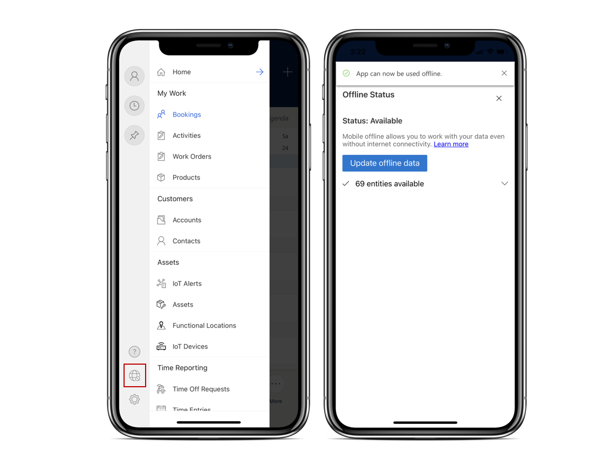
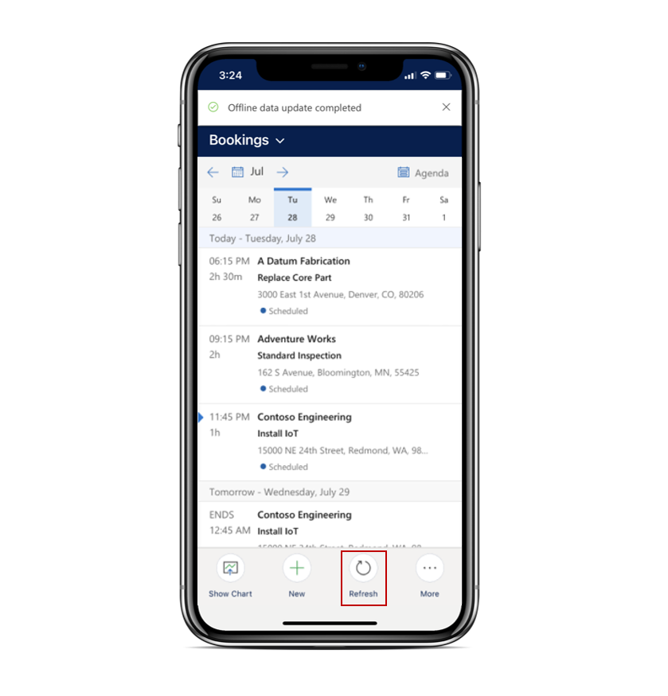

# Get started with the Field Service (Dynamics 365) mobile app

The Field Service (Dynamics 365) mobile app is designed and optimized for technicians to view Dynamics 365 Field Service work orders, customer assets, accounts, and contacts. This mobile app is built on Microsoft Power Platform as a [model-driven app](https://docs.microsoft.com/powerapps/maker/model-driven-apps/model-driven-app-overview) and is customizable to your business needs with the same admin console as all Dynamics 365 business apps.

> [!div class="mx-imgBorder"]
> 

Available natively for Apple iOS and Google Android phones and tablets, the Field Service (Dynamics 365) mobile app offers technicians many capabilities they need to perform onsite customer service, such as:  

- A calendar view of assigned jobs.
- Support for picture, video, and asset barcode scanning.
- Customer signature capture.
- Offline capabilities so technicians can continue viewing and recording work in areas without internet.

## Prerequisites

- **Field Service v8.8.22+**. The Field Service (Dynamics 365) mobile app will appear in your list of Dynamics 365 applications as "Field Service Mobile".

> [!div class="mx-imgBorder"]
> 

- Select the ellipses icon on the **Field Service Mobile** application, then choose **Manage Roles** and assign the app to the **Field Service-Resource**, **Field Service-Administrator**, and other relevant roles that will need access to the mobile app.

- Set up a Dynamics 365 Field Service user with the **Field Service-Resource** security role. This user will sign in to the Field Service (Dynamics 365) mobile app as a technician.

> [!div class="mx-imgBorder"]
> 

- To view work orders on the mobile app, you must also [create a bookable resource](./set-up-bookable-resources.md) related to your technician user and schedule work orders to the bookable resource.

> [!div class="mx-imgBorder"]
> 

## Install and sign into the Field Service (Dynamics 365) mobile app

Go to the app store on your iOS or Android device and search for **Dynamics 365 Field Service**.

Download the app called **Field Service (Dynamics 365)**, as seen in the following screenshot. It's the mobile app built on the Power Platform.

> [!div class="mx-imgBorder"]
> 

Launch the app and sign in with your username and password, which should be the user credentials of the technician user with the **Field Service - Resource** security role. View the topics on [setting up users and security roles](../field-service/view-user-accounts-security-roles.md) and [creating a Bookable Resource](set-up-bookable-resources.md) for help. 

## Use the Field Service (Dynamics 365) mobile app

Once you sign in, the app will prompt you to download offline data (your scheduled work orders) to the device. If you anticipate not having internet access, select **Download**. Otherwise you can **Skip for now**. If you're unsure, we recommend downloading the offline data just in case. 

> [!div class="mx-imgBorder"]
> 

## View scheduled work orders

The first screen you'll see is a calendar view of your scheduled work orders.

Select **More** > **Show as** > **Read-only Grid** to see the bookings as a list as shown on the right side of the following screenshot.

> [!div class="mx-imgBorder"]
> 

Select a booking to see more details about the booking time and the work order. For example, you can update the status to **Traveling** to indicate you are driving to the customer location; on the **Customer tab**, you can see the work order location on a map and trigger turn-by-turn driving directions from a GPS app on your phone such as Bing Maps, Apple Maps, Waze, or Google Maps.

> [!div class="mx-imgBorder"]
> 

On the **Service tab**, you'll see work order details like work order service tasks, products, and services.

On the **Notes tab**, you'll see a way to add note text, pictures, and videos, as well as customer signature capture.

> [!div class="mx-imgBorder"]
> 

## Find more information

To get to the sitemap, select the menu icon from the calendar view. From here, you can find other important information like accounts, contacts, customer assets, or to record time off.

> [!div class="mx-imgBorder"]
> 

## Global search (search with barcode)

Select the global search icon to search for records across accounts, contacts, work orders, customer assets, or any other entity. Technicians can also search by scanning a barcode with their phone's camera. The barcode scan will find records that have a matching barcode field.

> [!div class="mx-imgBorder"]
> 

For more information, see the article on [configuring global search](https://docs.microsoft.com/dynamics365/field-service/mobile-power-app-configure#customize-global-search-and-enable-scan-to-search).

## Work offline

If you expect to be performing work in areas without internet access, you can download important information to your device to keep working.

The Field Service mobile app runs in **offline by default**. Offline by default is a mode where the app runs offline first and performs consistently with or without internet connectivity. Technicians no longer need to decide to go offline or manually switch between online and offline modes.

Consider a scenario where a technician needs to work in the basement of an industrial complex. They will often have limited or no internet connectivity. Working offline will download their work orders, notes, service tasks, and pictures for use without connectivity; once connectivity is restored, new data is automatically synced back to the server. This process happens without interruption to the technician's experience.

Upon sign-in, the app will download important Field Service information as defined by system administrators. For more information, see the article on [configuring offline sync filters](https://docs.microsoft.com/dynamics365/field-service/mobile-power-app-configure#configure-offline-data-and-sync-filters).

> [!div class="mx-imgBorder"]
> 

When the **Status** is set to **Available**, you'll have all the data you need to work offline.

> [!div class="mx-imgBorder"]
> 

> [!Note]
> When the technician has internet connectivity, data on the device is automatically refreshed every five minutes.

Technicians also have the option to **Update offline data** manually by going to the home screen, selecting the offline icon in the bottom left, then selecting the **Update offline data** option. 

> [!div class="mx-imgBorder"]
> 

Technicians may also want to sync specific views when they have internet connectivity. For instance: 

- The technician wants to check for new bookings on their calendar before starting to drive.
- The technician wants to check for updates on a work order made by other crew members. 

To sync specific views, select **Refresh** from the app's bottom menu. For example, you can refresh bookings by selecting the **Refresh** option, shown in the following screenshot.

> [!div class="mx-imgBorder"]
> 

## Delete data and clear cache from device

To remove all cached data, you need to reconfigure the app.

Go to the main menu, then select the person icon in the top left.

Then select **Reconfigure**.

> [!div class="mx-imgBorder"]
> 

Reconfiguring deletes data and metadata for the current organization from the cache.

> [!Tip]
> Don't rely solely on the reconfiguration for security measures.

Make sure to reconfigure before you sign out. You won't be able to reconfigure if you're signed into another organization.

## IoT on the Field Service (Dynamics 365) mobile app

For organizations using Connected Field Service, technicians can view and interact with IoT data and actions in the Field Service (Dynamics 365) mobile app.
 
> [!div class="mx-imgBorder"]
> 

For more information, see the article on [Connected Field Service for the Field Service (Dynamics 365) mobile app](cfs-mobile-powerapp.md).

## Trigger Dynamics 365 Remote Assist

Organizations using Dynamics 365 Remote Assist will see that technicians can trigger a deep link from the work order to open the Dynamics 365 Remote Assist mobile app.

> [!div class="mx-imgBorder"]
> 

For more information, see the article: [Using Field Service with Dynamics 365 Remote Assist](remote-assist-hololens.md).

### Next steps

After installing Field Service and the Field Service mobile app, view the following topics to configure the system to create, schedule, view, and complete work orders.

- [Perform initial configurations](perform-initial-configurations-setup.md)
- [Set up users and security roles](../field-service/view-user-accounts-security-roles.md)
- [Create a Bookable Resource](set-up-bookable-resources.md)
- [Quickstart: Schedule a work order and view it on the mobile application](quickstart-schedule-work-order.md)