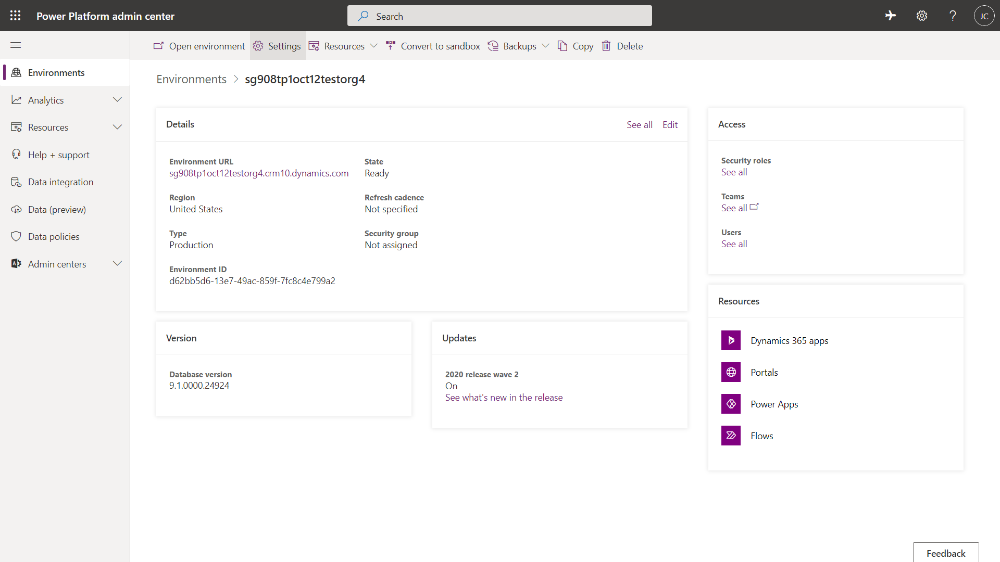
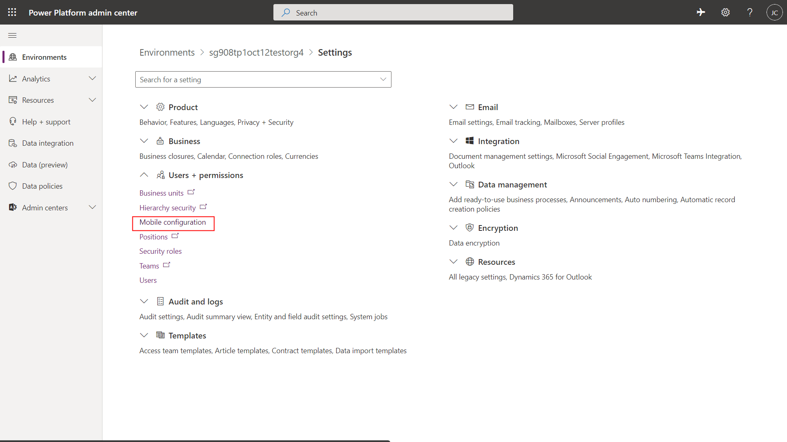
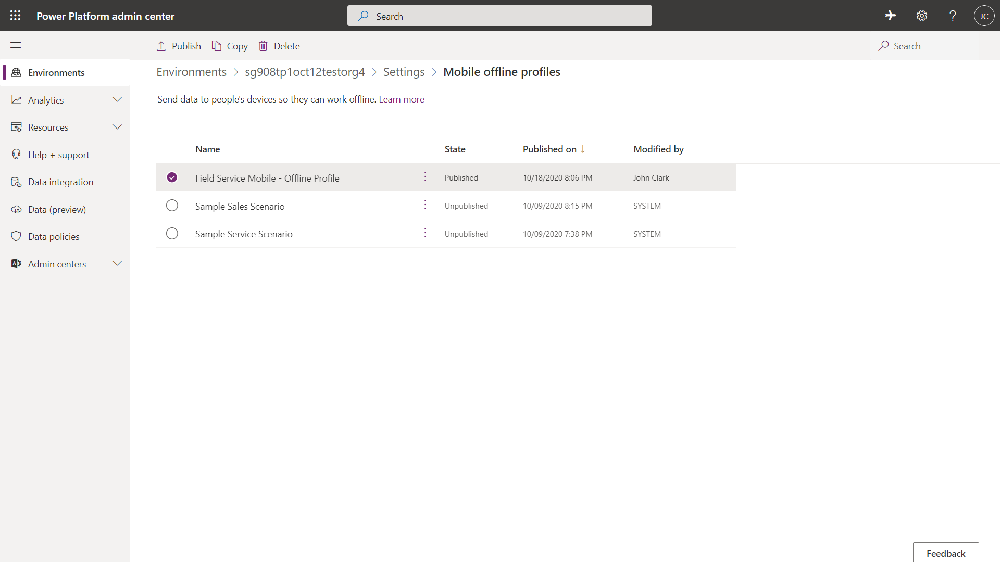
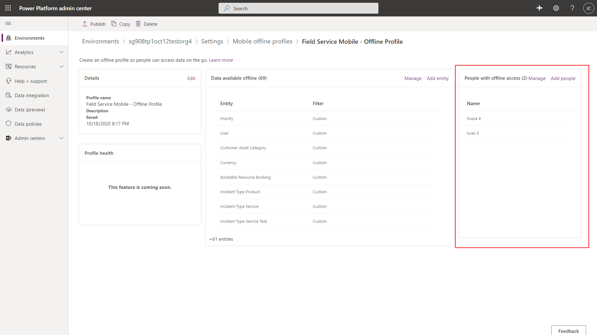
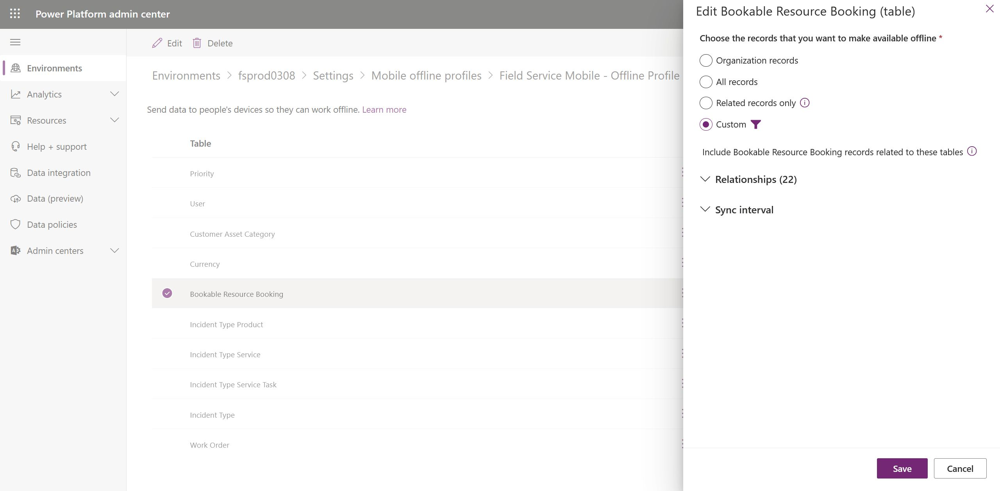
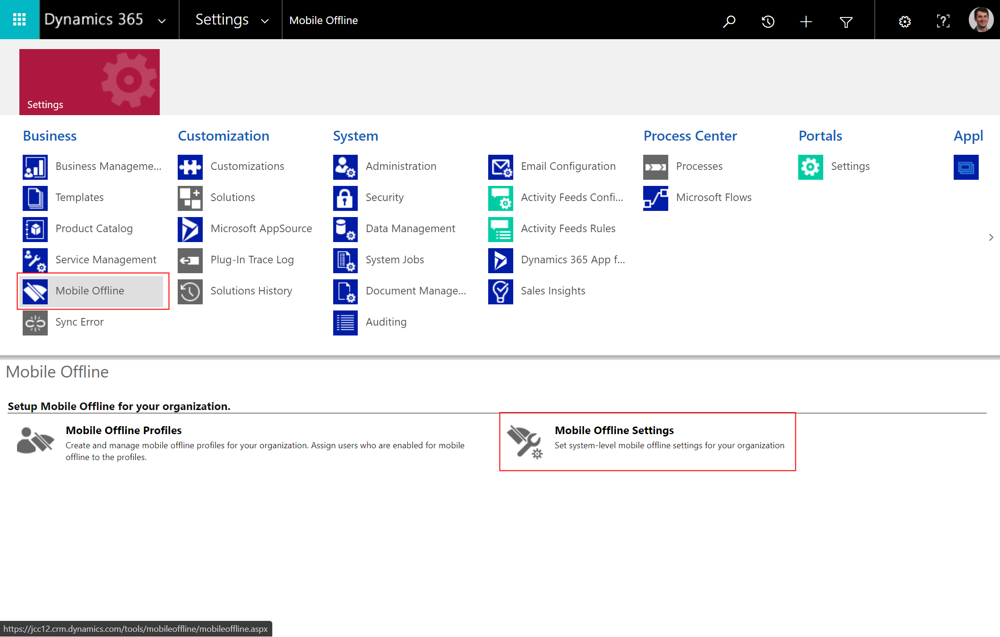
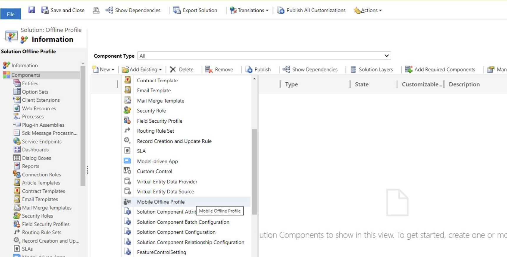
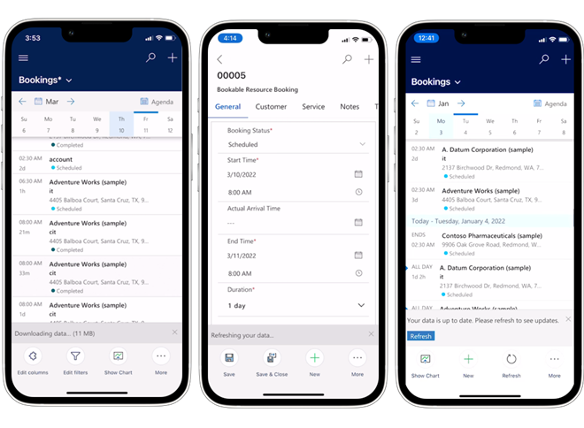

# Configure offline capabilities in the Field Service (Dynamics 365) mobile app

Often frontline workers need to work in areas without internet access like remote areas or underground. Configure offline capabilities to allow frontline workers to continue using the Field Service (Dynamics 365) mobile app when there's no internet connection.

With offline capabilities, important data syncs to the device for viewing when there's no internet connection. Updates by the frontline workers are stored locally on the device and synced to the server with an active internet connection.

> [!div class="mx-imgBorder"]
> 

>[!TIP]
> Configuring offline capabilities creates a fast and consistent experience and is strongly recommended.

Administrators can control what data is downloaded to the Field Service (Dynamics 365) mobile app with the offline profile.

Configure offline capabilities in four steps:

1. Set up an offline profile (one exists by default).
2. Add users to the offline profile.
3. Edit and publish the offline profile as needed.
4. Add the offline profile to the Field Service mobile model-driven app.

For a guided walkthrough, check out the following video.

> [!VIDEO https://www.microsoft.com/videoplayer/embed/RE4J8no]

## Step 1: Set up an offline profile

Offline record types, relationships, and user assignments are managed through your **Offline Profile**.

Within your offline profile you can:

- Define record types that are available offline and their sync interval.
- Define filters for each record type. For example, by default only bookings that start within the next seven days are downloaded to the device.
- Set up item association by creating relationships between entities. Item association saves time because not every record type needs a filter. You can associate related record types that follow filters set on the related record type.

Go to the Power Platform admin center at [https://admin.powerplatform.microsoft.com/](https://admin.powerplatform.microsoft.com/), and find and select your environment.

Select **Settings** at the top.

> [!div class="mx-imgBorder"]
> 

Go to **Users + permissions section** > **Mobile configuration**.

> [!div class="mx-imgBorder"]
> 

Field Service provides an out-of-the-box offline profile called **Field Service Mobile - Offline Profile** with recommended default settings for Field Service record types.

> [!div class="mx-imgBorder"]
> 

### Implementation guidance for the offline profile

**Use the offline profile included with Field Service**. The default **Field Service Mobile - Offline Profile** provides an ideal starting point for offline configuration, with defaults for out-of-the-box record types and sync intervals. Use this profile and build upon it by including your custom record types. By working within the provided profile, default entities can still receive updates over time. With offline data, in-app performance such as displaying forms will be much better. Limiting the amount of data in the offline profile to what is needed by the user will improve sync performance.

**Avoid removing default record types from the offline profile**. These default record types are purposefully added to ensure the right data is available to the frontline worker. Focus on adding the record types you need to the offline profile rather than removing ones you don't need.

**Avoid using "All records" as an offline filter**. The offline profile is the gate that controls the amount of data downloaded to the frontline workers’ devices. To keep sync times fast and efficient, avoid including "All records" as an entity filter and avoid wide date ranges. For example, rather than downloading all customer asset records, download only the records related to scheduled work orders. It reduces the number of customer asset records without impacting work that needs to be done.

**Use offline JavaScript**. Organizations often need to run workflows on mobile devices to execute business processes. However, Power Automate flows only run when the device is connected to the internet or on the next sync. Use offline JavaScript to run workflows on the device quickly and without internet access. For more information, go to [Workflows and scripts for the Field Service (Dynamics 365) mobile app](mobile-power-app-workflows.md).

For more best practices, go to [Power Apps Mobile Offline Guidelines](/power-apps/mobile/mobile-offline-guidelines)

## Step 2: Add users and teams to the offline profile

Open the **Field Service Mobile - Offline Profile**.  

Add users or [teams](/power-platform/admin/manage-group-teams) to the offline profile in the right **People with offline access** panel. When a team is added to the profile, the users within that team are displayed under the team, while individual users are displayed directly in the offline profile. Organizations with many users should use teams to help ease maintenance of user access.

A user or team can only be added to one offline profile one at a time. If they're added to another offline profile, you'll see a warning stating they're already part of a different offline profile. If you continue with the change, the user or team will be moved to the new profile.

> [!div class="mx-imgBorder"]
> 

## Step 3: Edit and publish the offline profile

For each record type, you can choose a data download filter:

1. Download related data only.
2. All records. We don't recommend this setting because it can lead to a slow sync.
3. Other data filter.
4. Custom data filter.

> [!div class="mx-imgBorder"]
> 

For example, the **Bookable Resource Booking** (in other words, the booking) entity has a data download filter set to **custom data filter** that downloads resource bookings that start or end in the next seven days or today.

> [!div class="mx-imgBorder"]
> 

**Save and Publish** the offline profile.

> [!NOTE]
> The default offline profile is updated periodically as part of Field Service updates. If you edited the offline sync filter of an entity, the entity's sync filter will not receive updates; other entity sync filters that have not been edited will receive updates in an unpublished state. Administrators can review the updates and decide if they want to take the update or continue with the previous sync filters. This only applies to sync filters and relationships will receive updates while keeping your specific changes.

For more information on offline profiles, see [Setting up mobile offline synchronization](/dynamics365/mobile-app/preview-setup-mobile-offline).

## Step 4: Add the offline profile to the app

Go to your Dynamics 365 apps by going to `yourenvironment.crm.dynamics.com/apps`, then go to the app designer for Field Service mobile.

> [!div class="mx-imgBorder"]
> 

Go to **Properties** and add the offline profile you published if it's not already there. Remember to save and publish your changes if you add an offline profile.

> [!div class="mx-imgBorder"]
> 

> [!NOTE]
> Field Service customers can create additional offline profiles to enable scenarios where different user roles have different sync settings or entities available to them. For example, a Field Service manager may require seeing a broader scope of work orders that may not be assigned to the current operator of the mobile app. If you create a new offline profile, you'll need to add it to the Field Service mobile app in the app designer as well.

Sign into your mobile app, then go to **Settings** > **Offline Setting (globe icon)** to see the status of downloaded data.

> [!div class="mx-imgBorder"]
> 

If data isn't downloading, try signing out and signing back in. If offline data is still not downloading, make sure the user you're signing into the mobile app as has been assigned to a **Published** mobile offline profile.

## Understanding offline vs. online capabilities

Once an offline profile is configured and user assigned, following the initial sync to download data, the mobile app will always run offline-first. This functionality optimizes performance and creates a consistent experience for frontline workers as they move through areas with and without internet connection.

1. **Offline not configured**: Occurs when there's internet but no offline profile is configured. The mobile app functions like using a Dynamics 365 app with internet on your PC. When internet is lost or diminished, the mobile app is unusable. Not recommended.
2. **Offline First without internet connection**: Data is downloaded to the device and all changes are saved locally to your mobile device. When internet is restored, the changes are synced to the server.
3. **Offline First with internet connection**: Data is downloaded to the device and all changes are saved locally; but because there's internet connection, the user can manually sync to receive the latest data from the server (like a new booking). The app will also automatically attempt to sync every few minutes. For more information, see [sync filters](#sync-intervals) in this article.

In summary, an offline-first application will always read from the local device database and will only use an active internet connection during the synchronization process. This makes it important that your offline profile is configured to sync all data to the device that the frontline worker requires during their working hours.

> [!NOTE]
> After the offline-enabled user configures and signs into the app, the initial data sync will begin. During this time period, the app with run in online mode and changes will be updated on the server. After completing the offline sync, the app will be in offline-first mode and will read data from the local device database. During the time period of subsequent sync cycles, the app will not run as though in online mode.

## Sync intervals

Sync intervals define how often record type data will automatically sync down to the users' devices. Sync intervals can be a minimum of five minutes or as long as one day. Records that change frequently can have a short duration sync interval, while infrequently changed records don't need to sync as often. With variable sync intervals, administrators have greater control over data and can help improve sync performance.

The default **Field Service Mobile - Offline Profile** has predetermined sync intervals for each record type, which is selected based on typical usage patterns of those record types.

> [!NOTE]
> A sync is only initiated when there is connectivity and when the app is actively running on the user’s mobile device. For Android devices, once the sync is initiated, it can be completed even when the app is in the background.
Dependencies based on selected relationships and custom filters that include related tables are analyzed at each sync request. Sync interval for an entity may not be respected if there is a related table with a lower sync interval.

> [!div class="mx-imgBorder"]
> 

> [!NOTE]
> Sync intervals are defined per record type with Field Service v8.8.40+. In earlier versions, all record types will have a five-minute sync interval.

## Sync conflicts

Sync conflicts can happen if there's a mismatch between data on the device and data on the server. For example, when a frontline worker and a dispatcher edit the same work order without synchronizing the changes. The system won't know which modification to apply to the record because it gets conflicting information.

Conflict errors can be resolved based on the settings set by the administrator. A conflict is raised at the entity level and not per field.

To set conflict detection, go to **Settings** > **Mobile Offline** > **Mobile Offline Settings** and the **Mobile Client** tab.

> [!div class="mx-imgBorder"]
> 

### Set conflict detection for mobile offline synchronization

- **No**: Data on the client device (mobile app) wins and there will be no sync errors. This setting is the default.

- **Yes**: Data on the server wins. The technician using the app may see errors informing them of conflict. In this case, while syncing changes to the server, you might see some errors that are automatically resolved. Client changes are overwritten by server values. Data on the device may be overwritten by data from the server. In this case, while syncing changes to the server, the technician using the application may see errors informing them of conflict.

> [!div class="mx-imgBorder"]
> 

Administrators can view past sync errors by going to **Settings** > **Sync Error**.

## Configuration considerations

### Should I make a copy of the offline profile?

It's recommended to use the mobile offline profile included with Field Service and then make offline filter changes directly in the *Field Service Mobile - Offline Profile*. Using the default offline profile allows your offline profile to receive updates to unchanged entity sync filters. You can also copy the default *Field Service Mobile - Offline Profile*, and make changes to the copy. The copy is considered unmanaged and won't receive any updates. If you make changes to the default offline profile and want to see the latest offline profile, create a new trial of Field Service to view it.

> [!div class="mx-imgBorder"]
> 

### What is the best practice when moving the mobile offline profile between environments?

To control changes and keep your offline profiles in sync, your organization may require making changes to your mobile offline profile in one environment and the moving that profile into other environments. Best practice is to perform the following steps:

1. Create a copy of the default **Field Service Mobile - Offline Profile**.
2. Modify your copied profile as needed.
3. Create a managed solution that includes the mobile offline profile.  
   - In Dynamics 365, go to **Settings** > **Solutions** > **Create a new solution**.
   - Within the new solution, **Add Existing** > **Mobile Offline Profile**.
4. Export the managed solution containing the mobile offline profile from the original environment.
5. Import the managed solution into the new environment.

> [!div class="mx-imgBorder"]
> 

### Are WebResources supported in offline mode?

Due to some current [limitations](/power-apps/mobile/offline-capabilities#limitations) of offline WebResources, we recommend using the [Power Apps component framework (PCF)](/powerapps/developer/component-framework/overview) to implement custom capabilities that work in both the Field Service (Dynamics 365) mobile app and in the browser.

### How do I know when a sync is in progress?

During regular use, a frontline worker will receive a notification during:

- Initial sync going offline for the first time.
- Manual refresh by selecting **Refresh** button on a grid.
- Large incremental sync, such as if the app has been closed for multiple days (like over the weekend, for instance).

These notifications will continue to display while the sync is in progress. The larger incremental sync lets you refresh the current view with latest data when complete.

The **Offline Status** page in the app, available from the sitemap, can also be viewed to see which tables have been synchronized and the last date and time of the sync.

> [!div class="mx-imgBorder"]
> 

Sync notifications are available from Unified Interface Platform version 9.2.22033.00152+.

### Why does the offline enabled application show a message "Network or Service Unavailable"

The message "Network or Service Unavailable" shows when the application detects the network isn't suitable for online activity. While this message is displayed, the client won't sync new data, and some network-dependent areas of the application won't work. For example, maps or Dataverse search depends on device connectivity. 

The application will check for connectivity whenever you navigate. The following events determine network detection, which may result in the error message:
- Application boots into offline mode prior to detecting network availability.
- Application network check fails with no response or a response that takes too long.

### Known Limitations

- Offline sync filters: If a record is created from the device while in offline mode, and that record doesn't meet filter conditions, then the record doesn't get resynchronized from the service until conditions are met.
- Offline sync filters: If commands or capabilities are set up to work with internet connectivity but not in offline mode, those capabilities should be reviewed to confirm they're calling correct APIs: `Xrm.WebApi.online`.
- Offline Tables: Tables that are supported offline are added as part of the default Field Service Mobile Offline Profile. Some field service tables such as Purchase Order, Agreements, RTV, and RMA don't support offline profiles. Adding these tables and running the application while offline may result in errors in the mobile application.
- Inventory Validation isn't performed while the device isn't connected.
- When configuring the Mobile Offline Profile, there can be a maximum of 15 linked Tables. This 15-link limit includes downstream Tables. For example, if Table A has relationship with Table B, C, D and Table B has a relationship with Table F, G, H. Table A will have six relationships: B, C, D, F, G H. 
- [Details on other platform supported capabilities and limitations for offline](../mobile-app/mobile-offline-capabilities.md)

> [!NOTE]
> As part of Wave 1, 2021, Power Platform is introducing new (preview) features for the mobile offline profile. These features include a new way to access the mobile offline profile from [http://make.powerapps.com](http://make.powerapps.com), improved error handling, and removing the need to manually add individual user access. For more information, see [mobile offline overview](/power-apps/mobile/mobile-offline-overview) in Power Platform documentation.

[!INCLUDE[footer-include](../includes/footer-banner.md)]
