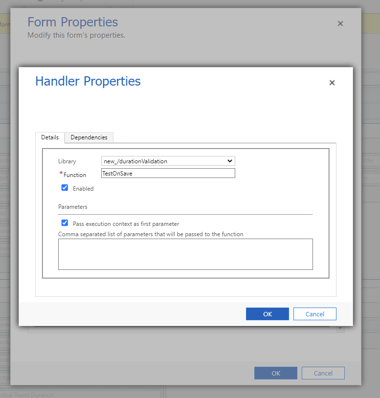

# Workflows and scripts for the Field Service (Dynamics 365) mobile app

Use Microsoft Power Automate flows and the Dynamics 365 workflow engine to create workflows and business processes for technicians using the Field Service (Dynamics 365) mobile app.

For more information, see the following articles: 
- [Create a flow that uses Microsoft Dataverse](/power-automate/common-data-model-intro) 
- [Create custom business logic through processes](../customerengagement/on-premises/customize/guide-staff-through-common-tasks-processes.md)

Power Automate flows and workflows will trigger when the mobile app is synced with the server and the conditions of the workflow are met. If there is no internet connectivity, use offline JavaScript as seen in the next section.

## Offline JavaScript

In some cases, an organization may want to run validation on certain field values after a technician updates an entity. For example, let's say you want to make sure the duration of a work order booking is at least two hours once a technician saves a record in the Field Service (Dynamics 365) mobile app.

Validation can be done with the help of some JavaScript and doing so works online and offline.

See the video on [Field Service (Dynamics 365) mobile app: Offline JavaScript](https://youtu.be/tUdL5YZA29A) for more details.

Go to **Settings** > **Customizations**.

Go to the **Bookable Resource Booking** entity.

Go to **Forms**.

Go to the **Booking and Work Order** form.

Go to **Form Properties** in the top.

> [!div class="mx-imgBorder"]
> 

Create and add a new JavaScript web resource to the form.

Enter in the following code snippet:

```javascript

        function TestOnSave(executionContext) {

            var formContext = executionContext.getFormContext(); // get formContext
            var duration = formContext.getAttribute("duration").getValue();

            formContext.ui.clearFormNotification("DurationErrorMessageId");

            if (duration < 120) {
                executionContext.getEventArgs().preventDefault(); // Stop the Save
                formContext.ui.setFormNotification("Duration must be greater than 2 hours", "ERROR", "DurationErrorMessageId");
        }
    }

```

In the Event Handlers section change the Event from onLoad to onSave of the form.


> [!div class="mx-imgBorder"]
> )

  
Save and publish customizations.

[!INCLUDE[footer-include](../includes/footer-banner.md)]
