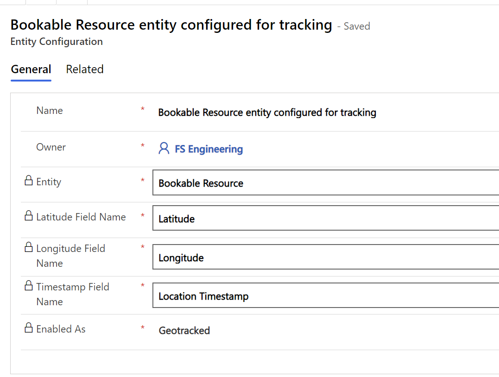
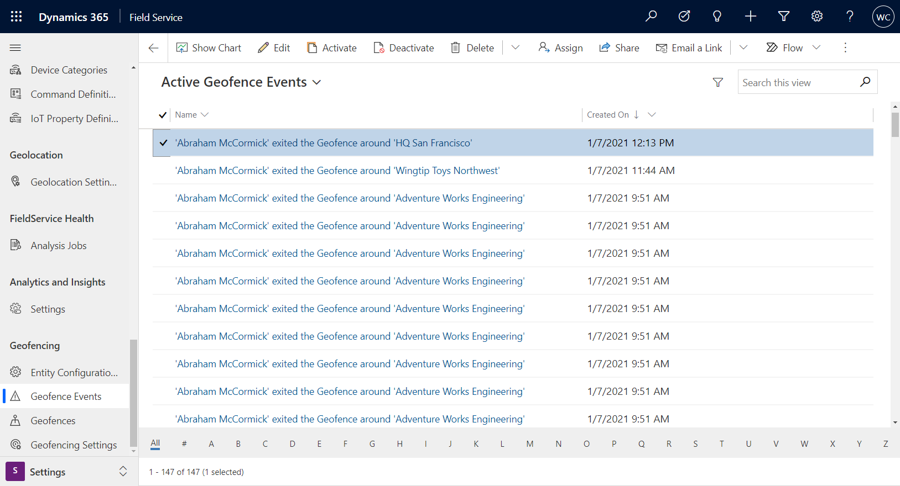
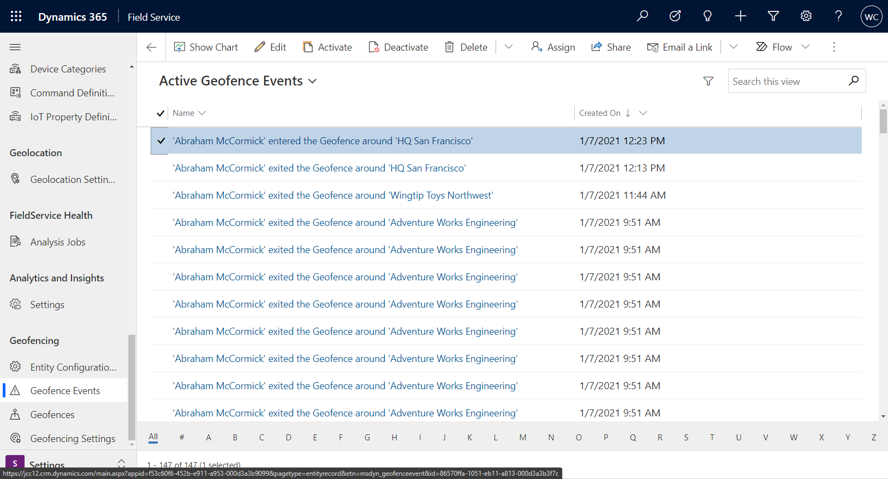

# Geofencing for the Field Service mobile app

A geofence is a virtual perimeter around a specific location. Geofencing allows users to draw zones around places of work, customer sites, and secure areas. You can configure the system to trigger various actions when geofences are crossed by a person or an equipped vehicle.

In Dynamics 365 Field Service, the default use case for geofencing is to create a circular geofence around a work order's location and compare this to the changing location of field technicians as measured by their mobile devices running the Field Service mobile app. When a work order geofence is crossed or "broken" by a field technician, a **geofence event** record is created and the geofence status is changed from **outside** to **inside**, indicating the field technician is inside the geofence. Another geofence event is created as the field technician leaves the geofenced area. Based on entering or leaving a geofenced area, a mobile push notification or custom workflow can be triggered.

In this article, we will look at how to configure and use geofences by exploring:

- setting distance radius
- booking a work order to automatically create a geofence around it 
- testing geofence events, as field technicians enter and leave geofenced areas 

## Prerequisites

- **Field Service v8.8.32+**. 

- [Connect to Bing Maps](https://docs.microsoft.com/dynamics365/customer-engagement/field-service/perform-initial-configurations-setup#step-1-resource-scheduling) in order to connect your Dynamics 365 environment to Bing Maps in order to locate service accounts and work orders to later place geofences around them.
   
- [Set auto geo code addresses to **yes**](https://docs.microsoft.com/dynamics365/customer-engagement/field-service/perform-initial-configurations-setup#step-2-field-service-settings) in order to automatically geo code accounts and work orders when addresses are entered. Geo coding an account or work order record populates latitude and longitude values, which are required to place geofences around them.

- [Enable location tracking, sharing, and auditing](mobile-powerapp-location-auditing.md) and test location tracking to ensure the technicians 

- This article applies to geofencing for the [Field Service mobile app built on the Power Platform](mobile-power-app-overview.md). 

## Step 1. Enable and test location tracking, sharing, and auditing

First [enable location tracking, sharing, and auditing](mobile-powerapp-location-auditing.md) and verify each technician's location is being tracked in Field Service. You will know location tracking is working if the technician's location is appearing on the schedule board map and in location records in the Geolocation Tracking entity.

> [!div class="mx-imgBorder"]
> 

## Step 2. Verify geofence solutions are installed

Go to **Settings > Solutions** and make sure the following geofence solutions are there:

- **Geofence Alerts**
- **Geofence Management**
- **Geofence for Field Service**

> [!div class="mx-imgBorder"]
> 

Upgrade to Field Service 8.8.32+ if these solutions are not present. 

## Step 3. Activate geofence processes

Go to **Settings > Processes** and **Activate** the following processes. These processes are installed in a draft state with the geofence solutions:

- DeleteGeofenceWhenBookingIsCompletedOrCanceled
- GenerateGeofenceWhenBookingIsCreated
- Update Resource Location from Resco Audit

> [!div class="mx-imgBorder"]
> 

If you have **Enhanced Background Processing** set to _Yes_ in [Field Service Settings](https://docs.microsoft.com/dynamics365/field-service/configure-default-settings#other-settings), enable the Geofence Power Automate flows.

1. Go to https://make.powerapps.com/ and select your environment.
2. Go to **Solutions** > **Geofencing for Field Service**.
3. Enable the following flows:
   - **Flow – DeleteGeofenceWhenBookingIsCompletedOrClosed**
   - **Flow – GenerateGeofenceWhenBookingIsCreated**
   - **Flow – UpdateGeofenceInstanceCoordinates**

> [!div class="mx-imgBorder"]
> 

> [!Note]
> If you choose to use enhanced background process Power Automate flows instead of Processes, you do not need to deactivate the Processes.

## Step 4. Configure geofencing settings

Go to **Field Service > Settings > Geofencing Settings**.

Enter a **unit of measure** and **minimum radius**. As demonstrated in the following screenshot, the smallest geofence we can create is a circle around a service account, with a radius of 25.59 feet.

> [!div class="mx-imgBorder"]
> 

## Step 5. Configure geofence entities

Go to **Field Service > Settings > Entity Configurations**.

Then select the account configuration, included by default with the geofence solutions.

> [!div class="mx-imgBorder"]
> 

Enter the following information:

- **Entity:** Select **Account** because work order locations are inherited from the related service account. 

- **Latitude / Longitude:** Choose the latitude and longitude fields on the account entity that hold the geo coded location;  this will determine the center of the geofence.

- **Enabled As:** Select **Geofence** because the account serves as a static location that a geofence will surround.

- **Default Radius:** Enter a number to represent the radius of the geofence around the latitude and longitude of the account location. The unit of measure will be the unit chosen in the geofence settings in the previous step. In this example, the default radius is 328.08399 feet.
   
> [!div class="mx-imgBorder"]
> 
 
Next, go to the bookable resource configuration and enter the following: 

- **Entity:** Select **Bookable Resource** to compare the location of field technicians relative to work orders and service accounts. 

- **Latitude / Longitude:** Choose the latitude and longitude fields on the bookable resource entity that hold the most recent coordinates of the location.

- **Enabled As:** Select **Geotracked** because the bookable resource has a variable location that is compared against defined geofences.

> [!div class="mx-imgBorder"]
> 

## Step 6. Book a work order 

Next, book a work order using your preferred method. In this example, a work order is manually dragged and dropped to a field technician bookable resource. As a reminder, this resource has been designated as a **User** type, and has access to the Field Service Mobile app. 

> [!div class="mx-imgBorder"]
> 

Booking a work order will trigger an asynchronous workflow that creates a geofence as long as the appropriate process was activated in earlier steps.

Go to **Field Service > Settings > Geofences** to view the newly created geofence.

> [!div class="mx-imgBorder"]
> 

The **Geotracked Record Status** is set to **Outside**, meaning the bookable resource is outside of the geofence area.

## Step 7. Test a geofence event

Finally, we can test "breaking" a geofence, meaning a bookable resource travels inside the geofenced area.

Before traveling to the work order location, the technician is outside the geofence and an "exit" geofence event is created.

> [!div class="mx-imgBorder"]
> 

This is typically done two ways.   

The first way is to travel within the geofenced area and sign in and synchronize the Field Service mobile application. 

> [!div class="mx-imgBorder"]
> 

The second way is for testing and development purposes; it simulates traveling within the geofenced area by using administrator security to manually enter latitude and longitude values in the mobile audit table and the bookable resource record.

> [!div class="mx-imgBorder"]
> 

> [!Note]
> You can enable editable grids for the mobile audit entity to override the latitude and longitude values. You can access the mobile audit table by going to a list view for another entity in the Unified Client Interface (UCI) and manually entering **resco_mobileaudit** in the URL.

Confirm the latitude and longitude on the bookable resource record is updated as well, and if not, manually adjust them with administrator security.

Either way, the synchronized coordinates will be within the geofenced area and trigger a **Geofence Event**.

> [!div class="mx-imgBorder"]
> 

Additionally, this will change the related geofence **Geotracked Record Status** to **Inside**.

## Configuration considerations
- Custom geofences using entities other than accounts and bookable resources are supported.
- You can configure how far back in time a geo-location is valid. This is important for scenarios when a bookable resource synchronizes a geo-location to the server and then loses internet connection, making dispatchers unaware of the true location. The time threshold can be configured in **Resource Scheduling > Settings > Scheduling Parameter > Geo Data > Geo Location Expires After X Minutes**.

> [!div class="mx-imgBorder"]
> 
  
## Additional notes
- Currently only circular-shaped geofences are supported.

## Configuration considerations
## Additional Notes

### See also

- [Geofencing for Field Service Mobile (Xamarin) app](field-service-mobile-overview.md)