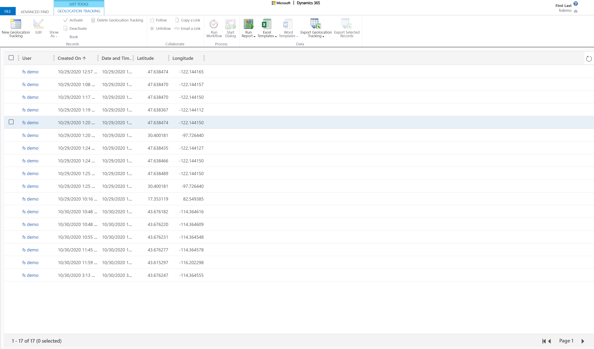

# Location auditing on the Dynamics 365 Field Service mobile app

// https://msit.microsoftstream.com/video/0a25a1ff-0400-9fb2-fe26-f1eb1afe3269

## Prerequisites

> [!div class="mx-imgBorder"]
> 

## Step 1. Enable location tracking

1.	Go to the Geolocation Settings.
2.	Select Enable Location Tracking  = Yes  
3.	Adjust the days, times, and frequency to capture technician location 

> [!div class="mx-imgBorder"]
> 

This allows a technician's location data stream to be sent to Dynamics 365 Field Service, which surfaces a technician’s location on the schedule board.  The technician’s location data will be stored in the Geolocation Tracking entity.

## Step 2. Allow Field Service mobile to access your location

After enabling location tracking, you should test the location data stream.

First, log into the Dynamics 365 Field Service mobile application and Allow Field Service to access your location while using the app.

> [!div class="mx-imgBorder"]
> 

## Step 3. Verify location tracking
The bookable resource's current location will appear on the schedule board map. Select the map pin icon next to the bookable resource's name and the map will display the location with a different icon.

> [!div class="mx-imgBorder"]
> 

## Step 4. Location Audit
Using the **Geolocation Tracking** entity and Advance Find, you can query to run location audits.

> [!div class="mx-imgBorder"]
> 

> [!div class="mx-imgBorder"]
> 

> [!Note]
> If you want to correlate technician location with other Field Service entity updates, such as Booking Resource Bookings, go to Auditing Overview for more info with instructions to enable for your organization and select entities.  

## Configuration considerations
## Additional Notes