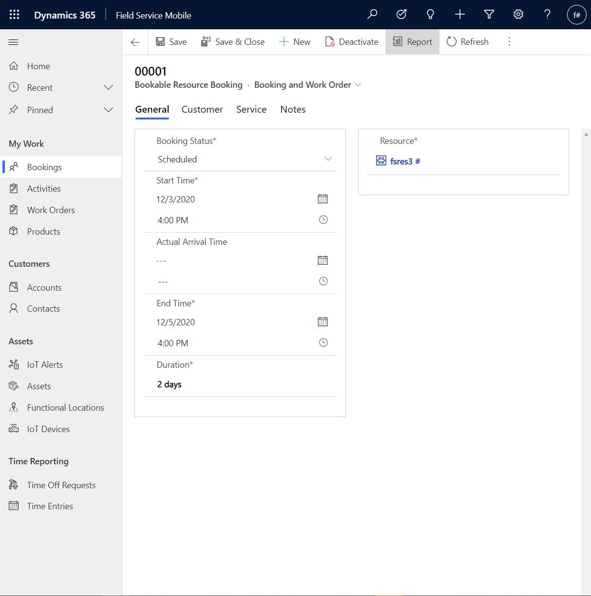

# Field Service Technician Service Report
Field Service Technicians often will create service reports summarizing work done during a customer visit. These reports can carry details such as tasks completed, and products or parts used during the service. Service report often need to be delivered to the customer as a PDF report.

> [!div class="mx-imgBorder"]
> 

This article outlines how to leverage the Power Apps Component Framework (PCF) to build a service report for the Field Service mobile application. This article also provides a sample report and PCF control which will serve as a guide for developers to design and import the control for their environment.

Features of the Technician Reporting PCF Control
- Generate service reports while your mobile app is online or offline.
- Command option on the Bookable Resource Booking form to launch the report.
- Sample report layout with API calls to fetch offline data.
- In-app report preview and signature experience.
- Save the report back to service timeline as a note. 
- Accessibility compliant preview and output report.

## Set up mobile reporting

### Steps to enable the PCF report

1. Download [Reporting Solution](http://aka.ms/fsmreporting-solution).
2. Download sample [Reporting PCF Control](http://aka.ms/fsmreporting-pcf) source code.
3. Import the reporting Solution into your environment. This will install a reporting form, ribbon command, and includes a sample report so you can execute functionality within your environment,
4. After importing the reporting solution, open your Field Service mobile app module in App Designer and enable the Reporting form for the Bookable Resource Booking entity.
5. Leverage your favorite IDE to edit the sample Reporting PCF control. Modify this control to change layout, add additional branding, updated data, or other updates necessary to meet your reporting requirements.
6. Import the modified PCF control back into your environment, replacing the sample report. [Steps to import a PCF control](https://docs.microsoft.com/powerapps/developer/component-framework/import-custom-controls)

## Generate reports from mobile

Launch the Field Service mobile app and go to the Bookable Resource Booking.

In the bottom select **More > Report**.

> [!div class="mx-imgBorder"]
> 

## Generate reports from web

Administrators and dispatchers can also generate reports when viewing a Booking in a web browser.

> [!div class="mx-imgBorder"]
> 

> [!div class="mx-imgBorder"]
> 

 
