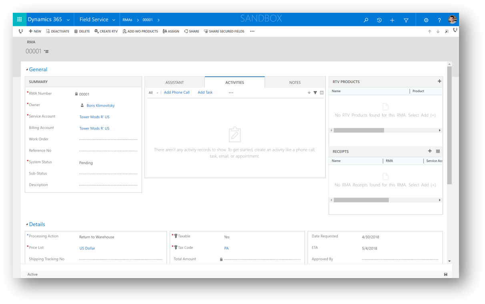

# Process a return (RMAs and RTVs)

Sometimes the same organization that installs parts and equipment at a customer's location needs to process a return of that product or customer asset.

Common examples for why returns may be initiated include:

- The part or equipment is defective
- The customer is dissatisfied
- A repair is needed and the repair will not take place on site, but back at the service provider's or manufacturer's location
- The equipment was at the customer's location as part of a lease that is ending and will not be renewed

Field Service supports three out-of-the-box returns:

- Return to Warehouse
- Return to Vendor
- Change of Equipment Ownership
  

## Step 1: Create an RMA  
  
1. From the main menu, click **Field Service** > **Inventory tab** > **RMAs**.  
  
2. On the **Active RMAs** screen, click **+New**  
  
3. [!INCLUDE[proc_handy_infotips](../includes/proc-handy-infotips.md)]  
  
   - If the product was used in a work order, choose the related **Work Order** where the product was used. The related **Service Account** is automatically filled in when you choose a work order.  
  
   - Choose an RMA substatus, for example, Exchange, Repair, Retire, or Upgrade. These options are configurable in **Field Service > Settings > RMA Substatuses**.
  
   - Select the **Date Requested** and if it's **Taxable** or not.  
  
   - Specify the price of the product being returned by choosing a **Price List**.  
  
4. When you're done, click **Save**. 

> [!div class="mx-imgBorder"]
> 

#### Ship via

When you create an [!INCLUDE[pn_dyn_365_field_service](../includes/pn-dyn-365-field-service.md)] RMA, it's a good idea to track how the return will be transported. This helps you track the part or customer asset. The **ship-via** field lets you specify different shipping methods used by your company. You can create new options in **Field Service > Settings > Ship Via**. COmmon examples include freight shipping, USPS Ground, or FedEx.  
  
## Step 2: Add RMA products  
 Once an RMA is created, you must add the products to be returned. There are two ways to add RMA products — either manually or by choosing a product that was used on a work order.  
  
#### To add products manually:
  
1.  In the RMA record, go to the **Product** section, and then click **+Add RMA Product Record.**   
2.  Use the tooltips to help fill in your information, and then click **Save & Close**.  

> [!div class="mx-imgBorder"]
> 

#### Add products used in a work order

> [!NOTE]
> To **Add WO Products**, a work order must be associated with the RMA.  
  
1.  In the RMA record, on the command bar at the top, click **Add WO Products**. The **Add WO Products** dialog box opens.  
  
2.  From the list of **Work Order Products**, select the **Return** check box for the products that are being returned.  
  
    > [!NOTE]
    >  If the full quantity is not to be returned, you can choose a different value in the **Return Value** column, for example, if 5 units were used on a work order, but only 3 are to be returned.  
  
3.  For each work order product to be returned, choose a **Processing Action**. This is the type of return. Choose from the following options:  
  
-   Return to Warehouse  
-   Create Return to Vendor (RTV)  
-   Change of Equipment Ownership  
  
4.  Next, specify the destination of the return. For example, if your **Processing Action** is **Return to Warehouse**, then in the **Return to Warehouse** column, choose the warehouse the product is going back to.  
  
5.  When you're done, in the **Add WO Products** dialog box, click **Ok**.  
    
## Step 3: Create an RMA receipt  
  
1.  From the RMA go to **Related > Receipts**. 
  
2.  Click **+Add New RMA Receipt**.  
  
3.  Use the tooltips to help fill in your information  
  
 
## Step 4: Add RMA receipt products  
  
1. From the RMA receipt record, go to the **Products** section.  
  
2. Click **+Add New RMA Receipt Product**.  
  
3. [!INCLUDE[proc_handy_infotips](../includes/proc-handy-infotips.md)]  
  
4. Enter the **RMA Product** and **Quantity** received.  
  
5. Click **Save**.  

> [!NOTE]
> For products that are tracked in inventory and for returns going to warehouses, an inventory journal is created automatically in the background that increases the "On Hand" warehouse quantity by the RMA Receipt Product quantity. 
   
## Step 5: (Optional) Create an RTV  
You only need to create an RTV if the return is going back to the vendor. Once the product is received, you will create an RTV.  
  
1.  In the RMA record, on the command bar at the top, click **Create RTV.** The **Create RTV** dialog box opens.  
  
2.  Review the details, and then select the **Return** check box.  
  
3.  A dialog box opens, confirming the RTV has been created.  
  
4.  To see the RTV record, from the main menu go to **Field Services** > **Inventory tab** > **RTVs**.  
  
5.  Click the RTV record that you created to open the record.  
  
6.  To track the return, mark when it was approved, shipped, and received.  
  
7.  To credit the customer, go to the RMA, and then click **RMA Product**.  
  
8. Set **Credit to Account** to **Yes**.  
  
9. Click **Save**.  
  
10. To issue a credit memo, go back to the RMA, and then to **RMA Receipts**.  
  
11. Click the RMA receipt.  
  
12. On the command bar at the top, click **Credit to Customer**.  

  
### See also    
 [Configure and set up customer assets](../field-service/configure-set-up-customer-assets.md)   
 [Create a purchase order](../field-service/create-purchase-order.md)   
 [Create an inventory adjustment](../field-service/create-inventory-adjustment.md)   
 [Create an inventory transfer](../field-service/create-inventory-transfer.md)   
 [View product inventory](../field-service/view-product-inventory.md)   
 [Create a return to vendo](../field-service/create-return-vendor.md) 

