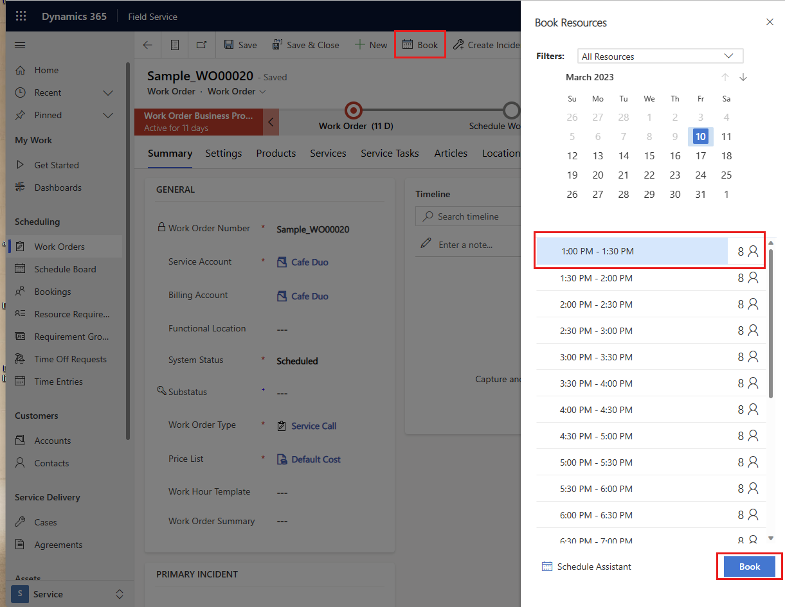

# Quick scheduling

Quick scheduling simplifies the schedule assistant experience to make scheduling easier and quicker.

Within the same window of a work order, a new panel displays available time slots for booking with a single click.

> [!div class="mx-imgBorder"]
> 

This is great for several scenarios:

1. Organizations with a high volume of bookings they need to quickly schedule. 
2. Organizations with homogeneous resources who are more concerned with quickly understanding availability and do not need the extra information and filter abilities of the schedule assistant.
3. For users who scheduling is a smaller proportion of their job. As an example, a customer service rep spends most of his or her time handling customer issues, and the few times he or she needs to schedule it should be quick and easy.

When quick scheduling is not enabled, the book button defaults to the full schedule assistant experience that displays additional information and filter options for more comprehensive resource assigning.

> [!div class="mx-imgBorder"]
> 

## Prerequisites

Field Service v8.7+
  
> [!Note]
> In Field Service v8.7 quick book capabilities need to be enabled, but in v8.8+ quick book is enabled by default. Quick booking onsite requirements is only available in v8.8+

Enable quick scheduling by going to Resource Scheduling > Settings > Administration > Enable Resource Scheduling for Entities

Then double click an entity to display the entities Booking Setup Metadata.

Set **Enable Quick Book** to **Yes**.

> [!div class="mx-imgBorder"]
> 

## Quick book a single resource

### Create a work order

First create a work order or another entity you'd like to schedule.

> [!div class="mx-imgBorder"]
> 

Then go to the related requirement and add additional attributes. This is to add more details for the desired resource to schedule this requirement to.

> [!div class="mx-imgBorder"]
> 

In our example above, we are looking for a resource within the specified date range with the "Assembly Repair" skill and part of the "Seattle" Organizational Unit.

### Select book

From the requirement or the work order select **Book** in the top ribbon. This opens the quick book side panel interface.

Next, all you need to do is select a time slot and then Book at the bottom.

> [!div class="mx-imgBorder"]
> 

In the background, the system chooses an available resource based on the filter criteria on the requirement we edited earlier. If the requirement is location based, as in the case of on site work orders, the system chooses the closest resource. The closest resource is determined based on the resource's starting location or previous work order. For location agnostic requirements, the system chooses the first available resource based on alphabetical order of the resource's first name. 

> [!div class="mx-imgBorder"]
> 

### Filter options 
Though quick scheduling is designed for quick and easy scheduling, the scheduler is still given a few simple filters in the quick book pane.

The date range is taken from the requirement date range and can be edited.

> [!Note]
> Time parameters on the work order such as Date Window Start and End are passed down to requirements and are factored into quick booking.

The **Filters** option on the top allows you to search through All Resources (meaning all resources that meet the requirement criteria) or select a specific resource to quick book to that resources schedule (again if the selected resource meets the criteria).

Additionally, select the resource icon next to a time slot to see a simple list of applicable resources for that time slot. 

> [!div class="mx-imgBorder"]
> 

This displays more details such as travel time and distance but still a simpler interface with less details than the full schedule assistant, which can be triggered by selecting the **Open Schedule Assistant** link at the bottom of the Quick Book panel.
> [!div class="mx-imgBorder"]
> 

## Quick book multiple resources

Quick scheduling also works with requirement groups, which allow organizations to schedule multiple resources at one time. For more details see the topic on [requirement groups](../field-service/multi-resource-scheduling-requirement-groups). 

### Create a requirement group

Go to **Resource Scheduling > Requirement Groups > +New**. 

To utilize requirement groups as part of the work order process, associate a requirement group template to an incident type. See more details in the [requirement groups for work orders](https://docs.microsoft.com/en-us/dynamics365/customer-engagement/field-service/multi-resource-scheduling-requirement-groups#requirement-groups-for-work-orders) section.

## Configuration considerations

successfully booked message is not configurable 

quick book again adds on a booking

org level setting, not for certain users or security roles

combine with fulfillment preference

## Additional Notes
- alphabetical order
- quick scheduling as long as there is a book button and the related entity has it enabled
- We discovered a bug with scheduling onsite requirements, so with this update of URS 3.7.*, the scope of the feature would only be non-onsite requirements (location agnostic, and Facilities). The bug with the onsite requirements scheduling is being fixed and will be pushed in the next update of URS 3.8.*. In this update 3.7.*, this feature will be disabled by default, however, with 3.8.*, we will flip it on all newer orgs

