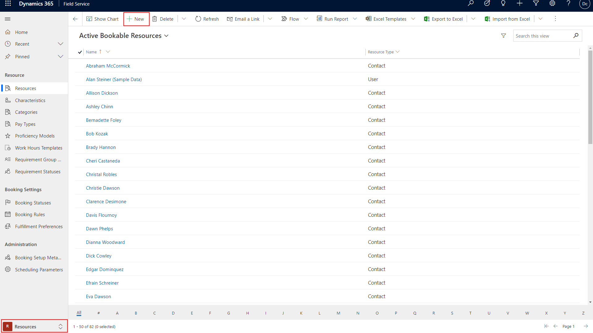
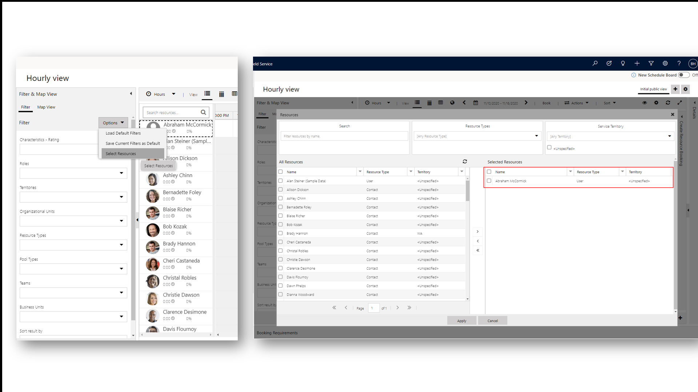

# Quickstart: Set up users to create, schedule, and view work orders

In this quickstart, we will walk through the following steps:

1. Set up users  
2. Assign appropriate security roles to your users
3. Create a bookable resource
4. Create a work order
5. Add the bookable resource to the schedule board
6. Schedule the work order to the bookable resource
7. View the scheduled work order on the mobile app

## Prerequisites

You need a Dynamics 365 organization with the Field Service application installed. For more information, see the article on [installing Field Service](install-field-service.md). 

You also need a phone or tablet for viewing a scheduled work order.

We recommend that you [perform initial configurations](perform-initial-configurations-setup.md) in your environment after installing Field Service.

### Verify the Field Service application is installed

Sign in as a system administrator and verify that the Field Service application is listed in the main menu. See the following screenshot for reference. If you don't see Field Service, ensure you are signed in as a system administrator. If you still do not see the app, go to the article on [installing Field Service](install-field-service.md). 

> [!div class="mx-imgBorder"]
> 

## 1. Set up users

Once you have a Dynamics 365 environment with Field Service, you need to create users to use the application. Many different roles interact with Field Service like system administrators, technicians, dispatchers, service managers, inventory managers, customer service representatives and more.

For this quickstart, we'll create two users:

1. Back-office administrator and dispatcher
2. Technician

Sign into [https://admin.microsoft.com/](https://admin.microsoft.com/) as a system administrator.

> [!div class="mx-imgBorder"]
> 

Go to **Users** and create at least two users. One to represent a back-office administrator and dispatcher, and another to represent a field technician.

Assign each user a license or trial license that includes Dynamics 365 Field Service.

> [!div class="mx-imgBorder"]
> 

Go to the [Power Apps admin center](https://admin.powerplatform.microsoft.com/).

> [!div class="mx-imgBorder"]
> 

Select your environment that has Field Service installed. Select **Settings** > **Users + permissions** > **Users**.

Add the two users you created that have Field Service licenses or trial licenses.

> [!div class="mx-imgBorder"]
> 

## 2. Assign appropriate security roles to your users 

Next we need to assign each user the correct Field Service security role.

Select **Manage users in Dynamics 365**.

> [!NOTE]
> Make sure you're seeing the "Enabled Users" view.

> [!div class="mx-imgBorder"]
> 

Select the user that represents the back-office administrator and dispatcher, then select **Manage Roles** in the top ribbon and assign the **Field Service - Administrator** and **Field Service - Dispatcher** security roles.

> [!div class="mx-imgBorder"]
> 

Then select the user that represents the technician, and assign them the **Field Service - Resource** security role.

> [!div class="mx-imgBorder"]
> 

Now we need to assign Field Security profiles.

Sign into your Dynamics 365 environment. In the top right, select **Advanced settings**.

> [!div class="mx-imgBorder"]
> 

Go to **Settings** > **Security** > **Users**.

Select **Field Security Profiles**.

> [!div class="mx-imgBorder"]
> 

Select the  **Field Service – Resource** field security profile and add the technician user.

Field technicians can't edit fields on mobile work orders unless they have this profile assigned.

> [!div class="mx-imgBorder"]
> 

Then select the **Field Service - Administrator** field security profile and add the administrator user.

> [!div class="mx-imgBorder"]
> 

## 3. Create a bookable resource

Next, create a bookable resource record for the technician user. Creating a bookable resource lets you schedule work orders for the technician, which the technician sees in the mobile app.

Go to **Field Service** > **Resources** > **Resources** > **+New**

> [!div class="mx-imgBorder"]
> 

Create a new technician resource with the following settings: 

- Resource Type = **User**
- User = **\[User record that represents your technician user\]**
- Display on Schedule Board = **Yes**
- Enable for Availability Search = **Yes**

> [!div class="mx-imgBorder"]
> 

For more information, see the article on [setting up bookable resources](set-up-bookable-resources.md).

## 4. Create a work order

Go to **Field Service** > **Service** > **Work Orders** > **+New**.

> [!div class="mx-imgBorder"]
> 

At a minimum, enter information in the following required fields.

- For **Service Account**, select an account from the list or create a new one.
- For **Work Order Type**, select a work order type from the list or create a new one. 
- For **System Status**, select **Open-Unscheduled**.
- For **Price List**, select a price list from list or create new one. 
- Set **Taxable** to **No**.

> [!div class="mx-imgBorder"]
> 

On the **Address** tab, enter a valid address. Then choose **Save and close**.

Consider adding incident types, products, services, and service tasks to add more details and instructions to your work orders. For more information, see the article on [configuring incident types](configure-incident-types.md).

## 5. Add the bookable resource to the schedule board

Next, add the bookable resource to the schedule board.

Go to **Field Service** > **Schedule Board**.

> [!div class="mx-imgBorder"]
> 

In the **Filter and Map View** panel, select **Options** > **Select Resources**.

Find the new technician bookable resource with the **Resource Type** set to **User**, and then move the user to selected resources. Choose **Apply**.

> [!div class="mx-imgBorder"]
> 

## 6. Schedule the work order to the bookable resource

In the lower pane, find the work order to schedule. This work order is listed in the **Unscheduled Work Orders** view. 

> [!div class="mx-imgBorder"]
> 

To schedule the work order, drag it to the technician's time slot.

> [!div class="mx-imgBorder"]
> 

> [!NOTE]
> Make sure you don't schedule the work order in the past. There is a blue vertical line that represents the current time. You may need to adjust the time zone of the schedule board by selecting the gear icon in the top right of the schedule board.

## 7. View the scheduled work order on the mobile app

Download the Field Service (Dynamics 365) mobile app from the iOS or Android app stores. For more information, see the article on [installing the mobile app](mobile-power-app-get-started.md).

Sign in with the username and password for the technician user.

- For the **Username**, enter the username of the technician user. For example, username@org.onmicrosoft.com
- For the **Password**, enter the password you set for the technician.

Select your app in the list.

> [!div class="mx-imgBorder"]
> 

If you do not see your app, but instead see "Contact your administrator for access to your organization's mobile apps," then select the menu icon and toggle the **Show non-production apps** to _Yes_.

> [!div class="mx-imgBorder"]
> 

In the **Booking** tab, see the work order you scheduled to your technician bookable resource. You must be signed in with the user the bookable resource was created for in step 3.

> [!div class="mx-imgBorder"]
> 

## See also

- [Perform initial configurations](perform-initial-configurations-setup.md)
- [Set up users and security roles](../field-service/view-user-accounts-security-roles.md)
- [Create a Bookable Resource](set-up-bookable-resources.md)

 

