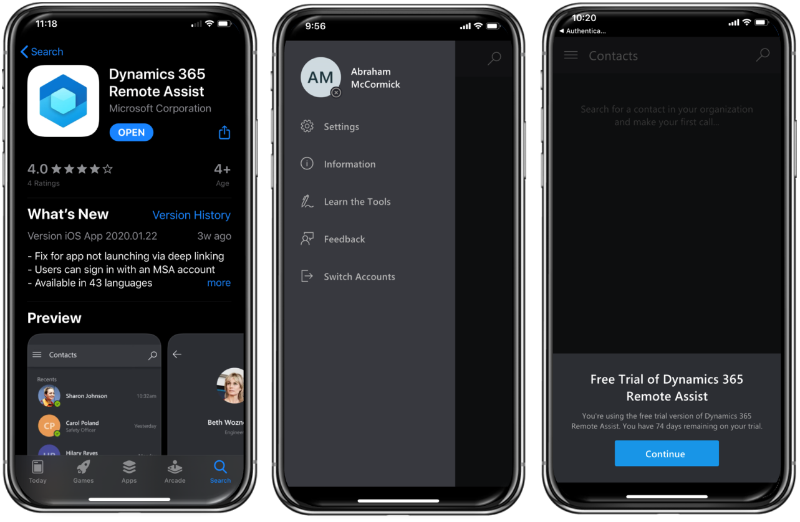
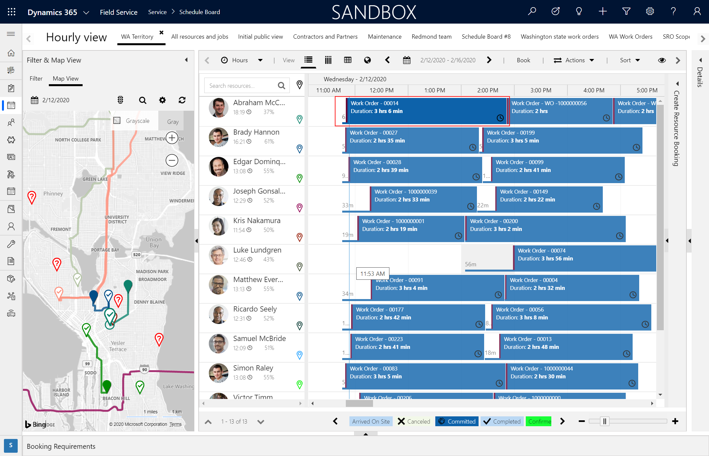
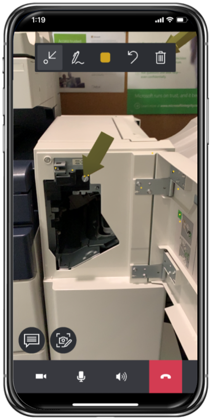
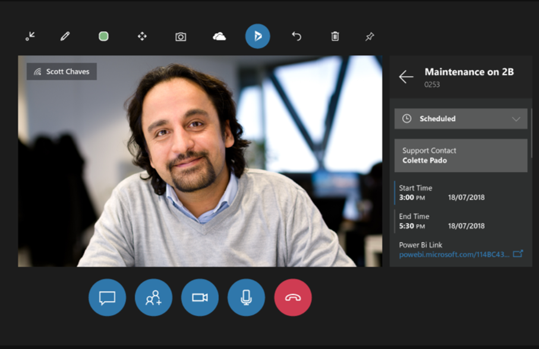
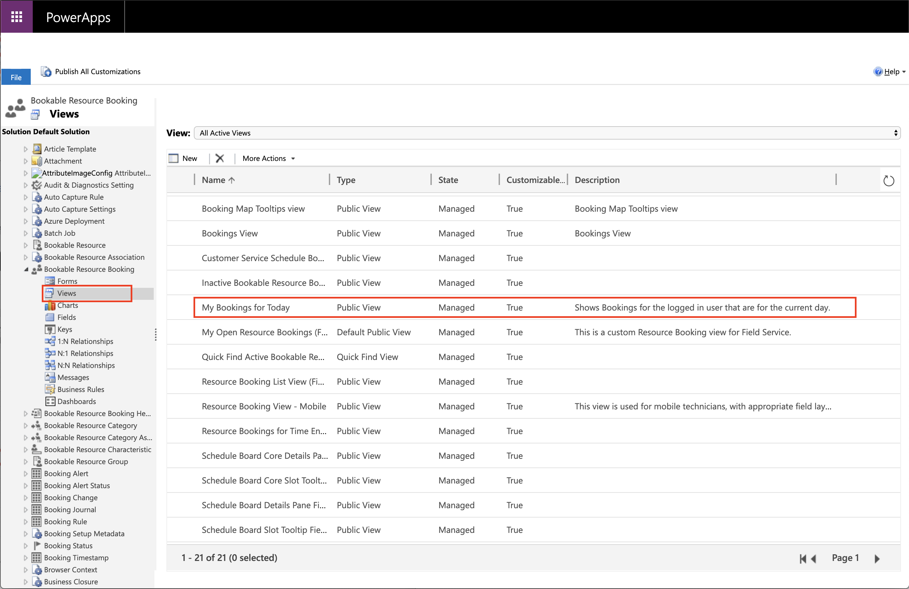

# Collaborate in mixed reality with Field Service, Dynamics 365 Remote Assist, and HoloLens

If your organization uses Dynamics 365 Field Service to manage field service work orders, your first-line workers using Remote Assist on HoloLens can see their Field Service bookings and quickly call the remote collaborator listed in the booking's **Support Contact** field. 

By integrating Field Service and Remote Assist, you can: 

- Launch Remote Assist mobile directly from a Field Service Mobile booking via deep links.
- See relevant work order information.
- Post the Remote Assist call information to the associated work order's timeline.

In this article, we'll explore how a field technician can use the Remote Assist mobile app to make a call to an expert for help completing a work order. We'll also explore the requirements to set up and use Remote Assist and Field Service together on the HoloLens.

For a guided walkthrough, see the following video.

> [!VIDEO https://www.microsoft.com/en-us/videoplayer/embed/RE4yt5l]

## Prerequisites

Before you begin, make sure you have the following set-up:

- A Microsoft Azure tenant with a Dynamics 365 subscription **and** a Dynamics 365 Remote Assist subscription. Both are required — Remote Assist is not included in any Dynamics 365 bundle.

  > [!NOTE]  
  > The tenant can have more than one Dynamics 365 instance. Remote Assist has the option to select an instance from within the app.

- You must have admin access to add or update the Dynamics 365 tenant instance.

- The Dynamics 365 instance must have the Dynamics 365 Field Service app installed, and it must include the **My Bookings for Today** view. To make sure this view is installed, we recommend Field Service version 8.2 or later. This article describes how to make sure you have the correct version and view.
    -  Note the **My In Progress Bookings** view has been renamed to **My Bookings for Today.** This doc has been updated to reflect the name change. Depending on your version of Field Service, you may see either name. The functionality remains the same regardless of the view name.
- The tenant must have at least two user accounts - one for the technician (front-line worker) and another for the remote collaborator.
  - The remote collaborator only needs a Microsoft Teams license.
  - The technician user will need a Dynamics 365 Field Service license, a Microsoft Teams license, _and_ a Dynamics 365 Remote Assist license. **Note:** A Remote Assist license includes Teams. 

- Field Service Mobile (only applicable if technicians and front line workers are not using HoloLens headsets). 

## Set up technician user

First, create a bookable resource that will serve as the technician or front line worker that will use both Field Service on the Field Service Mobile app and Remote Assist on the Remote Assist mobile app on their phone or tablet.

> [!div class="mx-imgBorder"]
> 

The bookable resource must have a **Resource Type** set to **User**; the related user record will need licenses to use both Field Service Mobile and Remote Assist. To set up a field technician to use Field Service Mobile, see the Field Service docs article on [setting up Field Service users and security roles](https://docs.microsoft.com/dynamics365/field-service/view-user-accounts-security-roles#set-up-a-field-technician-user).

Verify you can log into Field Service Mobile successfully as the field technician user.

> [!div class="mx-imgBorder"]
> 
 
Next, verify you can log into the Remote Assist mobile app with the same user. Then:

Find and download the Remote Assist mobile app in the Apple iOS or Google Android app stores. 

Sign in as the same user that you logged in to Field Service Mobile with. If your technician has a Field Service license and a Teams license, then you can simply start a free trial of Dynamics 365 Remote Assist before buying. 

> [!div class="mx-imgBorder"]
> 

After signing in, make sure you enable Dynamics 365 integration. Select **Enable** from the popup, or go to **Settings**.

> [!div class="mx-imgBorder"]
> 

> [!Note]
> The Remote Assist mobile app is available on mobile devices running iOS and Android with the related ARkit or ARcore capabilities.
 

## Set up remote collaborator user

As a different user that you have identified as the remote collaborator, verify you can sign in to Microsoft Teams. This user does not need a Field Service or Remote Assist license.
   
> [!div class="mx-imgBorder"]
> 

> [!Note]
> The remote collaborator must log into the Microsoft Teams native app on his or her PC or mobile device. Teams on web is not supported.

## Create and schedule work orders

Next, create a work order to outline the onsite work the technician or front line worker needs to perform - typically an installation or an equipment or system repair. Enter a recommended expert in the **Support Contact** field that could be called via Remote Assist for support. Technicians won't be limited to only calling this contact.

> [!div class="mx-imgBorder"]
> 

Schedule the work order to the bookable resource that represents the technician also known as the front line worker who travels to customer locations to complete work orders. In our example, Abraham McCormick is the bookable resource and we scheduled work orders to him with Resource Scheduling Optimization.

> [!div class="mx-imgBorder"]
> 

## View work orders on Field Service Mobile

Like any typical day, the technician logs in to Field Service Mobile and sees their assigned work orders for that day. If they need guidance from a remote collaborator who better knows the product, service, equipment, or account being serviced, they can launch the Remote Assist mobile app from the work order.

> [!div class="mx-imgBorder"]
> 

> [!Note]
> The deep link from Field Service Mobile to the Dynamics 365 Remote Assist mobile app is available on iOS and Android devices. For Field Service Mobile on iOS, your system administrator must import the [mobile project v1.0.4847 or later](https://docs.microsoft.com/dynamics365/field-service/field-service-version-history-mobile#104847). For Android devices, you must import the [mobile project v1.0.1322 or later](https://docs.microsoft.com/dynamics365/field-service/field-service-version-history-mobile#103482).

## Make a Remote Assist call

The support contact will be autoselected to call if Remote Assist was opened via the deep link; otherwise, the technician can search through the directory for Teams users inside or outside their organization.

> [!div class="mx-imgBorder"]
> 

The remote collaborator will then receive the call, like any other Teams call.

> [!div class="mx-imgBorder"]
> 

The technician can then begin to share what they see through their mobile device's camera, making annotations as needed.

> [!div class="mx-imgBorder"]
> 

From Teams, the remote collaborator can also make annotations. 

## Post Remote Assist Call to work order

After gaining the necessary guidance from the remote collaborator, the technician will end the call and be given the option to post the call as an activity to the work order time line.

Technicians can choose from a list of bookings they are scheduled for on the day of the call, which matches the **Agenda** view in Field Service Mobile.

> [!div class="mx-imgBorder"]
> 

Back on the work order, the dispatcher can see a Remote Assist call took place in the work order timeline; there will be a call log and links to files shared during the call.

> [!div class="mx-imgBorder"]
> 

Documenting the Remote Assist call on the work order is important because it lets managers know which types of issues are requiring extra help and can build training programs to accommodate.

## Set up and view Field Service bookings on HoloLens

If the technician is equipped with a HoloLens headset, then viewing and interacting with Field Service is even better. 

Technicians can:

- View today's bookings.

  > [!div class="mx-imgBorder"]
  > 

- View the work order and the recommended support contact field.

  > [!div class="mx-imgBorder"]
  > 

- Attach images to the work order during the Remote Assist call so future stakeholders can see the work or problem.

  > [!div class="mx-imgBorder"]
  > 

- Update booking statuses, like marking work as complete.

  > [!div class="mx-imgBorder"]
  > 

### Set up Field Service for the HoloLens

1. Ensure you're using Field Service v8.2 or later. [Upgrade](https://docs.microsoft.com/dynamics365/field-service/upgrade-field-service#field-service) your solution if necessary. 
2. Confirm the **My Bookings for Today** view on the **Bookable Resource Booking** entity is included:

     - Go to **Field Service** > **Settings** > **Customizations** > **Customize the System**.

> [!Note]
> The **My In Progress Bookings** view has been renamed to **My Bookings for Today**. This doc has been updated to reflect the name change. Depending on your version of Dynamics 365 Field Service, you may see either name. The functionality remains the same regardless of the view name.

> 

> [!Note]
> Fields can be added to this view if necessary for your business needs.

3. Create and schedule a work order.

     - The booking will not appear in the Dynamics 365 pane in Remote Assist unless the booking status is **In progress** and the related bookable resource has a user record that matches the HoloLens user.

## Configuration considerations

### Use the Field Service (Dynamics 365) mobile app

As part of the August 2020 early access update, technicians can deep link from the [Field Service (Dynamics 365) mobile app](mobile-2020-power-platform.md) to the Remote Assist mobile app. Find more details on [how to opt in to early access features](https://docs.microsoft.com/en-us/power-platform/admin/opt-in-early-access-updates#how-to-enable-early-access-updates). 
