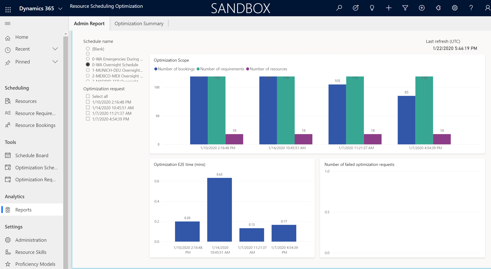

# Resource scheduling optimization admin report

The admin report in the Resource Scheduling Optimization add-in analyzes when and how resource scheduling optimization runs, but not the actual booking results.

## Before you start

To run the report, the resource scheduling optimization administrator needs to publish at least one [optimization schedule](rso-optimization-schedule.md).  

## Filters and slicers

- **Schedule name**: Name of the [optimization schedule](rso-optimization-schedule.md).
- **Optimization request**: [List of jobs](rso-schedule-optimization.md#monitoring-optimization-requests) that ran to optimize schedules.

## Report metrics

To access the admin report, open the **Resource Scheduling Optimization** app and go to **Analytics** > **Reports**.

> [!div class="mx-imgBorder"]
> 

### Optimization Scope

Number of bookings, requirements, and book in the selected schedule requests.

### Optimization E2E time (mins)

Time in minutes to run the optimization job from start to finish.

### Number of failed optimization requests

Number of failed optimization requests in the selected schedule requests.

## Next steps

- [Learn about other reports](reports.md)
- [Create an optimization schedule](rso-optimization-schedule.md)

<!--
| Visuals |	Description | 
| --- | --- |
| Optimization Scope: Number of bookings |	The average number of bookings in given schedule requests.  |
| Optimization Scope: Number of requirements |	The average number of requirements in given schedule requests. |
| Optimization Scope: Number of resources |	The average number of schedulable resources in given schedule requests. |
|Optimization E2E time |	This metric defines the optimization execution time. |
| Number of failed optimization requests |	The number of failed optimization requests in the given schedule requests. |
-->

[!INCLUDE[footer-include](../includes/footer-banner.md)]
