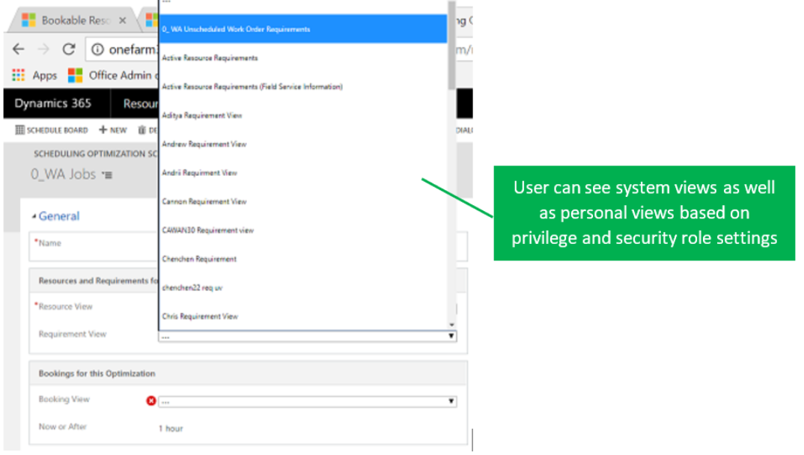
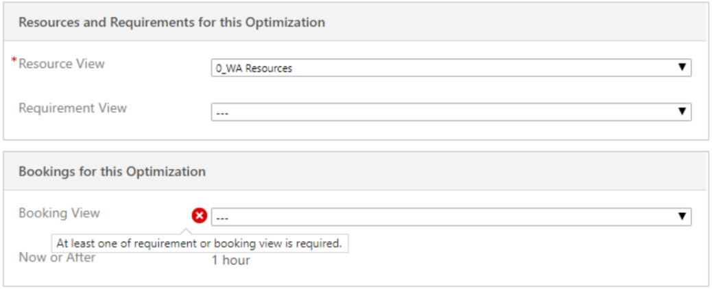
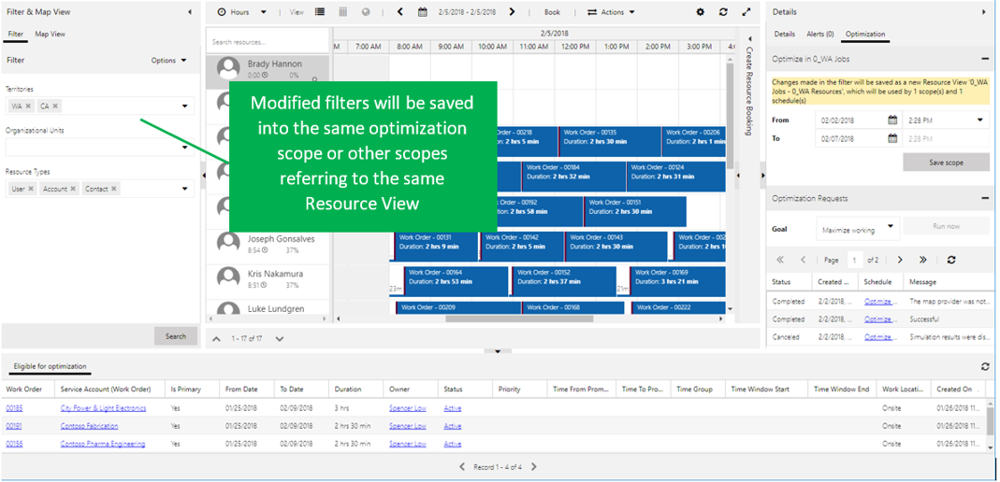

---

title: Configuration
author: shellyhaverkamp
manager: shellyha
ms.date: 06/08/2018
ms.topic: article
ms.custom:
  - dyn365-fieldservice
ms.service: dynamics-365-customerservice
ms.author: shellyha

---

Configuration 
==============

RSO system settings 
--------------------

The following settings must be configured after deploying RSO.

1. Go to **Resource Scheduling Optimization** \> **Administration** \>
    **Resource Scheduling Parameters**.

  - Set **Enable Resource Scheduling Optimization** as **Yes**.

  - Set **Default Goal** if needed. It can help you speed up interactions with
    RSO through the schedule board by predefining how the engine should optimize
    data. Users can still pick different goals. For more details, see “4.3
    Leverage schedule board to review optimization results.”

  - Set **Connect to Maps** as **Yes**. The connect to maps feature allows this
    organization to interact with the Bing Maps service that the schedule board
    uses.

    

    

  > [!NOTE]
  > Only a user with the System Administrator role can enable this. 

2. Go to **Settings** \> **Security** \> **Users**, navigate to the
    **Application Users** view, and assign the Field Service - Administrator
    security role to the Resource Scheduling Optimization application user.

3. Go to **Settings** \> **Security** \> **Field Security Profiles**, open
    **Field Service – Administrator**, and add **Resource Scheduling
    Optimization** into the Field Security Profile.

Steps 2 and 3 help ensure that RSO is able to optimize work order-related requirements and bookings. For Field Service dispatchers who want to interact with RSO:

1. Go to **Settings** \> **Security** \> **Users**.

2. Locate the user or team of dispatchers.

3. Click **Manage Roles**.

4. Grant **RSO Dispatcher** a security role.

5. Click **Save**.

6. Go to **Settings** \> **Security** \> **Field Security Profiles**.

7. Open **Resource Scheduling Optimization - Dispatcher** and add the user or
    team to the profile and then click **Save**.

Settings to prepare data for optimization 
------------------------------------------

The basic settings here will be checked and respected by all optimization scopes.

1. Update **Optimize Schedule** to **Yes** for resources. To do so, go to
    **Resource Scheduling Optimization** \> **Resources**. Navigate to the
    **Scheduling Summary** view, select one or more resource records, and then
    click **EDIT** to bulk edit the Optimize Schedule field to YES.

> [!NOTE]
> - Once you have enabled your resources for RSO, you need to set the latitude
    and longitude for the resources’ organizational unit or personal address,
    depending on whether their start/end location is an organizational unit or a
    personal address.
> - Start location and end location should have the same setting. For example,
    you cannot have the start location be a personal address and the end
    location be location agnostic.

   

2. Configure BOOKING SETUP METADATA for the desired entity. To do this, set
    **Default Scheduling Method** to **Optimize**. For example, if enabled for
    work order entity’s booking setup metadata, every newly created work order
    and related resource requirement will be configured to optimize
    automatically.

    

3. For existing resource requirement records in your system, update Resource
    Requirements Scheduling Method. To do this, go to **Resource Scheduling
    Optimization** \> **Resource Requirements,** navigate to the **Unscheduled
    Work Order Requirements** view, select some or all records, and click
    **EDIT** to bulk edit Optimize Schedule to YES.

    > [!NOTE]
    > Work Location must be either On Site or Location Agnostic. If On Site is the requirement, you need to specify latitude and longitude. More details on this are available in section 5.12. 

    

4. Check **From Date** and **To Date** for resource requirements to make sure
    the dates fall into the window you would like to schedule. You can use the
    bulk edit feature to update values for selected records as well.

5. Go to **Resource Scheduling Optimization** \> **Settings** \> **Booking
    Statuses** and configure **Scheduling Method** for booking status.

    

    > [!NOTE]
    > Any booking status with an empty scheduling method will be treated as Do Not Move.
    
  - **Optimize**: This means RSO is free to move this booking around. 
  - **Do Not Move**: This means RSO will not alter the booking (RSO will
    preserve the estimated arrival time and assigned resource. The booking’s
    start time and estimated travel duration may be changed if RSO schedules a
    booking in a new location before the Do Not Move booking). This operates the
    same as if the user set the booking to **Locked to resource + time** on the
    scheduling lock options field.
  - **Ignore**: RSO will completely ignore this booking. It will ignore for both
    location and time, meaning there will be overlaps. It is as if the booking
    doesn’t exist. Use this when the booking status is in the state of proposed
    or canceled.

Create an optimization schedule 
--------------------------------

>   You can define when RSO should optimize requirements and/or bookings for
>   selected resources—for example, at 1 AM on weekdays. Creating a schedule
>   also entails creating a scope and a goal.

| Give the schedule a logical name to express which resource requirements and bookable resources will be optimized. If a scope and goal have not been created, you will need to create those for this schedule. See the next section for details about scope and goals. | [./media/image8.png](./media/image8.png) |
|-----------------------------------------------------------------------------------------------------------------------------------------------------------------------------------------------------------------------------------------------------------------------|------------------------------------------|

-   **Timer**: Defines how often this schedule will run.

-   **Timer Mode**: The reference instant from when the schedule will start the
    timer (Fixed or After Job Completion). For example, if timer is set to 30
    minutes, the first run will start 30 minutes from the publish date/time.
    Fixed = run every 30 minutes. After Job Completion = run 30 minutes from the
    end of the last RSO job execution. Job refers to the RSO job.

-   **Valid From** and **Valid To**: The first/last date and time when this
    schedule will be valid for execution.

>   Filter is used to set a variety of combinations. For example, the schedule
>   will run at 1 AM and 7 PM every Monday through Friday.

>   The Filter section of the schedule is an advanced feature. The Filter window
>   allows for a variety of combinations to be selected:

-   You can filter by month, numerical day, weekday, hour, and minute, and refer
    to a configured time zone.

-   Leaving all filters blank means no filters will be applied.

**How does Timer work with Filter?**

>   If you configure your Timer and Filter as shown here, it means that RSO will
>   run every 30 minutes after the previous job is completed—from 12/3/2016 at 9
>   AM to 12/4/2018 at 9 AM except on Saturdays and Sundays.

| [./media/image10.png](./media/image10.png) |
|--------------------------------------------|

Define the optimization scope
-----------------------------

>   You can define what RSO should optimize. This includes resources,
>   requirements, and bookings.

>   Scope is the RSO mechanism for defining the relevant inputs: resource
>   requirements, resources, and existing resource bookings. It also includes
>   the timeframes to be considered for optimization. Extensible scope leverages
>   Dynamics 365 entity views, providing an easy and flexible way to define what
>   to optimize (resource requirements, resources, and existing resource
>   bookings).

| **Important:** Scopes should be as small as possible. RSO will be quicker and more effective if optimization requests contain few resources, requirements, bookings, and shorter range durations. Usually companies already have partitions that could be used for RSO; for instance: |
|---------------------------------------------------------------------------------------------------------------------------------------------------------------------------------------------------------------------------------------------------------------------------------------|

-   Temporally defined: optimize technicians who work in the day separately from
    those who work at night.

-   Geographically defined: neighborhoods, cities.

-   Logically defined: support level, incident type.

>   Upon opening the **Scheduling Optimization Scope** form, users can select
>   existing system views or personal views (for which they have read
>   permissions) from the Resource, Requirement, and Booking view drop-down
>   menus. If personal view is selected, it will be shared with the Resource
>   Scheduling Optimization application user and other users who have access to
>   the scope.

>    The following explains how to define an optimization scope.

1.  Using **Resource View** as an example, 0_WA Resources has been defined with
    the filter conditions shown in the following screenshot. This is equivalent
    to configuring WA territory as an optimization scope in the previous version
    of RSO. Users can apply more filter conditions as needed to specify
    resources they need to optimize. RSO will respect the Optimize Scheduling
    setting on individual resource records on top of the resource view filters.

1.  Select at least one requirement or booking view for what needs to be
    optimized.

1.  If you select booking view, you can set it to **Now or After**. For example,
    maybe you want to optimize bookings for the next 5 days, from 2 hours on
    (while excluding bookings within the next 2 hours and bookings in the past).
    The current, out-of-the-box Dynamics 365 entity view filter doesn’t support
    this Now or After condition; RSO enabled this additional setting on top of
    whatever filter conditions are defined for that booking view.

1.  Optimization Range Settings is the time range where bookings can be created,
    updated, and deleted.

>   **Example 1:** You want to have a booking created/moved ahead 24 hours but
>   from 1 hour on; in other words, bookings will be moved into a range starting
>   Now+1hour and ending Now+1hour+1day (which might partly still be today).

-   **Range Reference**: The start moment for all subsequent work order range
    calculation (Job current time or Beginning of the Job’s current day).

-   **Range Offset**: Amount of time added to the range reference to define the
    range start.

-   **Range Duration (days)**: Number of days added to the range reference.

>   **Example 2**: You want to have a booking created/moved into the next two
>   days.

>   **Note:** If bookings or resource requirements are defined in the
>   Requirement/Booking view, but the promised date/time windows are outside the
>   optimization range, RSO will NOT create/update these requirements/bookings
>   after respecting the scheduling window constraint. If the promised date/time
>   windows are overlapping the optimization range, RSO will create/update these
>   requirements/bookings after respecting the scheduling window constraint.

1.  You can preview resources, requirements, and bookings for optimization scope
    through the schedule board:

    -   Resource filters on the schedule board are prepopulated from the
        Resource View. The resource list matches the number of resources defined
        in the Resource View. RSO will display a lock icon and tooltip to
        indicate if a resource is not enabled for optimization (even though it
        was added into Resource View).

    -   Requirements under Eligible for Optimization match the records from the
        Requirement View.

1.  You can modify filters on the left panel and save it into scope:

    -   If Resource View referred by optimization scope is a system view,
        modified filters through the schedule board will be saved as a new
        personal view.

    -   If Resource View referred by optimization scope is a personal view,
        modified filters through the schedule board will be saved back into the
        same personal view.

Define the optimization goal 
-----------------------------

>   You can define how bookings should be optimized (constraints and
>   objectives). The goal of the Resource Scheduling Optimization engine is to
>   process a list of resources and a list of resource requirements, along with
>   existing bookings, to create the optimal route/list of bookings for the
>   resources. Bookings can be considered optimally scheduled if they:

-   Meet all company constraints.

-   Have the highest possible score for the company’s objectives.

>   **Engine Effort Level**: How much effort the RSO should make to find the
>   best combination of resources, route, and day/time. The higher the effort,
>   the longer RSO takes to complete the execution. For example, the effort
>   might be very light, light, moderate, intense, or very intense. The higher
>   the intensity, the more iterations of possible combinations the RSO engine
>   considers.

### Define constraints

-   **Schedule Within Working Hours**: Creates the booking if it can be
    completed within the resource’s working hours. Verifies the booking is not
    scheduled out of the resource’s working hours. This includes travel time
    from the last booking to the resource’s end location, although it’s not
    shown on the schedule board in a visual way.

-   **Meets Required Characteristics**: Verifies the resource has all the
    required characteristics and should have minimum required skill level.

-   **Scheduling Lock Option**: If marked, this will respect lock options
    configured on a booking record.

-   **Scheduling Windows**: If marked, RSO will schedule work to comply within
    the time window start and end fields on the resource requirement or booking
    record.

    -   If **From Date** and **To Date** on resource requirement or **Date
        Window Start** and **Date Window End** on resource booking are set as
        shown in the following example, it indicates you want RSO to schedule
        the booking on 5/24/2018 and time of day doesn’t matter.

-   If **Time Window Start** and **Time Window End** are set as shown in the
    following example, it indicates you want RSO to schedule a booking from 2 AM
    to 6 AM and the date doesn’t matter.

-   If **Time From Promised** and **Time To Promised** are set as shown in the
    following example, it indicates you want RSO to schedule a booking between 4
    AM and 8 AM on 5/24/2018. It has to be a specific date and specific time
    range.

| **Note:**  |
|------------|

-   If the above fields are conflicted, RSO will use **Time From Promised** and
    **Time To Promised** first. Then it will use one or a combination of other
    fields.

-   RSO will ensure the **Estimated Arrival Time** falls into the window
    specified above. It does not guarantee that the booking’s end time will fall
    within the time window.

-   **Restricted Resources**: If marked, RSO will not schedule a restricted
    resource to the booking.

### Define objectives

-   **Maximize total working hours**: The combination of the engine results
    (iteration) with the total highest aggregate work time will best meet this
    objective.

-   **Minimize total travel time**: The version of the engine results
    (iteration) with the total lowest aggregate travel time will best meet this
    objective.

| **Note:** This cannot be the first objective in the list. RSO might not schedule anything with the travel time as 0 minutes in order to meet the first objective. |
|-------------------------------------------------------------------------------------------------------------------------------------------------------------------|

-   **Locked bookings:** Once a booking is created, a lock can be set on the
    scheduling lock options field in the RSO section of the booking. The options
    are Time Range, Resource, Time, and Resource and Time. When the locked
    bookings objective is selected, RSO will try to include locked bookings into
    the optimal route. For example, the following screenshot shows that Norbert
    has a booking that starts at 2:30 AM, and this booking is locked to
    **Time**. When RSO runs, the system detects a 30-minute idle time for
    Norbert in the morning, but none of the other requirement durations fit into
    that slot with the locked booking next to it, even though RSO tries to move
    it to other resources’ time.

    

    -   If locked booking is a high-ranking objective, RSO will keep the locked
        booking there with 30 minutes of idle time before it by sacrificing the
        other objectives. The following screenshot shows the result.

-   If locked booking is not a selected objective or is ranked lower in the
    order of importance for objectives, RSO might ignore this locked booking
    (exclude this locked booking from the optimal route) and schedule other
    bookings for Matthew at 2:30 AM in order to achieve the highest score for
    top-ranking objectives, with the result shown in the following screenshot.
    It looks as if a booking overlaps, but actually the locked booking was
    ignored in this case. RSO would not delete the locked booking because it
    would lose the lock information defined on the booking record, which can’t
    be retrieved from the backing requirement.

-   **High priority requirements**: RSO will evaluate this objective and give
    priority to the resource/booking combination with the highest score for
    priority. The priority is set on the resource requirement record and is an
    option set with weighted values. RSO checks **Level of Importance** on
    priority to determine how important that priority is—for example, set
    **Level of Importance**=10 for urgent priority and set **Level of
    Importance**=1 for low priority and RSO will score 1 urgent requirement the
    same as 10 low-priority requirements because both scores are 10.
