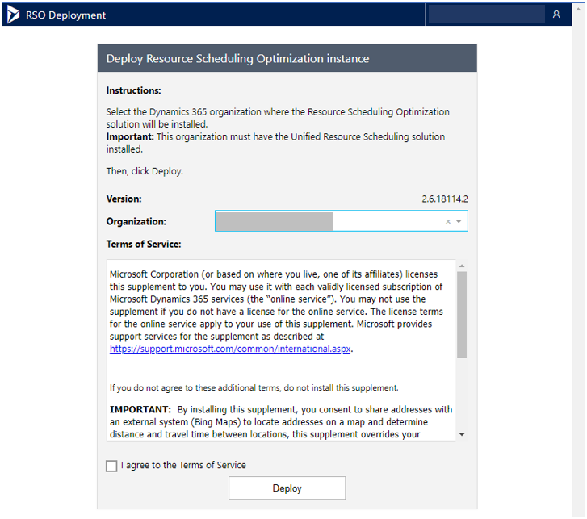

# Deploy Resource Scheduling Optimization (RSO)

After [getting access to RSO](./rso-get-install.md) either by purchasing a license or through your local Microsoft representative, you must deploy it to your Dynamics 365 Field Service environment.

## Deployment steps 

1. Verify Field Service is installed in your environment. The Field Service app will appear in the Dynamics 365 main menu when logged in as a system administrator.
> [!div class="mx-imgBorder"]
> 

2. Go to the Dynamics 365 admin center and select the **Applications** tab.

> [!NOTE]
> **Do not** install the Resource Scheduling Optimization solution from the solution page. Follow the next steps using the RSO deployment app.

3. Select the **Resource Scheduling Optimization** application to configure or manage.

    > [!div class="mx-imgBorder"]
    > 

4. Select the organization where the RSO solution will be installed, review the Terms of Service and select the agreement box, and then select **Deploy** to start the RSO deployment.

    > [!div class="mx-imgBorder"]
    > 
    
RSO is associated with a single Dynamics 365 organization in the tenant. You can change the associated organization through the RSO deployment app’s page. If additional RSO instances are needed for development and testing environments and you have an Enterprise Agreement with Microsoft, contact your technical account manager. Such instances are not yet available to Cloud Solution Providers or retail purchase.

5. Select **Upgrade to new version** to apply a new update if one is available.

6. Use **Change Organization** to change the RSO deployment from a Dynamics 365 organization to another. This will not delete data inside of the original Dynamics 365 organization an you can always change it back.

7. Use **Delete current deployment** to delete RSO Azure resources. The RSO solution will remain, which will not impact anything inside of the Dynamics 365 organization.

    > [!div class="mx-imgBorder"]
    > 
