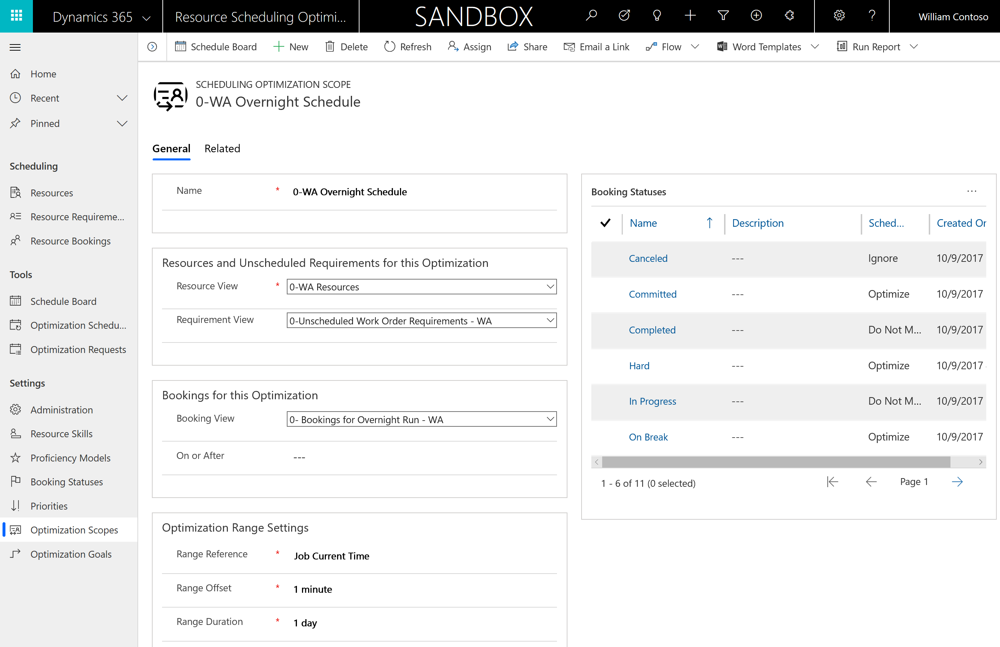
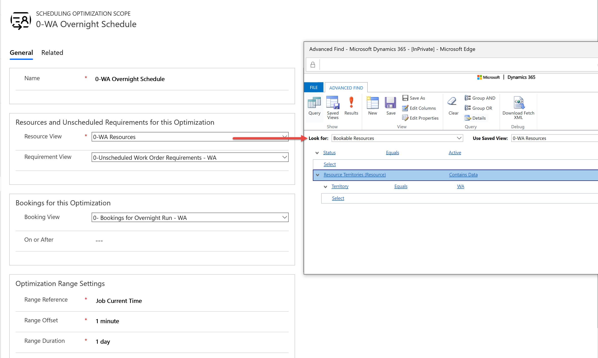

# Automated overnight scheduling

Resource Scheduling Optimization (RSO) is flexible and can be configured to run optimizations based on your organization's scheduling needs. Sometimes it's best for these optimizations to run when the humans who do the work are asleep.

In this topic, we will dive into overnight scheduling. 

Overnight scheduling means RSO runs each night at a defined time and schedules work orders for the following day. The next morning, a dispatcher finds a fully optimized schedule board for that day where jobs are scheduled to the appropriate resources based on skills, promised time windows, preferred resources, roles, and more. 

RSO will not automatically run again for the rest of the work day. The dispatcher can make changes as needed with manual scheduling or the schedule assistant to accommodate delays, cancellations, and special customer requests. Any changes the dispatcher makes will take priority over RSO's optimizations. 

Overnight scheduling saves time by letting RSO handle the bulk of scheduling during non-work hours while still relying on the expertise of dispatchers. 

## Prerequisites

- Field Service version 7.x+.
- Resource Scheduling Optimization version 1.5+.
- This RSO scenario involves creating a scope, goal, and a schedule. To learn more about these 3 key components of RSO, see the topic on [RSO configuration](./rso-configuration.md).

## Step 1: Set up a scope

Scopes define the resources, requirements, and bookings that RSO will optimize.

Go to **Resource Scheduling Optimization app** > **Optimization Scopes** > **+New**.

> [!div class="mx-imgBorder"]
> 

On your new optimization scope: 

- Assign a **Name** that describes the scope.

- Set **Range Reference** to **Job Current Time**.

- Set **Range Offset** to **1 minute**. Because this optimization will run at night, this value does not affect a technician's ability to respond quickly to schedule changes.

- Set **Range Duration** to **1 day**. This means that jobs will be booked within a 24-hour period from when RSO runs. Later, we will set RSO to run at midnight.

Create and select a bookable resource view that defines the resources jobs can be scheduled to. In the following example, we're filtering for active resources in a specific territory, Washington state (WA). While not shown in this example, it's common to filter for specific resource types if all these jobs should be scheduled to people (where resource type is user, account, contact) or machines (where resource type is equipment).

> [!div class="mx-imgBorder"]
> 

Create and select a resource requirement view that defines the unscheduled jobs to book. In our example, we're filtering for requirements in the same territory as our resource list (Washington state - WA) that are active, and requirements that are related to unscheduled work orders.

> [!div class="mx-imgBorder"]
> 

In addition to booking unscheduled jobs, RSO can also update, move, and improve existing schedules. When a requirement is scheduled, a **Bookable Resource Booking** record is created. Create and select a Bookable Resource Booking. 

>[!Note]
> Any bookings not in the booking view will be locked and not moved.

> [!div class="mx-imgBorder"]
> 

In this example, we're filtering for bookings that:

1. Are **Active**.
2. Were previously scheduled by RSO, where **Booking Method = Resource Scheduling Optimization**. This is because we do not want RSO to move bookings that were created manually or with the schedule assistant indicating they were booked by a dispatcher; our scenario assumes dispatchers have priority.
3. Have booking statuses that indicate it's okay to reschedule them (**Scheduling, Hard, Committed**).
4. Relate to resource requirements in the same territory as our resources and requirements (**Washington state - WA**). 

**Save**.

## Step 2: Set up a goal

Goals define what RSO should consider and prioritize.

Go to **Resource Scheduling Optimization app** > **Optimization Goals** > **+New**.

> [!div class="mx-imgBorder"]
> 

Set engine effort level to **Moderate**, **Intense**, or **Very Intense**. As effort level intensity increases, the optimization will take longer to run, but will return better optimizations. Because overnight scheduling is intended to run during the night when no one is working, the optimization can typically afford more time to run. 

Add the constraints RSO should consider based on your business needs. For example, if your work orders require different characteristics (skills), add the **Meets Required Characteristics** constraint. For more details on constraints, see the topic on [RSO configurations](https://docs.microsoft.com/dynamics365/field-service/rso-configuration#define-the-optimization-goal).

**Save**

## Step 3: Set up a schedule

Schedules combine scopes and goals and tell RSO when to run.

Go to **Resource Scheduling Optimization** > **Optimization Schedules** > **+New**.

> [!div class="mx-imgBorder"]
> 

Configure the following: 

- Set **Timer** to **1 hour**. This means that every hour, RSO will check the filter panel to see if it should run.

- Set **Timer Mode** to **Fixed**.

- For **Valid From and To**, enter the date range for which overnight scheduling is valid. RSO will not run automatically outside of this date range, but it can always be triggered manually with the **Run Now** option in the top ribbon.

Next, go to the **Filter** tab and enter the following values to define when you want RSO to run:

1. **Time Zone**: Enter your resources' time zone.
2. **Hours**: Enter **12:00 AM** or similar time during the night. 
3. **Days of the week**: Enter days of business operations. In the following example, we entered **Monday, Tuesday, Wednesday, Thursday, Friday**.

> [!div class="mx-imgBorder"]
> 

Based on the timer, RSO will check the filter panel and run if there is a matching value. In our example, every hour, RSO will check if the hour of the day is 12:00 AM and the day of the week is Monday through Friday. 

> [Note!]
> If no values are entered in the **Filter** section, RSO will run according to the timer, in this example every 1 hour.

**Save & Publish**.

At this point, we are ready to run overnight scheduling with RSO. One option is to wait for the trigger at midnight. Another option is for testing and development purposes to select the Run Now button in the top ribbon.

## Results

To see the optimization results for overnight scheduling, either wait until midnight for RSO to run, or select **Run Now**. You can then select **Schedule Board** from your **Optimization Schedule** to see the resulting optimization. 

Here you can see jobs were only scheduled for 1 working day to our Washington-WA resources.

> [!div class="mx-imgBorder"]
> 

A defining characteristic of overnight scheduling is that dispatchers have priority and changes they make should not be moved by RSO. For this reason, if a dispatcher moves a booking, or schedules a new one from the schedule board or with schedule assistant, it is automatically locked based on the booking method value. A lock icon will appear when viewing the booking on the schedule bard tab related to the optimization scope.

> [!div class="mx-imgBorder"]
> 

### See also

- [RSO Quickstart](./rso-quickstart.md)
- [Booking lock options](./booking-lock-options.md)
- [RSO configuration](./rso-configuration.md)

