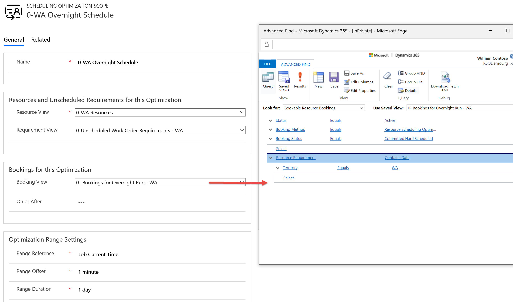
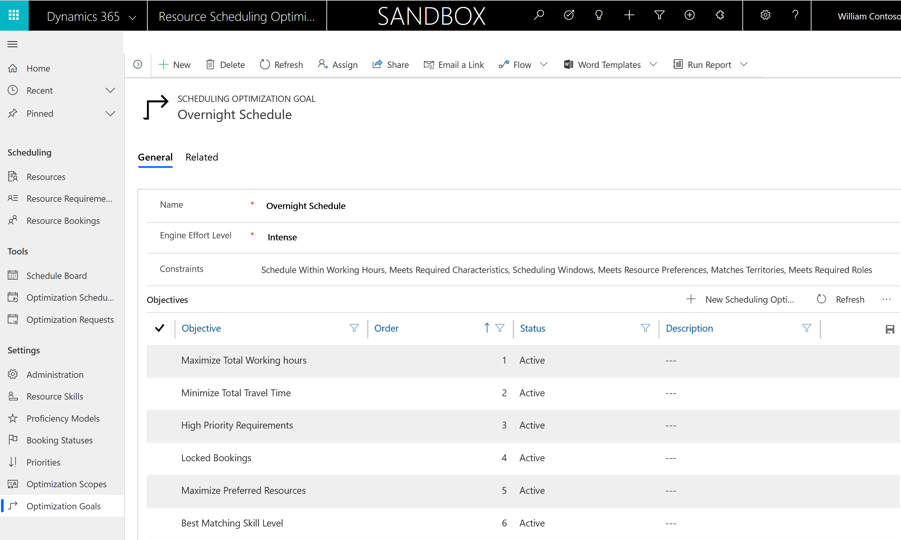
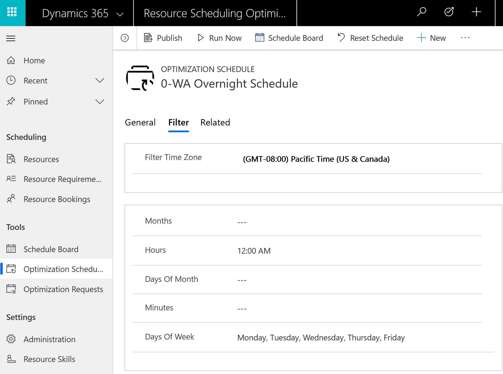
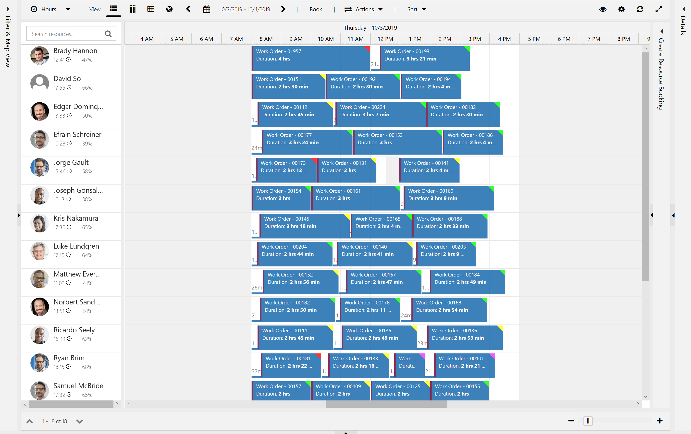
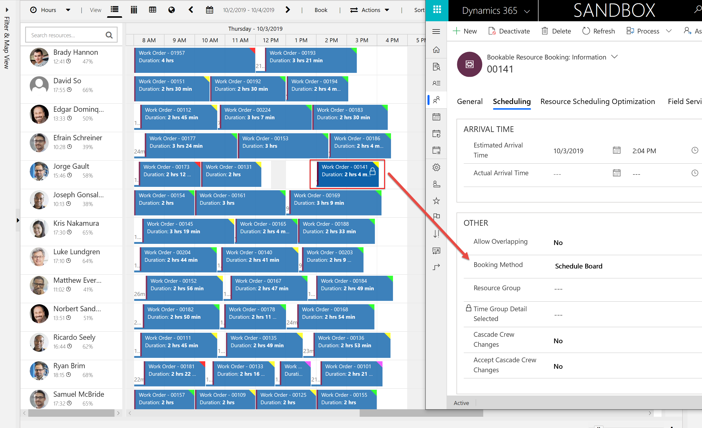

# Automated Overnight Scheduling

How and when Resource Scheduling Optimization (RSO) runs is flexible based on your organization's scheduling needs. RSO can be run manually, based on a schedule, or triggered from a workflow; and every run can optimize a specific set of resources, requirements, and bookings that are defined with system views.

Common scenarios include:

- Manual Run  
- Overnight scheduling
- Single resource optimization
- Intraday scheduling
- Condition based workflow action (CreateScheduledOptimizationRequest)
- Simulation 

When it comes to adopting Resource Scheduling tools there is a recommended progression from manual to fully automatic, see the topic on [The 5 stages of scheduling adoption](./5-stages-scheduling-adoption.md).

In this article let's explore overnight scheduling and understand why an organization may choose to optimize work orders this way and how to configure it.

Overnight scheduling means RSO runs each night at a defined time and schedules jobs (e.g. work orders) for the next day. The next morning, a dispatcher arrives to work to find a fully optimized schedule board for that day where jobs are scheduled to the appropriate resources based on skills, promised time windows, preferred resources, roles, and more. For the rest of the day, RSO will not run and the dispatcher will make changes as needed with manual scheduling or the schedule assistant to deal with delays, cancellations, and special customer requests. Overnight scheduling allows RSO to handle the bulk of scheduling to save time while still relying on the expertise of dispatchers who know the work to be done and the resources. 

Setting up this RSO scenario as well as other scenarios involves creating a scope, goal, and schedule. To learn more about these three components of RSO, see the topic on [RSO configuration](./rso-configuration.md).

## Scope
Scopes define the resources, requirements, and booking to optimize.

Go to **Resource Scheduling Optimization app > Optimization Scopes > +New**

> [!div class="mx-imgBorder"]
> 

Assign a **Name** that describes the scope.

**Range Reference**: set to Job Current Time

**Range Offset**: Set to 1 minute or similar time. Because this RSO will run at night when no one is working, this value does not affect a technician's ability to respond to schedule changes quickly.

**Range Duration**: set to 1 day. This indicates jobs will be booked within a 24 hour period from when RSO runs. Later on we will set RSO to run at midnight.

> [!div class="mx-imgBorder"]
> 

Create and select a Bookable Resource system view or personal view that defines the resources jobs can be scheduled to. In this example we're filtering for Active resources in a specific territory, Washington state (WA). Not shown in this example, but it is common to filter for specific resource types if all these jobs should be scheduled to people (resource type = User, Account, Contact) or machines (resource type = equipment).

> [!div class="mx-imgBorder"]
> 

Create and select a Resource Requirement view that defines the unscheduled jobs to book. In this example we're filtering for requirements in the same territory as our resource list (Washington state - WA) that are active, and requirements that are related to unscheduled work orders.

> [!div class="mx-imgBorder"]
> 

In addition to booking unscheduled jobs, RSO can also shuffle and re-optimize **bookings**. In other words, RSO will update, move, and improve existing schedules. When a requirement is scheduled, a Bookable Resource Booking record is created. So create and select a Bookable Resource Booking. In this example, we're filtering for bookings that are active, have booking statuses that indicate it's okay to reschedule them (Scheduling, Hard, Committed), and ones that relate to resource requirements in the same territory as our resources and requirements. In addition, we're filtering for bookings that were previously scheduled by RSO, where Booking Method = Resource Scheduling Optimization. This is because we do not want RSO to move bookings that were created manually or with the schedule assistant indicating they were booked by a dispatcher because our scenario assumes dispatchers are 

## Goal

Go to **Resource Scheduling Optimization app > Optimization Goals > +New**

> [!div class="mx-imgBorder"]
> 

## Schedule

Go to **Resource Scheduling Optimization app > Optimization Schedules > +New**

> [!div class="mx-imgBorder"]
> 

> [!div class="mx-imgBorder"]
> 

> [!Note]
> can test with run now button 

## Results

Your scope creates a new schedule board tab or you can simply choose Schedule Board from the top ribbon of your Optimization Schedule.

> [!div class="mx-imgBorder"]
> 

> [!div class="mx-imgBorder"]
> 

### See also

- Quickstart
- 
