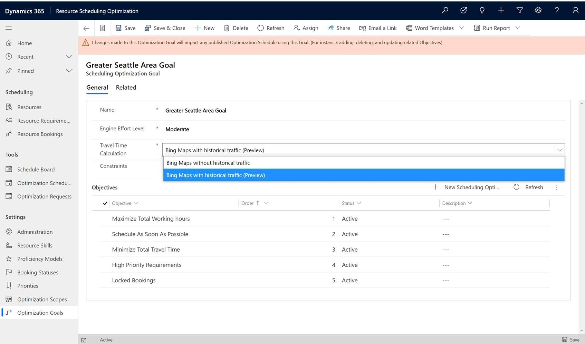
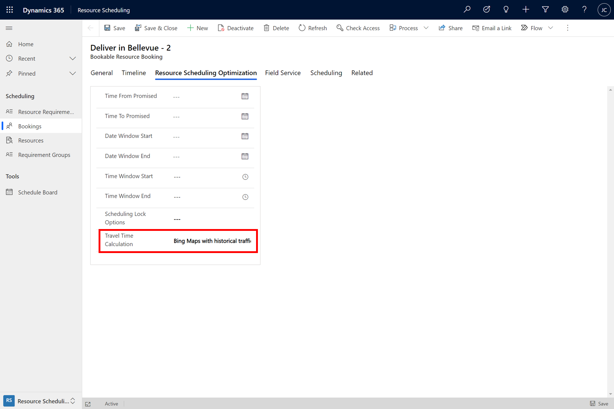

# Predictive travel times for Resource Scheduling Optimization

In order to predict accurate travel times for technicians, it's important to remember that travel times can vary because of traffic conditions.

Resource Scheduling Optimization can use historical traffic information in order to predict more accurate travel times for technicians. Better travel time predictions mean more accurate and realistic scheduling for dispatchers and technicians alike.

For a guided walkthrough, check out the following video.

> [!VIDEO https://www.microsoft.com/en-us/videoplayer/embed/RWEhsq]

## Prerequisites

- **Connect to Maps** must be set to **Yes**. Go to **Resource Scheduling App** > **Settings** > **Administration** > **Scheduling Parameters** to make sure.
- Predictive travel times that use historical data is only available for scheduling with Resource Scheduling Optimization; the feature isn't currently supported for the schedule assistant or manual scheduling.

## Set travel time calculation on optimization goal

To turn on predictive travel time calculations, go to a Resource Scheduling Optimization goal.

For the field **Travel Time Calculation**, select **Bing Maps with historical traffic (Preview)**.

Save and publish.

> [!div class="mx-imgBorder"]
> 

## Run Resource Scheduling Optimization

After adding predictive travel to the optimization goal, set up your optimization scope according to your business needs, and run the optimization manually, through a schedule, or via a workflow.

Without predictive travel times, Resource Scheduling Optimization will calculate the travel time between two locations as the same, no matter the time of day the work is scheduled.

> [!div class="mx-imgBorder"]
> 

With predictive travel enabled, Resource Scheduling Optimization will generate a schedule that uses time-of-day dependent travel time that takes into account historical traffic.

> [!div class="mx-imgBorder"]
> 

> [!Note]
> Running an optimization with predictive travel time may change the order of the bookings to optimize objectives and constraints. Additionally, it may increase the runtime for the engine to optimize the requirements and bookings.

Hovering on a booking with predictive travel time will also show this indicator in the booking card in the **Estimated Travel Duration** field, along with a _(with historical traffic)_ suffix and informational link. The legend explains this indicator as well.

Additionally, the booking form includes a **Travel Time Calculation** field in the **Resource Scheduling Optimization** tab, which is set to _Bing Maps with historical traffic_ for bookings with predictive travel times. Resource Scheduling Optimization administrators can use this to report and quantify volume of bookings that did and didn't use historical traffic, and then refine scopes accordingly to improve overall business metrics. 

> [!div class="mx-imgBorder"]
> 

## Configuration considerations

- Predictive travel times that use historical data is a feature only available for scheduling with Resource Scheduling Optimization. Predictive travel isn't currently supported for the schedule assistant or manual scheduling.

- Since optimizations can take longer when considering historical traffic information, use predictive travel times for [automated overnight scheduling](rso-overnight-scheduling.md) where the optimization runs during non-working hours for the following working day.

- Predictive travel time can only be applied to optimization scopes with fewer than 500 requirements and bookings in total *and* fewer than 500 shifts. If your optimization scope exceeds this threshold, the optimization will still run but without predictive travel times. If you have more resources or requirements, consider splitting the scope into smaller scopes and apply predictive travel time to each related optimization goal.

- [Single resource optimization](rso-single-resource-optimization.md) doesn't currently support predictive travel times.

- Predictive travel time is only available for Bing Maps.

## Additional notes

- Running Resource Scheduling Optimization with predictive travel times can result in different travel times and different sequences of schedules.

- Predictive travel time isn't real-time traffic, so they won't reflect one-time events like traffic accidents or road closures. Instead, this feature will take into account general traffic patterns like high volumes of cars in the morning when many people are commuting to work.

[!INCLUDE[footer-include](../includes/footer-banner.md)]
