# Setting up a proof of concept for Resource Scheduling Optimization

> [!Note]
> This topic assumes a working knowledge of Resource Scheduling Optimization. See the "See also" section at the end of this topic for links to learn more about Resource Scheduling Optimization.

Setting up a proof-of-concept (POC) for Resource Scheduling Optimization should follow some basic guidance, and include the following stages: 

1. **Discovery**, where you learn about client needs and expectations

2. **Initial configuration of Resource Scheduling Optimization**, and knowing which entities are critical for a successful POC

3. **Running simulations of data,** which shows the POC in action

4. **Presenting results of the POC**, which can help your client understand how working with Resource Scheduling Optimization can benefit their organizations

## Discovery

A collaborative Resource Scheduling Optimization proof of concept should engage a client to actively work with the optimizer rather than simply comparing features on paper. Setting up a useful discovery phase for your Resource Scheduling Optimization proof of concept means understanding your client's needs, defining success criteria, and making sure they have the right expectations going in. 

### Defining the client's participation 

First, you'll want to make sure that the client has the right level of expectations around their participation in this proof of concept process. This is very much a collaborative effort, and your client must actively participate in order to find value in the outcomes. 

### Understanding your client's needs 

No two organizations run the exact same way, so understanding how your clients use data is critical to running a successful POC. This means you want to work with real data for this run. Make sure to understand *how* they are using their data and for what business reasons.

Resource scheduling optimization is most applicable to onsite service scenarios where work is performed at multiple customer locations each day because a central benefit of Resource Scheduling Optimization is organizing routes to minimize travel time. For this reason, this POC guide will focus on running Resource Scheduling Optimization to optimize work orders scheduled to field technicians. However, knowing that customers use Dynamics 365 in different ways, Resource Scheduling Optimization can optimize cases that are onsite, cases that are remote (referred to as "location agnostic"), as well as other entities that represent work that needs to be scheduled. In the example of remote cases, Resource Scheduling Optimization would be used to schedule cases to customer service reps with the goal of maximizing work orders and matching skills. Another example could be scheduling leads to salespersons in an automated and optimal way. 

Resource scheduling optimization can optimize any entity (that is enabled for scheduling) because Universal Resource Scheduling is an open framework that schedules the requirement record. The data that your client may provide, such as work orders or cases, will result in a requirement record when imported. For more information, see the article on [Universal Resource Scheduling for Field Service](universal-resource-scheduling-for-field-service.md). 

Here are a few questions to ask clients that will help tailor the Resource Scheduling Optimization POC: 

- How many resources are they working with? 
- What types of resources are there? (people, equipment, facilities, and so on)
- How frequently are resources scheduled? 
- Where do resources start and end their days? 
- How many territories do resources work within?
- What types of skills or characteristics are important for resources? 
- What tools are currently in use for scheduling and optimization?
- How do they manage emergencies / exceptions with resourcing? 
- How are resource priorities defined and managed?

Any other questions that help determine how the client is currently managing or optimizing their resources will help for a successful discovery.

### Defining success criteria

To know if the POC works well for the client, you first need to determine what measurable success looks like. While it's tempting to declare that "improved travel times" or "decreased overtime" are successes, they aren't specific or measurable enough. Work with the client to define *measurable* success criteria, such as *reduce travel time by 10%* or *schedule no overtime for maintenance work*. 

Be sure that what the client asks for is something we can actually measure. For example, reducing the number of trips to a customer's site is not easily measured, as each requirement will create a related booking when scheduled. Resource scheduling optimization will often schedule work at the same location back-to-back, as long as other criteria like the scheduling window allow for it; to report this as a single trip to the customer site, however, is difficult with multiple booking records. Typically work booked at the same location back-to-back with another work order will have zero travel time or zero miles, so think of ways to present these as success criteria to your client or prospect. 

Also, understand the data in terms of dates and timeframes. It's common to receive a data set from prior periods where the expectation is the customer can compare the Resource Scheduling Optimization results to what really happened. This is difficult because Resource Scheduling Optimization cannot schedule before the current time. If you add days to the dates provided, remember that a weekday in September may be a weekend date in December. If you are maximizing work hours and there are no resources working weekends, this requirement will not be scheduled. Be sure to discuss this up front with the POC stakeholders and define a plan to work around this. 

You should also consider how you might manage SLAs or response times. It's not uncommon to receive SLA terms as text. Resource scheduling optimization can't act upon text so you should have a plan to convert the various terms and conditions to dates. These can be retained as **Time From Promised** and **Time To Promised** fields on the work order, or by setting the **Date Window Start** and **Date Window End** work order fields, which translate to the Start and End fields on a requirement (using either is applicable). You'll often see examples such as "next day before 12:00 PM" or even something like "within 4 hours or within 8 hours." Work out a plan on how you'll address these types of scenarios.

Whatever you choose, be sure the result is a date window that can be acted upon by Resource Scheduling Optimization. Resource scheduling optimization will only consider these requirements within that date window. If not scheduled, these requirements will not be considered in future Resource Scheduling Optimization runs targeting dates outside that time frame. Have a plan to address those requirements with small scheduling windows, or have a process to push the scheduling window forward as you do subsequent Resource Scheduling Optimization runs. 

## Initial configuration of the POC

So we've set expectations, defined goals, and understand what success looks like. Now, we need the actual data to get the POC up and running. Once gathered, that data can then be imported into Dynamics 365. 

Typical types of data include: 

- Accounts
- Addresses
- Territories
- Bookable Resources
- Resource territories
- Characteristics (skills)
- Start and end locations
- Work hours
- Priorities
- Work orders (and other transactional data)

### Accounts

Account information is helpful when dealing with work orders, since **Service Account** is a required field. The account information can typically be derived from the work order data if an address or longitude and latitude are provided. A generic naming convention can be used for privacy reasons. We frequently see clients who provide data with names removed, and only include an account number so that they can refer to actuals from existing systems.

### Addresses

Addresses should be geocoded on import. To make sure this happens, go to **Resource Scheduling Optimization** > **Resource Scheduling Parameters**. Make sure that **Connect to Maps** is set to **Yes** and there is a valid **Map API Key**.

> [!div class="mx-imgBorder"]
>  

On that same screen, go to the **Resource Scheduling Optimization** tab, and set **Enable Resource Scheduling Optimization** to **Yes**.

> [!div class="mx-imgBorder"]
> 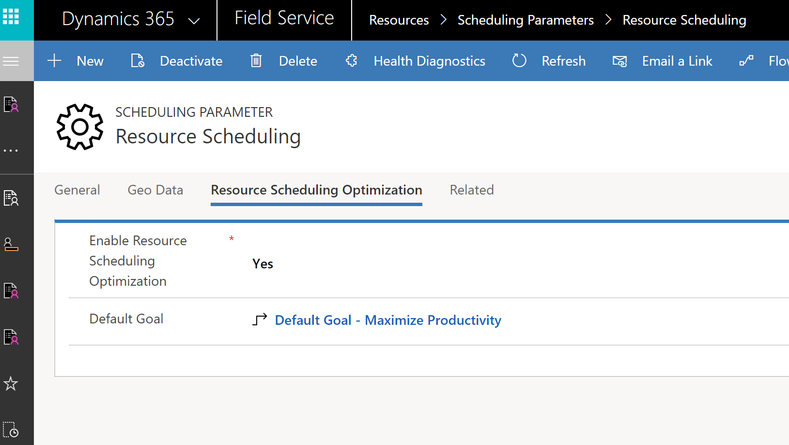 

Addresses will then be automatically geocoded. If you're working with a small amount of address data, you can geocode them manually as well.

If you don't wish to rely on geocoding, you can also import longitude and latitude directly to the account by adding those values in the imported Excel doc. However, manually added latitude and longitude are typically less accurate than the geocoded results.

> [!div class="mx-imgBorder"]
> 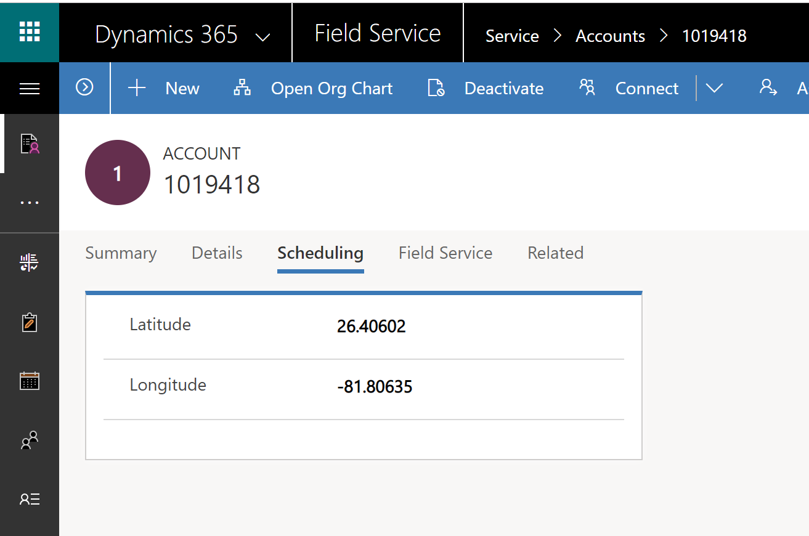 

Territories can then be assigned to the account, and will default to the work orders as imported.

> [!div class="mx-imgBorder"]
> 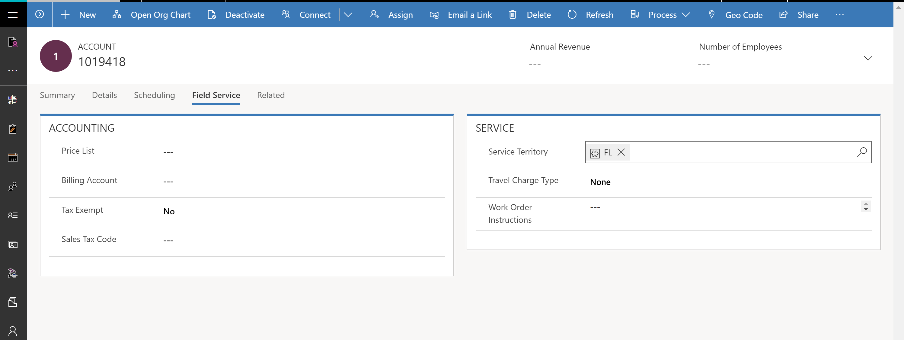 

### Territories

Resource scheduling optimization needs at least one territory in order to operate.  However, having multiple territories allows for additional demo flexibility and makes it so optimization schedules can be more precisely defined. This also means that multiple schedules can run simultaneously. If no territories are provided, use state or some other criteria to create artificial territories so that you can filter Resource Scheduling Optimization schedules to smaller subsets of data. 

If no territories are provided, you may need to define your own schema. See more on using territories under the defining schedules section of this article.

### Bookable resources 

Include a subset of actual resource data for the purposes of this POC. Working with real data makes it easier to drill into specific use cases and also limits the related data required for resources, such as work hours, resource territories, or characteristics (skills). Resources must be related to a user, account, or contact. The easiest way to make sure this happens is to relate resources to contacts - this ensures that they are separate from the accounts you're scheduling. If the resources are also users, then relating them to a user record is also acceptable.

> [!Note]
> If you relate resource data to user data, note that location data for start and end locations are maintained in the user record, which can only be edited by an administrator.

Be sure to set the proper time zone on the resource. This will inform the required work hours. If multiple time zones are needed for the POC, be sure that you have schedule board views set up with the proper time zone filters, or you may misread the outputs. 

> [!div class="mx-imgBorder"]
> 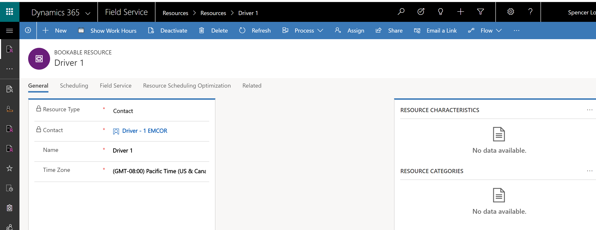 

Resources can start or end their day from an **Organization Unit** if it has been set up with a latitude and longitude. This represents starting or ending from an office or warehouse; however, this is fixed for a user and not adjustable for different days of the week.

> [!div class="mx-imgBorder"]
> 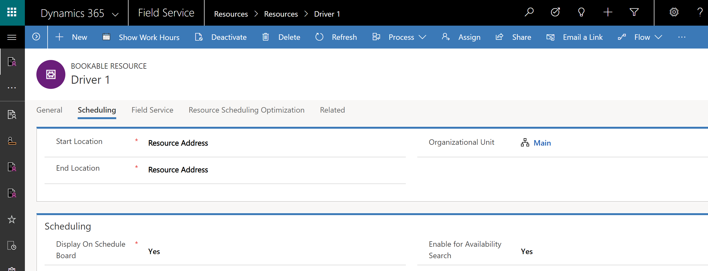 

On the bookable resource record, go to the **Resource Scheduling Optimization** tab and set the **Optimize Schedule** to **Yes**. This can be done on import, or manually afterwards.

> [!div class="mx-imgBorder"]
>  

### Start and end locations

Start and end locations are maintained on the resource record. The latitudes and longitudes used by Resource Scheduling Optimization, however, are maintained in whatever record the resource is related to, such as user, account, or contact. Additionally, if using **Organizational Unit**, the latitude and longitude must also be added.

### Resource territories 
Resource territory records must be created for each resource so that Resource Scheduling Optimization will include the resources in any optimization run. Resource scheduling optimization will be more efficient if you can use multiple territories to filter the data to smaller subsets. You can run multiple Resource Scheduling Optimization schedules at the same time for separate data sets and territory is a great way to do that. 

> [!div class="mx-imgBorder"]
> 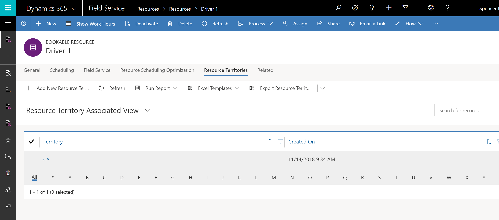 

### Characteristics (Skills) 
While not required for a POC, skills and characteristics can be used as additional filter criteria, as well as in the goals and objectives setups. You can set constraints to **Meet Required Characteristics**, which will add additional dimensions to Resource Scheduling Optimization results. However, we recommend keeping a POC to a manageable number of skills and characteristics.

> [!div class="mx-imgBorder"]
> 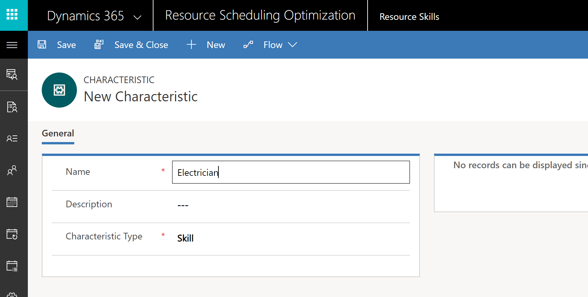 

### Work hours 

Work hours are required for Resource Scheduling Optimization to consider a resource for scheduling. We recommend grouping your resources so you can set work hours for one person, and then using the work hour template and set calendar feature for a given group. Time zone is derived from the resource record and while you can change it on the work hours record, be aware this can cause conflicts. It's best to set time zone on the resource record and allow it to default to the work hours.

You can set work hours for the specific day of the week by checking off the days that the resource will not be working. You can also select **Vary by day** or set work hours.

> [!div class="mx-imgBorder"]
> 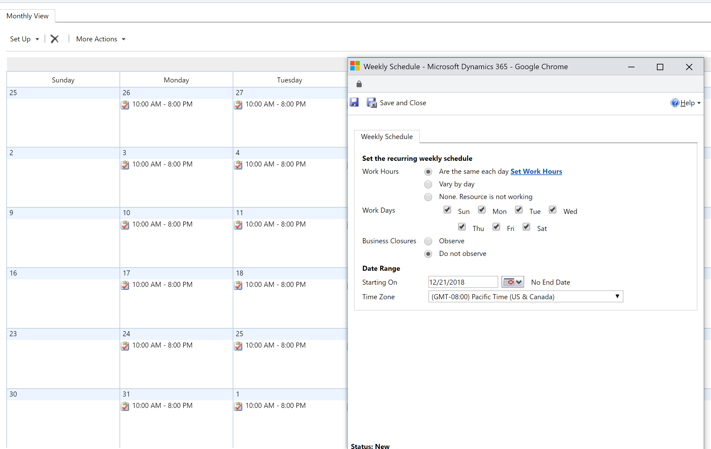 
 
If you select the **Vary by day** setting, work hours for the first day will replicate for the remaining days. Make sure to review, make the proper adjustments, and save. If you return to set work hours again, the settings will default to the original. 
 
> [!div class="mx-imgBorder"]
> 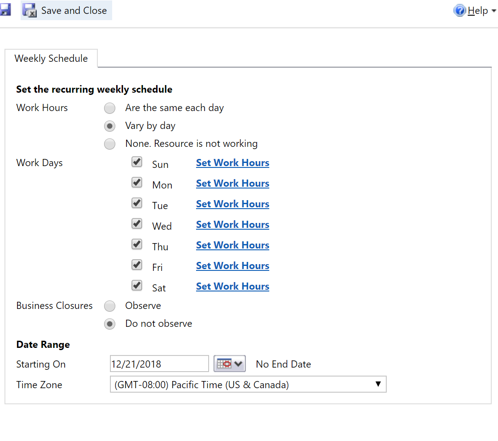 

When setting up work hours, you may also set a fixed break time, which Resource Scheduling Optimization will honor during optimizations.  Set the duration for the break, and include a start and end time to represent the scheduling window Resource Scheduling Optimization should use to fit the break into the optimized schedule.

> [Note!]
> If you require floating breaks or breaks based on other business logic, you'll need to build a custom schedulable entity for breaks.

> [!div class="mx-imgBorder"]
>  

### Priorities

Priorities provide additional dimensions to a Resource Scheduling Optimization run. Using high priority requirements as a constraint will provide control over those more urgent requirements. If the data provided doesn't include levels of priority, you should develop a prioritization logic. For example, perhaps requirements where the scheduling window is small are a higher priority than those with wider scheduling windows. 

> [!div class="mx-imgBorder"]
> 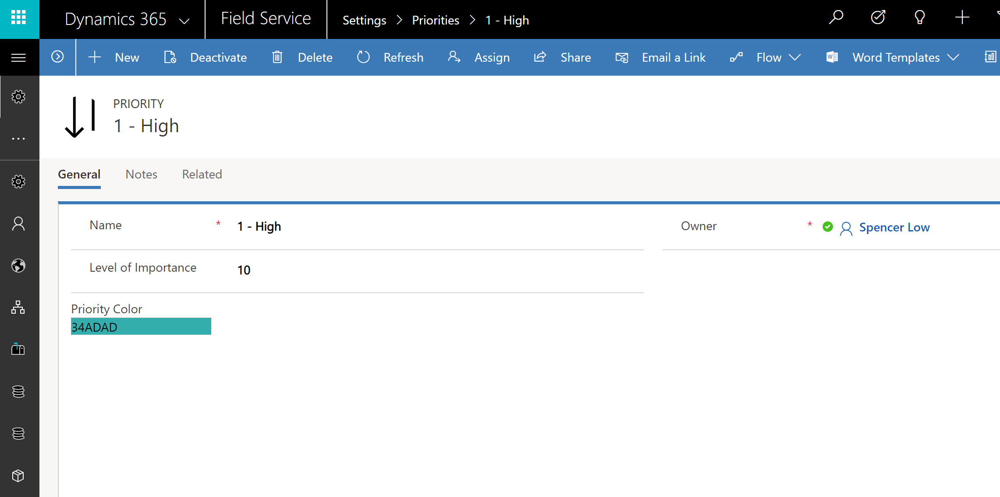 

You can define priority codes as high, medium, or low and then set a ranking value (1-10). Resource scheduling optimization uses this numerical range to address priorities while optimizing. We recommended that you assign color coding to priorities, which will then be reflected on the schedule board as a colorful corner on the scheduled work order.

> [!div class="mx-imgBorder"]
>  

Using or excluding priority as a constraint will produce different optimized schedules. Review both to see which best meets the success criteria.

### Work orders (and other transactional data)
This data represents the work you are trying to schedule, typically in the form of work orders, which we will use for the purposes of this article. 

Field service POCs are typically set up to receive a bulk-load of data that represent a block of maintenance jobs. For example, this might look like a full month of maintenance work and service calls broken down by the day or hour. The service calls are typically more urgent and can require reoptimization of the maintenance jobs in order to take advantage of where a resource will be when they address those calls. This may require a separate optimization schedule with different scope, goals, and objectives, and is also typically a different time frame, such as a few days or a week. The key to this schedule is to keep it to a smaller time frame as more service calls are expected - it's much quicker to optimize a smaller, focused data set. We'll look at defining these optimization schedules in the next section.

Importing work orders will automatically create related requirements that the Resource Scheduling Optimization will then automatically schedule. On import or afterwards, you must set the **Scheduling Method** field on the requirement to **Optimize**.

> [!div class="mx-imgBorder"]
> 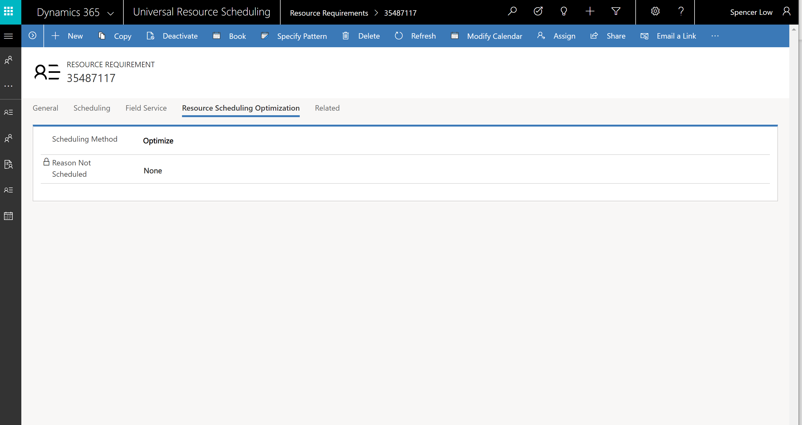 

> [!Note]
> Work Order requirements Scheduling Method field can be set to Optimize by default in the work order Booking Setup Metadata in **Resource Scheduling app > Settings > Administration > Enable Resource Scheduling for Entities**.
> [!div class="mx-imgBorder"]
> 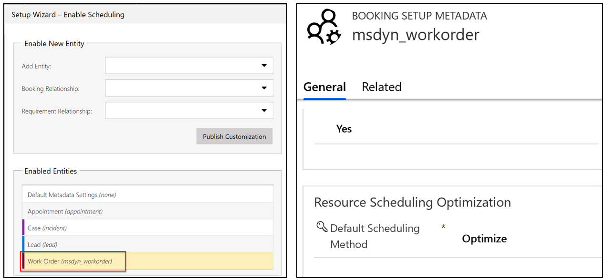

### Time off

Since Resource Scheduling Optimization's goal is to optimize resource scheduling, you should be ready to accommodate time off. You can create time-off entries to make a resource unavailable for a specific period of time, but Resource Scheduling Optimization will treat this like time outside of work hours and will schedule according to the **Schedule within Work Hours** and **Scheduling Windows** constraints.

If your requirements for time off are more complex, you can create a custom time-off entity as a schedulable entity and flag the related requirement to optimize. This would allow you to create more robust time off entries, which can then be handled more like work orders with time from and time to promise scheduling windows, priorities, and so on.

You can see the related time off entries by going to the **Resource Record** > **Related Items**.

> [!div class="mx-imgBorder"]
>  

## Running simulations

Now that we've had a look at types of data that will make for a useful POC, let's take a look at what to do once the data is imported and ready to go. 

### Simulating a period of time

 Resource scheduling optimization's resource optimization engine schedules requirements from the current point in time as far in the future as you specify using the **Range Offset** and the **Range Durations** values defined in the Optimization Scope. Since Resource Scheduling Optimization only looks to the future, the provided data can't have scheduling windows in the past, and you will need to modify any dates provided. 
 
 > [Note!]
 > This is not as simple as adding 30, 60, or 90 days to the existing dates, as weekdays in a prior month may fall on a weekend in a future month. Be sure to validate how you manage the dates with your client or prospect and insure there is a clear understanding of the time period you will use in the POC.

### Scheduling initial data

With POCs, it's not unheard of to receive multiple data sets representing information such as a months' worth of maintenance jobs and daily or hourly service calls. Typically, the first data set is the monthly maintenance work. It's good to have an optimization scope where the range offset is the number of days from the date you run Resource Scheduling Optimization to the first of the month or period you want to schedule. For example, if running for the month of January on December 16, set the range offset to 15 and the range duration would be 31. The result would be a schedule stating on January 1 through January 31.

For more detailed information about setting up optimization schedules, see [this article on on the subject](/dynamics365/customer-engagement/field-service/rso-configuration#create-an-optimization-schedule).  

### Receiving disruptors

A good Resource Scheduling Optimization POC will include a data set with a mix of predictive and reactive requirements. To simulate a typical service company's activity, you might expect disruptors representing service calls for an hour or a day. A second scope could then address a shorter period of time, which would optimize the subsequent data representing service calls or these other types of disruptors. This second scope could also reoptimize previously scheduled work along with the new set of service calls. All of this also allows Resource Scheduling Optimization to run more efficiently by using smaller data sets.

Review with the client, setting clear expectations regarding the different goals of predictive (maintenance) requirements and reactive (service calls) requirements. We've seen that clients might expect a single Resource Scheduling Optimization run to address all their needs, but that won't provide the best results. Be sure to discuss this early on in the POC. 

### Defining views and schedules

It's helpful to create views that are used by Resource Scheduling Optimization to filter the data being considered for optimization. These views are combined in the optimization scheduled for specific resources, requirements, and bookings. Consider views that filter data to specific territories. This allows you to associate different goals and objectives to specific territories. For example, a rural area might optimize once a week, whereas a more congested area might optimize on an hourly basis; rural areas frequently have longer drive times that are less subject to change than congested areas, where a schedule or route changes more frequently. 

### Defining goals with specific constraints and objectives

You can also define how bookings should be optimized. The goal of the Resource Scheduling Optimization engine is to process a list of resources and a list of resource requirements, along with existing bookings, to create the optimal route and list of bookings for the resources. Bookings can be considered optimally scheduled if they:

- Meet all company constraints
- Have the highest possible score for the company's objectives

Let's take a look at some constraints and objectives.

#### Constraints

- **Schedule Within Working Hours**: Creates the booking if it can be completed within the resource's working hours. Removing this constraint does not mean Resource Scheduling Optimization will treat working hours as 24-7. Rather, it will allow the booking at the end of the day to overflow into non-working hours. 
- **Meets Required Characteristics**: Verifies the resource has all the required characteristics and should have minimum required skill level. 
- **Scheduling Lock Option**: If checked, this will respect lock options configured on a booking record.
- **Scheduling Windows**:  Resource scheduling optimization will schedule work to comply within the time window start and end fields on the resource requirement or booking record. 
- **Restricted Resources**:  If marked, Resource Scheduling Optimization will not schedule a restricted resource to the booking. 

#### Objectives

- **Maximize total working hours**: The combination of the engine results (iteration) with the total highest aggregate work time will best meet this objective.
- **Minimize total travel time**: The version of the engine results (iteration) with the total lowest aggregate travel time will best meet this objective. 

> [!Note] 
> **Minimize total travel time** can't be the first objective in the list. RResource Scheduling Optimization might not schedule anything with the travel time of 0 minutes in order to meet the first objective. 

- **Locked bookings**: Once a booking is created, a lock can be set on the scheduling lock options field in the Resource Scheduling Optimization section of the booking. The options are **Time Range**, **Resource**, **Time**, and **Resource and Time**. 
- **High priority requirements**: Resource scheduling optimization will evaluate this objective and give priority to the resource and booking combination with the highest score for priority. The priority is set on the resource requirement record and is an option set with weighted values. Resource scheduling optimization checks **Level of Importance** on priority to determine how important that priority is. For example, set **Level of Importance** to **10** for urgent priority and set **Level of Importance** to **1** for low priority; Resource Scheduling Optimization will score 1 urgent requirement the same as 10 low-priority requirements because both scores are 10. 

### Simulations

Resource scheduling optimization includes the ability to run simulations or "What If" scenarios. In an optimization schedule, Set **Run as Simulation** to **Yes** and when the schedule runs, it will create soft bookings with a Booking status of **Simulations - RSO**. These will show on the schedule board as a white booking. They can then be turned into hard bookings should a simulation meet specific requirements and it is deemed the best option. The simulations should be deleted if they don't meet expectations. 

> [!div class="mx-imgBorder"]
> 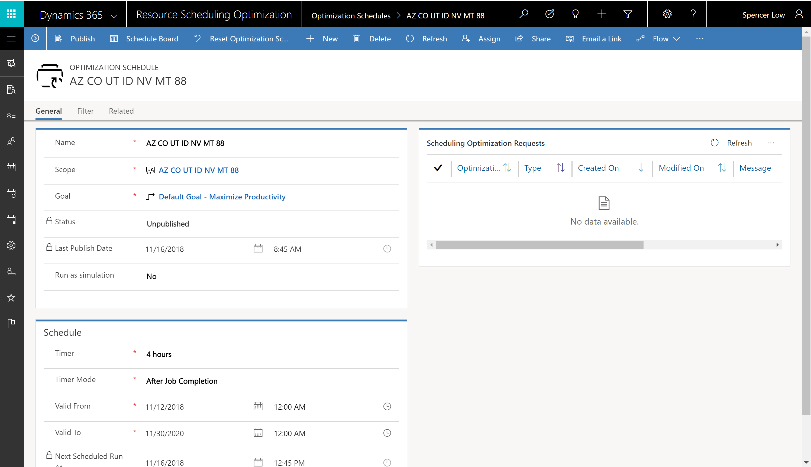 

### Schedule board optimization, selected resources

From the schedule board, you can open the detail pane and select **Optimize**. Here you select to reoptimize one or more resources. This allows for the reoptimization of a single person, should they be assigned a disruptor that takes them some distance from the previously defined route. By optimizing a single resource, Resource Scheduling Optimization can run more quickly and be more focused. You can also select a default goal, which allows for even more control over the schedule. Be sure to include this in your POC planning as it addresses several real-world problems dispatchers face daily.

> [!div class="mx-imgBorder"]
> 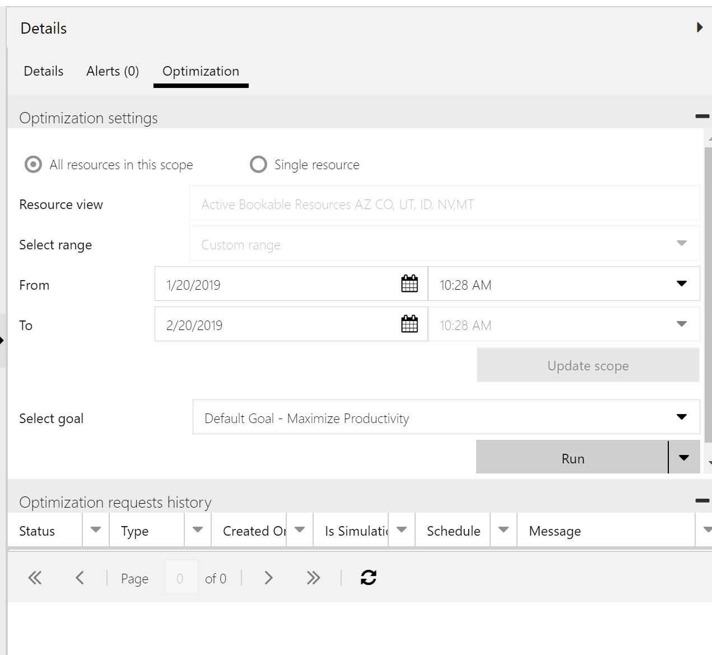 

## Presenting results
### Reporting on the success criteria

There are several ways to present the results of a Resource Scheduling Optimization POC, including Excel spreadsheets or Power BI dashboards. However, we don't recommend that you supply the client a report showing success criteria, as this does not reflect the true value of Resource Scheduling Optimization. As we've covered, defining a detailed POC plan and engaging with the client to participate in the POC is key. 

Whatever method you use, make sure that you tailor the results to address business needs uncovered during discovery, and walk them through what this POC has shown them about their business processes.

### Reviewing routes and booking details

Reviewing specific routes with the client is another good way to drill into the differences achieved with different goals and objectives. By selecting a few specific **Resources** and **Territories**, you can run Resource Scheduling Optimization schedules and output resulting bookings for comparison. Run Resource Scheduling Optimization with different goals and objectives, then compare the same resource and territory to determine the objective that best meets the requirements. Be sure to point out these requirements may vary based on many factors such as time of the month, priority of the requirements, and controlling overtime, just to name a few possibilities. Identify these routes before you start and understand the criteria you will be reviewing with the client or prospect up front, so expectations are clear.

[!INCLUDE[footer-include](../includes/footer-banner.md)]
