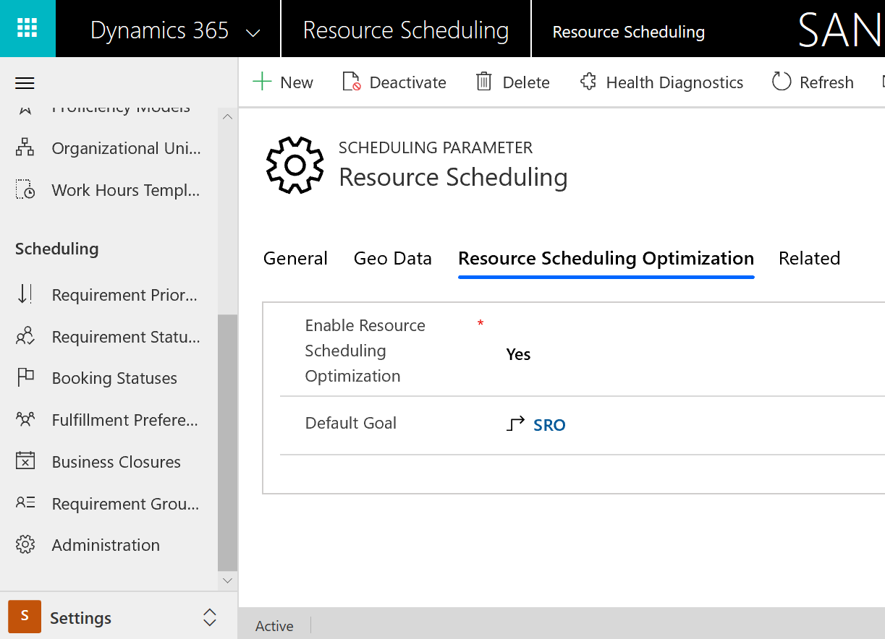

# QuickStart for Resource Schedule Optimization (RSO)

Resource Schedule Optimization (RSO) automatically schedules work orders, cases, opportunities, and even custom entities to the resources that are most available and best qualified. Many field service organizations that perform work orders on site at their customers' locations benefit from automatic scheduling because it optimizes the routes and travel times of field technicians as they travel from work order to work order.

In this quickstart, let's configure RSO to schedule and optimize a group of work orders to a predefined list of resources (field technicians). We will do this by setting up a scope, goal, and schedule that will run once a day to schedule work orders in the Washington state service territory to resources in that territory up to 48 hours in advance to minimize travel time. 

## Prerequisites

The images and definitions in this quickstart reflect **Field Service v8.7** and **RSO v3.0**

Resource Schedule Optimization works with Resource Scheduling to schedule field service work orders. It is helpful to understand how resource scheduling enables field service scheduling. For more details view the topic on [Universal Resource Scheduling for Field Service](/universal-resource-scheduling-for-field-service.md).

This quickstart also assumes you already have RSO deployed into your Dynamics 365 for Field Service environment. This is achieved by first purchasing a field service license and then purchasing a Resource Schedule Optimization (RSO) license in the Purchase Services section of Office 365. For more details view the topic on [Deployment of the Resource Scheduling Optimization (RSO) solution](/rso-deployment.md)

## Turn on RSO

After deploying RSO into your environment, the first step is to enable the solution. 

Go to **Resource Scheduling > Settings > Administration > Scheduling Parameters > Resource Scheduling Optimization tab**

> [!div class="mx-imgBorder"]
> 

Set **Enable Resource Scheduling Optimization** to **Yes**.

Select a **Default Goal**. Among other uses, a default goal tells RSO what to prioritize by default such as maximizing working hours and is important for using [Single Resource Optimization](/single-resource-optimization.md). A default goal is shipped with RSO, select it here if it is not already. If no default goal is present, select **+New** and create one, below are recommended settings.

> [!div class="mx-imgBorder"]
> 

## Set work orders to optimize

Next, create a system view that filters resource requirements to the ones you want to optimize. 

Create a new view in **Settings > Customizations**

For our quickstart scenario, create a new for resource requirements that relate to work orders in the Washington (WA) service territory.

> [!div class="mx-imgBorder"]
> 

> [!Note]
> When using Resource Scheduling you schedule resource requirement records related to work orders, cases, custom entities, etc rather than scheduling those entities.

## Set resources as eligible for optimization 

## Create Scope

## Create Goal

## Create Schedule

## Run RSO

## Analyze results

## Configuration considerations
## Additional Notes