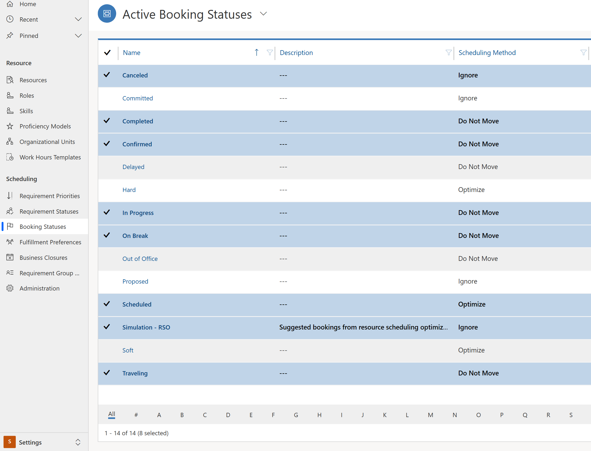
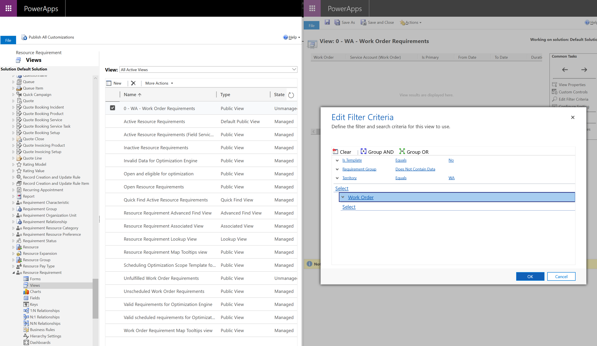
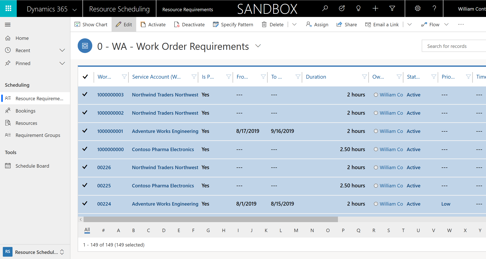
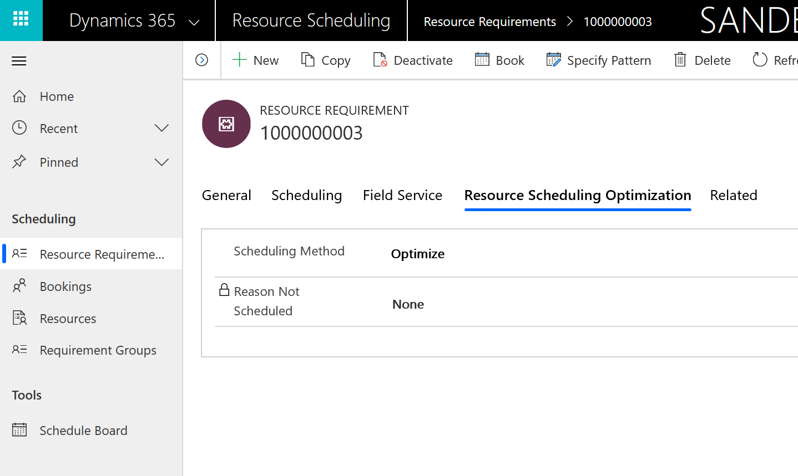

# QuickStart for Resource Schedule Optimization (RSO)

Resource Schedule Optimization (RSO) automatically schedules work orders, cases, opportunities, and even custom entities to the resources that are most available and best qualified. Many field service organizations that perform work orders on site at their customers' locations benefit from automatic scheduling because it optimizes the routes and travel times of field technicians as they travel from work order to work order.

In this quickstart, let's configure RSO to schedule and optimize a group of work orders to a predefined list of resources (field technicians). We will do this by setting up a scope, goal, and schedule that will run once a day to schedule work orders in the Washington state service territory to resources in that territory up to 48 hours in advance to minimize travel time. 

## Prerequisites

The images and definitions in this quickstart reflect **Field Service v8.7** and **RSO v3.0**

Resource Schedule Optimization works with Resource Scheduling to schedule field service work orders. It is helpful to understand how resource scheduling enables field service scheduling. For more details view the topic on [Universal Resource Scheduling for Field Service](/universal-resource-scheduling-for-field-service.md).

This quickstart also assumes you already have RSO deployed into your Dynamics 365 for Field Service environment. This is achieved by first purchasing a field service license and then purchasing a Resource Schedule Optimization (RSO) license in the Purchase Services section of Office 365. For more details view the topic on [Deployment of the Resource Scheduling Optimization (RSO) solution](/rso-deployment.md)

> [!div class="mx-imgBorder"]
> 

## Turn on RSO

After deploying RSO into your environment, the first step is to enable the solution. 

Go to **Resource Scheduling > Settings > Administration > Scheduling Parameters > Resource Scheduling Optimization tab**

> [!div class="mx-imgBorder"]
> 

Set **Enable Resource Scheduling Optimization** to **Yes**.

Select a **Default Goal**. Among other uses, a default goal tells RSO what to prioritize by default such as maximizing working hours and is important for using [Single Resource Optimization](/single-resource-optimization.md). A default goal is shipped with RSO, select it here if it is not already. If no default goal is present, select **+New** and create one, below are recommended settings.

> [!div class="mx-imgBorder"]
> 

## Verify Booking Statuses

> [!div class="mx-imgBorder"]
> 

## Set work orders to optimize

Next, create a system view that filters resource requirements to the ones you want to optimize. 

Create a new view in **Settings > Customizations**

For our quickstart scenario, create a new view for the Resource Requirement entity for requirements related to work orders in the Washington (WA) service territory.

> [!div class="mx-imgBorder"]
> 

> [!Note]
> When using Resource Scheduling you schedule resource requirement records related to work orders, cases, custom entities, etc rather than scheduling those entities.

Next, ensure the requirements in that view are eligible for optimization.

Each requirement can be set as eligible for optimization and this allows you to add workflows and business processes to which requirements should be automatically scheduled with RSO and others that should be scheduled manually.

Go to **Resource Scheduling > Resource Requirements** and then select the view you just created and highlight and edit those records.

> [!div class="mx-imgBorder"]
> 

Then set the **Scheduling Method** to **Optimize**. This means that if RSO runs and targets this requirement, i can be scheduled automatically.

> [!div class="mx-imgBorder"]
> 

This can also be done individually for each requirement record as well.

> [!div class="mx-imgBorder"]
> 

You can also have the system automatically set work order requirements to be optimized by default when a work order requirement is created in **Booking Setup Metadata**. 

Go to **Resource Scheduling > Settings > Administration > Enable Resource Scheduling for Entities**

Then double click on Work Order and set **Default Scheduling Method** to **Optimize**.

> [!div class="mx-imgBorder"]
> 

## Set resources as eligible for optimization 

So at this point you have a set of work orders in the Washington territory that need to scheduled in an optimal way. But who could or should they be scheduled to?

Let's define the resources that are eligible for optimization.

To fulfill our scenario, we want to create a view of Bookable Resources that are part of the Washington (WA) state service territory. 

> [!div class="mx-imgBorder"]
> 

After the view is created to partition the bookable resources that will later be fed into RSO, the next step is to ensure they are marked as eligible for optimization.

For each resource in your view, set the **Optimize Schedule** field to **Yes**.

> [!div class="mx-imgBorder"]
> 

Similar to requirements, this can be done individually or via a bulk update.

> [!div class="mx-imgBorder"]
> 

## Create Scope

Now that we have enabled RSO, and have:

1. a list of the requirements (work orders) we want to optimize and 
2. a list of the resources that the requirements should be scheduled to, 

the next step is to set up an RSO run and input both of these lists.

Go to the **Resource Scheduling Optimization app** which is a separate app from the Field Service and Resource Scheduling apps. 

Then choose **Optimization Scopes** in the left pane then **+New**.

Enter a **Name** that describes the requirements and resources you are optimizing.

In the **Resources and Unscheduled Requirements for this Optimization** section, select the **Resource View** and the **Requirement View** you created in the previous steps.

> [!div class="mx-imgBorder"]
> 

In the **Bookings for the Optimization** section, select the **Active Bookable Resource Bookings** view or a similar view for bookings.

> [!Note]
> By entering a view for unscheduled requirements **and** bookings we are configuring RSO to optimize both unscheduled jobs and existing jobs. If you only select a booking view, then RSO will only optimize existing bookings and you must schedule the unscheduled jobs manually or with the schedule assistant. By only selecting an unscheduled requirement view, this means RSO will not move existing bookings and simply attempt to schedule the unscheduled jobs to available time slots.

For Optimization Range Settings, enter the following values.

**Range Reference** - Job Current Time - means the 2 days we would like RSO to schedule will begin when RSO is run

**Range Offset** - 5 minutes - means the first booking RSO can schedule will be 5 minutes after the time RSO is run. Some organizations would like RSO to schedule tomorrow jobs, in which case the **Range Offset** should be set to 1 day

**Range Duration** - 2 days - means RSO will schedule requirements to fill up a maximum of 2 days. 

**Save**.

## Create Goal

THe next steps is to create goals or objectives for your RSO run.

Choose **Optimization Goals** in the left pane then **+New**.

Enter a **Name** that describes the goal.

**Engine Effort Level** - Very Light - meaning RSO will run very quickly but may not find the most optimal solution. 

> [!div class="mx-imgBorder"]
> 

For constraints, select the following

- Schedule Within Working Hours
- Meets Required Characteristics (if your requirements and resources both have characteristics)
- Matches Territory (if your requirements and resources both belong to the same service territory, in our example, Washington state (WA))

For objectives, select the following order

1. Maximize Total Working Hours
2. Minimize Total Travel Time
3. Best Matching Skill Level

> [!Note]
> Minimize Total Travel Time **cannot** be the first objective

## Create Schedule

> [!div class="mx-imgBorder"]
> 

## Run RSO

## Analyze results

## Configuration considerations
## Additional Notes