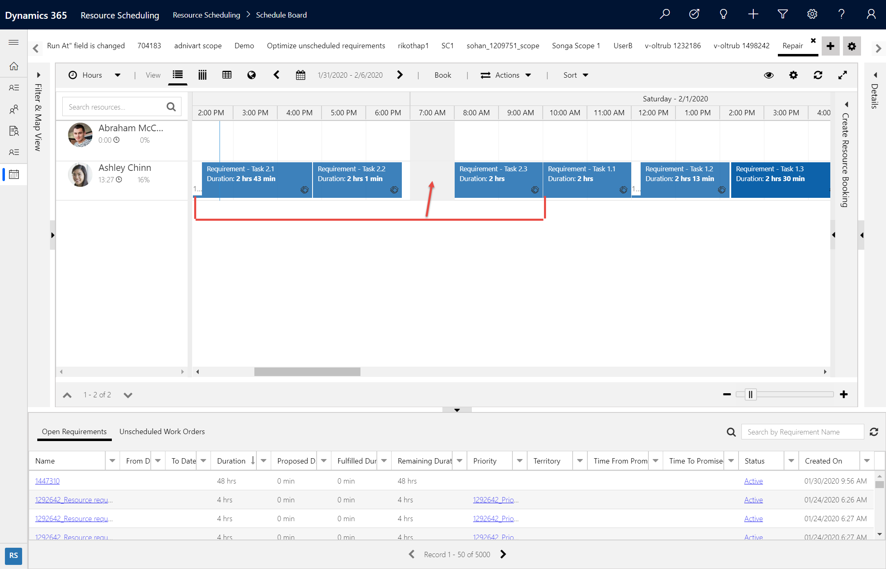

# Schedule in sequence with Requirement Dependencies

Ensure Resource Scheduling Optimization (RSO) auto schedules requirements in sequence by adding requirement dependencies.

This is helpful for many scenarios including but not limited to:

1) a technician needs to travel to one location to pick up a unique part from the warehouse before performing at the customer's site.
2) a work order must be completed and approved before another work order can begin. For example, a physical installation must occur before an electrical connection.

Requirement dependencies allow customers to schedule requirements in a specific order by relating them through a predecessor and successor dependency relationship. When RSO runs, it ensures the requirements are scheduled in the correct order where the start time of the defined predecessor is after the end time of the predecessor. 

> [!div class="mx-imgBorder"]
> 

In the image above you can see RSO scheduled requirements  "Task 2.1", "Task 2.2", and "Task 2.3" in order.

## Prerequisites

> [!Note]
> Early access Feb 3

## Instructions

First create two or more requirments like you would any requirements. This can be manually creating two requirements or utilizing the requirements that are automatically created when a work order is created.

From the requirement that should be completed first go to **Related > Successors**.

> [!div class="mx-imgBorder"]
> 

Add the first requirement as a predessor and the second requirement as a successor. In the example below we have two requirements, Task 1.1 which should be completed first followed by Task 1.2 which should be completed second. Leave Dependency type as _StartAfterEnd_.

> [!div class="mx-imgBorder"]
> 

For as many requirements as there are in the sequence, add a requirement dependency for each one. In our example there is another requirement "Task 1.3" that must be performed after Task 1.2 so we added another requirement dependency record from requirement Task 1.2 as seen in the image below.

> [!div class="mx-imgBorder"]
> 

After creating each requirement and adding the desired requirement dependencies, run RSO. Assuming the requirements are within RSO's scope, RSO will resepct the dependencies. There is no constrain or objective that must be added to the Optimization Goal.

## Configuration considerations

Applies to single requirements

Also these dependencies will work only for single-resource, single-day scenarios.

## Additional Notes

Will ensure the start time of the successor is after the end time of the predecessor. RSO may schedule the successive requirements on the following day or days but to the same resource. 

> [!div class="mx-imgBorder"]
> 

> [!div class="mx-imgBorder"]
> 

Does not apply to requirement groups
Does not apply to manual scheduling or schedule assistant

Chain is scheduled to same resource 

Will schedule around other bookings 