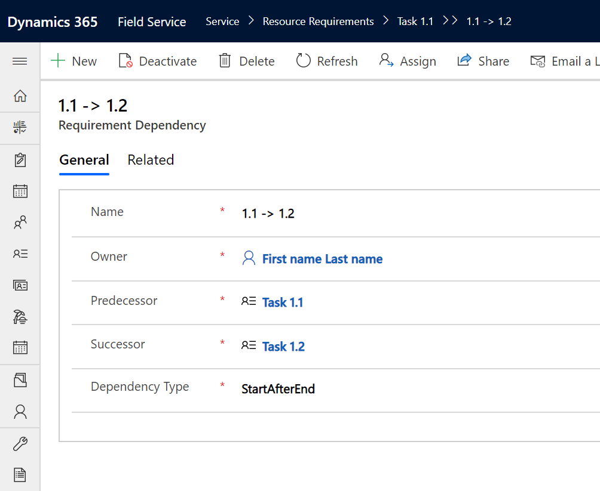

# Schedule in sequence with Requirement Dependencies

Very helpful for scenarios where a technician needs to travel to one location to pick up parts before performing a work order or any scenario with sequential work at the same or different locations

Ensure RSO auto schedules requirements in sequence

Business value
Sometimes it's necessary to sequence work in order to make sure that it's done in the correct order. For example, a physical installation must occur before electrical connection. Businesses can optimize operations workflows by ensuring dependent tasks are done in order. This feature allows organizations to complete work in a specific order.

Feature details
This feature enables the configuration of requirement dependencies to ensure technicians follow the optimal workflow and achieve the most efficient service operation. Requirement dependencies allow customers to schedule requirements in a specific order by relating them through a predecessor and successor dependency relationship. For example, a technician might need to pick up a unique part from the warehouse and then perform work at the customer's site. Critical jobs that rely on a series of tasks dependent on one another can now be linked together as predecessors and successors and booked through the resource scheduling optimizer.

In 2020 release wave 1, this feature will only be supported by resource scheduling optimization with the ability to view these bookings on the schedule board. Also these dependencies will work only for single-resource, single-day scenarios.

> [!div class="mx-imgBorder"]
> 

## Prerequisites

Early access Feb 3

> [!Note]
>

## Instructions

Create a requirement and add predecessor and successor requirements
> [!div class="mx-imgBorder"]
> 

As an example
> [!div class="mx-imgBorder"]
> 

Run RSO, there is no constraint or objective, RSO will always respect dependencies

## Configuration considerations

Applies to single requirements

## Additional Notes

Will ensure the start time of the successor is after the end time of the predecessor. RSO may schedule the successive requirements on the following day or days but to the same resource. 

Does not apply to requirement groups
Does not apply to manual scheduling or schedule assistant

Chain is scheduled to same resource 

Will schedule around other bookings 