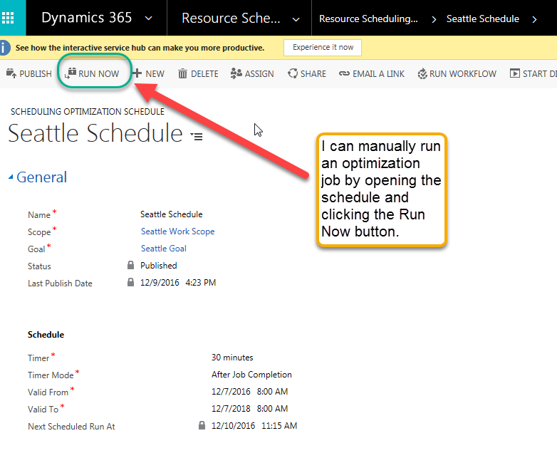
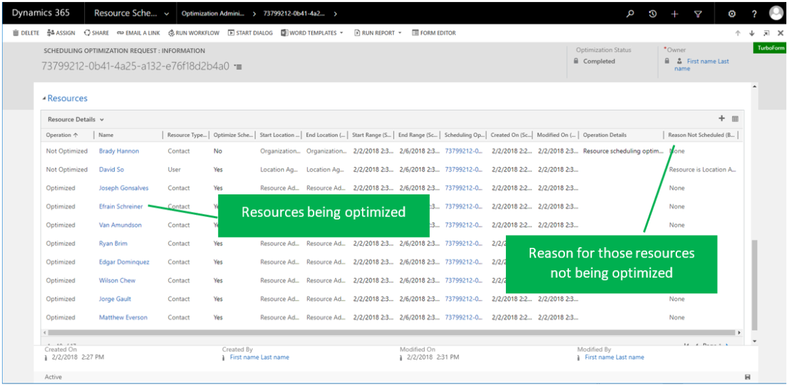
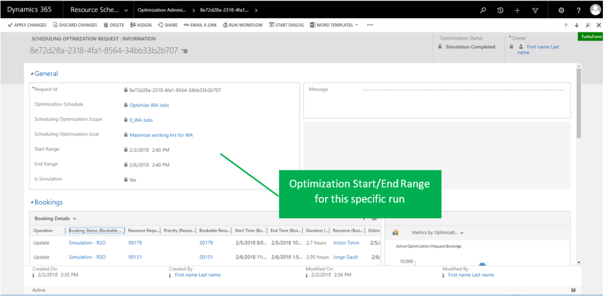
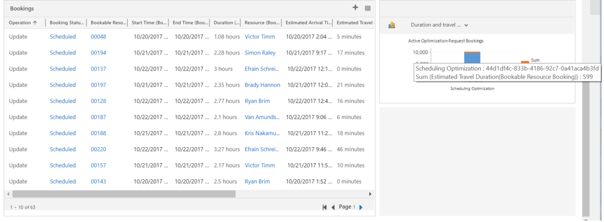

# Schedule optimization

## Publishing schedules

### Optimization status code 

- **Unpublished**: Default status when a schedule is created or after a reset.

- **Publishing**: The system is trying to publish schedules.

- **Published**: The system published a schedule and it's good to run.

- **Out of Sync**: Changes made against the schedule require it to be
    published again.

- **Under Maintenance**: Indicates someone is upgrading the resource scheduling optimization to a newer
    version.

- **Failed**: System failed to publish schedules for various reasons.

    - The user is able to see the error details on the form of the schedule.

    - A typical error would be that the SAS Key has not been configured,
        meaning resource scheduling optimization Azure resources are not set up correctly.

      > [!div class="mx-imgBorder"]
      > 

### Buttons and functions for optimization schedules 

- **PUBLISH**: After creating and saving the schedules, you need to publish
    them. Notice the **Status** in this screenshot is **Unpublished**. To
    publish, select **Publish** in the upper left.

    > [!div class="mx-imgBorder"]
    > 

- **PUBLISH ALL**: Publishes all schedules.

- **RESET RESOURCE SCHEDULING OPTIMIZATION**: Cancels all pending resource scheduling optimization jobs and
    unpublishes all schedules.

The next screenshot shows the publish status of the schedule, the date it was last modified, and the next scheduled run date and time.

> [!div class="mx-imgBorder"]
> 

- **RUN NOW**: Run resource scheduling optimization on demand, regardless of the timer setting.

  > [!NOTE]
  > RUN NOW is also a function that can trigger a new job. The user can use this button to run resource scheduling optimization per their business needs. For example, whenever there is a P1 work order requirement, you can re-run resource scheduling optimization right away.

  > [!div class="mx-imgBorder"]
  > 

## Monitoring optimization requests

Once a schedule has been published, you can open it and monitor the scheduling optimization requests (resource scheduling optimization jobs). You can drill into each of these to see the bookings associated with that resource scheduling optimization job run.

> [!div class="mx-imgBorder"]
> 

1. You can see which resources are being optimized, and which are not (and for
    what reason).  
    
    > [!div class="mx-imgBorder"]
    > 
 
    > [!div class="mx-imgBorder"]
    > 

2. You can view booking details as well as analytic charts showing how many
    hours of travel time versus how many work hours are scheduled for this run.

    > [!div class="mx-imgBorder"]
    > 

## Leveraging the schedule board to review optimization results 

With schedule board integration, you can:

- Better understand the optimization scope.
- View optimization results in a visualized way.
- More easily analyze failed optimization requests.
- Create a new schedule on the fly.

**How to get there:** Navigate to your Optimization Schedules, select your schedule, and select **SCHEDULE BOARD** on the grid view, or open the Optimization Schedules record form and select **SCHEDULE BOARD** on the form.

> [!div class="mx-imgBorder"]
> 

 

> [!div class="mx-imgBorder"]
> 

 

**Feature Details**: After clicking **SCHEDULE BOARD**, you will see the
following:

> [!div class="mx-imgBorder"]
> 

1. In the Filter section, the system prepopulated filters match **Scope** \>
    **Resource** view.

2. The **Open and eligible for optimization** tab shows all eligible
    unscheduled requirements that match scope definition, requirement range, and
    requirement state setting.

3. The **Eligible for optimization** tab shows all eligible unscheduled
    requirements as well as any eligible bookings to be reoptimized that match
    scope definition, requirement range, and requirement state setting.

4. The **Excluded from optimization** tab shows any eligible requirements or
    bookings that fail to be optimized for certain reasons (such as invalid
    longitude/latitude).

5. The icon and tooltip indicate resources not in the optimization scope.

    > [!div class="mx-imgBorder"]
    > 

6. The lock icon and tooltip indicate that the booking has been locked.

    > [!div class="mx-imgBorder"]
    > 

7. Yellow lines indicate the start and end time for the optimization range.

    > [!div class="mx-imgBorder"]
    > 

8. **From** / **To** date and time match the time range defined in the
    optimization scope. You can continue to modify and save the changes back to
    the original scope. If the same scope is being referenced by multiple
    optimization schedules, the change will apply to all of these schedules with
    the same scope.

    > [!div class="mx-imgBorder"]
    > 

9. Select a goal and select **Run Now** to trigger an on-demand optimization
    request.

    > [!div class="mx-imgBorder"]
    > 

10. The optimization request will show the status and details. If an exception
    occurs, select a specific optimization request to open it. You can view
    booking details as well as analytic charts showing how many hours of travel
    time versus how many work hours are scheduled for this run.

[!INCLUDE[footer-include](../includes/footer-banner.md)]
