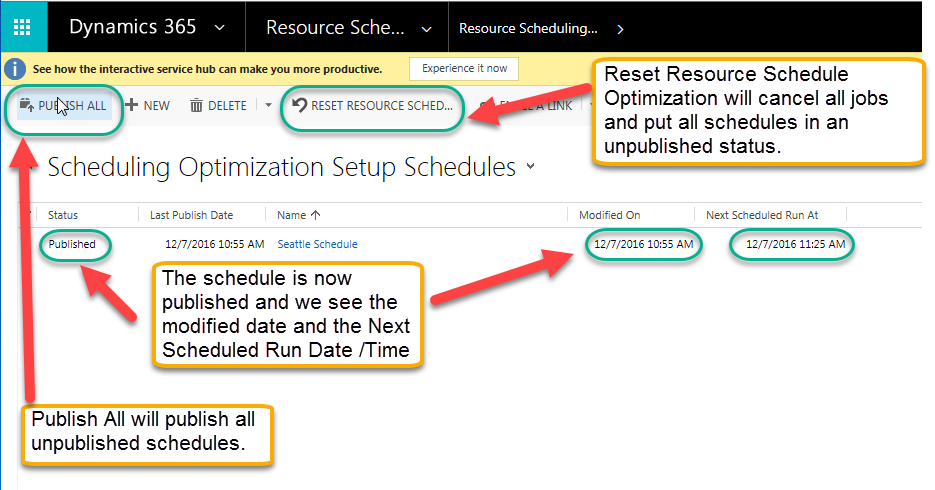
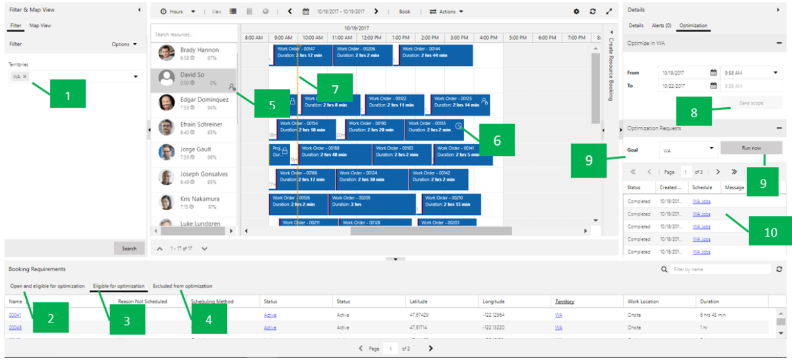
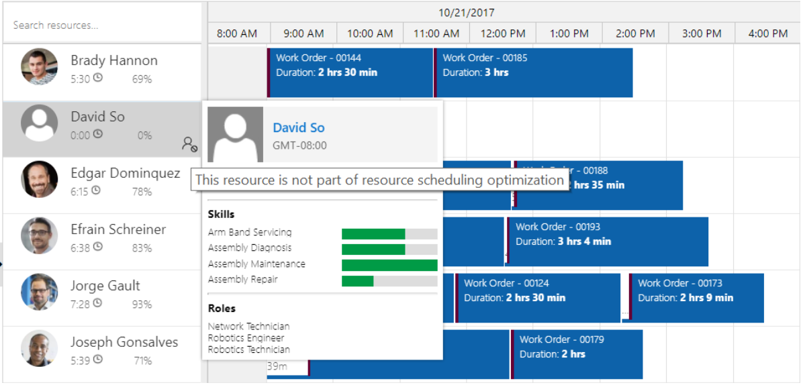
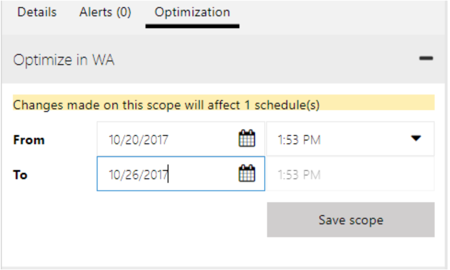

---

title: Schedule optimization
author: shellyhaverkamp
manager: shellyha
ms.date: 06/08/2018
ms.topic: article
ms.custom:
  - dyn365-fieldservice
ms.service: dynamics-365-customerservice
ms.author: shellha

---

Schedule optimization
=====================

Publishing schedules
--------------------

### Optimization status code 

- **Unpublished**: Default status when a schedule is created or after a reset.

- **Publishing**: The system is trying to publish schedules.

- **Published**: The system published a schedule and it’s good to run.

- **Out of Sync**: Changes made against the schedule require it to be
    published again.

- **Under Maintenance**: Indicates someone is upgrading the RSO to a newer
    version.

- **Failed**: System failed to publish schedules for various reasons.

    - The user is able to see the error details on the form of the schedule.

    - A typical error would be that the SASKey has not been configured,
        meaning RSO Azure resources are not set up correctly.

      

### Buttons and functions for optimization schedules 

- **PUBLISH**: After creating and saving the schedules, you need to publish
    them. Notice the **Status** in this screenshot is **Unpublished**. To
    publish, click **Publish** in the upper left.

    

- **PUBLISH ALL**: Publishes all schedules.

- **RESET RESOURCE SCHEDULING OPTIMIZATION**: Cancels all pending RSO jobs and
    unpublishes all schedules.

The next screenshot shows the publish status of the schedule, the date it was last modified, and the next scheduled run date and time.

- **RUN NOW**: Run RSO on demand, regardless of the timer setting.

> [!NOTE]
> RUN NOW is also an API. The user can call this API to run RSO per their business needs. For example, whenever there is a P1 work order requirement, you can re-run RSO right away.

Monitoring optimization requests
--------------------------------

Once a schedule has been published, you can open it and monitor the scheduling optimization requests (RSO jobs). You can drill into each of these to see the bookings associated with that RSO job run.

1. You can see which resources are being optimized, and which are not (and for
    what reason).  
    

    

     

    

1. You can view booking details as well as analytic charts showing how many
    hours of travel time versus how many work hours are scheduled for this run.

    

Leveraging the schedule board to review optimization results 
-------------------------------------------------------------

With schedule board integration, you can:

- Better understand the optimization scope.
- View optimization results in a visualized way.
- More easily analyze failed optimization requests.
- Create a new schedule on the fly.

**How to get there:** Navigate to your Optimization Schedules, select your schedule, and click **SCHEDULE BOARD** on the grid view, or open the Optimization Schedules record form and click **SCHEDULE BOARD** on the form.

**Feature Details: **After clicking **SCHEDULE BOARD**, you will see the
following:

1. In the Filter section, the system prepopulated filters match **Scope** \>
    **Resource** view.

2. The **Open and eligible for optimization** tab shows all eligible
    unscheduled requirements that match scope definition, requirement range, and
    requirement state setting.

3. The **Eligible for optimization** tab shows all eligible unscheduled
    requirements as well as any eligible bookings to be re-optimized that match
    scope definition, requirement range, and requirement state setting.

4. The **Excluded from optimization** tab shows any eligible requirements or
    bookings that fail to be optimized for certain reasons (such as invalid
    longitude/latitude).

5. The icon and tooltip indicate resources not in the optimization scope.

    

6. The lock icon and tooltip indicate that the booking has been locked.

    

7. Yellow lines indicate the start and end time for the optimization range.

    

8. **From** / **To** date and time match the time range defined in the
    optimization scope. You can continue to modify and save the changes back to
    the original scope. If the same scope is being referenced by multiple
    optimization schedules, the change will apply to all of these schedules with
    the same scope.

    

9. Select a goal and click **Run Now** to trigger an on-demand optimization
    request.

    

10. The optimization request will show the status and details. If an exception
    occurs, select a specific optimization request to open it. You can view
    booking details as well as analytic charts showing how many hours of travel
    time versus how many work hours are scheduled for this run.

Understanding the booking lock option 
--------------------------------------

You can schedule lock options. There are four types:

1. **Time Range**: RSO is able to move bookings with this lock option within
    certain time ranges (ensure Estimated Arrival Time falls into this time
    range). RSO is also able to reassign bookings to other resources by
    respecting this time range and the following time-related fields.

    - If **Date Window Start** and **Date Window End** are set as 5/25/2018,
        this indicates you want RSO to reoptimize this booking on 5/25/2018 and
        time of day doesn’t matter.

      

    - If **Time Window Start** and **Time Window End** are set as shown in this
    screenshot, it indicates you want RSO to schedule the booking from 3 AM to 6
    AM and date doesn’t matter.

    

    - If **Time From Promised** and **Time To Promised** are set as shown in this
    screenshot, it indicates you want RSO to schedule a booking between 4 AM and
    10 AM on 5/24/2018 and it has to be within that specific date and specific
    time range.

    

    - If **Date Window Start/End** and **Time From/To Promised** are set as shown
    in this screenshot, it indicates you want RSO to schedule a booking between
    3 AM and 6 AM on 5/25/2018.

    

    > [!NOTE]
    > - If these fields conflict, RSO uses **Time From Promised** and **Time To
    Promised** first. Then it either uses one or a combination of the other
    fields.
    > - RSO will ensure that the estimated arrival time falls into the window
    specified previously. It does not guarantee that the booking’s end time will
    fall within the time window.

2. **Resource**: RSO is able to move bookings to other times, but has to keep
    the same resource.

3. **Time**: RSO is able to move bookings to other resources but has to keep
    the same estimated arrival time.

4. **Resource and Time**: RSO can’t move bookings to any other resource or any
    other time, but it can make some changes. RSO will preserve the estimated
    arrival time and assigned resource. The booking’s start time and estimated
    travel duration may be changed if RSO schedules a booking in a new location
    before this is a locked booking.
