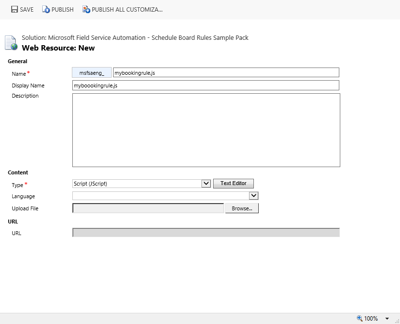
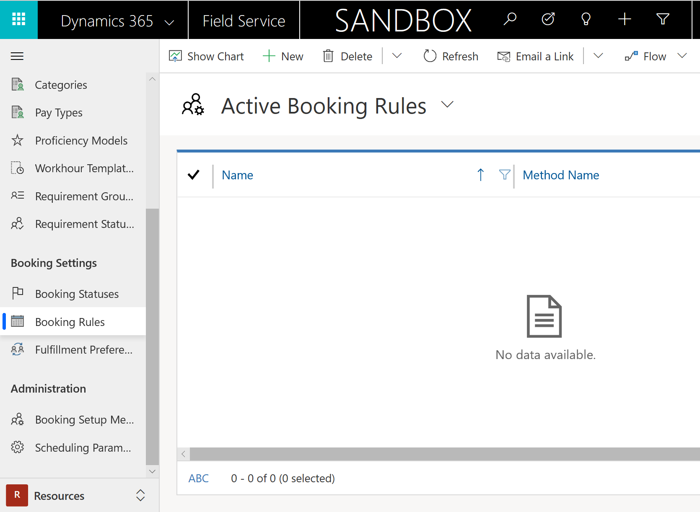

# Set up booking rules (Field Service)

Booking rules in Field Service allow a System Administrator to create warning or error messages that users see when creating or editing a resource booking record, based on custom conditions. For example, a booking rule could be created to warn a user when they attempt to book a work order to a resource on the schedule board that doesn't have the skills required for the job.  

Booking rules are custom JavaScript methods that will be executed prior to the Bookable Resource Booking record being created or edited.  The JavaScript method can accept a parameter that will contain information for the Bookable Resource Booking record being created and must return a JavaScript object with the required properties.
  
 Set up booking rules to validate a booking when it is created or modified.  
 
Booking rules are only available for the hourly view and not daily, weekly and monthly.

## Create a solution

The first step to setting up your booking rule is to create a custom Jscript web resource.  It is recommended that you create a solution in CRM to add your custom Jscript web resource or use an existing solution you may have for customizations.

Create CRM Solution

1.	From the Settings -> Solutions area create a new solution for your booking rule Jscript web resources.
The following screen shot shows a new solution that has been created.  It is recommended that your solution use a unique publisher rather than the default publisher.

> [!div class="mx-imgBorder"]
> 

2.	After creating the solution click on the Web Resources component and create a new Web Resource.
3.	On the new Web Resource form enter the following information
  a.	Name
  b.	Display Name.
  c.	Select “Script (Jscript)” as the Type.
4.	Click on the Text Editor button to enter your JavaScript code for the booking rule.
5.	Click the SAVE button to save your web resource.
6.	Click the PUBLISH button to ensure your booking rule web resource has been published.

> [!div class="mx-imgBorder"]
> 

## Set up a booking rule

1.  From the main menu, click **Field Service** > **Resources**, and then choose **Booking Rules** under **Booking Settings**.  

> [!div class="mx-imgBorder"]
> 

2.	Click +NEW to create a new Booking Rule.
3.	From the Booking Rule form enter the following information
a.	Name
b.	Web Resource -> Select the web resource that you created above.
c.	Enter the Method Name that you defined in your JavaScript.
 

> [!div class="mx-imgBorder"]
> 

4.	Save your booking rule.  Once you save the booking rule it will be used by the Schedule Board and Schedule Assistant.  You can deactivate your booking rule record to keep the Schedule Board and Schedule Assistant from executing the rule.

## Create a CRM action

The following is an example showing how you can use a custom CRM Action to perform the validation(s) as part of a booking rule.

When using a CRM Action for the booking rule validation you will still need to create a custom web resource as defined above.  The JavaScript that you will define in your custom web resource will call the custom CRM Action and evaluate the results from the custom CRM Action.  See Attachment A at the end of this document for sample code that you can use to call a custom CRM Action.

A custom CRM Action will need to be created in CRM.  It is recommended that you use the CRM Solution you have defined for your custom web resource to add your custom CRM Action.
The custom CRM Action should have the following input and output parameters.  You can add additional input and output parameters as your scenario requires.  You will need to ensure the JavaScript that you define to call your custom CRM Action is updated to support your additional input / output parameters.

Input Parameters:

- originalScheduleStart – DateTime
- originalScheduleEnd – DateTime
- originalBookableResource – EntityReference
- originalScheduleSource – Picklist
- newScheduleStart – DateTime
- newScheduleEnd – DateTime
- isCreate – Boolean
- isUpdate – Boolean

Output Parameters:
- isError – Boolean
- isWarning – Boolean
- errorMessage – String
- warningMessage - String
 
The screenshot below shows an example custom CRM Action.  This sample is checking if the newBookableResource matches the Preferred Resource on the work order and if the newScheduleStart is inside of the Time From Promised and Time To Promised.  It is assumed the dates of the promised window are for a single date. Example: Time From Promised: 01/01/2016 8:00AM / Time To Promised: 01/01/2016 12:00PM.

> [!div class="mx-imgBorder"]
> 

## Sample code

The JavaScript function that you create can accept a single parameter.  This parameter is considered the booking context.  The passed in Booking Context parameter is NOT a typical CRM context used in client side scripting.

The booking context parameter will have the following JavaScript definition. (It is NOT necessary to include this JavaScript code in the custom web resource for the booking rule).

The possible values for ResourceScheduleSource are from the Resource Schedule Source global option set. You can make use of this property to know if the booking rule is being triggered from the Schedule Board or Scheduling Assistant.

    var sbContext = {
    oldValues: {
        WorkOrderId: "00000000-0000-0000-0000-00000000",
        StartTime: "01/01/2016 08:00AM",
        EndTime: "01/01/2016 05:00PM",
        ResourceId: "00000000-0000-0000-0000-00000000",
        ResourceScheduleSource: 690970001
    },
    newValues: {
        WorkOrderId: "00000000-0000-0000-0000-00000000",
        StartTime: "01/01/2016 08:00AM",
        EndTime: "01/01/2016 05:00PM",
        ResourceId: "00000000-0000-0000-0000-00000000",
        ResourceScheduleSource: 690970001
    },
    isCreate: true,
    isUpdate: false
    };

Your validation method must return a JavaScript object with the following definition. (It is NOT necessary to include this JavaScript code in the custom web resource for the booking rule).

    var ruleResult = {
    IsValid: false,
    Message: "Some Message Here",
    Type: "error" // this can be either "error" or "warning"
};

Example JavaScript function definition. The JavaScript code shown below is the only JavaScript code that you will need to include in your custom web resource. 

    function Validate(ctx) {
      var url = Xrm.Page.context.getClientUrl();
      var ruleResult = {
  	IsValid = false;
       Message = '';
       Type = 'error';
      };

      //
      // perform some lookups or other validation logic here.
      //
  
      ruleResult.IsValid = false;
      ruleResult.Message = 'Some Error Message Here.';
      ruleResult.Type = 'error';

      return ruleResult;
    }

The following JavaScript can be used to call a custom CRM Action that has the same input and output parameters as the sample shown above.

On the Booking Rule record the “Method Name” must be: MSFSAENG.ScheduleBoard.Validate (See the screen shot in the Setting Up A Booking Rule section).

    /// <reference path="xrm.d.ts" />
    function brErrorCallback(sb) {
    // Add custom error handeling here if desired.
     return:
    function brWarningCallback(sb) {
    // Add custom warning handeling here if desired.
    return;
    }
    function brSuccessCallback(sb) {
    // add custom sucess handeling here if desired.
    return;
    }
    var MSFSAENG;
    (function (MSFSAENG) {
    MSFSAENG.ScheduleBoard = {
        url: Xrm.Page.context.getClientUrl() + "/api/data/v8.1/",
        actionName: "msfsaeng_MSFSAScheduleBoardRuleActionSample",
        actionInputParameters: function (ctx) {
            var inputParameters = {};
            if (ctx.isUpdate) {
                inputParameters = {
                    "originalScheduleStart": ctx.oldValues.StartTime,
                    "originalScheduleEnd": ctx.oldValues.EndTime,
                    "originalBookableResource": {
                        "@odata.type": "Microsoft.Dynamics.CRM.bookableresource",
                        "bookableresourceid": ctx.oldValues.ResourceId,
                        "name": ""
                    },
                    "originalScheduleSource": ctx.oldValues.ResourceScheduleSource,
                    "newScheduleStart": ctx.newValues.StartTime,
                    "newScheduleEnd": ctx.newValues.EndTime,
                    "newBookableResource": {
                        "@odata.type": "Microsoft.Dynamics.CRM.bookableresource",
                        "bookableresourceid": ctx.newValues.ResourceId,
                        "name": ""
                    },
                    "newScheduleSource": ctx.newValues.ResourceScheduleSource,
                    "isCreate": ctx.isCreate,
                    "isUpdate": ctx.isUpdate
                };
            }
            else {
                inputParameters = {
                    "newScheduleStart": ctx.newValues.StartTime,
                    "newScheduleEnd": ctx.newValues.EndTime,
                    "newBookableResource": {
                        "@odata.type": "Microsoft.Dynamics.CRM.bookableresource",
                        "bookableresourceid": ctx.newValues.ResourceId,
                        "name": ""
                    },
                    "newScheduleSource": ctx.newValues.ResourceScheduleSource,
                    "isCreate": ctx.isCreate,
                    "isUpdate": ctx.isUpdate
                };
            }
            return JSON.stringify(inputParameters);
        },
        ctx: null,
        ruleResult: {
            IsValid: true,
            Message: "",
            Type: ""
        },
        outputParameters: {
            isError: false,
            isWarning: false,
            errorMessage: "",
            warningMessage: ""
        },
        Validate: function (context) {
            this.ctx = context;
            ScheduleBoardHelper.callActionWebApi(this);
            return this.ruleResult;
        },
        errorCallback: brErrorCallback,
        warningCallback: brWarningCallback,
        successCallback: brSuccessCallback
    };
    var ScheduleBoardHelper = (function () {
        function ScheduleBoardHelper() {
        }
        ScheduleBoardHelper.callActionWebApi = function (sb) {
            var oDataEndpoint = sb.url + "msdyn_workorders(" + sb.ctx.newValues.WorkOrderId + ")/Microsoft.Dynamics.CRM." + sb.actionName;
            var req = new XMLHttpRequest();
            req.open("POST", oDataEndpoint, false);
            req.setRequestHeader("Accept", "application/json");
            req.setRequestHeader("Content-Type", "application/json; charset=utf-8");
            req.setRequestHeader("OData-MaxVersion", "4.0");
            req.setRequestHeader("OData-Version", "4.0");
            req.onreadystatechange = function () {
                if (req.readyState == 4) {
                    req.onreadystatechange = null;
                    if (req.status == 200) {
                        sb.outputParameters = JSON.parse(req.response);
                        if (sb.outputParameters.isError) {
                            sb.ruleResult.IsValid = false;
                            sb.ruleResult.Message = sb.outputParameters.errorMessage;
                            sb.ruleResult.Type = 'error';
                            if (sb.errorCallback)
                                sb.errorCallback(sb);
                            return;
                        }
                        else if (sb.outputParameters.isWarning) {
                            sb.ruleResult.IsValid = false;
                            sb.ruleResult.Message = sb.outputParameters.warningMessage;
                            sb.ruleResult.Type = 'warning';
                            if (sb.warningCallback)
                                sb.warningCallback(sb);
                            return;
                        }
                        else {
                            sb.ruleResult.IsValid = true;
                            sb.ruleResult.Message = '';
                            sb.ruleResult.Type = '';
                            if (sb.successCallback)
                                sb.successCallback(sb);
                            return;
                        }
                    }
                    else {
                        alert('Error calling Rule Action. Response = ' + req.response + ', Status = ' + req.statusText);
                    }
                }
            };
            req.send(sb.actionInputParameters(sb.ctx));
        };
        return ScheduleBoardHelper;
    }());
    })(MSFSAENG || (MSFSAENG = {}));
      
 
### See also    
 [Schedule within time constraints](../field-service/schedule-time-constraints.md)   
 [Set up booking statuses](../field-service/set-up-booking-statuses.md)   
 [Create and edit web resources](../customize/create-edit-web-resources.md)
