# Set up agreements to automatically generate work orders and invoices

Field Service agreements allow organizations to automatically generate work orders and invoices with predefined details, frequency, and date ranges. Agreements are most commonly used for maintenance schedules where an organization must perform daily, weekly, or monthly inspections on equipment.

Here are a few different ways agreements can be configured and used. The agreement generates:

- Daily inspection work orders that dispatchers schedule through the schedule board or schedule assistant.
- Monthly maintenance work orders that are automatically scheduled by resource scheduling optimization.
- Weekly work orders where the agreement assigns the same resource each time at a defined start time.
- A single work order each month to inspect multiple customer assets at a customer location.
- Multiple work orders each year to inspect multiple assets at a customer location.
- Quarterly invoices to bill customers for predefined products and services.

To use agreements, you'll need to:  

1. Create the **Agreement**. Define high-level details such as the customer, date range, and price list.
2. Create an **Agreement Booking Setup** where you'll define how often work orders should be created for the agreement, along with basic details of the eventual work orders like **Work Order Type**.
3. Add **Agreement Incidents**, **Products**, **Services**, and **Service Tasks** that define the specific details of the work to be performed as part of each work order that is generated.
4. **Activate** the agreement and **Agreement Booking Dates** will be created along with work orders as the dates approach.

Let's walk through two scenarios to show how agreements can create work orders and invoices.

## Prerequisites

- Field Service v6.1+

- Work order-related data such as accounts, incident types, products, services, and service tasks configured in your system.

- Consider specifying an agreement prefix and start number (optional). Go to **Field Service** > **Settings**, then the **Agreements** section.

Enter an **Agreement Prefix** and **Agreement Starting Number**.

> [!div class="mx-imgBorder"]
> 

Doing so will dictate the **Agreement Number** when a new agreement is created.

> [!div class="mx-imgBorder"]
> 

## Scenario 1: Auto generate work orders for asset maintenance

An organization must perform monthly maintenance on a piece of equipment they installed at a customer's location for the next two years. They want to use Dynamics 365 Field Service to automatically generate the maintenance jobs in the middle of each month, with *some* flexibility. They want dispatchers to schedule the monthly maintenance jobs to the best and most appropriate field technicians and bill the customer for completed work at an agreed upon price.

We'll use agreements - along with customer assets, incident types, and price lists - to configure this scenario.

### Step 1: Create an agreement

From the main menu, go to **Field Services** > **Agreements** > **+New**.  

Fill in your information. Use the handy tooltips as a guide.  

- **Service Account & Billing Account**: Like with the work order fields, the service account defines where the agreement work orders will take place, while the billing account defines who the invoice should be sent to.

- **System Status**: Defines if the agreement is currently being executed. Set to **Estimate** while building a new agreement and adding details. We'll set to **Active** later when we're ready to begin performing work orders and sending invoices.

- **Start & End dates**: Defines the duration of the agreement.
  
- **Price list**: Specifies the price of all products and services related to an agreement and controls the price list populated on work orders and invoices generated from this agreement. Add all products and services that will be used during the agreement to the agreement price list. Agreements usually contain a negotiated price for goods and services that are reflected in an entirely new price list. The price list on resulting work orders and invoices can be manually updated as needed.

> [!div class="mx-imgBorder"]
> 

In the **Other** tab, you can enter more details such as the **Service Territory** resulting work orders should be part of, and **Record Generation Time**, which dictates the time of day work orders, invoices, and other records related to this agreement should be generated. This definition is important because some organizations don't want agreements creating work orders in the middle of the working day. If no value is set, it defaults to the value in Field Service **Settings**.

Finally, **Save**.  

### Step 2: Set up booking recurrence

Once the agreement has been created, specify how often work orders should be generated.  

In the **Booking Setups** section, select **+Add Booking Setup record**.  

> [!div class="mx-imgBorder"]
> 

Fill in your information to create the agreement schedule. Use the handy tooltips as a guide.

- **Name**: Enter the name of the agreement schedule. For example, it could be "Monthly Maintenance." Naming is important because an agreement can have multiple booking recurrences. For instance, the service organization may perform weekly and monthly maintenance as part of the same agreement.

#### Work order settings  

- **Auto Generate Work Order**: Set to **Yes** to have this agreement automatically generate work orders. The system will generate work orders on a rolling basis. Generated work orders will appear in the active work order view with the status **Open-Unscheduled**. If set to **No**, you must manually generate the work order for each schedule date, as we'll explore later in this article.

- **Generate Work Orders Day in Advance**: Dictates how many days before the expected service date the work order will be generated. If you choose a large number of days in advance, your backlog of work orders may become larger than desired; however, if you choose too few days in advance, you may not have time to prepare. If no value is entered at the agreement level, there's an environment-wide setting in **Field Service Settings** > **Agreement** tab > **Generate Agreement Work Order X Days in Advance**. If this field also has no value, the work orders will be generated seven days in advance of the booking date at the record generation time entered on the agreement.

**Work Order Type**, **Priority**, **Work Order Summary**, and **Work Location** entered here are passed down to resulting work orders.

#### Booking Settings

- **Auto Generate Booking**: Set to **Yes** to have the system book generated work orders (regardless of auto generated or manually generated). If set to **Yes**, you must specify a **Preferred Resource** and **Preferred Start Time** for the booking. If set to **No**, the generated work orders must be scheduled through the normal scheduling process: manually, with the schedule assistant, or with resource scheduling optimization.

    > [!NOTE]
    > Bookings made by agreements will not consider existing bookings, meaning it will double book on top of existing schedules.
  
- **Pre Booking Flexibility** and **Post Booking Flexibility** fields specify how many days before and after the anticipated schedule date the work order is allowed to be scheduled. These will populate the **Date Window Start** and **Date Window End** fields on the generated work orders to aid the schedule assistant. For example, if you plan to perform monthly maintenance on the 8th of each month, and set pre and post-booking flexibility to seven days, then the work orders can be scheduled between the first and the 15th of each month.

- **Time Window Start** and **Time Window End** can be specified to create a time window for generated work orders, and will be taken into account by the schedule assistant. (Example: Work order should be scheduled between 8 AM and 12 PM).  

#### Booking recurrence

Define a pattern to create work orders based on the agreement.

1. Select **Booking Recurrence** in the command bar at the top.  

    > [!div class="mx-imgBorder"]
    > 

1. Specify the **Recurrence Pattern**. For example, every week, every first Monday of the month, or every other Friday.

    > [!div class="mx-imgBorder"]
    > 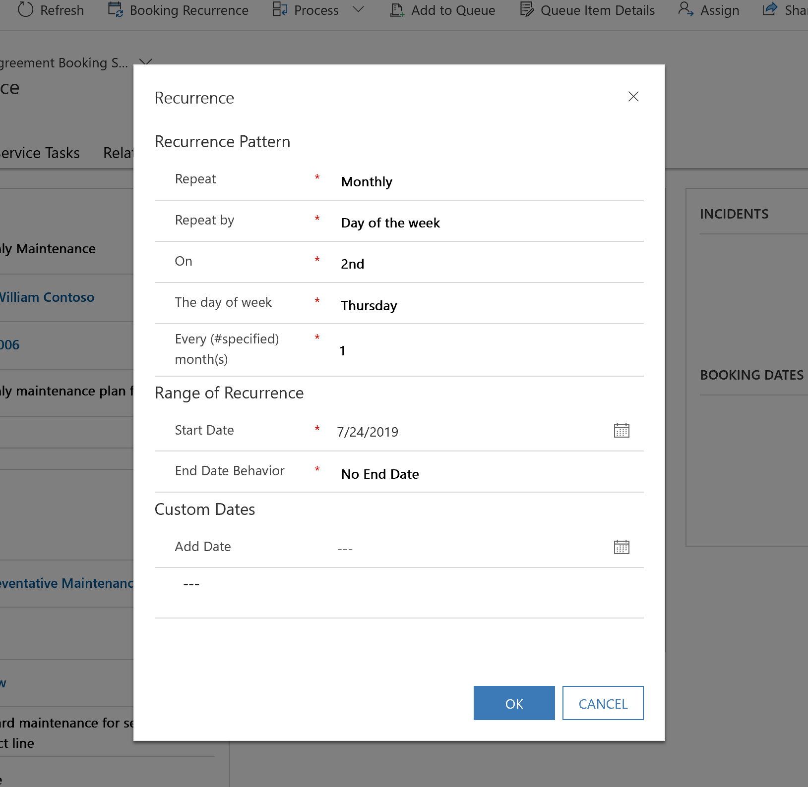

1. Set the **Range of Recurrence**. Define the **Start Date** and choose the **End Date Behavior**.
   - **No End Date**: Work orders are generated until the agreement end date.
   - **End by**: Stop generating work order after the recurrence end date.
   - **End after # recurrences**: Work order are generated until the specified number of recurrences is reached.

1. You can also define **Custom Dates** to generate work orders that should be performed in addition to a recurrence if a pattern doesn't reflect your business needs. For example, to perform service on various holidays throughout the year. Custom date work orders won't be generated, unless a recurrence is provided.

1. Select **Save**.

> [!NOTE]
> A single agreement can have various booking setups. For example, you may create a booking setup for weekly visits that creates work orders every week and booking setup for monthly visits with different bookings.

See also: [Import booking recurrences](#import-booking-recurrences).

### Step 3: Add agreement work details

After setting up the **Agreement** to define the high-level details, and the **Agreement Booking Setup** to define a recurrence, the next step is to define the work that should be performed.

This definition is achieved by adding incident types, products, services, and service tasks to the agreement.

From the agreement booking setup, select **+Add Agreement Booking incident record**. Use the tooltips as a guide to specify the incident details, and then select **Save & Close**.

> [!div class="mx-imgBorder"]
> 

As you add incidents to the agreement, the related products, services, service tasks, and characteristics are added to the agreement and then to work orders as they're generated. See note about the "Copy Incident Items to Agreement" in the configuration considerations at the end of this article.

> [!div class="mx-imgBorder"]
> 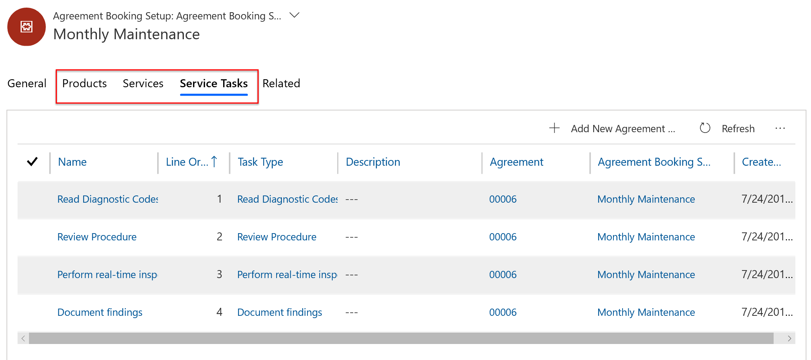

If you don't want to use incident types, you can add products, services, and service tasks directly to the agreement.

#### Customer assets with agreements

If you want to use agreements for customer asset maintenance, use agreement incidents.

By specifying a customer asset on the agreement incident, you can define recurring work that should be performed on specific equipment and build service history. You can also add multiple incident types to an agreement booking setup each with a customer asset.

Using the example of two incidents for monthly maintenance, organizations can:

1. Perform two different types of maintenance procedures (incident types) on the same customer asset.
2. Perform the same maintenance procedure (incident type) on two different customer assets, as long as both assets are at the same location as defined by the service account.

### Step 4: Activate agreement and view work orders

Finally, after the high-level details, recurrence, and work are defined, the last step is to **Activate** the agreement to begin generating related records such as maintenance dates and work orders. This is typically done after manager review and customer acceptance. To add more details to the agreement status, consider using the **Agreement Sub-Status** values. Custom agreement substatuses can also be created.

From the agreement, set the **System Status** field to **Active**. Doing so triggers the creation of booking dates that represent the dates service should be performed.

> [!div class="mx-imgBorder"]
> 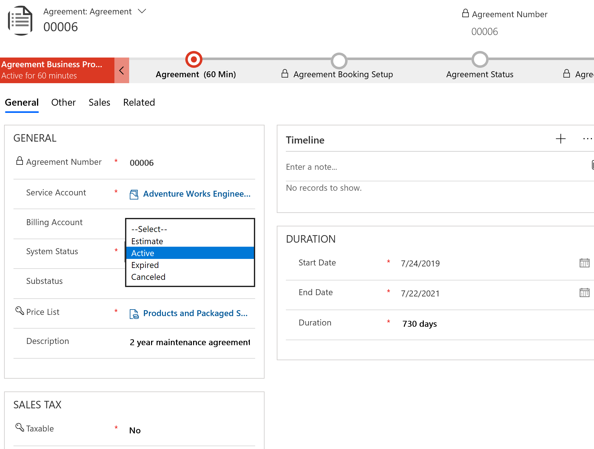

> [!div class="mx-imgBorder"]
> 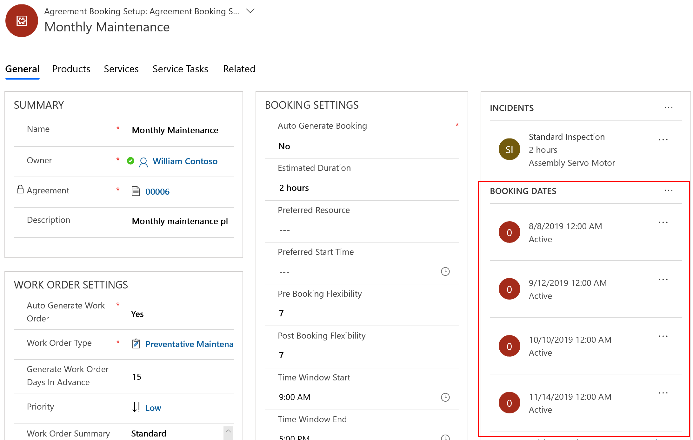

As time approaches the booking dates, work orders will be generated based on the **Generate Work Orders Days in Advance** field. The booking date will then have a status of **Processed**, along with a lookup to the generated work order.

> [!div class="mx-imgBorder"]
> 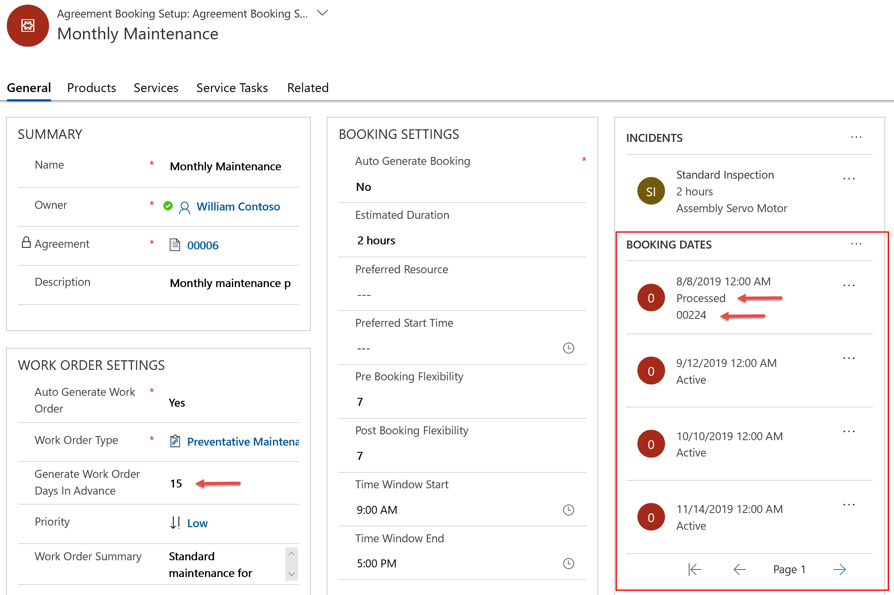

You also have the ability to manually generate work orders for each booking date. This is applicable if you set **Auto Generate Work Orders** to **No**, or for unique business cases where you must generate a work order earlier than defined.

> [!div class="mx-imgBorder"]
> 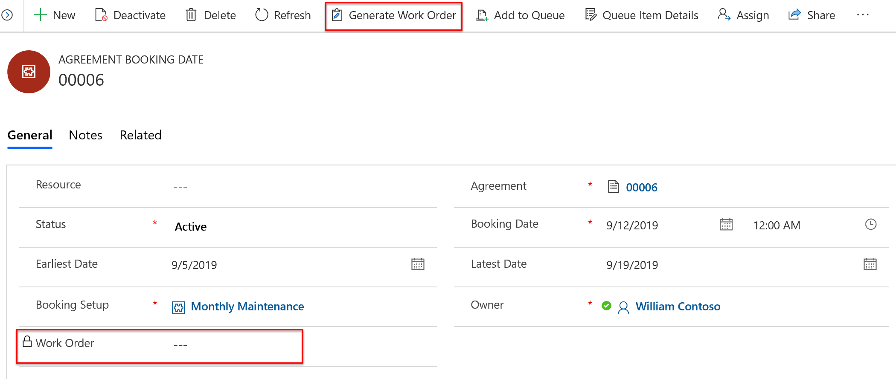

If you decided to have the agreement **Auto Generate Bookings**, the work orders will be scheduled to the preferred resource when the work orders are generated.

### Step 5: Perform agreement work orders

As work orders are generated, they'll appear among other work orders in the **Active Work Orders** view.

The generated work orders will have all the details specified on the agreement, such as price list, work order type, incident type(s), customer asset, and so on.

> [!div class="mx-imgBorder"]
> 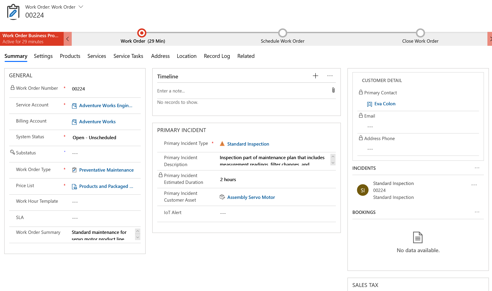

> [!NOTE]
> Though the agreement provides a framework to generate work orders, details can still be edited at the work order level. For example, though a work order may be generated from an agreement, more products and services can be added to the work order as needed; other details, such as price list and work order type, can be changed, assuming sufficient permissions.

A lookup to the agreement will also be noted in the **Settings** section.

> [!div class="mx-imgBorder"]
> 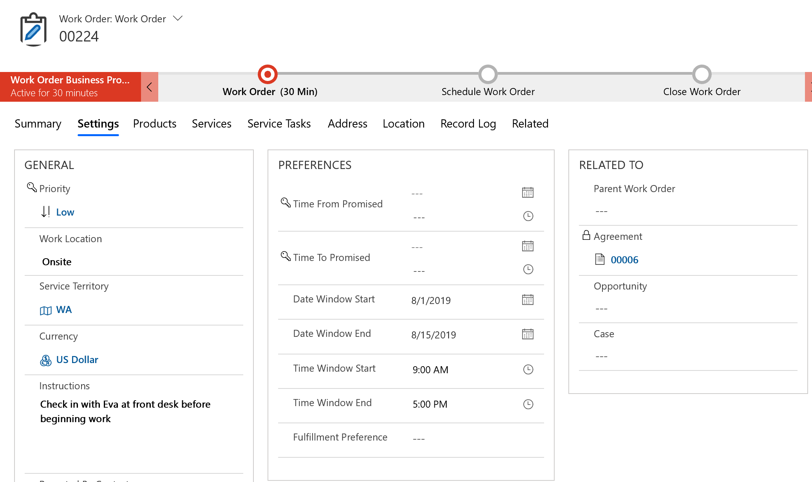

After selecting the work order **Book** button and triggering the schedule assistant, the **Search Start** and **Search End** time parameters will reflect the booking date.

> [!div class="mx-imgBorder"]
> 

After an agreement work order is performed by a field technician and closed by a manager, an invoice for completed work will be created as part of the normal work order invoicing process. This is true whether a work order is part of an agreement or not. For more information, see the article on [work order life cycle and statuses](work-order-status-booking-status.md).

## Scenario 2: Auto generate invoices

Agreement invoices are used to automatically generate invoices for products and services. The invoices will be generated at a defined recurrence and contain the same products at the same price each time. The invoices are generated and billed regardless of whether any work orders are performed or not. It's a similar model to how you may pay a monthly cell phone bill regardless of the number of phone calls or texts you send.

Let's configure the scenario where a customer pays a field service organization a quarterly amount for a service plan.

### Step 1: Create an agreement or select an existing one

You can add an agreement invoice to an existing agreement or add it to a new one. You can have an agreement with only an agreement invoice and no maintenance plan and even have multiple invoices for a single agreement.

In our example, we'll add quarterly invoices to the agreement we created.

From the agreement, go to **Invoice Setup** > **Add New Agreement Invoice Setup**.

> [!div class="mx-imgBorder"]
> 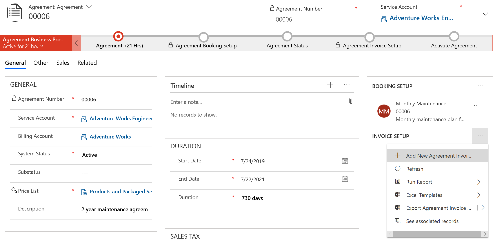

### Step 2: Set up invoice recurrence and products

In the invoice products section, add the products you would like to bill the customer for regularly. The price of the invoice products will be derived from the price list on the agreement.

> [!div class="mx-imgBorder"]
> 

> [!NOTE]
> Invoice products can only be products where **Field Service Product Type** is set to **Inventory** or **Non-inventory**. Service type products cannot be added.

Next, define how often the invoices should be generated by selecting **Invoice Recurrence** at the top.

> [!div class="mx-imgBorder"]
> 

> [!div class="mx-imgBorder"]
> 

Select **Save** to apply the changes.

### Step 3: Activate invoice recurrence and view invoices

Because this agreement is already active, the invoice dates will generate after a short time but not immediately. If you added an agreement invoice setup to a new agreement or an existing one that has an estimate status, then you'll need to activate the agreement.

> [!div class="mx-imgBorder"]
> 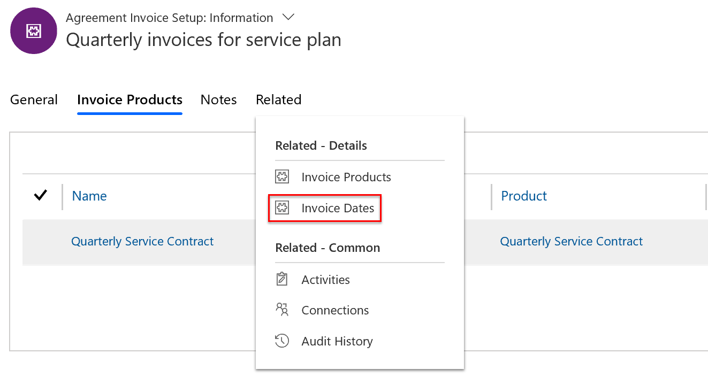

Once the agreement is active, agreement invoice dates will generate after a short time.

> [!div class="mx-imgBorder"]
> 

It isn't possible to manually generate agreement invoices like you can with agreement work orders.

> [!NOTE]
> The invoice will generate in advance depending on what you have set for X in the **Generate Agreement Invoices X Days in Advance** field in **Field Service Settings** under the **Agreement** section. This means the invoice due date is set based on your recurring invoice setup, but it will be created X days in advance. If no value is entered for **Generate Agreement Invoices X Days in Advance**, the system will generate the invoice on the day of the invoice date at the **Record Generation Timing** field on the agreement, and then in Field Service settings.

> [!div class="mx-imgBorder"]
> 

## Configuration considerations

In Field Service Settings, there are important defaults you can set for agreements that help administrators control how the system creates agreements. Agreement booking dates help organizations plan for maintenance. For more information, go to [Agreement settings](configure-default-settings.md#agreement-settings).

> [!NOTE]
> Some updates to agreements or their sub-records (Agreement Booking Setups, Agreement Booking Dates, Agreement Invoice Setups, and Agreement Invoice Dates) can trigger asynchronous background processes. Updates in rapid succession which trigger these processes within the same agreement will cause the system to momentarily block subsequent updates until the processes are complete. It’s the intended behavior of the system to protect the data integrity of each agreement. Please wait until the processes complete and try again or retry the update until it succeeds.
>
> Examples of updates which might trigger asynchronous background processes:
>
> - Updating an Agreement Booking Setup or Agreement Invoice Setup recurrence.
> - Updating the date of an Agreement Booking Date or Agreement Invoice Date.
> - Modifying an agreement status.
>
> These processes and their potential to block subsequent, rapid updates, are specific to the agreement under which they were triggered. Updates to other agreements or their sub-records won’t be impacted.

### Multiple incidents vs multiple recurrences

As agreement work increases, you'll have to decide whether to add multiple agreement incidents to a single recurrence or to add multiple recurrences, each with one or more incidents. Here are a few things to consider:

- *Who will perform the work order(s)?*: A single recurrence will create a single work order, whereas multiple recurrences will create multiple work orders, and work orders are performed by a single person. If you envision the agreement work being completed by a single person, then using a single recurrence may be better. One workaround is to use incident types with [requirement group templates](/dynamics365/field-service/multi-resource-scheduling-requirement-groups) that help schedule single work orders to multiple resources.

- *Travel*: If multiple recurrences create multiple work orders, then this may create more trips and more travel.

- *How are you tracking assets?*: Some organizations prefer each work order to relate to a single customer asset. This way they know the time spent on a work order correlates to time spent servicing an asset, which helps with reporting. If so, you may choose to have multiple recurrences each creating one work order with a single incident related to a single asset.

### Schedule agreement work orders automatically with resource scheduling optimization

Resource scheduling optimization automatically schedules work orders to optimize working hours and travel time. This includes work orders generated from agreements. If you're interested in using resource scheduling optimization to schedule agreement work orders, here are three options:

1. Have the agreement auto generate work orders and ensure the generated work order is picked up by the resource scheduling optimization scope.
2. Have the agreement auto generate and book work orders and ensure the preferred resource it's scheduled to is enabled for resource scheduling optimization and the booking status of the related booking can be optimized. You can use schedule lock options on the booking to ensure the agreement booking remains scheduled to that resource, time slot, or both.
3. Create a specific resource scheduling optimization schedule and scope that only considers work orders generated from agreements. This allows you to set specific cadences and priorities for when agreement work order bookings are optimized.

### Using invoices and entitlements with agreements

When deciding to use agreement invoices, you can create a new agreement to generate invoices, or add invoices to an existing service agreement. If the agreement invoices relate to scheduled maintenance, then we recommend having the agreement-generated work orders and the agreement-generated invoices as part of the same agreement.

Even if you have an agreement generating invoices, agreement work orders will still create invoices upon completion and **Close-Posted** status. If only the agreement invoices represent what should be billed to the customer, you'll need to create a process to disregard or mitigate the work order invoices. This could be as simple as deactivating those invoices or using price lists and entitlements to ensure the work order subtotal and work order invoice is $0.

Entitlements are applied to work order pricing based on multiple factors such as service account, incident type, and customer asset categories. It's common practice to create specific incident types for specific customers outlining custom work; one option is to apply an entitlement when the custom agreement incident type is added to a work order that makes the products and services $0 by discounting them 100%.

For more information, see [Entitlements for work orders in Dynamics 365 Field Service](work-order-entitlements.md).

### Import booking recurrences

It's possible to import a booking recurrence pattern for an agreement booking setup (ABS) or agreement invoice setup (AIS).

- The recurrence dialog, when saved, populates a field on the ABS or AIS records.
- The field is called **Recurrence Settings** and isn't displayed on the form by default.
- To import a recurrence with one or more ABS or AIS records through CSV, just get a representative string from an ABS or AIS that is set up similarly to how you would like the imported records to be configured.
- With that string, you'll see that there are some values driving how the record behaves that can be parsed out of that string, like start and end date, months every, etc.
- Use these sample strings to populate the agreement booking and invoice setup records into a spreadsheet and use this to import fully configured records.

For example, see a recurrence in the following screenshot, and related XML below.

> [!div class="mx-imgBorder"]
> 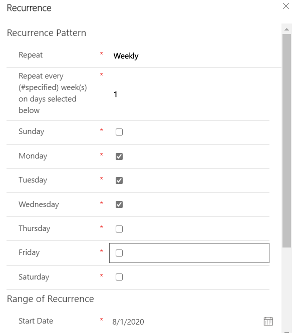

```xml
<root><pattern><period>weekly</period><option>every</option><weeks every='1'><days>1</days><days>2</days><days>3</days></weeks></pattern><range><start>08/01/2020</start><option>endAfter</option><end>10</end></range><datas/></root>
```

## Additional notes

- You can edit active agreements; the edits are immediately eligible and will update the agreement after a short time.
- Editing the booking recurrence of an active agreement will update booking dates asynchronously.
- You can copy existing agreements and choose which parameters you want to apply to the resulting copy.
- If **Auto Generate Work Order** is set to **No** but **Auto Generate Booking** is set to **Yes**, then the booking will automatically be created when the work order is manually generated from the booking date.
- An agreement is intended to be executed at a single location represented by the service account. Work at multiple locations should be configured with multiple agreements.
- In scenarios where you want to use agreements solely for invoice generation and not for work order generation, consider using the quote entity as part of the Field Service solution, which has similar capabilities.
- Agreements work seamlessly with the Dynamics 365 Sales Lead > Opportunity > Quote > Order process. This is achieved by:  
  - Categorizing a lead as a service-maintenance lead
  - Adding opportunity lines with service-based lines
  - Creating quote lines as service-based lines and adding a quote booking setup
- When setting up agreements to automatically generate work orders, limit the number of work order child records - work order products, services, service tasks, incident types, and so on - to be generated to no more than 500. Larger volumes of records, synchronous custom plugins, or custom processes may cause a time-out, resulting in the remaining child records not being generated.

- The **Copy Incident Items to Agreement** field during incident type setup is important for two reasons:

1. The incident you want to add to an agreement may be slightly different than the incident you would add to a single work order that's not part of an agreement. For example, normally the incident would require 1 hour of a service, but for the agreement, you negotiated with the customer 2 hours of a service. Rather than having to create a second incident type just for this agreement, you can set **Copy Incident Items to Agreement** to **No**, add the incident to the agreement, then manually add the specific service tasks, product, services, and so on. This way you can use the same incident type, which helps for reporting later on. Set this option to **Yes** and the incident items will be added to the agreement and you can accept these items or make slight variations from there.

If set to **Yes**, agreement items will be created.
> [!div class="mx-imgBorder"]
> 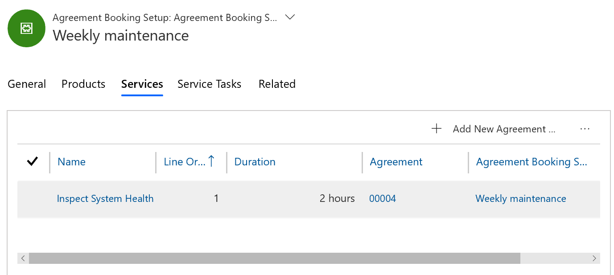

If set to **No**, they won't.

> [!div class="mx-imgBorder"]
> 

1. Incidents can be added to agreements for recurring work. This means agreements will generate work orders with predefined work order incidents attached. However, as mentioned earlier in this article, incidents can be edited as processes and procedures change. But agreements can span multiple months and even years, so should the agreement use the original incident type at the time of agreement creation, or use the latest changes to the incident type? This could result in different work being performed than originally intended at the end of the agreement. Set to **Yes** if the incident should remain the same throughout the agreement life span by copying the incident details to the agreement at the time of agreement activation.
  Set to **No** if the work orders generated from the agreement should grab the latest incident type details when the work orders are generated from the agreement, which is generally at an ongoing basis depending on the **Generate Work Orders X Days In Advance** field on **Agreement Booking Setup**.

1. Items are copied to the agreement when they're added to the agreement, even if the agreement has an estimate status.

### See also  

- [Create work order templates with incident types](configure-incident-types.md)

- [Add account details to work orders](work-order-customer-account.md)

[!INCLUDE[footer-include](../includes/footer-banner.md)]
