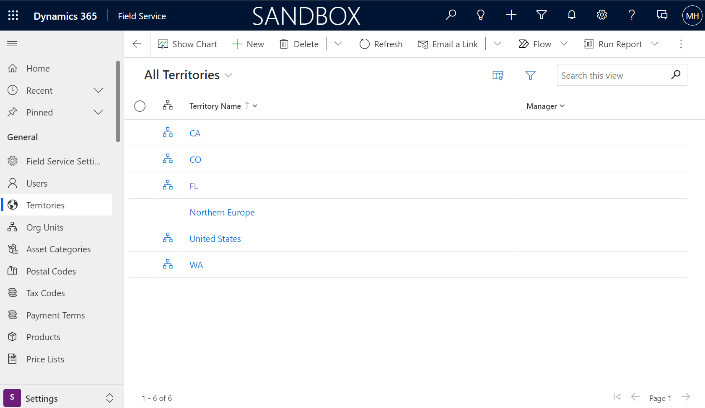

# Set up territories to divide service areas (Field Service)

Territories are used to divide large service areas. If a service territory is assigned to a service account record, and a work order is generated for that service account, then the work order will inherit the service territory from the service account. When you are scheduling a work order using the scheduling assistant, the suggested available resources can be filtered based on the resources that are assigned to the same territory as the work order. Using territories also helps dispatchers manage the schedules more efficiently when managing the schedule board.  

Dynamics 365 Territories can be leveraged to segment Customers, Resources and Work Orders.  By using Territories, work can be assigned to the proper Resource by matching the assigned Territory.  
  
> [!NOTE]
>  To assign a territory to a resource, you will need to add the resource to a territory. [!INCLUDE[proc_more_information](../includes/proc-more-information.md)] [Set up bookable resources](../field-service/set-up-bookable-resources.md)  
  
   
## Create a territory  
  
1.  From the main menu, click **Field Services** > **Administration**, and then choose **Territories**.  
  
2.  On the **All Territories** screen, click **+New** in the upper left corner.  
  
3.  Fill in your information:  
  
    - **Name**: Enter the geographical name for the territory, such as the name of a city, country/region, or a state.  
  
    - **Manager**: Enter the name of the user who manages this territory. This person typically assigns leads to salespeople.  
  
    - **Important**: You can't allocate the same user to multiple territories. If you need to assign a user to a large area (more than one existing territory), create a new territory that includes the existing territories, and then assign the user to that new territory.  
  
    - **Description**: Enter any details that you'd like to include for this territory; for example, "Sales territory created for education and training".  
  
4.  When you're done, on the command bar, click **Save** or **Save & Close**.  

Territories are managed in Field Service Settings
 

 
To add a new Territory, click the New button.  Populate the Territory Name and the Manager.  

  
   
## Assign members to territories  
  
1.  To assign members to a sales territory, open the territory and then, in the left pane, under **Common**, choose **Members**.  
  
2.  At the top of **Users**, click **Add Members**.  
  
3.  In the **Look Up Records** dialog box, select a user, and then click **Add**.  

To add Resources to the Territory, navigate to a Resource record. Click the Related button to find Resource Territories.  
 

Click Add New Resource Territory.  Populate the Territory, Resource and Name.  
 

 
Resources can be a part of multiple Territories.  
 
Accounts can be assigned a Service Territory on the Field Service tab.  
 
## Leverage territories for scheduling

Leveraging Territories for Scheduling
By assigning a Territory to a Work Order, either manually or automatically through a workflow or mapping, the Scheduling Engine will use the Territory to find a resource in the matching territory.  This will ensure resources stay within their assigned territories.  To ensure the Territory will be used, enable the filter by default in the Scheduling Parameter. This setting is found in the Universal Resource Scheduling App, Administration.   Verify Auto Filter Service Territory set to Yes.
 
 
When a Work Order is Booked, the Service Territory will be auto populated in the Filter. 
 

Territories can also be leveraged to create a segmented Schedule Board.  By simply using the Territory filter and saving the filters, organizations can have focused territory boards.  
 

> [!div class="mx-imgBorder"]
> 

> [!div class="mx-imgBorder"]
> 

> [!div class="mx-imgBorder"]
> 

> [!div class="mx-imgBorder"]
> 

> [!div class="mx-imgBorder"]
> 

> [!div class="mx-imgBorder"]
> 

> [!div class="mx-imgBorder"]
> 

> [!div class="mx-imgBorder"]
> 

> [!div class="mx-imgBorder"]
> 