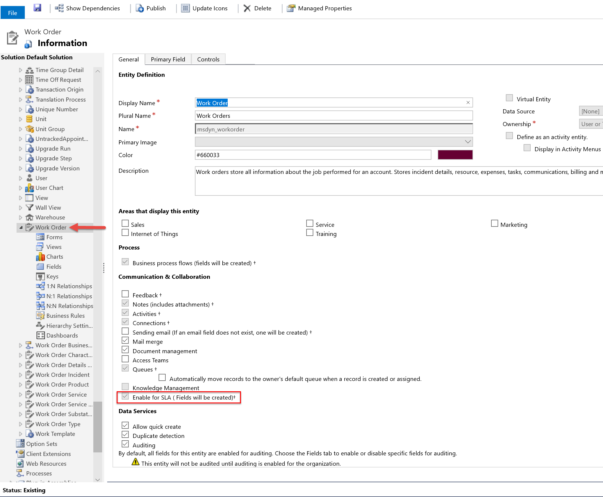
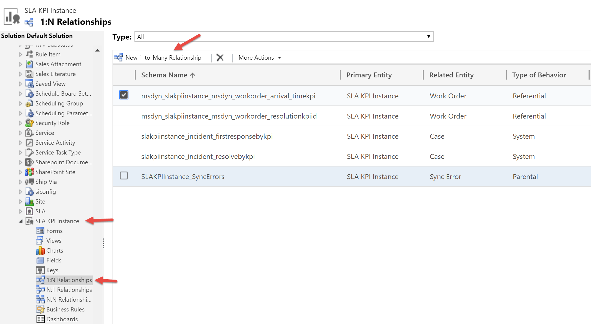

# Service level agreements (SLAs) for work orders

Dynamics 365 for Field Service is designed to use the broader Dynamics 365 Service Level Agreement (SLA) functionality.

SLAs for Field Service help you ensure work orders are getting attention and completed in a timely manner.

Consider the following scenario:

A field service organization would like to offer an [SLA](https://hosting.review/web-hosting-glossary/#8) to their customers where field technicians must arrive at the customer's location within 3 hours from the time a work order is created. The organization would also like a warning status displayed after 90 minutes and to use the SLA timer during the scheduling process.

For more information on SLAs in a broader Dynamics 365 capacity, visit our [topic on the defining SLAs](https://docs.microsoft.com/dynamics365/customer-engagement/customer-service/define-service-level-agreements). 

In this topic, we'll walk through how to associate SLAs to Field Service work orders.

## Prerequisites

- Field Service v8.3+
- Knowledge of [Dynamics 365 Service Level Agreements](https://docs.microsoft.com/dynamics365/customer-engagement/customer-service/define-service-level-agreements)

## Step 1: Enable SLA functionality for Field Service

1. Go to **Settings > Customizations > Work Order**.

2. Under the **Communication & Collaboration** header on the form, check the **Enable for SLA** box, as seen in the following screenshot.

> [!div class="mx-imgBorder"]
> 

3. Save and publish customizations. 

4. Go to **Field Service > Settings > Field Service Settings** and enter the active Field Service Settings record.

5. Next, go to the **Field Service SLA Configurations** tab. Here you will define the **SLA KPI Instances** that you would like to use for Field Service. By default, you should see an SLA related to work order arrival times, which is available out-of-the-box with Field Service v8.3+. 

  SLA KPI instances help track how often your organization meets SLAs by establishing a relationship between the SLA and work order entities. The SLA KPI instances entered in our example tell the system to update the **Time from Promised** and **Time to Promised** work order fields for scheduling, which we will discuss further on in this topic.

> [!Note]
>  One SLA can have many SLA KPI instances.

> [!div class="mx-imgBorder"]
> 

You can create new SLA KPI instances by going to **Settings > Customizations > Customize the System > Entities > SLA KPI Instances > 1:N relationships > New 1-to-Many Relationship**.

> [!div class="mx-imgBorder"]
> 

## Step 2. Create a new SLA

Now we are going to create a new SLA.

1. Go to **Settings > Service Management > Service Level Agreements > +New**.

> [!div class="mx-imgBorder"]
> 

2. Enter the following information:
  - **Name:** give the SLA a title
  - **Entity:** Select **Work Order** from the list

> [!div class="mx-imgBorder"]
> 

3. If appropriate, assign a business hours calendar and then **Save**.

> [!div class="mx-imgBorder"]
> 

4. Now we will add details to our SLA:

- **Name:** enter a title for your SLA detail.
- **SLA KPI:** select the SLA KPI this relates to. You can choose the arrival time KPI that is automatically available with Field Service v8.3+, or select one you have created.
- **Applicable When**: in our example, the SLA is applicable when the **Priority** field on the work order is set to **High**.
- **Success Criteria**: we want this SLA to be considered a success when a field technician begins traveling to or arrives on site. Therefore, a work order system status of **Open-In Progress** would indicate this because when a field technician changes the booking status on one of his or her scheduled work orders to **Traveling** or **In Progress**, the related work order system status changes to **Open-In Progress**, thus making the SLA a success.  
  - Additionally, work orders with a system status of **Open-Completed**, **Closed-Posted**, and **Closed-Canceled** should be considered a success in terms of this SLA.
- **SLA Item Failure**: in our example, we set this to 3 hours, which means the work order must reach a successful status (Open-In Progress, Open-Completed, Closed-Posted, Closed-Canceled) within 3 business hours. See the configuration considerations section in this topic for more information.
- **SLA Item Warning**: set to 1.5 hours, which means the SLA status will be set to "warning" after 1.5 hours.

> [!div class="mx-imgBorder"]
> 

The following screenshot shows the Field Service Mobile app that field technicians use to view and record on-site work. When a work order is scheduled to a field technician, a booking record is created. He or she can edit the booking status, which will update the related work order system status, which then updates the related SLA success status. 
> [!div class="mx-imgBorder"]
> 

5. Select **Activate** on the SLA. The following screenshot shows an activated SLA. 
> [!div class="mx-imgBorder"]
> 

## Step 3. Add the SLA to a work order

1. Go to **Field Service > Work Orders > select a work order record** and then select **Form Editor**.

2. Add the SLA field to the work order form. The SLA field is created when SLA functionality is enabled for the work order entity.
> [!div class="mx-imgBorder"]
> 

3. Save and publish form changes.

4. Create a work order and associated to your SLA, or associate a current work order to your SLA.
> [!div class="mx-imgBorder"]
> 

## Step 4. Schedule a work order to meet SLA  

Once a work order is associated with an SLA, the **Time From Promised** and **Time To Promised** fields will be populated on the work order according to the SLA, appropriate SLA Item, and business hours of the SLA. Note that these fields will populate along with other system jobs, which may typically take up to 5 minutes.

> [!div class="mx-imgBorder"]
> 

Additionally, scheduling tools like the schedule assistant and Resource Schedule Optimization consider **Time From Promised** and **Time To Promised** fields and therefore will respect the SLA.

> [!div class="mx-imgBorder"]
> 

## Configuration considerations

- The SLA timer and populated values for **Time From Promised** and **Time To Promised** will respect the business hours of the SLA. For example, let's say the SLA has a success parameter of 3 hours, business hours are set to Monday through Friday from 9AM to 5PM, and a work order is created at 4pm on Friday. The SLA timer and **Time From Promised** and **Time To Promised** will be set to a start of Friday at 4pm and an end of Monday at 11AM to compensate for business closure on the weekend up until 9AM the following Monday. 

## Additional notes
- Multiple SLAs and multiple business hours or calendars can be created and utilized for different customers; however, a work order can only have one SLA assigned to it.
- SLAs on work orders will overwrite existing values for **Time From Promised** and **Time To Promised**.
- Pausing an SLA timer on the work order will update **Time From Promised** and **Time To Promised** fields when resumed.
