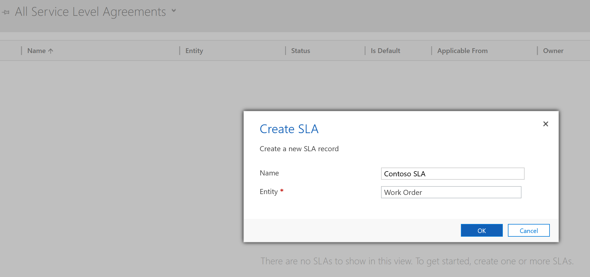
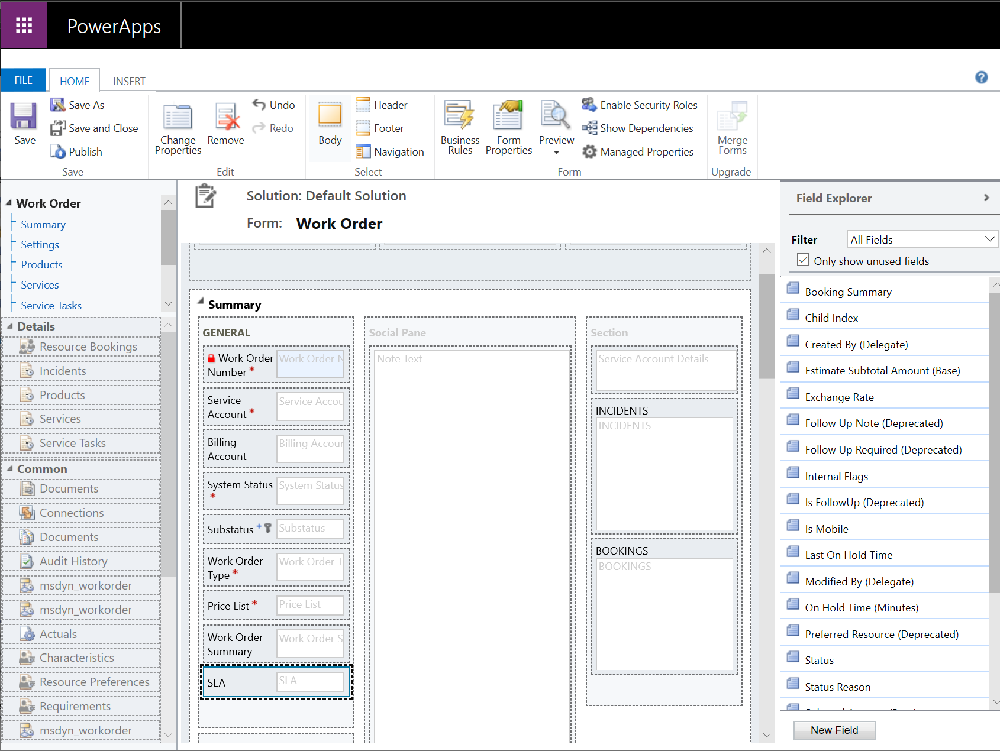

# Service Level Agreements (SLA) for Work Orders

- scenario: ensure field technican arrives on site within 1.5 hours for high priority work and within 6 hours otherwise

## Prerequisites

Field Service v8.3+

## 1. Enable SLA functionality for Field Service

Navigate to **Settings > Customizations > Work Order**

Under Communication & Collaboration, check off **Enable for SLA**.

> [!div class="mx-imgBorder"]
> 

Save & Publish Customizations 

Next, navigate **Field Service > Settings > Field Service Settings** and enter the active Field Service Settings record.

Then go to the **Field Service SLA Configurations** tab

Here you will see an SLA related to work order arrival times that is available "out of the box" when Field Service is installed.  

As more KPI scenarios are released they will be available here.

> [!div class="mx-imgBorder"]
> 

## 2. Create a new SLA

Navigate to **Settings > Service Management > Service Level Agreements > +New**

> [!div class="mx-imgBorder"]
> 

**Name:** enter a title of your SLA

**Entity:** Select **Work Order**

> [!div class="mx-imgBorder"]
> 

If appropriate, assign a Business Hours calendar and **Save**.

> [!div class="mx-imgBorder"]
> 

Next let's create SLA details.

In this example, the SLA is applicable when the priority field on the work order is set to High.

We want this SLA to be considered a success when a field technician arrives on site. Therefore, a work order system status of Open-In Progress would indicate this because

SLA Item failure is set to 3 hours meaning from the time the Work Order is created to the time it is considered successful (system status = Open-In Progress) must be under 3 hours in duration according to Business Hours and not absolute time.

SLA Item Warning indicates the SLA status ill be set to warning after 1.5 hours.

> [!div class="mx-imgBorder"]
> 

Activate the SLA.
> [!div class="mx-imgBorder"]
> 

## 3. Add the SLA to a Work Order
Navigate to the Work Order form editor. This can be done via

(1) **Field Service > Work Orders > select a work order record > Form Editor** or 

(2) **Settings > Customizations > Customize the System > Entities > Work Order > Forms > then select related Work Order form (generally Main form type)**

Next, add the SLA field to the Work Order form. The SLA field is created when SLA functionality is enabled for the work order entity.
> [!div class="mx-imgBorder"]
> 

Save & Publish form changes.

Create a Work Order associated to your SLA.
> [!div class="mx-imgBorder"]
> 

## 4. Schedule a Work Order to meet SLA  
Asynchronously (meaning not instantaneously but along with other system jobs cadence typically one minute to five minutes), **Time From Promised** and **Time To Promised** will be populated according to the applied SLA and appropriate SLA Item.

> [!div class="mx-imgBorder"]
> 

Furthermore, Schedule Assistant and Resource Schedule Optimization consider Time From Promised and Time To Promised fields and therefore will respect the SLA.

> [!div class="mx-imgBorder"]
> 

## Additional Notes
- Multiple SLAs and multiple business hours/calendars can be created and utlized for different customers, however a work order can only have one SLA assigned to it.
- SLAs on work orders will overwrite existing values for **Time From Promised** and **Time To Promised**
- Pausing an SLA timer on the work order will update **Time From Promised** and **Time To Promised** fields when resumed.

questions: 

- do you have an org?
- can you create your own KPIs? or do you have to use arrival or resolution time ones
- what are the field service settings? how do you utlze multiple ones?
- how do we know the technician arrives on site? the system status become open-in progress when technician sets booking status to traveling too
