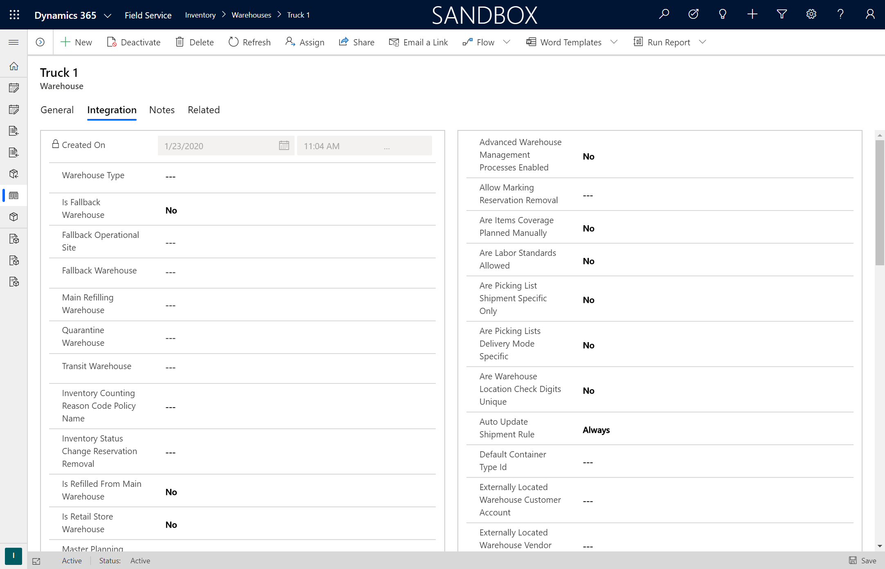
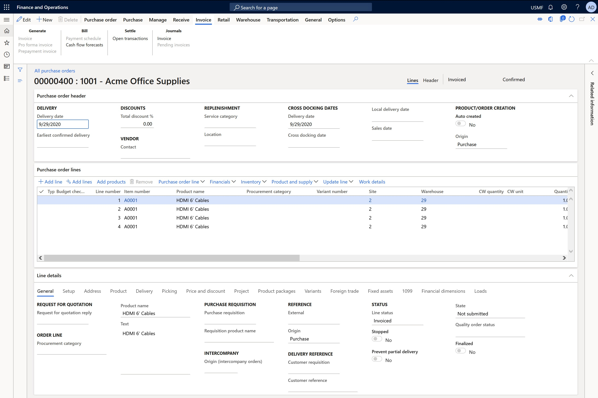
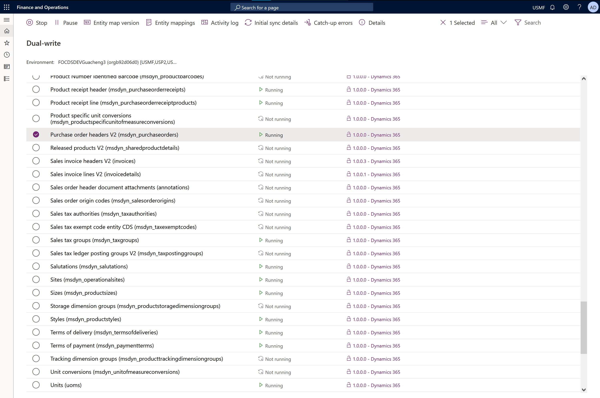
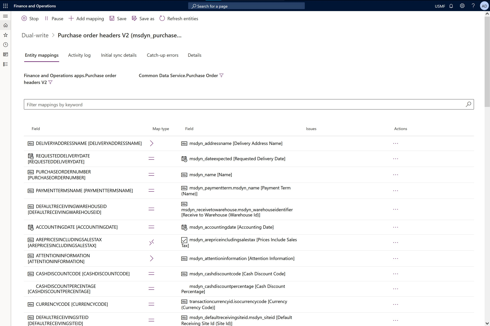
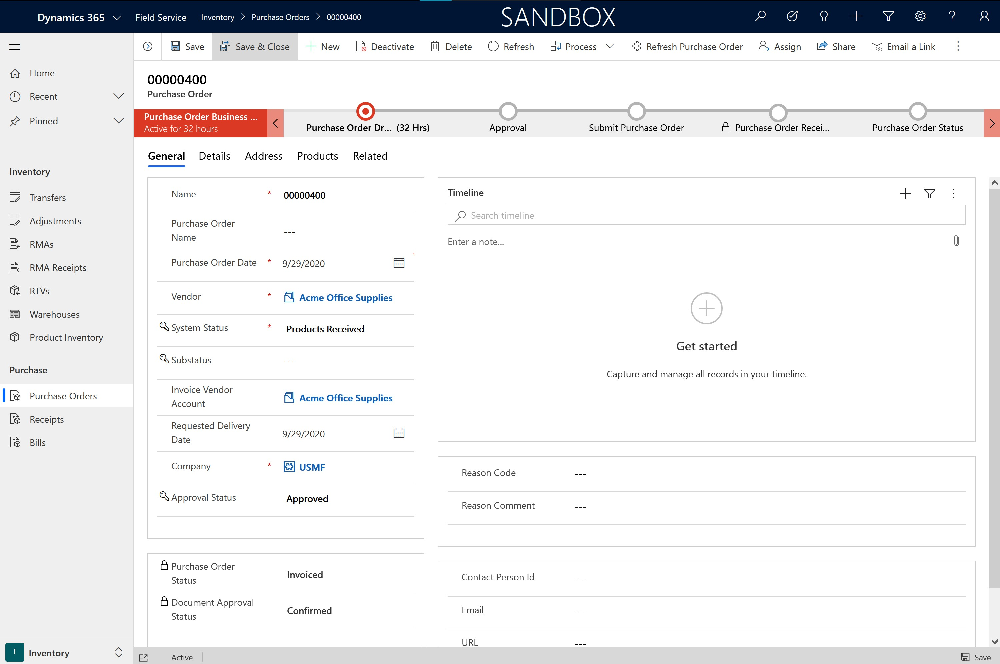

# Integrate Dynamics 365 Field Service and Supply Chain Management

While Dynamics 365 Field Service includes basic [inventory capabilities](./inventory-purchasing-returns-overview.md) for managing technician truck stock, tracking asset service history, requesting purchase orders, and documenting returns; many field service organizations still integrate Field Service with their Enterprise Resource Planning (ERP) systems. Organizations using the Microsoft Dynamics 365 stack will find it easy to integrate Dynamics 365 Field Service and [Dynamics 365 Supply Chain Management](https://docs.microsoft.com/dynamics365/supply-chain/) systems. 

Leveraging Common Data Model and Common Data Service in Dynamics 365, you can set up a synchronous two-way integration for the following entities, with more entities planned: 

- **Warehouse**
- **Customer Asset**
- **Customer Asset Category**
- **Payment Terms**
- **Ship Via**
- **Purchase Order**
- **Purchase Order Product**
- **Purchase Order Receiept**
- **Purchase Order Receiept Product**

Here are a few examples of how the integration is useful.

1. **Asset management**: When creating a work order for repair or maintenance on a customer asset, the integration will allow dispatchers to pick from a full list of customer assets, regardless of which system it was created in.
2. **Nearby warehouses**: Integration provides technicians with a complete list of nearby warehouses and relevant details.
3. **Purchase orders**: A purchase order is created in Supply Chain Management; then a technician documents receipt of the products in the Field Service app while onsite at the customer's location. 

## Prerequisites

- To view integrated data, you need the required license and security for one system. Only a few IT administrators will need access to both Dynamics 365 Field Service *and* Supply Chain Management. In other words, users only need a license for the interface in which they are accessing the data.

## How it works

The integration is made possible because Field Service is built on top of Common Data Service and [dual-write](https://powerapps.microsoft.com/blog/announcing-dual-write-preview/), which writes changes in Dynamics 365 Supply Chain Management to Common Data Service and vice versa.

After dual-write is enabled, a solution is imported into Field Service that adds the required fields to make the entities in each system integratable. 

For example, in Field Service, you'll see new fields added to the warehouse entity that are required in Supply Chain Management.

> [!div class="mx-imgBorder"]
> 

> [!div class="mx-imgBorder"]
> 

When a warehouse record is created or updated in either system, the change will show in the other system in near real time.

Business rules and validations in either system are respected in the other system. For example, imagine a warehouse can't be created in Supply Chain Management without a specific field value. When a user attempts to create the warehouse in Field Service, an error will appear based on the validation logic in Supply Chain Management.

## Purchase Orders

Here is an another example.

A purchase order is created in either system. In the following example, a purchase order was created in Supply Chain Management.

> [!div class="mx-imgBorder"]
> 

In dual-write, you can see the integration is running.

> [!div class="mx-imgBorder"]
> 

For each entity in the integration, the relevant fields are mapped to the other system. The following screenshot shows the mapping between purchase orders in Supply Chain Management and purchase orders in Field Service.

> [!div class="mx-imgBorder"]
> 

As the last part of the process, a purchase order is created in Field Service with relevant information from both systems. 

> [!div class="mx-imgBorder"]
> 

## Additional Notes

- Dual-write allows organizations to integrate Supply Chain Management with Common Data Service, even without Field Service. 

- The dual-write integration described in this article is separate and more robust than the previously released [prospect to cash](https://docs.microsoft.com/dynamics365/supply-chain/sales-marketing/prospect-to-cash) data integrator that is one-direction, batch, asynchronous, and does not respect business rules and validations. 

## See also

- [Overview of Dynamics 365 Field Service inventory capabilities](https://docs.microsoft.com/dynamics365/field-service/inventory-purchasing-returns-overview)

- [Customer assets in Dynamics 365 Field Service](https://docs.microsoft.com/dynamics365/field-service/configure-set-up-customer-assets)

- [Pricing in Dynamics 365 Field Service](https://docs.microsoft.com/dynamics365/field-service/create-price-list) 

