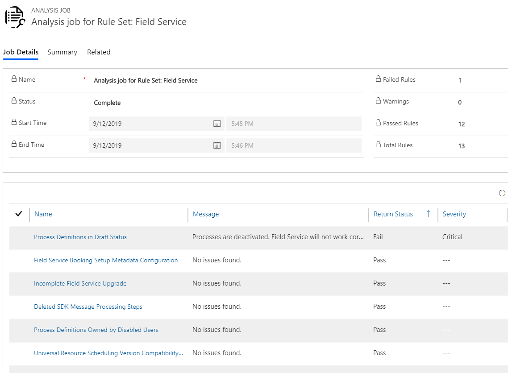

# Troubleshoot Field Service issues with Solution Health Hub

Solution Health Hub allows you to get a better picture of the state of your environment and detect issues with your Dynamics 365 environment. The Solution Health Hub runs rules within an instance to validate the environment's configuration, which might change over time through natural system operations. Some of the rules are specific to Dynamics 365 Field Service and you can run the rules on demand when you encounter an issue. Some rules automatically trigger when Field Service is installed or updated. Regularly run the Field Service ruleset to monitor the health of your environment.

Here are a few common issues the Solution Health Hub detects:

1. If critical Field Service processes are deactivated
2. If processes that will cause an upgrade to fail are assigned to disabled users 
3. Customized web resources that will later lead to runtime issues

## Prerequisites

- Field Service v8.4.0.338+ (UCI) or  v7.5.7.87+ (Web)
- The Solution Health Hub extends the [PowerApps checker](https://docs.microsoft.com/powerapps/maker/common-data-service/use-powerapps-checker) to ensure continued healthy operation of an environment. 

> [!Note]
> Currently, the ruleset uses 15 rules to verify the environment is in a good state. 

## Run a health check

To run an analysis job for Field Service:

1.	Open the Solution Health Hub app.

> [!div class="mx-imgBorder"]
> 

2.	Select **Analysis Jobs** and create a new analysis job.
3.	When the dialog box opens, select **Field Service**.
4.	Select **OK** and the analysis job will begin.

> [!div class="mx-imgBorder"]
> 

These are the rules currently included for Field Service:

| Rule name: | What it checks: |
| --- | --- | 
| Process Definitions in Draft Status	| Checks whether there are any process definitions in draft status. If there are processes in draft status, Field Service will not work correctly.| 
| Disabled SDK Message Processing Steps	| Checks whether there are any **SDKMessage Processing Steps** that are disabled. Disabled SDK message processing steps will lead to incorrect behavior when using Field Service.| 
| Missing Form Libraries	| Detects if there are any forms in the system that are referencing Field Service libraries without passing the required parameters.| 
| Process Definitions Owned by Disabled Users	| Checks whether there are any process definitions in the system that are assigned to users that are disabled. If that’s the case, upgrade will fail.
| Waiting Workflow Instances Owned by Disabled Users	| Detects waiting workflow instances that are assigned to disabled users. These will fail to correctly generate the records that they are supposed to generate.| 
| Customized Web Resources	| Detects which web resources have been customized by solutions that are not part of the Field Service package. This will lead to those web resources not being updated on upgrade and can lead to different functionality issues after upgrade.| 
| Field Service Booking Setup Metadata Configuration	| Checks that the Field Service Booking Setup Metadata record exists correctly in the system. If this record is missing, scheduling functionality might not work as expected.| 
| Universal Resource Scheduling Version Compatibility Check	| Verifies that the current installed version of Field Service is compatible with the version of Universal Resource Scheduling. | 
| Agreement Work Order Generation	| Verifies that all work orders that were supposed to be generated over the last 7 days were correctly generated by agreements.| 
| Field Service Settings	| Checks that the **Field Service Settings** record exists correctly in the system.| 
| Deleted SDK Message Processing Steps	| Verifies that there are no deleted SDK message processing steps.| 
| Deleted Processes	| Verifies that there are no deleted processes.| 
| Deleted Web Resources	| Checks whether there are any deleted webresources.| 
| Incomplete Field Service Upgrade	| Detects whether a Field Service upgrade has started but not successfully completed.| 
| Customizations on "Connected Field Service" app module	| Checks whether there are customizations to the Connected Field Service app module that is being deprecated and shouldn’t be customized.| 
| Customized Optionsets	| Detects whether any optionset in Field Service that is not supposed to be customized has been customized. Customizing option sets can lead to unexpected behavior.| 

## View health check results

Once you run the analysis job, you will be directed to the overview page, which will automatically refresh when the run has finished. See the following screenshot for an example overview of a run.

> [!div class="mx-imgBorder"]
> 

When running an analysis job, you will see a **Return Status** for each rule, which indicates whether the rule passed, failed, or there was a configuration error. Rules also return a severity if they are failing, which shows how severe each problem is. All possible return status outcomes are listed in the following table. 

| Rule return status | 	Recommendation|
| --- | --- |  
| Fail	| Highlight specific failures within the system; fix the rule as suggested.| 
| Warning	| Be aware of the implications mentioned in the rule message.| 
| Pass	| Indicates that there are no problems with this rule. All rules should be in this state.| 

### See also

- [Frequently asked questions](./troubleshoot-faq.md)
