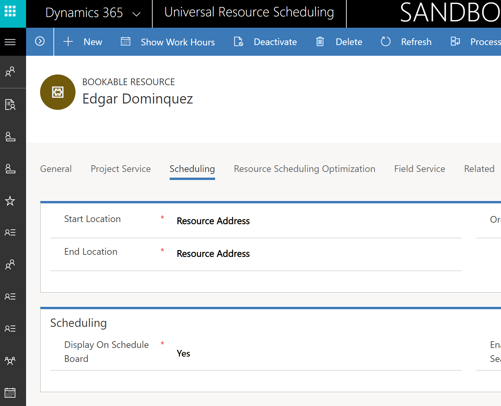
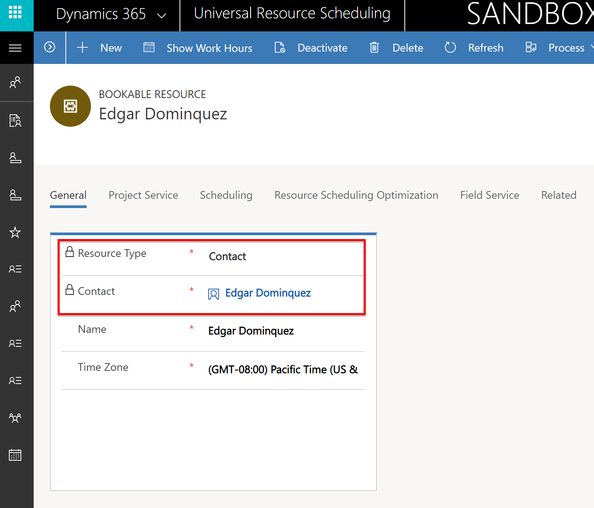

# Universal Resource Scheduling for Dynamics 365 Field Service overview

This article describes how Dynamics 365 Field Service uses [Universal Resource Scheduling](../common-scheduler/schedule-anything-with-universal-resource-scheduling.md).

Field service organizations most frequently use Universal Resource Scheduling to book field technicians for work orders. Because work orders are generally performed onsite, Universal Resource Scheduling helps reduce travel time and costs.

## Universal Resource Scheduling and Field Service work orders

When [installing Field Service](install-field-service.md), Universal Resource Scheduling gets added automatically.

Work orders and related entities are a part of Field Service and work seamlessly with resources and requirements of Universal Resource Scheduling.

In other words, Field Service defines **what** needs to be done and **where**, while Universal Resource Scheduling defines **who** can perform the work and **when**.

## Generate requirements from a work order

For every work order, the system creates a related requirement. It outlines the specific details for resources that can perform the work order. Requirements will be scheduled to resources and reference the work order.

By default, the system created one requirement for each work order. However, a work order can have multiple requirements or a requirement group with multiple requirements. [Create incident types to configure templates for work order](configure-incident-types.md).

Requirements inherit attributes from the work order, such as name, location, duration, and more. Updating work order attributes will update requirement attributes. Manual edits to requirements can be made before scheduling, too.

> [!CAUTION]
> Manually created requirements for work order don't synchronize automatically.

## Book a resource for a requirement
<!-- This section ideally links articles that explain the book options for FS. RSO should have its own article about booking -->
After a work order and related requirement are ready to be scheduled, Universal Resource Scheduling scheduling tools can be used to **book** the requirement to the most appropriate resource.

After a work order requirement is booked, a bookable resource booking record is created documenting the resource, travel time, and start/end time. The booking relates to both the work order and requirement.

 <!--
### Book from the work order

Selecting **Book** from the work order will trigger the Universal Resource Scheduling schedule assistant to match the related work order requirement with available resources.

> [!div class="mx-imgBorder"]
>  

### Book from the requirement

Like with work orders, the same booking experience can be triggered from the requirement entity, by selecting **Book** while on the requirement.

> [!div class="mx-imgBorder"]
>  

### Book from the schedule board

The lower schedule board pane displays requirement records and can be configured to show only requirements related to work orders with a view filter.

> [!div class="mx-imgBorder"]
>  

The requirement can be dragged and dropped onto a resource on the schedule board to schedule the work order. Alternatively, selecting  **find availability** on the requirement in the lower pane will trigger the schedule assistant, which recommends the most appropriate resources. 

### Book with Resource Scheduling Optimization

Resource Scheduling Optimization can automatically schedule work order requirements based on predefined schedules or triggers. You can also manually accomplish this by selecting the **Run Now** button.

> [!div class="mx-imgBorder"]
> 
-->

## Enable Universal Resource Scheduling for Field Service

There are a few things you'll need to configure to enable Universal Resource Scheduling for Field Service.

1. [Enable Resource scheduling](schedule-new-entity.md) for the *msdyn_workorder* entity.

1. [Enable location and map settings](field-service-maps-address-locations.md).

1. [Configure booking statuses](set-up-booking-statuses.md) to let field technicians communicate the progress of their work to stakeholders.

1. [Enable auto-geocoding](turn-on-auto-geocoding.md) to account for start and end location of resources.

  > [!TIP]
  > Work orders or requirements without location are treated as location-agnostic and the system doesn't consider the location during scheduling.
  
<!--
### Geo-locate resources

Work order locations are defined by the latitude / longitude of either the work order form, or the related service account. It's important to also geo-locate resources.

Navigate to **Resource Scheduling > Resources**.

To ensure resources can appear on the schedule board map, they must have a geocoded starting and ending location. 

There are **two ways** to geocode your resources.

#### Option one

Set resource start/end location to **Resource address** and ensure the related resource record (User, Account, Contact) as defined by the resource type has latitude and longitude values.

> [!div class="mx-imgBorder"]
> 

For example, in the following screenshot, the bookable resource has resource type = Contact; this means the related contact record must be geo-coded, meaning latitude and longitude fields must have values. 

> [!div class="mx-imgBorder"]
> 

> [!NOTE]
> 

#### Option two

Set resource start/end location to **Organizational Unit Address** and ensure the related organizational unit record is geo-coded, meaning latitude and longitude fields must have values.

> [!div class="mx-imgBorder"]
> 

> [!NOTE] 
> You may need to add the latitude/longitude fields to the organizational unit entity form.

#### Confirm geocoding works appropriately

To make sure resources are geocoded properly, navigate to **Universal Resource Scheduling** > **Schedule Board**. The resource should appear on the map. Select a resource's name to highlight their location pin on the map.

> [!div class="mx-imgBorder"]
> 

## Additional notes

If the work order or requirement doesn't have a latitude or longitude, the location is treated as location-agnostic, which means the location of resources isn't considered during scheduling. If the work order or requirement has a latitude and longitude and work location is set to **onsite**, resource locations, travel time, and routes are considered during scheduling. -->

## Next steps

- [Use and configure the schedule board in Dynamics 365 Field Service](configure-schedule-board.md)

[!INCLUDE[footer-include](../includes/footer-banner.md)]
