# Entitlements for Work Orders

Entitlements for work orders allow a field service organization to dynamically apply price lists and discounts to work order products and services based on work order attributes and date range factors. This is achieved through the same process and entities an organization would offer case entitlements in Dynamics 365 for Customer Service.

Entitlements can be applied to work orders based on:

- Billing account
- Service account
- Specific products and services
- Specific customer assets
- Customer asset categories
- Incident types

Let's explore entitlements for work orders with two scenarios: 

> **Scenario 1:** An organization would like to offer a customer a 10% discount for two years on all work order products and services based on a preset price list. 

> **Scenario 2:** An organization would like to offer a customer free work order products and services for two years for work orders that relate to customer assets of a specified category.

## Prerequisites
Field Service v8.4+

Dynamics 365 for Customer Service  

Knowledge of Dynamics 365 [price lists](https://docs.microsoft.com/en-us/dynamics365/customer-engagement/sales-enterprise/create-price-lists-price-list-items-define-pricing-products) is recommended

## Scenario 1: Entitlement for price list and discount

An organization would like to offer a customer a 10% discount for two years on all work order products and services based on a preset price list. 

### Step 1: Create a price list and add a product 

To create an entitlement that adds a price list and a discount to work order products and services, you must first have a price list with associated products.

Go to **Field Service > Settings > Price Lists** and create a new price list.

Then add the products and services as price list items with the related prices.

> [!div class="mx-imgBorder"]
> 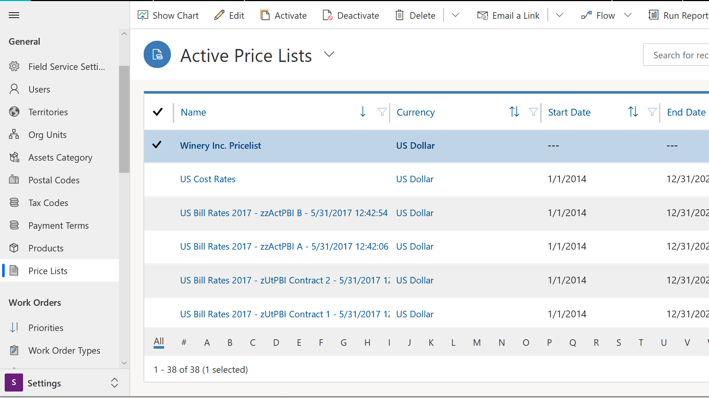

> [!div class="mx-imgBorder"]
> 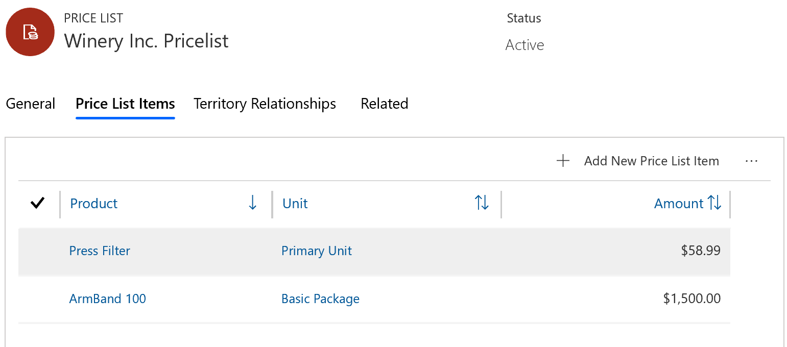

**Pro Tip #1:** Products and services are both added in the product entity, simply use the **Field Service Product Type** to distinguish them, using **Inventory** and **Non-inventory** options for products, and the **Service** option for Services. 

**Pro Tip #2:** Enter a list price for the product record that is used if the product does not belong to a price list or if it does not belong to the price entered on the work order.

> [!div class="mx-imgBorder"]
> 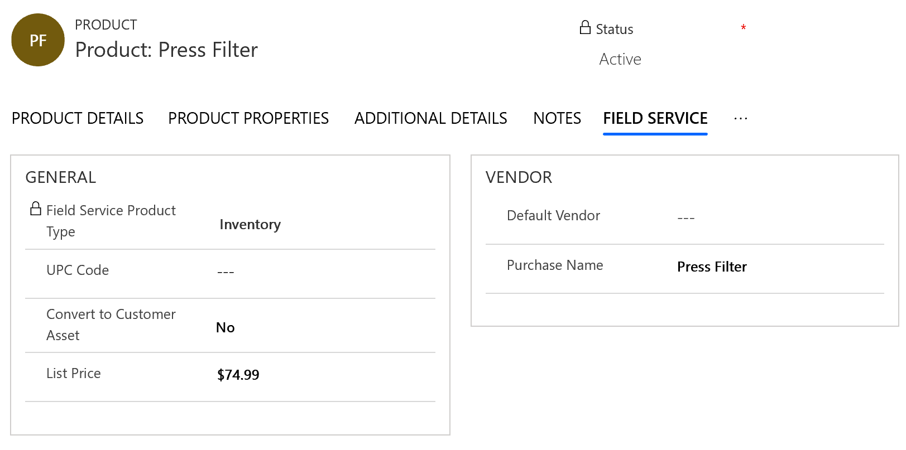

### Step 2: Create an entitlement

Go to **Field Service > Settings > Entitlement** and create a new entitlement.

> [!div class="mx-imgBorder"]
> 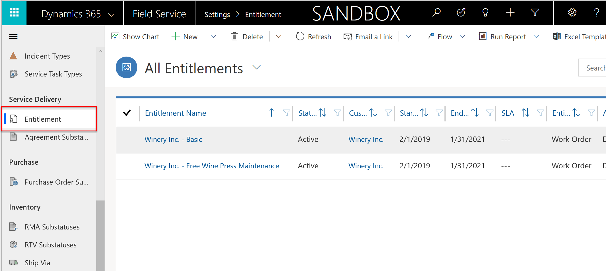

**Primary Customer:** Choose the account this entitlement will apply to. If the account chosen here is later listed as the billing account of a work order then this entitlement can be eligible. An entitlement can only apply to one customer, however a billing account can be related to multiple service accounts, so work orders for multiple locations can have entitlements applied to all of them as long as the billing account is the same.

**Start/End Date:** choose the date range this entitlement is valid for, if a valid work order is created within this range the entitlement will be applied.

**Entity Type:** Select Work Order.

**Allocation Type:** Select Discount % and Price List. This is currently the only option available and more will appear as the feature develops.

**Applies to:** Select Both Work Order Products & Services for this scenario. It is possible to have an entitlement only apply to either products or services.

**Price List to Apply:** Select the price list that you want applied to the work order product and service when the entitlement is applied.

**% Discount:** Enter a number that represents the percent the price of the work order product or service should be discounted. If a Price List is applied, and the product or service is part of the price list, this value will discount the price list price. If it is not part of the price list, this value will discount the list price on the product record.

**Entitlement Prioritization:** If applicable enter a number to represent the priority of this entitlement for instances when multiple entitlements apply to a single work order product or service. Entering "1" represents the highest priority. See more details in the **Entitlement conflicts** section of this article.

**Save** and **Activate** the entitlement.

> [!div class="mx-imgBorder"]
> 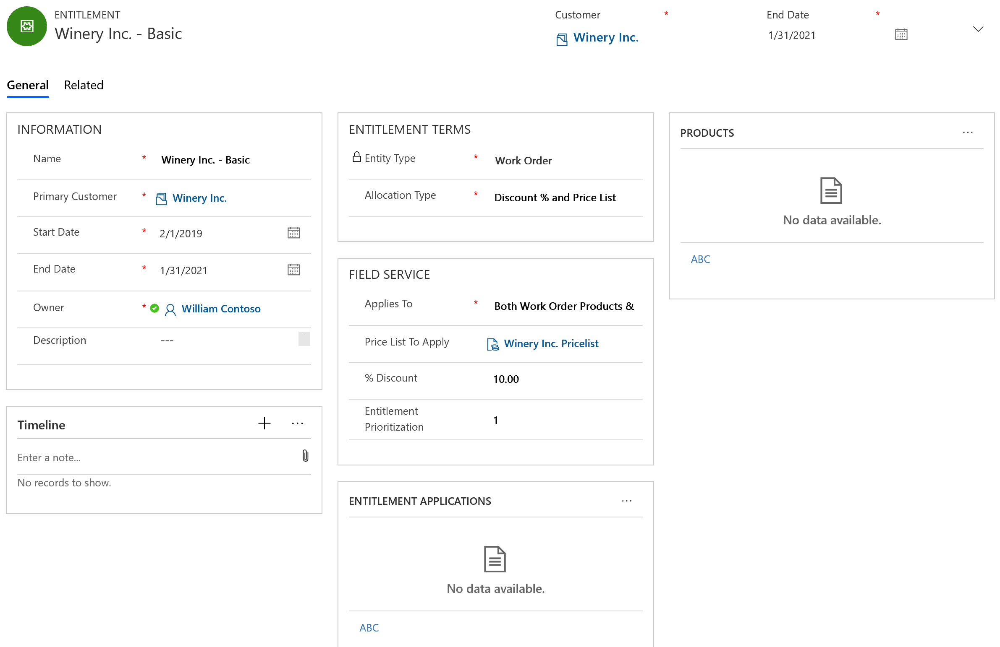

### Step 3: Create a work order and add work order products and services

Next create a work order the entitlement you just created will apply to.

In the image below is a work order with a billing account that is the same as the primary customer of the entitlement. This triggers the entitlement to apply to this work order.

> [!div class="mx-imgBorder"]
> 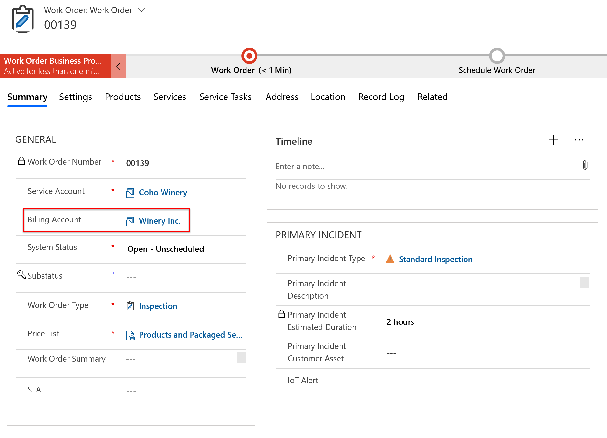

Select the products tab to view work order products. Products are typically added to work orders automatically by from work order incidents or manually. However the work order products are added, the entitlement will apply.

> [!div class="mx-imgBorder"]
> 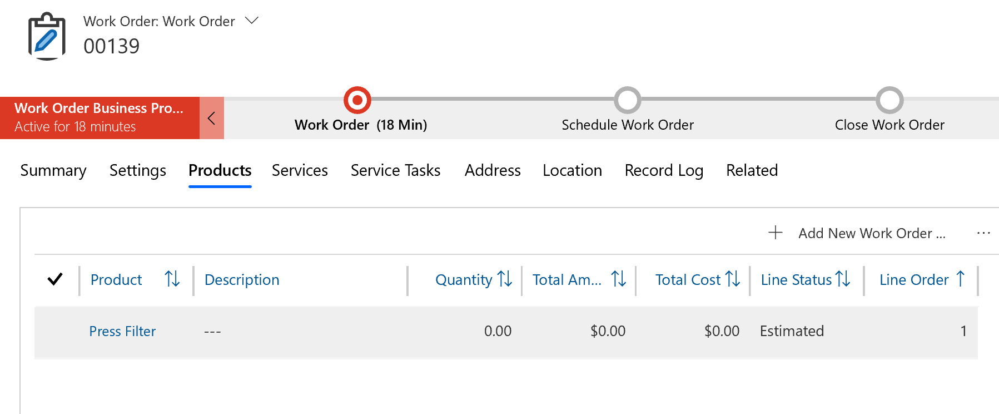

In the Other tab of the work order product, the entitlement is automatically chosen. This means the price list chosen on the entitlement is added to the work order product as well, even if this differs from the price list on the work order. 

> [!div class="mx-imgBorder"]
> 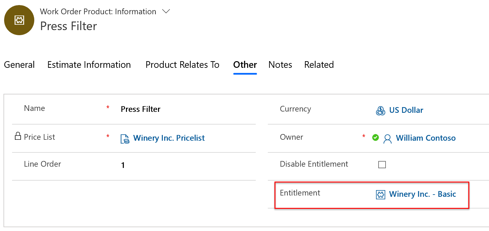

> [!Note]
> The work order price list applies to work order products and services by default but an entitlement will override this and apply directly to the work order products and services. 

The discount percentage is also applied because of the entitlement and this edits the estimate total amount. If the work order line status is changed from Estimated to Used, this is the price that will be billed to the customer.

> [!div class="mx-imgBorder"]
> 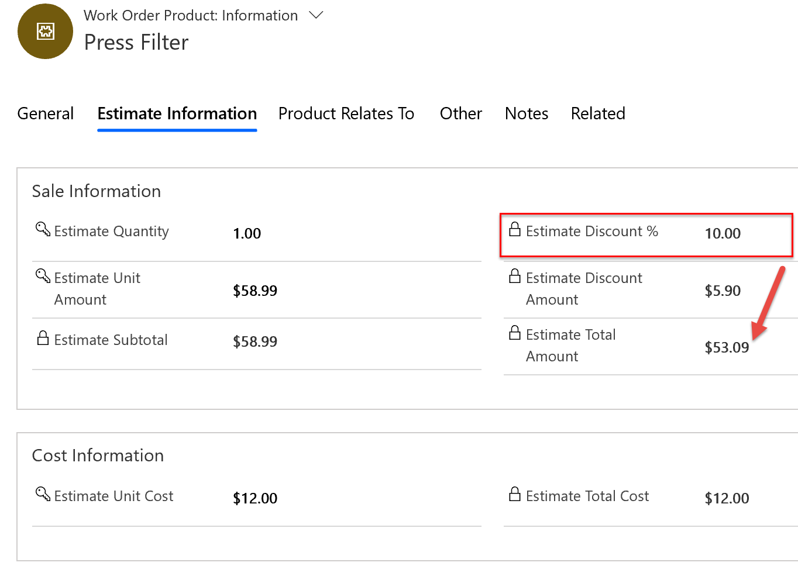

## Scenario 2: Entitlement for free products and services for an asset category

An organization would like to offer a customer free work order products and services for two years for work orders that relate to customer assets of a specified category.

### Step 1: Create an entitlement

Go to entitlements and create a new one.

This entitlement is similar to the previous one however the **% Discount** is set to 100% to make the work order products and services free when the entitlement is applied.

> [!div class="mx-imgBorder"]
> 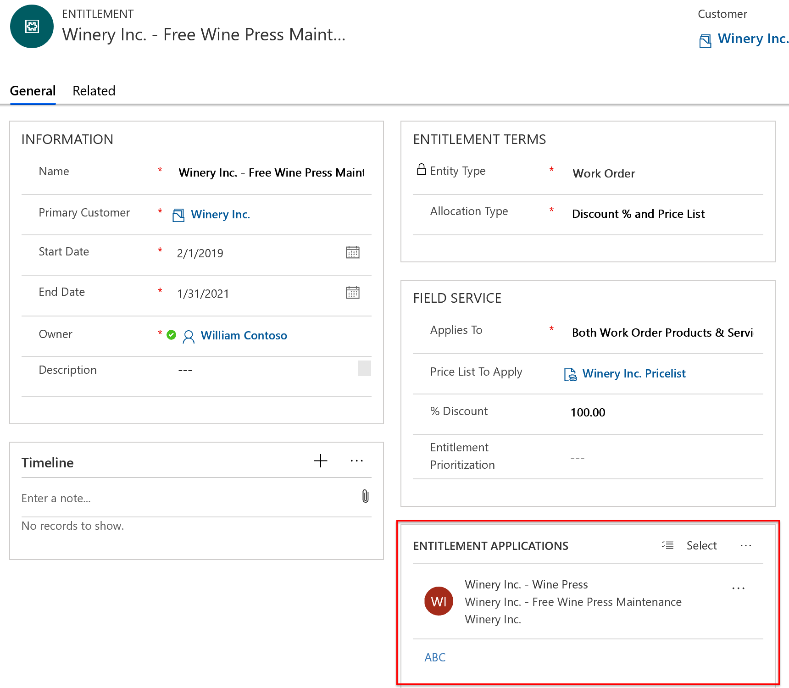

From the entitlement, create a new entitlement application to add more details to when the entitlement should be applied.

Given the primary customer of the entitlement matches the billing account on the work order, entitlement applications allow you to add more constraints to when an entitlement should apply to work order products and services.

> [!Note]
> Entitlement Applications work in addition to the primary customer value, not in replacement of. As an example, if the service account of an entitlement application matches a work order service account, but the billing account does not match the primary customer, then the entitlement will not be applied. 

In the example below, if a work order product or service is related to a customer asset, AND the customer asset belongs to the Wine Press Asset Category, then the entitlement is applicable. 

> [!div class="mx-imgBorder"]
> 

Other applications are:

> **Service Account:** if the service account here matches the work order service account then the entitlement will be applied to all work order products and services.

> **Customer Asset:** if the customer asset value here matches the customer asset on the work order product or service then the entitlement will be applied to that work order product or service.

> **Incident Type:** if the incident type here matches the work order incident type on the work order product or service then the entitlement will be applied to that work order product or service. Basically this means products and services added from the incident type entered here will have the entitlement.

> [!Note]
> Entitlement applications use AND logic. This means if you specify a service account and an incident type then both need to be present on the work order to apply.

### Step 2: Create a customer asset 

Next create a customer asset. In the image below is a customer asset that has a category equal to Wine Press that was noted on the entitlement application. 

> [!div class="mx-imgBorder"]
> 

### Step 3: Create a work order to service the customer asset

Next create a work order that matches the entitlement for the second scenario. In the example below the billing account matches the primary customer. The primary incident customer asset lists an asset that belongs to the Wine Press category. 

> [!div class="mx-imgBorder"]
> 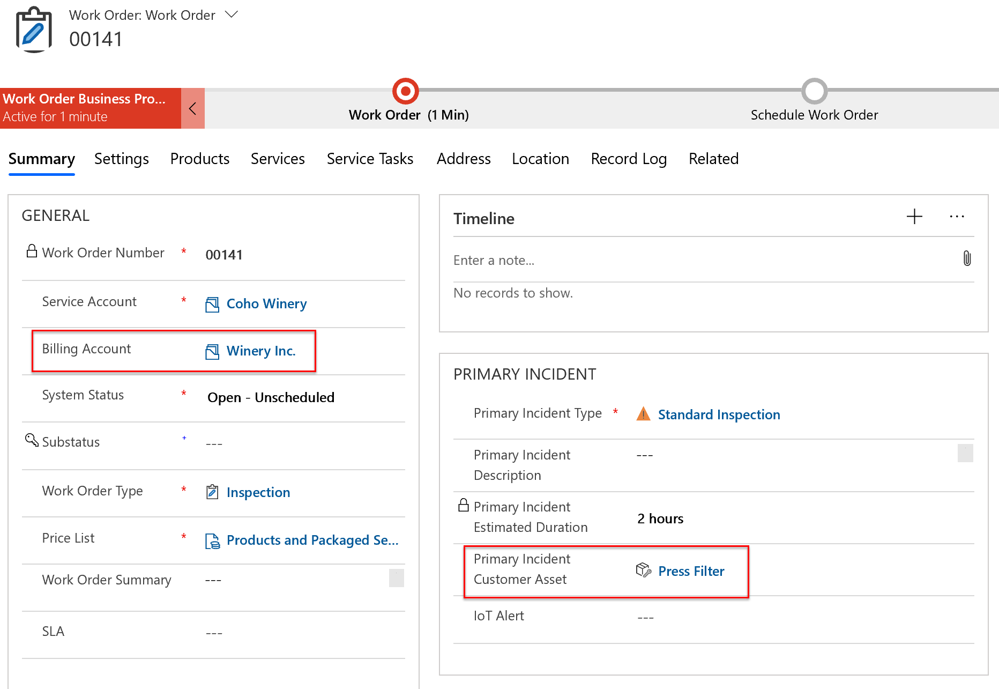

The correct entitlement is applied to the work order products.

> [!div class="mx-imgBorder"]
> 

Products and services added from the Standard Inspection incident type are related to the Press Filter customer asset.

> [!div class="mx-imgBorder"]
> 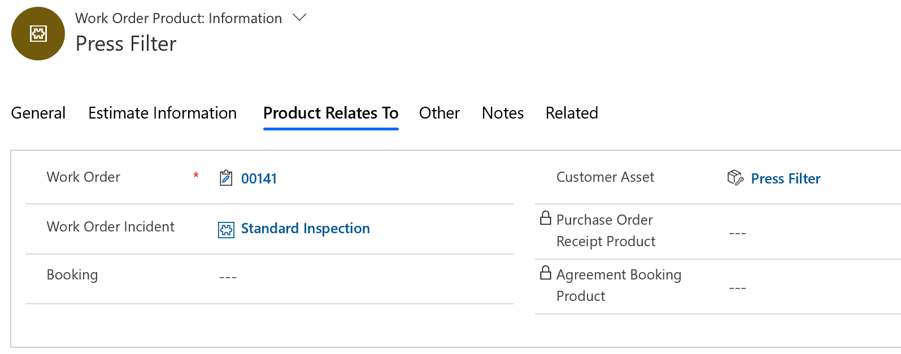

Finally, the 100% discount is applied rendering the work order products as free.
> [!div class="mx-imgBorder"]
> 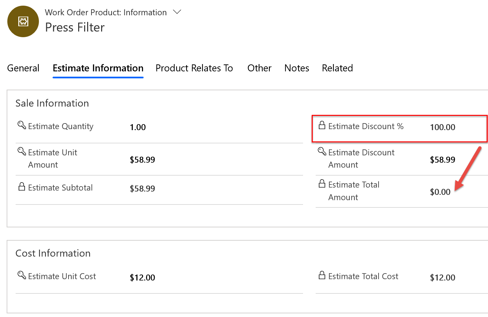

The same entitlement effects apply to work order services as well.
> [!div class="mx-imgBorder"]
> 

## Entitlement conflicts 

It possible for multiple entitlements to apply to a single work order product or service. This is because entitlements can be applied based on different work order and work order product and service attributes that can all be present. As an example, in the first scenario an entitlement applied based on the work order billing account, and in the second scenario an entitlement applied based on the customer asset category. 

In such cases, all applicable entitlements will show as options in the entitlement lookup field.

> [!div class="mx-imgBorder"]
> 

However one entitlement will be selected by default, first by the **Entitlement Prioritization** value and second by the specificity.

The system will look at the entitlement prioritization values of all applicable entitlements and select the one with the highest priority (1 being the highest priority). Any priority value is greater than a blank priority value.

If no priority values exists or priority values are equal, the system will select the most specific entitlement. 

Using our examples above, the second scenario entitlement is applicable based on the billing account and the customer asset category, whereas the first scenario entitlement is applicable based only on the billing account. In this case, the second scenario entitlement is more specific as it is based on two factors and was chosen.

Even if multiple entitlements apply and one is chosen by default, the user can manually override or disable an entitlement.

## Configuration considerations

- **Applying different discounts** - In the scenario where you may want to apply a 10% discount on products and a 20% discount on services, this would require two entitlements.
- If the work order service account matches the primary customer of the entitlement and the billing account does not, the entitlement will not be applied. 
- **Applying entitlements to specific products or services** - By adding products and services to the products subgrid in an entitlement will apply the entitlement when the product or service matches the work order product or service.

> [!div class="mx-imgBorder"]
> 

## Additional Notes
- Entitlements cannot change the cost of a product or service, only the price. 
- For simpler scenarios, administrators should consider using the relationship between work order types, incident types, and price lists. Selecting an incident type can populate a work order type, and populating a work order type can populate a price list on the work order. This is configured during the incident type and work order type setup. In addition, adding a price list to a work order will populate the price lists on work order products and services by default. 

- what if entitlement is edited?
  - why is this needed, why cant i just add special price lists?
  - currently unsupported scenarios
    -  examples warranty (currently not supported)
    - quantity based and limit based - limited number of work orders (currently not supported)
    - what if product is not part of price list?
