Universal Resource Scheduling (URS) enables organizations to schedule interactions between customers and company resources. For scenarios where the customer is expected to travel to the company's location, the facility scheduling feature can coordinate physical spaces and related resources.

Typical examples include:

**Reserving a physical space**

- Reserve a room for an event or party
- Reserve a room for an exercise class
- Reserve a bay at a mechanic shop
- Reserve a boat

**Reserving an appointment with a person at a facility**

- Laptop repair at a Microsoft retail store
- Wealth management consultation at bank branch
- Doctor's office with related nurse and doctor

In this topic, we'll explore a few example scenarios using facility scheduling, and describe how it's used in each. 

## Prerequisites

- Universal Resource Scheduling (URS) v3.0
- Field Service v8.0 (for work orders, if applicable) 

In general, to use facility scheduling, an administrator must create a facility resource (with or without additional related resources), configure a requirement that calls for facility resources, book the requirement, and view facility resources and booking(s) on the schedule board.

Let's consider five scenarios to describe facility scheduling: 

1. Schedule a facility
2. Schedule a facility with 5 generic rooms 
3. Schedule a facility and related resource
4. Schedule a facility with 5 specific rooms
5. Schedule a facility with 5 specific rooms and 5 related resources

## Scenario 1: Schedule a facility  

In this scenario, schedulers want to search for nearby doctors' offices and schedule an appointment for a patient to arrive at the doctor's office. 

We will configure this scenario by creating a facility resource to represent the doctor's office, creating a requirement to represent the patient's request for an appointment at a nearby facility, and then booking the appointment and viewing the facility and booking on the schedule board. 

### 1. Create a facility resource

First, navigate to **Universal Resource Scheduling > Resources** and create a facility resource with the following attributes.

> [!div class="mx-imgBorder"]
> 

1. **Resource Type** = Facility
2. **Start/end location** = Organizational Unit Address 
   1. Since a facility represents a physical space, the fields "start location" and "end location" must be set to Organizational Unit Address. 
   2. The parent organizational unit **must have a latitude and longitude** that represents the location of the facility. This allows the schedule assistant to consider the Facility’s location when displaying available results. 
3. **Display on Schedule Board** = Yes
4. **Enable for Availability Search** = Yes
5. (Optional) Enter working hours
6. (Optional) Add related characteristics, territory, resource roles, etc. to distinguish facility resources from other facilities and resources.  For example, if a doctor's office has X-ray equipment, "X-Ray" can be added as a characteristic to the facility resource. This can influence which facility resources are filtered and displayed on the schedule board or which facility resources are returned during a schedule assistant search. 

> [!div class="mx-imgBorder"]
> 

### 2. Create a requirement for a facility 

Next, create a requirement that calls for a facility resource.

Navigate to **Universal Resource Scheduling > Requirement Groups > +New**. Configure the following fields.

  1. Enter a **Name**
  2. Enter **From** and **To** dates
  3. Set a **Duration**

> [!div class="mx-imgBorder"]
> 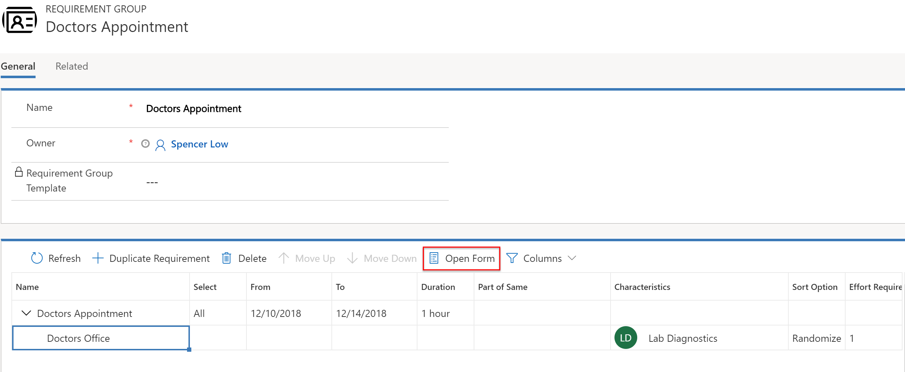

  4. Highlight the requirement and select **Open Form**, then set the **Resource Type** field to **Facility**, which accomplishes the following:
     1. It filters schedule assistant results by only showing resources with the chosen types (User, Account, Contact, Equipment, Pool, Crew, or in this case, **Facility**).
     2. This means the requirement requires a facility resource to be fulfilled and ensures the schedule assistant search results return facility type resources (as opposed to personnel or equipment).
     3. It maps to the resource type field on the resource entity.
     4. Note that if this field is left empty, all resources are searched.

> [!div class="mx-imgBorder"]
> 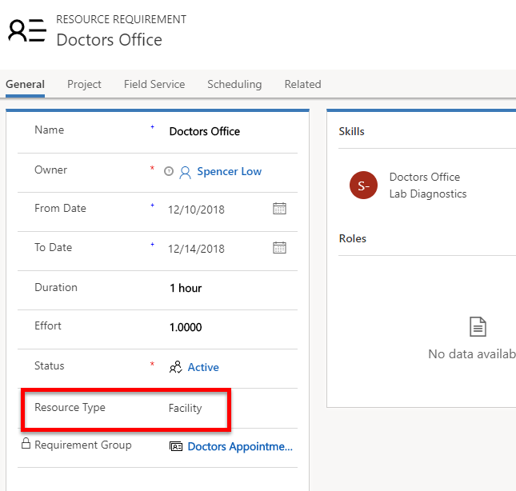

  5. Set **Work Location** to **Facility**, which means:
     1. The interaction will take place at the scheduled facility and factors into travel time and distance calculations. Find more details in the configuration considerations section of this article.
  6. Enter **latitude and longitude**. 
     1. These values are typically entered manually or through workflows.
     2. These values represent the customer's location and are used to display facilities relative to the customer's location in schedule assistant results. This is not the facility's location, as that is taken from the organizational unit of the facility type resource.  

> [!div class="mx-imgBorder"]
> 

### 3. Book the requirement 

After creating a facility resource and a requirement that calls for a facility, you can schedule the facility. Requirements that are part of a group can be scheduled via the **Book** button to trigger the schedule assistant, but not through drag and drop. Facility requirements not part of a group (single requirements) can be manually dragged and dropped to a facility on the schedule board or by using the schedule assistant.

The schedule assistant considers availability of resources as well as other set requirement constraints, such as characteristics, organizational units, categories, etc.

Select **Book** from the requirement or requirement group form, as seen in the following screenshot.

> [!div class="mx-imgBorder"]
> 

**Facility travel time and distance** calculations in the preceding schedule assistant example represent the time and distance between the facility resource (as defined by the location of the related organizational unit) and the customer's location (as defined by the latitude and longitude values on the requirement). The schedule assistant's radius filter filters based on this travel calculation.

> [!div class="mx-imgBorder"]
> 

**Filtering work location to location agnostic** will remove travel time and distance calculations from schedule assistant results. 

### 4. Add the facility resource to the schedule board

Scheduling a facility is just like scheduling any other resource. You can drag and drop requirements to create bookings; you can drag existing bookings to change the time or resource; or you can use the schedule assistant to help sift through the list of facilities based on availability and other constraints.

To view facility resources on the schedule board, filter by resource type and/or organizational units.

> [!div class="mx-imgBorder"]
> 

Facility resources will also be displayed on the schedule board map based on the location of the related organizational unit.

> [!div class="mx-imgBorder"]
> 

## Scenario 2: Schedule a facility with 5 generic rooms

In this scenario, a doctor's office has 5 identical rooms and schedulers don't need to book each room specifically. They must, however, ensure that no more than 5 patients are booked across all rooms during any one time slot.

We will configure this scenario by adding a **capacity** to a facility resource.

### 1. Create a facility resource

See scenario 1 in this article to create a facility resource, or select an existing facility resource record.

From the facility resource record, select **Show Work Hours** in the top ribbon.

### 2. Set the capacity of the facility resource

When choosing hours, select **Show Capacity** and enter **5**. By default, the capacity is set to 1.

> [!div class="mx-imgBorder"]
> 

Setting the capacity to 5 means that when booking a facility with the schedule assistant, the facility resource will show as available and can be double-booked up to the capacity limit (in this case, 5 times).  

> [!div class="mx-imgBorder"]
> 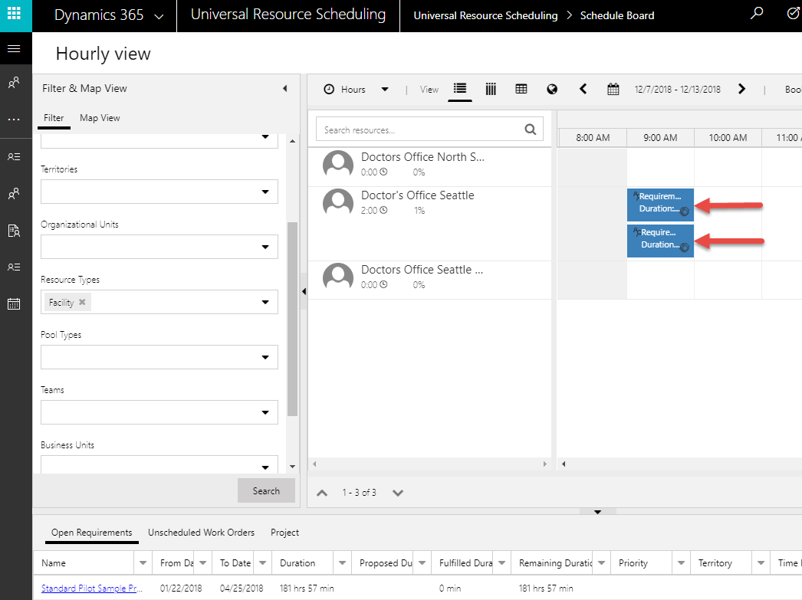

In the preceding screenshot, two separate requirements for a facility were both scheduled to the same facility during the same time slot. Without increasing the capacity, once a timeslot at a facility is booked, it will no longer show in schedule assistant results. 

> [!Note]
> Capacity scheduling is not intended for booking the same requirement multiple times, but rather to book multiple requirements. Rebooking a previously booked requirement will cancel the existing booking and create a new one.

## Scenario 3: Schedule a facility and related resource

In this scenario, schedulers want to schedule a doctor's office and a related doctor at the same facility during the same timeslot.

This scenario is configured by creating a facility resource, creating a doctor resource (a resource with resource type = user/contact/account), associating the doctor resource to the facility resource, and then creating a requirement group that calls for both a facility and a doctor.

In order to schedule groups of resources to perform a task together at a facility, non-facility resources can be associated to facility/facility pool resources through the **Resource Associations entity (msdyn_bookableresourceassociations)**. 

Resources such as people, equipment, or pool resources may be associated to a facility or facility pool with date effectivity. This means resources will perform work at the facility location during the expressed date range, and they are not eligible for “onsite” work for which they would have to leave the facility and travel to a customer's location. This is extremely important as it relates to using the option **Same Resource Tree**.

### 1. Create a facility resource

First, create a resource to represent the doctor's office. The resource type should be set to **Facility**. The following screenshot shows an example of a facility resource.

> [!div class="mx-imgBorder"]
> 

### 2. Create a doctor resource

Create a resource to represent a doctor. Set the resource type to **User, Account, or Contact**, based on your business needs. 

> [!Note]
> The user resource type is typically designated for employees who access Dynamics 365 data; contact and account resource types are typically for contractors who need to be scheduled but don't access data.

Start/end location should be set to **Organizational Unit Address** and the organizational unit should be set to the same organizational unit of the facility resource (in this case, the doctor's office). This is **recommended but not required**.

### 3. Associate the doctor resource to the facility resource

From the facility resource, navigate to **Related > Bookable Resource Association (Resource 2)**. This related entity is called Resource Associations (**msdyn_bookableresourceassociations**).

From here, associate the resource that represents the doctor. 

In the following screenshot, Abraham McCormick represents a doctor and is associated to "Doctors Office North Seattle," which represents the doctor's office.

> [!div class="mx-imgBorder"]
> 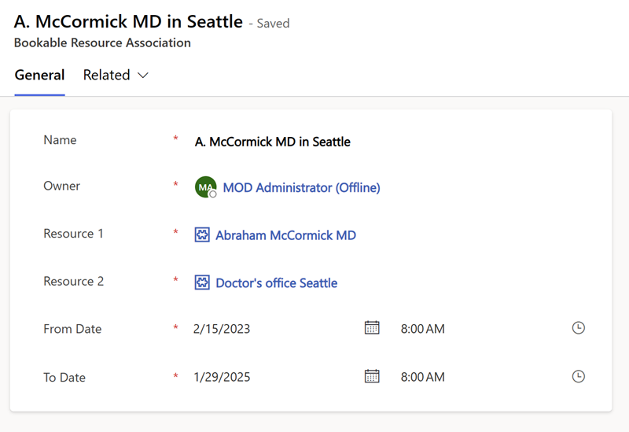

### 4. Create a requirement group 

Next, create a requirement group with one requirement that calls for a doctor's office (Resource Type = Facility), and another requirement that calls for a doctor (Resource Type = User/Contact/Account).

> [!div class="mx-imgBorder"]
> 

Set the **Work Location** on each requirement to **Facility**, indicating the work will take place at the doctor's office.
 
> [!Note]
> Using the **Select > All** option in the requirement group means that both requirements need to be fulfilled.

> [!div class="mx-imgBorder"]
> 

Set **Part of Same** to **Resource Tree**. This ensures resources from different locations are not recommended for work taking place at a facility. As an example, a doctor associated with Facility B should not be paired with Facility A. Find more details about this setting in the configuration considerations section of this article. 

> [!div class="mx-imgBorder"]
> 

Scheduling the requirement group creates a booking for the facility resource and the doctor resource.

> [!div class="mx-imgBorder"]
> 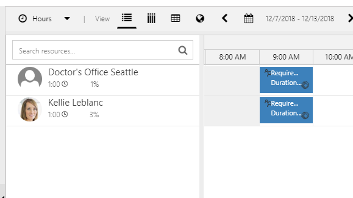

> [!Note]
> As in scenario 1, travel time and distance are calculated as the time and distance for the customer to travel to the facility. There is no travel calculation considered for the doctor resource, as it's assumed he/she will be at the facility at the required time.

## Scenario 4: Schedule a facility with 5 specific rooms

In this scenario, schedulers want to track all rooms within a doctor's office and schedule each individual room to patients.

This scenario is configured by creating a pool of facilities to represent the doctor's office and each individual room.

 
### 1. Create a facility pool resource 

First, create a resource to represent the overall doctor's office where **Resource Type = Pool** and **Pool Type = Facility**.

In this example, we call it "Health Clinic," as seen in the following screenshot.

> [!div class="mx-imgBorder"]
> 

### 2. Create facility resources to represent each room

Next, create multiple facility resources to represent each room.

Set **Resource Type** to **Facility** on each resource.

Set the **Start/End Location** to **Organizational Unit Address** and select an organizational unit to represent the location of the rooms.  

> [!div class="mx-imgBorder"]
> 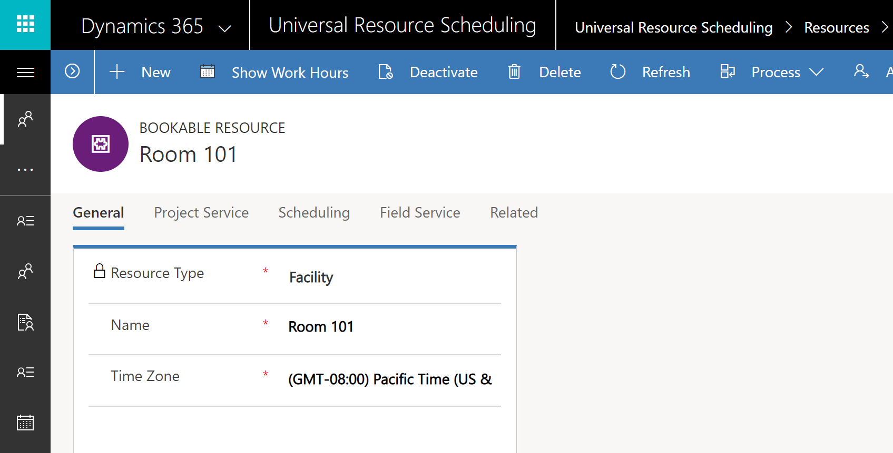

### 3.  Add each room resource as a child resource to the doctor's office resource pool

Navigate to the doctor's office facility pool resource, and go to **Related > Resource Children**.

Add each room resource as a child record to the parent facility pool (health clinic), as seen in the following screenshot.

> [!div class="mx-imgBorder"]
> 

### 4. Create a requirement group

Create a requirement that calls for one or more facilities. In this example, we're looking for 2 specific rooms within the same doctor's office (health clinic). 

Set **Part of Same** to **Same Location** to ensure each room is at the same physical address. 

> [!div class="mx-imgBorder"]
> 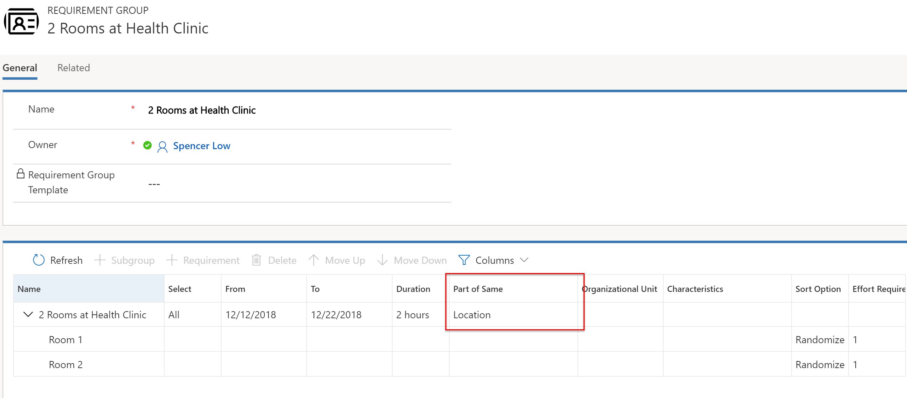

Each requirement should call for facility resource types, as seen in the following screenshot.

> [!div class="mx-imgBorder"]
> 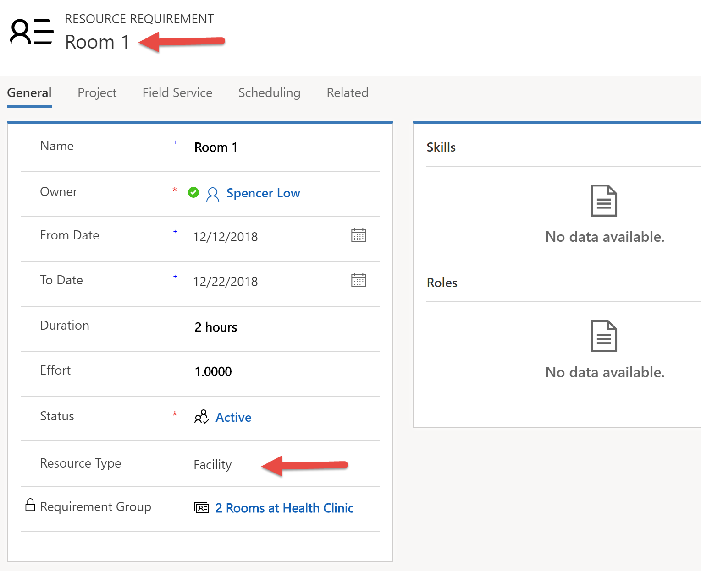

Again, the **Work Location** of each requirement should be set to **Facility** and the latitude and longitude fields of the requirements should correspond to the customer's (or patient's) location. 

> [!Note]
> Latitude and longitude fields on all requirements within a group must be equal; updating the values on one requirement will update the others.

### 5. Book the requirement group
Select **Book** from the requirement group to trigger the schedule assistant.

> [!div class="mx-imgBorder"]
> 

In the preceding screenshot's results, two specific rooms are recommended at the same location. The travel time and distance is calculated from the customer's location (latitude and longitude values on the requirement records) and the location of the facility resources (resource children organizational units). 

## Scenario 5: Schedule a facility with 5 specific rooms and 5 related resources

In this scenario, schedulers want to schedule specific rooms within a doctor's office to a pool of available pediatric doctors who work at the health clinic.

This scenario is configured by creating a pool of facilities and a pool of doctors, and associating them together with **Resource Associations** (**msdyn_bookableresourceassociations**).

### 1. Create a facility pool 
 
Using the same process we used in scenario 4, create a facility pool resource to represent the doctor's office. 

> [!div class="mx-imgBorder"]
> 

### 2. Create facility resources for each room

Next, create facility resources to represent each room in the doctor's office facility pool.

Then add each room as a resource child to the doctor's office (health clinic) facility pool resource. The organizational unit of the office facility pool and the room facilities should be the same.

> [!div class="mx-imgBorder"]
> 

### 3. Create a pool of pediatric doctors
 
Create a new resource pool to represent the pediatric doctors. 
 
Set **Resource Type** to **Pool** and set **Pool Type** to **Contacts, Users, Accounts**, as doctors are personnel.

As is true of all resource records, you can add characteristics to define and distinguish differences among resources. In this example, "pediatrics" could be a skill to add to a doctor resource.

Set **Derive Capacity from Group Members** to **Yes**. This means the capacity of the pool is based on how many doctors are associated to it.

> [!div class="mx-imgBorder"]
> 

Create resources to represent doctors and add them as resource children to the pediatric doctors pool.

> [!div class="mx-imgBorder"]
> 

### 5. Associate doctor pool to facility pool

Next, navigate to the original facility pool (health clinic), and go to **Related > Bookable Resource Association**.

Set the **Resource 2** field to the pediatric doctor pool resource, as seen in the following screenshot.

> [!div class="mx-imgBorder"]
> 

### 6. Create a requirement group for rooms and doctors
 
Navigate to **Universal Resource Scheduling > Requirement Groups > +New**.

In this example, we created a requirement group that calls for two rooms (facilities) and a pediatric doctor.

Setting **Part of Same** to **Resource Tree** ensures rooms and pediatricians are related to same facility resource through resource children or resource association.

For each room requirement, set the resource type to facility.

> [!div class="mx-imgBorder"]
> 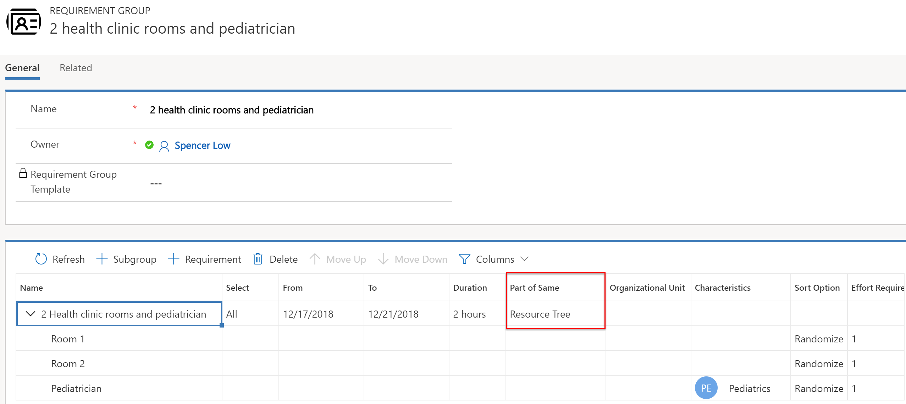

The resource types you choose for the pediatrician doctor requirement will affect schedule assistant results.

**On the requirement, if Resource Type = Pool and Pool Type =  Users, Accounts, Contacts**, the pediatrician pool resource will be displayed in the results, as seen in the following screenshot.

> [!div class="mx-imgBorder"]
> 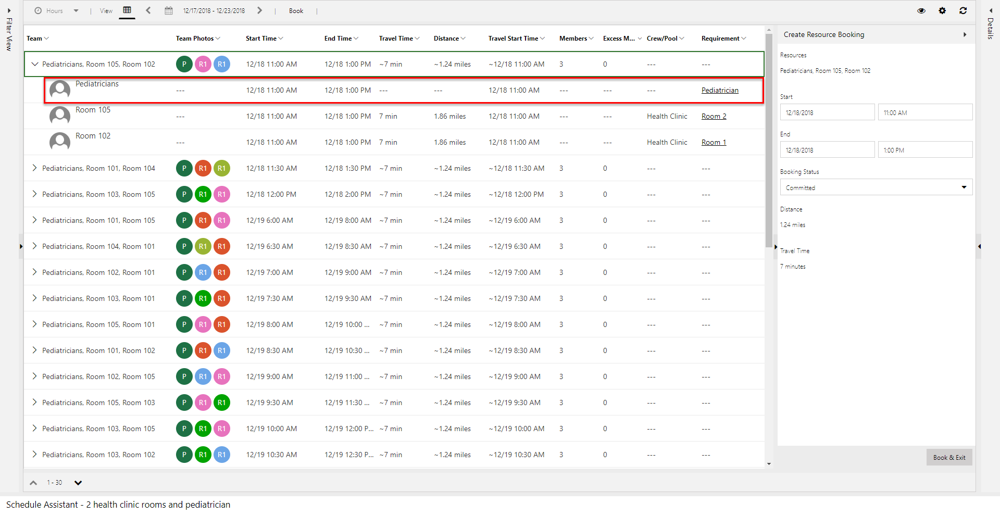

This allows you to book the pediatrician pool and assign a specific pediatric doctor at a later time. Whether pediatricians show as results will depend on capacity (as derived from the number of doctors in the pool). Using the pool allows schedulers to book appointments based on capacity without having to assign a specific doctor at the time of scheduling.

**On the requirement, if Resource Type = Users, Accounts, Contacts, (Not Pools)**, specific doctor resources will show in results, as seen in the following screenshot.

> [!div class="mx-imgBorder"]
> 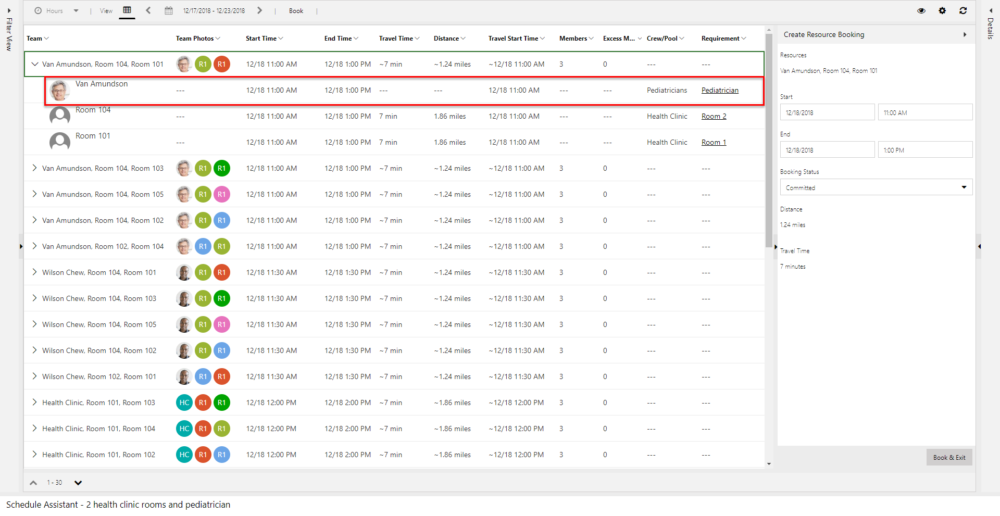

> [!Note]
> Use fulfillment preferences to display schedule assistant results in neat hourly timeslots.

## Configuration considerations

###  Choosing the right work location on requirements

Let's take a look at the following work location types:

- Facility
- On Site
- Location Agnostic

> [!div class="mx-imgBorder"]
> 

  - **Facility** work location implies the interaction takes place at the facility and travel time is calculated as the distance between the customer location and the facility location. The requirement's latitude and longitude fields are used as the customer location. It also means at least one facility or facility pool must return in schedule assistant search results in order for a resource(s) to be returned.
  
  - **On Site** work location implies the interaction takes place at the customer location and travel time is calculated as the distance between the customer location and the resource (typically field technician) location, which is variable based on the resource's schedule that day. The requirement's latitude and longitude fields are used as the customer location. As a result, facility resources and facility pools will be excluded from the results.

  - **Location Agnostic** work location implies the interaction takes place remotely and the location of the customer nor the resource is considered for scheduling. Travel time is not applicable and is not calculated. Facility resources can still be returned as part of the schedule assistant search, but travel time will not be displayed or considered in ranking.

### "Part of Same" options on requirement groups

  - **Same Location**: Same location means that only teams of resources working at the same location will be returned. This uses the logic expressed in this document to determine the location, using the Resource Associations (msdyn_bookableresourceassociations) and the Bookable Resource Group (bookableresourcegroup) entities. Using this option, regardless of which specific facility or facility pool other non-facility resources may be associated to, all that matters is that the resources are at the same physical location (organizational unit).

  - **Same Resource Tree**: This option adds an extra layer of stringency to the search. It means that the teams assembled must actually be associated to the same facility or facility pool in order to be returned as a team. For example, let’s assume there is one physical location, Location A. 

    There are 2 facilities at location A: facility 1 and facility 2. If resource 1 is associated to facility 1, and "Same Resource Tree" is selected, the one team that can be assembled is facility 1 + resource 1. Facility 2 and resource 1 cannot be returned. This combo could however be returned if “Same Location” is the only option selected. 

    It works the same with facility pools. Let’s assume there is one physical location, Location A. At location A are 2 facilities, facility 1 and facility 2, as well as a facility pool (facility pool 1). If resource 1 is associated to facility pool 1, and “Same Resource Tree” is selected, the one team that can be assembled is facility pool 1 (or one of it’s child facilities) + resource 1. 
   
 > [!Note]
 > If neither of these two options are selected on the requirement relationship (msdyn_requirementrelationship), and work location is set to facility, the schedule assistant search will execute as if “Same Resource Tree” was selected. 

  - **Same Organizational Unit**: An even more stringent option is same organizational unit. This option ensures that the parent organizational unit of the resources are the same. It does not check the bookable resource group or the bookable resource association entity. It only checks the parent organizational unit.

    If your implementation uses requirements that are location agnostic, this option may be used without either of the other two options; however, it completely ignores the two aforementioned entities (associations and groups). This could work in a simple implementation where resources are always staffed at the same location, and you do not need the advanced location search functionality of the work location “facility.”

> [!Note]
> The **Part of Same** field schema name is **msdyn_requirementrelationship**

### When to use "facility with capacity," "multiple facilities," and "facility pool"

- **Facility with capacity**: this option is configured by adding a capacity to a single facility. It's most useful when schedulers care most about not overbooking, and either don't need to schedule specific facilities or can handle coordination in person when customers arrive at the facility.

- **Multiple facilities**: this option is configured by creating multiple facility resources and relating them to each other through an organizational unit. This option makes the most sense when each facility needs to be scheduled individually.  

- **Facility pool**: this option is configured by creating a facility pool and adding facilities as pool members. This option makes the most sense when schedulers want to (1) utilize capacity scheduling by having the facility pool capacity increase and decrease as facilities are added or removed and (2) use local scheduling where bookings are first assigned to the facility pool and then later assigned to pool members. Example: a hotel (facility pool) is first scheduled for a weekend and travelers are assigned specific rooms (facility pool members) at a later date when they arrive. 

- When upgrading from Field Service v7.x to v8.x, facility type resources may not appear in schedule assistant results due to default filter settings. To fix this, go to **Field Service** > **Schedule Board**. Double-click on a schedule board tab, and then **Open Default Settings** in the upper right. Scroll down to **Other Settings**. Set **Retreive Resources Query** to 3.0.0.0 as seen in the following screenshot. **Filter Layout** and **Resource Cell Template** should also be set to 3.0.0.0.
> [!div class="mx-imgBorder"]
> 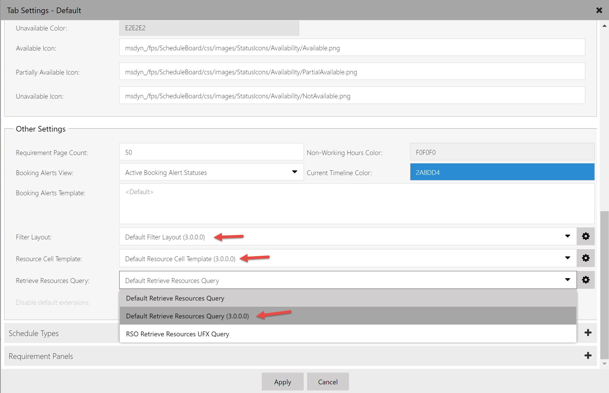

## Additional notes

- For requirements that are not part of a requirement group, only facility or facility pool resources can return in the schedule assistant if **Work Location** is set to **Facility**.
- A resource can't be related to two facilities (child or association) at the same time.
- There is currently no specific way to visualize every resource related to a facility on the schedule board. The closest way to achieve this is to filter by organizational units. 
- Manually scheduling a single requirement to a facility will not create records for all resources related to the facility.

### Facility pool location

The location for a facility pool is taken from the parent organizational unit. If a facility resource is a member of a facility pool, the location of the facility is taken from the pool resource. For example, if you create a facility with a location/organizational unit of **location A**, and you add this facility to a pool, which is located at **location B**, the facility will be considered as located at **location B** for as long as it remains in the pool.

### Booking location

When a team is selected and booked, the latitude and longitude of the booked facility/facility pool's location will be stored on the booking record. The work location will also be set based on the work location used when booking in the schedule assistant. In the following conditions, the work location, latitude, and longitude will still be set on the booking: 
- If bookings are created without using the schedule assistant
- If the requirement's work location is set to facility
- There are latitude and longitude values on the requirement
