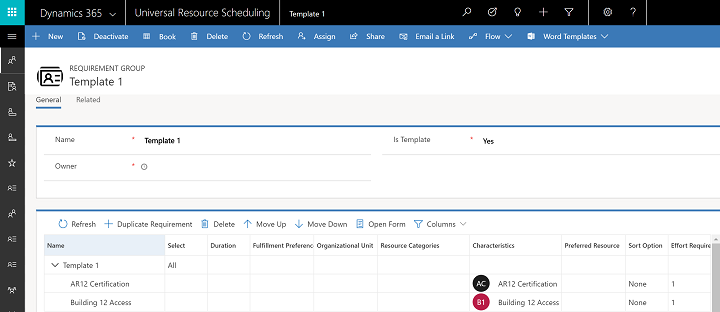
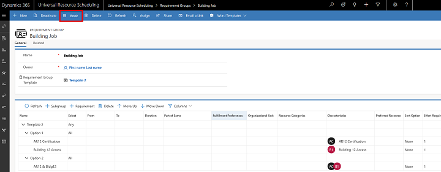
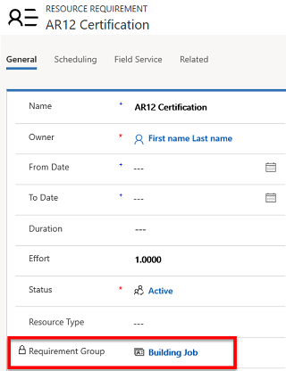
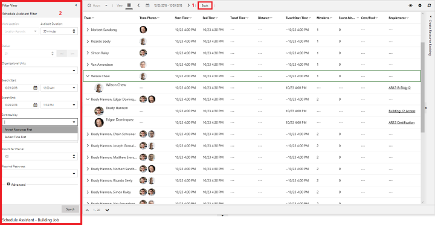
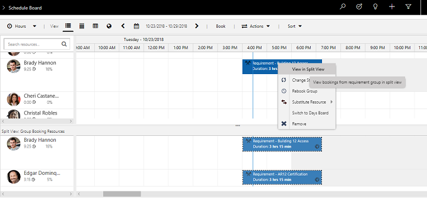
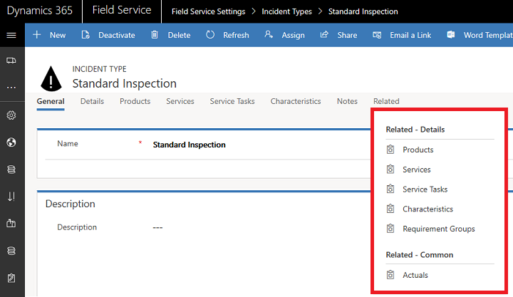
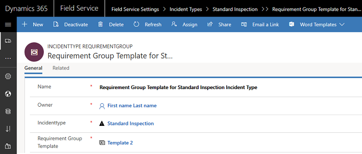
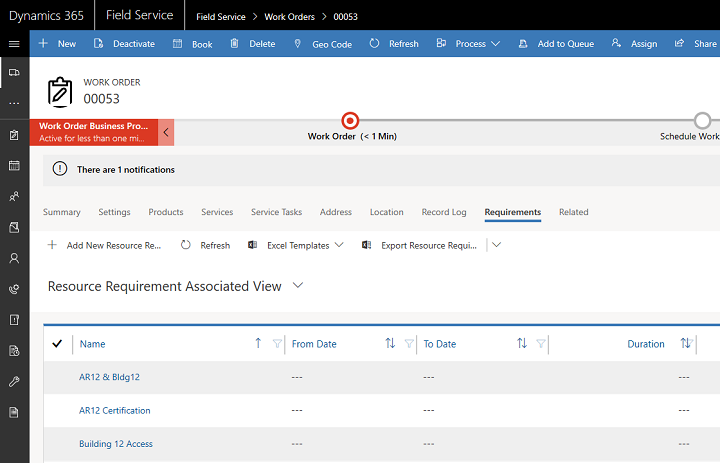
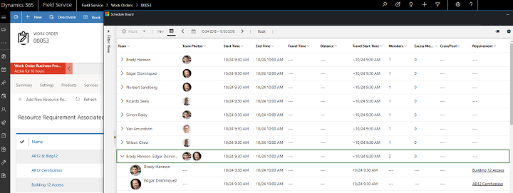

Requirement groups allow you to define groups of resources that would be appropriate for a job, and then schedule all the resources with a single search. With requirement groups, you can mix and match the different types of resources needed for a job, like individual field technicians, a whole crew, equipment, or facilities.  

For example, you might use a requirement group to find resources for a work order requiring: 
   
  - 1 field techician with skill A *and* skill B; or
  - 2 field techinicians, one with skill A and the other with skill B

You might also use a requirement group to find resources for a sales demonstration requiring:
  
  - 2 people in the same sales territory, with both working onsite
  - 2 people in the same sales territory, with one onsite and one working remotely
  
You can also use a requirement group to find resources for a project that can be done by any resource with the right piece of equipment, who is available at 9 AM during a selected week.

To schedule multiple resources with requirement groups, follow these steps:

1. Create a requirement group template
2. Create a new requirement group 
3. Book the requirement with the scheduling assistant

## 1. Create a requirement group template

- Navigate to **Universal Resource Scheduling** > **Settings** > **Requirement Group Templates** , and then choose **New**.

- Enter a name for the requirement group, and set the **Is Template** field to **Yes**. Choose **Save**. You will see a grid view of requirement details with a root requirement named after the template.

- In the root, set a duration for all related requirements. Note that changing the duration for the root or an individual requirement changes the duration for all requirements in the group. 

- Select the root, and then choose **Add Requirements**. Fill the the fields across the columns. If you need to add details that aren't displayed in the columns, select the requirement and then choose **Open Form** to add details in the requirement form.

> [!div class="mx-imgBorder"]
> 

- Set the **All** or **Any** option. Setting **All** means all requirements must be fulfilled, so the the system searches for one resource for each requirement. Setting **Any** means the system searches for one resource that can fulfill any requirement. 

> [!Note]
> The All or Any setting is powerful when you need to add multiple option sets to a requirement group, which is done by adding subgroups. 
>
> In the following screenshot example, the root requirement is set to **Any**, but each option within the root is set to **All**. This means when attempting to book the requirement group the system searches for either **all of option 1** OR **all of Option 2**. The system searches for two resources, each with one required skill (characteristic), *or* searches for one resource with two required skills.
    > 

- **Save** the requirement group template.

## 2. Create a new requirement group

- Navigate to **Universal Resource Scheduling** > **Requirement Group** > **New**

- Enter a **Name**. 

- Select a template from the drop-down list, and then choose **Save**.

- If needed, edit the requirements, and then choose **Book**.

> 

The requirement group is noted on all related requirements.

> [!div class="mx-imgBorder"]
> 

## 3. Book the requirement group 

- Select **Book** from a requirement group, which triggers the schedule assistant, as seen in the following screenshot.

> [!div class="mx-imgBorder"]
> 

The schedule assitant will display different options to fulfill the requirement group, noting the particular requirement it is fulfilling in the Requirement column. 

By default, it will recommend options with fewer resources first, in an attempt to minimize travel time and/or cost. You can also sort by **Earliest Time First** in the left pane.

Selecting and booking an option for multiple requirements will create multiple bookings reflected on the schedule board.

If multiple bookings are created when scheduling a requirement group, you can use the split view feature on the schedule board to view all related bookings.  

> [!div class="mx-imgBorder"]
> 

In the preceding screenshot, the lower split view shows all bookings scheduled from the requirement group.

## Requirement groups for work orders

For field service scenarios, requirement group templates are designed to work with incident types. An incident type is a way of automatically adding duration, service tasks, products, services, and other attributes to a work order. Adding an incident type to a work order can also automatically add requirement groups. This is achieved by **associating a requirement group template to an incident type**.
 

1. Create a requirement group template
2. Associate an incident type to the requirement group template
3. Add the incident type to a work order
4. Book the work order

### 1. Create a requirement group template

Refer to the first section of this topic for instructions.

### 2. Associate an incident type to the requirement group template 

- Navigate to **Field Service Settings** > **Incident Types**.
- Select an incident type or create a new one.

> [!Note]
> Incident types with characteristics cannot relate to requirement group templates.

- Select **Requirement Group** under related entities and **add a new one**.

> [!div class="mx-imgBorder"]
> 

- Select a requirement group template from the dropdown menu to associate the template with the incident type, and then choose **Save**.

> [!div class="mx-imgBorder"]
> 

### Add the incident type to a work order

- Navigate to **Field Service** > **Work Orders** > **New**.

- Fill out required work order details and add the incident type **before saving**.

This is done by choosing an incident type for the **Primary Incident Type** field or navigating to *** > **Work Order Incident Types**.

> [!Note]
> When an incident type with a requirement group template is added to a work order, the number of work order incidents is limited to 1.

- Navigate to **Work Order** > **Requirement Groups** to verify requirements have been added to the work order according to the requirement group template.

> [!div class="mx-imgBorder"]
> 

### Book the work order

Choose **Book** to schedule the work order.

> [!div class="mx-imgBorder"]
> 

## Tips for using templates for requirement groups

- **A template is not required**. A requirement group can be created and booked without a template being created first. Templates are recommended for repeatable scenarios. 

- **Order matters**. By default, the schedule assistant results will favor requirements within a requirement group with fewer resources. If options within a requirement group require the same number of resources, the schedule assistant results will favor the requirements listed first.

- **Duration must be equal**. All requirements within a requirement group must have the same duration. Changing the duration of the root/subgroups or any of the requirements will change the duration of **all requirements** within a requirement group. Duration of individual bookings can be changed after the fact depending on cascade settings.

- You can book directly from a template because creating a template will automatically create related requirements in the background. The actual template is not scheduled. This increases efficiency for scenarios where you want to schedule a requirement group and create a template at the same time. However, editing **start time** and **end time** is not available through the template, only through resulting requirements. 

- The following fields are kept in sync between requirements in a requirement group. Editing these fields for one requirement will update all requirements.

  - Duration
  - Start
  - End
  - Fulfillment preference
  - Booking Setup Metadata
  - Work location
  - Latitude
  - Longitude
  - Schedulable entity (work order, Project, custom entity etc.) 

- Updating a requirement group template will not update previously created requirements from that template, only new requirements.

- Crews can be an option for fulfilling requirement groups; however a crew may have more resources than required by the requirement group, and will therefore rank lower in schedule assistant search results.

## Tips for using requirement groups to schedule work orders

- When requirement groups are related to onsite work with a location (work orders), the schedule assistant looks for groups of resources that can arrive at the same time, not resources that can begin traveling at the same time.

- If an incident type has a characteristic associated with it, it is not possible to add a requirement group template and vice versa.
  
- After scheduling multiple requirements to multiple resources and thus creating multiple bookings, the work order status is driven by the same logic as scheduling crews, pools, or manually scheduling the same work order multiple times. This means if at least 1 booking has a status of **in progress**, then the related work order will have a status of **Open-In Progress**. Additionally, the work order status will only become **Open-Completed** if all related bookings have a status of **completed** (not including canceled bookings). 
