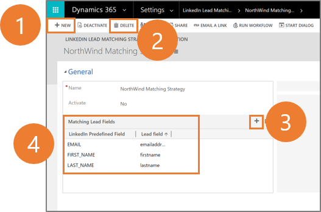

# Configure the matching strategy to update lead records from LinkedIn leads
When a new lead syncs from LinkedIn, Dynamics 365 (online) can either update an existing lead record if the person is already known, or create a new lead if it’s the first contact with this person. New LinkedIn leads show as **LinkedIn Form Submissions** in Dynamics 365 (online). Form submissions contain **LinkedIn Form Submission** Answers containing the information submitted by the LinkedIn members. To match existing leads in Dynamics 365 (online) with new LinkedIn Form Submission Answers, users with at least a LinkedIn Lead Gen Forms Connector Administrator security role can define a LinkedIn Lead Matching Strategy in Dynamics 365. A matching strategy maps the fields of a LinkedIn Form Submission to a lead record fields in Dynamics 365. By default, a matching strategy based on a lead’s email address is activated. 

You need a LinkedIn Lead Gen Forms Connector Administrator security role to manage lead matching strategies. 

1. Create a new matching strategy
2. Delete this matching strategy
3. Add more lead mapping fields
4. List of active lead mapping fields 

><b>Note</b> 
A matching strategy applies to all LinkedIn leads in the same Dynamics 365 (online) organization. 
If a matching strategy contains more than one field mapping, all mappings must match to update an existing lead record. If only a subset of the fields match, Dynamics 365 (online) creates a new lead record. We recommend maintaining simple matching strategies, for example based on the phone number or the email address only.

## Create a LinkedIn Lead Matching Strategy
1.	In Dynamics 365, go to **Settings > LinkedIn Lead Gen > LinkedIn Lead Matching Strategies**.
2.	To create the matching strategy, click **New**  and provide a **Name** before clicking **Save**.
3.	To add a LinkedIn Field Mapping record, click **Add**  and enter the name of the LinkedIn Member Field. 
4.	Click the **LinkedIn Field Mapping** record to add it to this matching strategy.
## Activate a different LinkedIn Lead Matching Strategy
1.	In Dynamics 365, go to **Settings > LinkedIn Lead Gen > LinkedIn Lead Matching Strategies**.
2.	Click the matching strategy in the list that you want to activate to open its details. 
3.	In the matching strategy details, set the value for **Activate** drop-down menu to **Yes**. 
If another matching strategy is active, it will get deactivated.

><b>Tip</b> 
It’s a good practice to maintain a single strategy and update it if needed. However, you can maintain multiple matching strategies while only one can be activated at a time. 
## Edit a LinkedIn Lead Matching Strategy
1.	In Dynamics 365, go to **Settings > LinkedIn Lead Gen > LinkedIn Lead Matching Strategies**.
2.	Click the matching strategy in the list that you want to edit.
3.	To add an additional LinkedIn Field Mapping record, click **Add**  and enter the name of the LinkedIn Member Field. 
4.	To remove a LinkedIn Field Mapping record, click **Delete**. 
## Delete a LinkedIn Lead Matching Strategy
1.	In Dynamics 365, go to **Settings > LinkedIn Lead Gen > LinkedIn Lead Matching Strategies**.
2.	Select the checkbox for the lead matching strategy you want to delete.
3.	Click **Delete** and confirm your deletion.
><b>Note</b>  You can’t delete the activated lead matching strategy. 

## See Also
