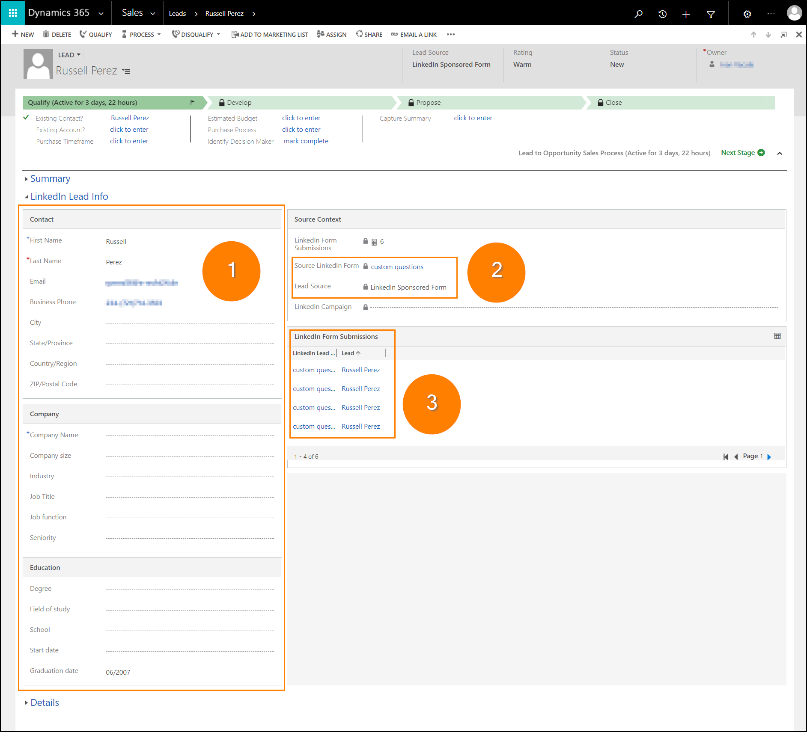
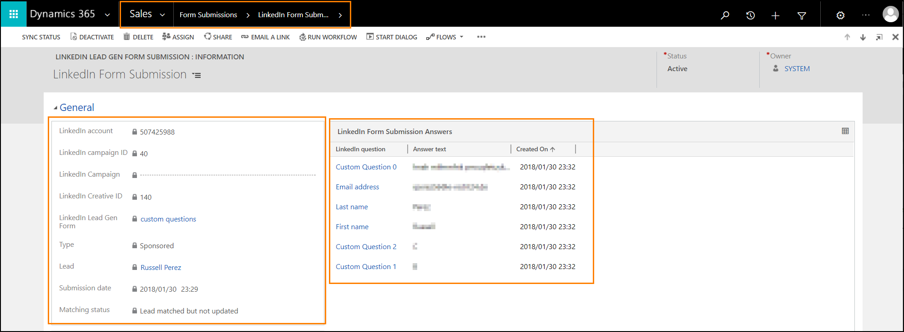

# Review and analyze leads and lead performance
When a LinkedIn lead matches a lead record in Dynamics 365 (online), the lead record is updated with additional information. In addition to the updates of individual lead records, charts on dashboards can represent the performance of a marketing campaign on LinkedIn.
## See the details of a lead
To see the details of a lead record in Dynamics 365, go to **Sales > Leads** and select the lead record from the list. If a lead was created by the Dynamics 365 Connector for LinkedIn Lead Gen Forms, the lead source is **LinkedIn Sponsored Content**. If an existing lead record was updated, Dynamics 365 updates the lead field values with the information submitted by the prospect on LinkedIn.
For more information about creating or editing a lead, see [Dynamics 365 Help & Training: Create or edit a lead](https://www.microsoft.com/en-us/Dynamics/crm-customer-center/create-or-edit-a-lead-sales.aspx).

1. Information about the lead from LinkedIn
2. Source where the lead originates from
3. Forms submitted by this lead

## Review the aggregated lead performance
Work with a dashboard containing charts about the source of new leads, or create new dashboards with the charts that matter the most to get your reporting completed. 

 
When you create your own dashboard, consider adding a chart for the record type **LinkedIn Form Submissions** to see how your campaigns perform compared to each other. Or, you can create a **Leads by Source** chart for the record type **Lead**. Give it a try! 

 
For more information about building custom dashboards, see [Create or customize dashboards](https://www.microsoft.com/en-us/dynamics/crm-customer-center/create-or-customize-dashboards.aspx) and [Manage dashboard components](https://www.microsoft.com/en-us/dynamics/crm-customer-center/manage-dashboard-components.aspx) on the [Dynamics 365 Help Center](http://go.microsoft.com/fwlink/p/?LinkId=394323).

## Analyze individual LinkedIn Lead Gen forms and submissions
To see all form submissions in Dynamics 365 (online), go to **Sales > LinkedIn Lead Gen > LinkedIn Form Submissions**. You can drill in to individual submissions to see the details of the lead and the answers provided be the LinkedIn members answering the underlying LinkedIn Lead Gen form.  

 
For more information about the mapping of LinkedIn fields to Dynamics 365 entity fields, see Available properties to match LinkedIn Member Field and Lead Field [Link needed].

## See Also
