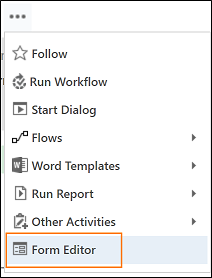

# Add LinkedIn Sales Navigator controls to form

[comment]: <> (Todo: Tokens, Alt-text)

## Prerequisites

- LinkedIn Sales Navigator for Microsoft Dynamics Version 2 is installed in Dynamics 365.
- You have Customizer or System Administrator security role in Dynamics 365. 
- Your organization uses Unified Interface apps.
- To test the controls, you need a LinkedIn Sales Navigator member seat.

## Add Sales Navigator member or account controls to a form

You can customize lead, account, and contact forms by adding LinkedIn controls.
You can [add two custom controls](https://docs.microsoft.com/dynamics365/customer-engagement/customize/use-custom-controls-data-visualizations) available: 
- LinkedIn Sales Navigator Lead (member profile): Shows information about a LinkedIn member profile.
- LinkedIn Sales Navigator Account (company profile): Shows information about a LinkedIn company profile. 

For the steps below, we'll customize a first name field on a lead form. Customizing fields on other forms is similar, starting from step 3.

1. In the web client of Dynamics 365, go to Sales > Leads.

2. Select any existing lead.

3. On the lead form, select **More options**. 

   

4. In the menu, select **Form Editor**.

   

5. Select the **First Name** field and then select **Change Properties**.

   

6. In the **Field Properties** window, switch to the **Control** tab and select **Add control...**.

   

7. Select the **LinkedIn Sales Navigator member profile** control and select **Add**.

   

8. Now you need to configure the Sales Navigator control.    
In the **Control** area, select **Web** for the LinkedIn control. Phone and tablet aren't supported as of April 1 2018.

   

9. In the property area, make sure all required properties (with a red asterisk) have a binding configured. You might need to scroll down in the list to find additional required properties. For this example, we need to configure one additional property.    
Select the **Last Name** property and select the  pencil icon. in the **Bind a value on a field** list, select **lastname (SingleLine.Text)** and select **OK**.

   

10. Select **Add** in the Field Properties window.

11. In the **Form Editor**, select **Save** to apply your changes to the form. 

12. Select **Publish** to make your customizations available to the organization.

## Available properties and bindings

### LinkedIn Sales Navigator Lead (member profile)

Shows information about a LinkedIn member profile. A member profile and a record are matched based on the parameters provided in the binding. If you are using a [lookup field](https://docs.microsoft.com/en-us/dynamics365/customer-engagement/developer/set-field-values-using-parameters-passed-form#set-values-for-lookup-fields) for the contact on the lead form, you'll find the same options but need to specify the lookup to the record that matches the LinkedIn member profile.    
This control has four modules, which can be enabled independently:
   - Top Card: shows information about the person like name, headline, and more. Additionally, provides capabilities to message or save the person as a lead
   - News (Icebreakers): shows the person’s highlights, activities, and more
   - Connections (Get Introduced): shows the mutual connections and allows for an introduction to the person
   - Related Leads: shows potential leads who are similar to the person

### LinkedIn Sales Navigator Account (company profile)

Shows information about a LinkedIn company profile. A company profile and a record are matched based on the parameters provided in the binding. If you are using a [lookup field](https://docs.microsoft.com/en-us/dynamics365/customer-engagement/developer/set-field-values-using-parameters-passed-form#set-values-for-lookup-fields) for the account on the lead form, you'll find the same options but need to specify the lookup to the record that matches the LinkedIn company profile.    
This control has four modules, which can be enabled independently:
   - Top Card: shows information about the company like company name, industry, location and more. Additionally, provides capabilities to view the related account and save as account
   - News: shows the latest news of this company
   - Connections: shows relevant connections for this company
   - Recommended Leads: shows the recommended potential leads in this company

### Available field values for binding

- companyname (SingleLine.Text)
- customeridname (SingleLine.Text)
- customeridyominame (SingleLine.Text)
- fax (SingleLine.Text)
- firstname (SingleLine.Text)
- fullname (SingleLine.Text)
- jobtitle (SingleLine.Text)
- lastname (SingleLine.Text)
- middlename (SingleLine.Text)
- pager (SingleLine.Text)
- salutation (SingleLine.Text)
- sic (SingleLine.Text)
- subject (SingleLine.Text)
- timespentbymeonemailandmeetings (SingleLine.Text)
- traversedpath (SingleLine.Text)

### See also
...