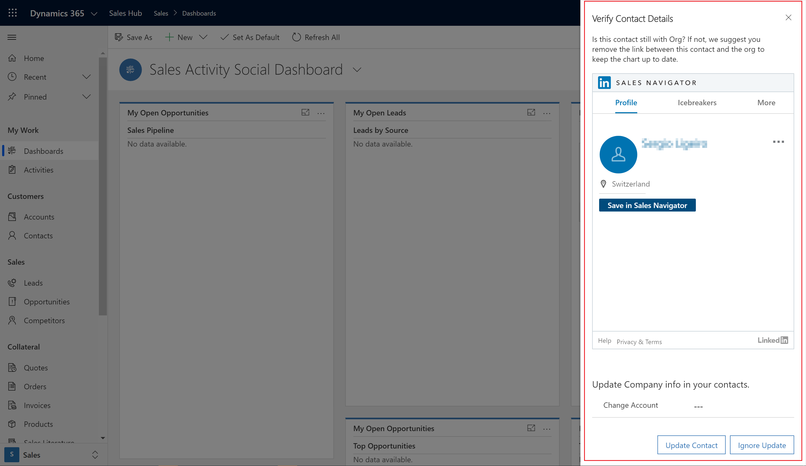

# Data validation

This article describes the data validation capabilities of the LinkedIn Sales Navigator solution for Dynamics 365 Sales that helps you keep the organizational structure of your matched contacts up to date. It uses the LinkedIn information to validate the contact records in Dynamics 365 Sales and enables you to check back on pending opportunities or have a useful icebreaker when getting in touch with a contact.

## Prerequisites

To ensure timely updates if a matched contact changes the company, the following prerequisites must be met:

- The CRM sync capability in LinkedIn Sales Navigator is activated by an administrator. To learn more, see [CRM Sync & Activity Writeback for Dynamics 365](https://business.linkedin.com/sales-solutions/sales-navigator-customer-hub/resources/ms-dynamics-sync-activity-writeback).

- The data validation LinkedIn in Sales Navigator is enabled by an administrator. To learn more, see [Sales Navigator Data Validation for Dynamics 365](https://business.linkedin.com/sales-solutions/sales-navigator-customer-hub/resources/data-validation-dynamics).

- You must have a Microsoft Relationship Sales solution Plus license. To learn more, see the **Dynamics 365 Sales** section from the [Microsoft Dynamics 365 Licensing Guide](https://go.microsoft.com/fwlink/?LinkId=866544).

- The data validation settings are turned on in **Settings** > **Business Management** > **Sales Navigator Integration Settings**. When the data validation feature is turned on for the first time, you'll get updates about the company change status for the past two years. Afterwards, the updates come are sent to the system on daily basis, every 24 hours.

## Access the data validation capabilities Dynamics 365 Sales

There are several ways to find out if a contact's company has changed.

- From the org chart on an Account record: A red dot next to a contact's name in the org chart indicates that their company has changed since you built the org chart.

- From the **Relationship Assistant** card in the **Sales Activity Social Dashboard**. To turn on the Relationship Assistant card, go to **Settings** > **Sales Insights** > **Insight cards**

- From the **Opportunities** > **All Opportunities at Risk - Contact left** view in Dynamics 365 Sales.

- From the **Contacts** > **All Contacts Not at Company** view in Dynamics 365 Sales.

## Update the contact details

To update the org chart for a specific contact, perform the following steps in the **Verify Contact Details** pane.

1. In Dynamics 365 Sales, open the **Verify Contact Details** pane as described in the section above.

2. Under the LinkedIn Sales Navigator widget, search for the new account of this contact using the **Change Account** field.

3. Select **Update contact** to change the company information of the contact.

## Ignore the contact details

To ignore a proposed update of an org chart, select **Ignore Update**  in the **Verify Contact Details** pane.

### See also

[Troubleshooting LinkedIn integration errors](ts-linkedin-integration.md)
