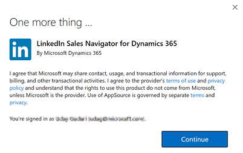
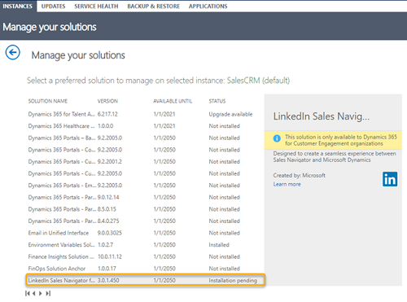
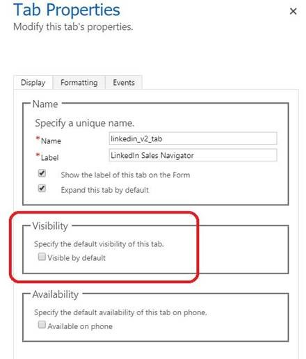

# Install and enable LinkedIn Sales Navigator

As an administrator, you can install and enable the LinkedIn Sales Navigator for your organization in the following ways depending on your requirements.

-	**Advance Settings**: Use the **Advanced Settings** option to install and enable LinkedIn Sales Navigator for that organization that you have already signed in. To learn more, see [Install through Advanced Settings](#install-through-advanced-settings).
-	**AppSource**: Use the **LinkedIn Sales Navigator for Dynamics 365** AppSource page to install and enable LinkedIn Sales Navigator, if you are managing multiple organizations and enable it of an organization. To learn more, see [Install through AppSource page](#install-through-appsource-page).

The following diagram illustrates the steps to install and enable LinkedIn Sales Navigator:

> [!div class="mx-imgBorder"]  
> 

1.	[Review prerequisites](#review-prerequisites).

2.	Install LinkedIn Sales Navigator.

    -	[Install through Advanced Settings](#install-through-advanced-settings).

    -	[Install through AppSource page](#install-through-appsource-page).

3.	[Validate the installation](#validate-the-installation).

4.	[Enable LinkedIn Sales Navigator](#enable-linkedin-sales-navigator).

## Review prerequisites

Review the following prerequisites to install and enable LinkedIn Sales Navigator:

- You have a System Administrator security role in [!INCLUDE[pn-dynamics-365](../includes/pn-dynamics-365.md)]. 

- You have a [Microsoft Relationship Sales subscription](https://dynamics.microsoft.com/sales/relationship-sales/) for Dynamics 365   
    --OR--   
    You will need to sign your team up for [LinkedIn Sales Navigator Team](https://business.linkedin.com/sales-solutions) or [LinkedIn Sales Navigator Enterprise](https://business.linkedin.com/sales-solutions).    

    We recommend having a Sales Navigator Administrator seat. To learn more, see the **Dynamics 365 Sales** section from [Microsoft Dynamics 365 License Guide](https://go.microsoft.com/fwlink/?LinkId=866544).

- You will need to enable JavaScript in your browser.

- You will need to disable your pop-up blocker for the [!INCLUDE[pn-dynamics-365](../includes/pn-dynamics-365.md)] domain.

## Install through Advanced Settings

1.	In your app, select the **Settings** icon, and then select **Advanced Settings**.

    > [!div class="mx-imgBorder"]  
    > 
    
    The **Business Management settings** page opens in a new browser tab.

2. Select **LinkedIn Sales Navigator**.

    > [!div class="mx-imgBorder"]  
    > 

3. In the new **Installation** tab that opens, select **Continue** to install the required solutions. It takes a few minutes to complete the installation.

4. Verify that the installation is complete. To learn more, see [Validate the installation](#validate-the-installation).

    When the installation is completed, select **Go to Configuration** and follow the steps below to [Enable the default Sales Navigator controls](#enable-the-default-sales-navigator-controls).

## Install through AppSource page

1.	Go to the [LinkedIn Sales Navigator for Dynamics 365](https://appsource.microsoft.com/product/dynamics-365/mscrm.5ba43194-adc5-4c13-b40d-af04f549d5da) AppSource page and select **GET IT NOW**.

    > [!div class="mx-imgBorder"]  
    > 
 
2.	Read the terms and conditions and select **Continue**.

    > [!div class="mx-imgBorder"]  
    > 
 
    The Dynamics 365 marketplace opens.

3.	Choose the organization from **Organization to add the application to** list, and accept Microsoft and Dynamics 365 legal terms and privacy statements.

    > [!div class="mx-imgBorder"]  
    > 
 
4.	Select **Agree**. The Manage your solutions page open and you can verify the status of the installation.

    > [!div class="mx-imgBorder"]  
    > 
 
5. Verify that the installation is complete. To learn more, see [Validate the installation](#validate-the-installation).

    When the installation is completed, select **Go to Configuration** and follow the steps below to [Enable the default Sales Navigator controls](#enable-the-default-sales-navigator-controls).

## Validate the installation

To verify that the LinkedIn Sales Navigator is successfully installed, follow the steps:

1.	In your app, select the **Settings** icon, and then select **Advanced Settings**.

    > [!div class="mx-imgBorder"]  
    > 

2.	Go to **Settings** > **Customizations** > **Solutions**.

3.	Verify that the following solutions are installed in your organization.

    -	LinkedInSalesNavigatorControlsForUnifiedClient
    -	LinkedIn
    -	msdyn_LinkedInSalesNavigatorAnchor

    > [!div class="mx-imgBorder"]  
    > 

## Enable LinkedIn Sales Navigator

The following procedure guides administrators to enable default controls for LinkedIn Sales Navigator content. The Sales Navigator controls will appear on Account, Contact, Lead, and Opportunity pages by default. However, you can still customize other forms and entities to show Sales Navigator controls.

1.	In your app, select the **Settings** icon, and then select **Advanced Settings**.

    > [!div class="mx-imgBorder"]  
    > 
    
    The **Business Management settings** page opens in a new browser tab.

2. Select **LinkedIn Sales Navigator**.

    > [!div class="mx-imgBorder"]  
    > 

3.	Select the **Enable Sales Navigator integration** control.

    > [!div class="mx-imgBorder"]  
    > 

4.	Select **Ok** to enable the integration.

## Existing orgs that got updated with April 19 features

In the [April 19 release](https://docs.microsoft.com/power-platform/admin/preview-october-2019-updates#when-will-the-2019-release-wave-2-features-be-enabled) we introduced changes to how the Sales Navigator controls are enabled.   
   
Here are a few things to consider if you don't plan to enable the integration. 
   
1. Three solutions related to the LinkedIn integration appear in the **All Solutions** view in **Settings** > **Customizations** > **Solutions**. Although these solutions are pre-installed, the functionality and data transfer between the two systems will be disabled unless you [enable the Sales Navigator controls](#enable-the-default-sales-navigator-controls). Additionally, **CRM Sync** needs to be explicitly enabled on the LinkedIn Sales Navigator Admin Settings. 

   > [!div class="mx-imgBorder"] 
   > 

2. System customizers will see the new LinkedIn controls in Account, Contact, Lead, and Opportunity form editors. However, their default visibility is turned OFF and end users will not be able to see these controls on the forms unless the feature is enabled by a system administrator. Customizers can remove these controls from the pages as they would remove any control in case they find it too distracting.  

   > [!div class="mx-imgBorder"] 
   > 

3. While using **Advanced Find**, end users see the new entities introduced by these solutions (InMails, Messages, and PointDrive Presentation Viewed) even if the integration is not enabled. This is the intended behavior and users can ignore these entities if they are not actively using the LinkedIn Sales Navigator integration.

### See also

[Overview for LinkedIn Sales Navigator solutions](integrate-sales-navigator.md)     
[Customize forms to show Sales Navigator controls](add-sales-navigator-controls-forms.md)    
[Work with Sales Navigator controls on forms](view-sales-navigator-forms.md) 
[See profile pictures](see-profile-pictures.md)