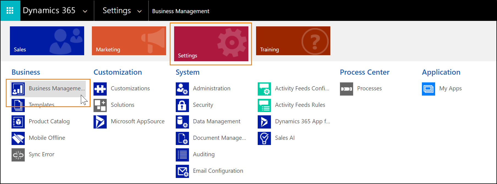

# Enable default LinkedIn Sales Navigator controls

## Prerequisites

- You have a System Administrator security role in [!INCLUDE[pn-dynamics-365](../includes/pn-dynamics-365.md)]. 
- You have a [Microsoft Relationship Sales subscription](https://dynamics.microsoft.com/sales/relationship-sales/) for Dynamics 365   
--OR--   
You will need to sign your team up for [LinkedIn Sales Navigator Team](https://business.linkedin.com/sales-solutions) or [LinkedIn Sales Navigator Enterprise](https://business.linkedin.com/sales-solutions).    
  We recommend having a Sales Navigator Administrator + Team Member seat to complete the installation. However, you may use a Sales Navigator Administrator seat.
- You will need to enable JavaScript in your browser.
- You will need to disable your pop-up blocker for the [!INCLUDE[pn-dynamics-365](../includes/pn-dynamics-365.md)] domain.

## Enable the default Sales Navigator controls

The following procedure guides administrators to enable default controls for LinkedIn Sales Navigator content. The Sales Navigator controls will appear on Account, Contact, Lead, and Opportunity pages by default. However, you can still customize other forms and entities to show Sales Navigator controls.

1. In Dynamics 365 for Sales, go to **Settings** > **Business Management**.
   
2. Select **LinkedIn Sales Navigator**.
3. Select the **Enable Sales Navigator Integration** checkbox.
   
4. Select **Ok** to enable the integration.

## Disable the default Sales Navigator controls

Disabling the integration will stop showing the Sales Navigator controls. 

1. In Dynamics 365 for Sales, go to **Settings** > **Business Management**.
2. Select **LinkedIn Sales Navigator**.
3. Remove the check mark from the **Enable Sales Navigator Integration** checkbox.
4. Select **Ok** to disable the integration.

### See also

[Overview for LinkedIn Sales Navigator solutions](integrate-sales-navigator.md)     
[Customize forms to show Sales Navigator controls](add-sales-navigator-controls-forms.md)    
[Work with Sales Navigator controls on forms](view-sales-navigator-forms.md)
