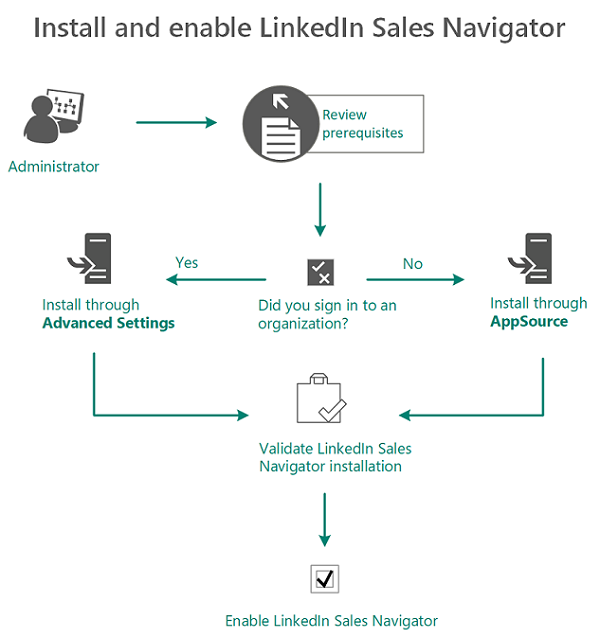
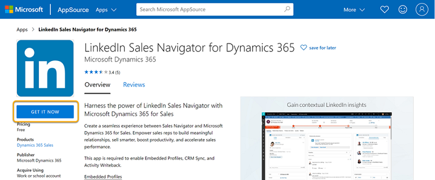
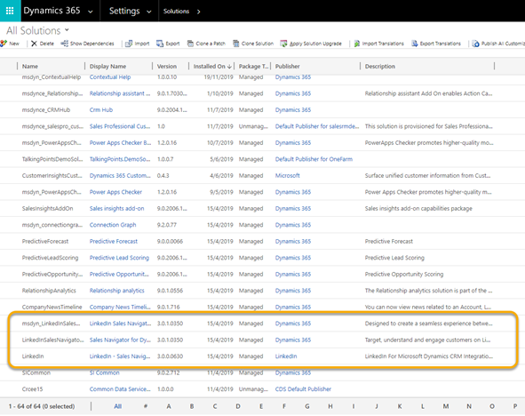
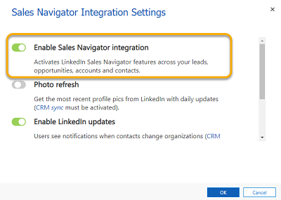

# Install and enable LinkedIn Sales Navigator

As an administrator, you can install and enable the LinkedIn Sales Navigator for your organization in one of two ways, depending on your requirements:

- **Advanced Settings**: Use the **Advanced Settings** option to install and enable LinkedIn Sales Navigator for the organization that you're already signed in to. More information: [Install through Advanced Settings](#install-through-advanced-settings)
- **AppSource**: Use the **LinkedIn Sales Navigator for Dynamics 365** AppSource page to install and enable LinkedIn Sales Navigator if you're managing multiple organizations and want to enable it in an organization. To learn more, see [Install through the AppSource page](#install-through-the-appsource-page).

The following diagram illustrates the steps to install and enable LinkedIn Sales Navigator:

> [!div class="mx-imgBorder"]  
> 

1. [Review prerequisites](#review-prerequisites).

2. Install LinkedIn Sales Navigator:

    - [Through Advanced Settings](#install-through-advanced-settings).

    - [Through the AppSource page](#install-through-the-appsource-page).

3.	[Validate the installation](#validate-the-installation).

4.	[Enable LinkedIn Sales Navigator](#enable-linkedin-sales-navigator).

## Review prerequisites

Review the following prerequisites to install and enable LinkedIn Sales Navigator:

- You have a System Administrator security role in [!INCLUDE[pn-dynamics-365](../includes/pn-dynamics-365.md)]. 

- You have a [Microsoft Relationship Sales subscription](https://dynamics.microsoft.com/sales/relationship-sales/) for Dynamics 365.  or  
    You'll need to sign up your team for [LinkedIn Sales Navigator Team](https://business.linkedin.com/sales-solutions) or [LinkedIn Sales Navigator Enterprise](https://business.linkedin.com/sales-solutions).

    > [!NOTE]
    > We recommend having a Microsoft Relationship Sales solution Plus license. To learn more, see the **Dynamics 365 Sales** section from the [Microsoft Dynamics 365 Licensing Guide](https://go.microsoft.com/fwlink/?LinkId=866544).

- You'll need to enable JavaScript in your browser.

- You'll need to disable your pop-up blocker for the [!INCLUDE[pn-dynamics-365](../includes/pn-dynamics-365.md)] domain.

## Install through Advanced Settings

1. In your app, select **Settings** , and then select **Advanced Settings**.

    > [!div class="mx-imgBorder"]  
    > 

    The **Business Management settings** page opens in a new browser tab.

2. Select **LinkedIn Sales Navigator**.

    > [!div class="mx-imgBorder"]  
    > 

3. On the new **Installation** tab that opens, select **Continue** to install the required solutions. It takes a few minutes to complete the installation.

4. Verify that the installation is complete by following the steps in [Validate the installation](#validate-the-installation).

## Install through the AppSource page

1. Go to the [LinkedIn Sales Navigator for Dynamics 365](https://appsource.microsoft.com/product/dynamics-365/mscrm.5ba43194-adc5-4c13-b40d-af04f549d5da) AppSource page, and then select **GET IT NOW**.

    > [!div class="mx-imgBorder"]  
    > 

2. Read the terms and conditions, and then select **Continue**.

    > [!div class="mx-imgBorder"]  
    > 

    The Dynamics 365 marketplace opens.

3. Choose the organization from the **Organization to add the application to** list, select the check boxes for Microsoft and Dynamics 365 legal terms and privacy statements, and then select **Agree**.

    > [!div class="mx-imgBorder"]  
    > 

4. On the **Manage your solutions** page, verify the status of the installation.

    > [!div class="mx-imgBorder"]  
    > 

5. Verify that the installation is complete by following the steps in [Validate the installation](#validate-the-installation).

## Validate the installation

1. In your app, select **Settings** , and then select **Advanced Settings**.

    > [!div class="mx-imgBorder"]  
    > 

2. Go to **Settings** > **Customizations** > **Solutions**.

3. Verify that the following solutions are installed in your organization.

    - LinkedInSalesNavigatorControlsForUnifiedClient
    - LinkedIn
    - msdyn_LinkedInSalesNavigatorAnchor

    > [!div class="mx-imgBorder"]  
    > 

4. When the installation is completed, select **Go to Configuration** and follow the steps to [Enable LinkedIn Sales Navigator](#enable-linkedin-sales-navigator).    

## Enable LinkedIn Sales Navigator

Use this procedure to enable default controls for LinkedIn Sales Navigator content. The Sales Navigator controls will appear on Account, Contact, Lead, and Opportunity pages by default. You can also customize other forms and entities to show Sales Navigator controls.

1. In your app, select **Settings** , and then select **Advanced Settings**.

    > [!div class="mx-imgBorder"]  
    > 

2. On the **Business Management settings** page, select **LinkedIn Sales Navigator**.

    > [!div class="mx-imgBorder"]  
    > 

3. Turn on the **Enable Sales Navigator integration** toggle.

    > [!div class="mx-imgBorder"]  
    > 

4. Select **OK**.

## Enable CRM sync and activity writeback

By enabling the CRM sync and activity writeback, the Sales Navigator matches the Accounts, Leads, and Contacts in Dynamics 365 Sales. It also saves information you create in Sales Navigator directly in your Dynamics 365 Sales, including InMails and Messages.

To enable the CRM sync and activity writeback, follow the process as defined in [CRM Sync & Activity Writeback for Dynamics 365](https://business.linkedin.com/sales-solutions/sales-navigator-customer-hub/resources/ms-dynamics-sync-activity-writeback).

## Existing orgs that got updated with April 19 features

In the [April 19 release](https://docs.microsoft.com/power-platform/admin/preview-october-2019-updates#when-will-the-2019-release-wave-2-features-be-enabled), we introduced changes to how the Sales Navigator controls are enabled. Here are a few things to consider if you don't plan to enable the integration:

- Three solutions related to the LinkedIn integration appear in the **All Solutions** view in **Settings** > **Customizations** > **Solutions**. Although these solutions are preinstalled, the functionality and data transfer between the two systems will be disabled unless you [enable LinkedIn Sales Navigator](#enable-linkedin-sales-navigator). Additionally, **CRM Sync** needs to be explicitly enabled on LinkedIn Sales Navigator Admin Settings page.

   > [!div class="mx-imgBorder"] 
   > 

- System customizers will see the new LinkedIn controls in Account, Contact, Lead, and Opportunity form editors. However, the visibility for these controls is turned off by default and users won't be able to see them on forms unless the feature is enabled by a system administrator. Customizers can remove these controls from pages as they'd remove any control that they consider too distracting.  

   > [!div class="mx-imgBorder"] 
   > 

- While using **Advanced Find**, users see the new entities introduced by these solutions (InMails, Messages, and Smart Links) even if the integration wasn't enabled. This is the intended behavior; users can ignore these entities if they aren't actively using LinkedIn Sales Navigator.

### See also

[Overview for LinkedIn Sales Navigator solutions](integrate-sales-navigator.md)  
[Customize forms to show Sales Navigator controls](add-sales-navigator-controls-forms.md)  
[Work with Sales Navigator controls on forms](view-sales-navigator-forms.md) 
[See profile pictures](see-profile-pictures.md)
