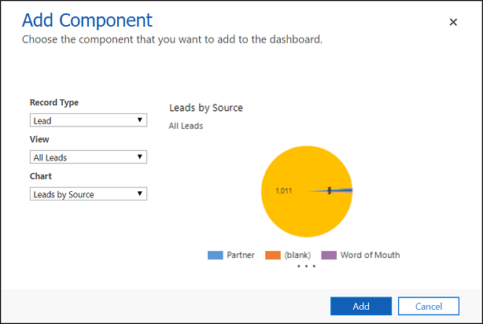

# Analyze leads and lead performance

[!include[Pre-release disclaimer](includes/cc-beta-prerelease-disclaimer.md)]

When a [!include[LinkedIn](includes/tn-linkedin.md)] lead matches a lead record in [!include[Dynamics 365 (online)](includes/pn-dyn-365-online.md)], the lead record is updated with additional information. In addition to the updates of individual lead records, charts on dashboards can represent the performance of a marketing campaign on [!include[LinkedIn](includes/tn-linkedin.md)].

## See the details of a lead

To see the details of a lead record in [!include[Dynamics 365](includes/pn-dynamics-crm.md)], go to **Sales/Marketing** > **Leads** and select the lead record from the list. If the lead was created by [!include[Dynamics 365 Connector for LinkedIn Lead Gen Forms](includes/pn-linkedin-solution.md)], the lead source is **[!include[LinkedIn](includes/tn-linkedin.md)] Sponsored Content**. If an existing lead record was updated, [!include[Dynamics 365](includes/pn-dynamics-crm.md)] updates the lead field values by using the information submitted by the lead on [!include[LinkedIn](includes/tn-linkedin.md)].
More information about creating or editing a lead: [Dynamics 365 Help & Training: Create or edit a lead](https://go.microsoft.com/fwlink/p?linkid=832163).

1. Information about the lead from [!include[LinkedIn](includes/tn-linkedin.md)]
2. Source from which the lead originated and the [!include[LinkedIn](includes/tn-linkedin.md)] campaign related to this lead
4. Forms submitted by this lead

[//]: # (> [!NOTE])
[//]: # (When working with Marketing, Business edition, LinkedIn campaigns automatically create a **Customer Journey** record. To stop these records from being automatically generated, a system administrator or customizer needs to edit the **LinkedIn LeadGen Integration Configurations** entity and change the value for the **Create Journeys for LinkedIn Campaigns** attribute from **Yes** to **No**. For quick access to this custom entity, consider [adding it to the site map]https://go.microsoft.com/fwlink/?linkid=850397.)

## Review the aggregated lead performance

Work with a dashboard containing charts about the source of new leads, or create new dashboards by using the charts that matter the most to get your reporting completed. 

When you create your own dashboard, consider adding a chart for the record type **[!include[LinkedIn](includes/tn-linkedin.md)] Form Submissions** to see how your campaigns perform compared to each other. Or, you can create a **Leads by Source** chart for the record type **Lead**. Give it a try!

More information about building custom dashboards: [Create or customize dashboards](https://go.microsoft.com/fwlink/p/?linkid=834422) and [Manage dashboard components](https://go.microsoft.com/fwlink/p/?linkid=320334) in [Dynamics 365 Help Center](http://go.microsoft.com/fwlink/p/?LinkId=394323).

## Analyze individual [!include[LinkedIn](includes/tn-linkedin.md)] Lead Gen forms and submissions

To see all form submissions in [!include[Dynamics 365 (online)](includes/pn-dyn-365-online.md)], go to **Sales** > **[!include[LinkedIn](includes/tn-linkedin.md)] Lead Gen** > **[!include[LinkedIn](includes/tn-linkedin.md)] Form Submissions**. You can drill down to individual submissions to see the details of the lead and the information provided by the [!include[LinkedIn](includes/tn-linkedin.md)] members when they answered the underlying [!include[LinkedIn](includes/tn-linkedin.md)] Lead Gen form. 

## Establish and grow relationships with [!include[LinkedIn](includes/tn-linkedin.md)] Sales Navigator

The [LinkedIn Sales Navigator for Microsoft Dynamics](https://appsource.microsoft.com/en-us/product/dynamics-365/linkedin.acdbc404-e99f-4c3e-927f-52fa28a6a682) is a useful addition if your organization is already using [!include[LinkedIn](includes/tn-linkedin.md)] Sales Navigator.

To find out more about the capabilites or request a demo, head over to [Sales Navigator from LinkedIn Sales Solutions](https://business.linkedin.com/sales-solutions/sales-navigator). 

Learn how to install the solution on the [LinkedIn Sales Navigator help center](https://www.linkedin.com/help/sales-navigator/answer/56320/linkedin-for-microsoft-dynamics-crm).

### See also

[Establish a connection between Dynamics 365 Connector for LinkedIn Lead Gen Forms and LinkedIn](connect-dynamics-365-linkedin.md)  
[Configure a matching strategy to update leads from LinkedIn Lead Gen ads](configure-matching-strategy.md)