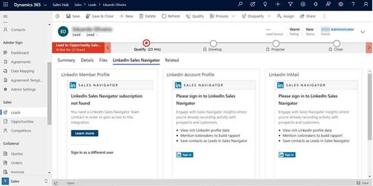
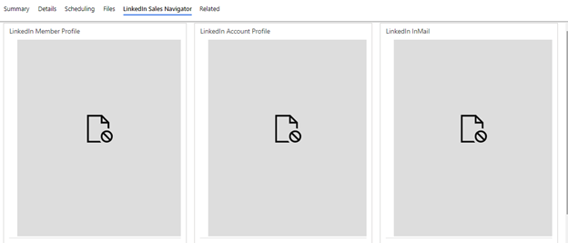
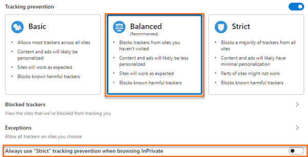
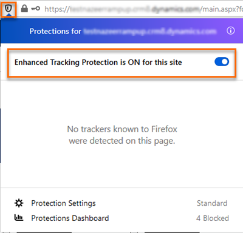
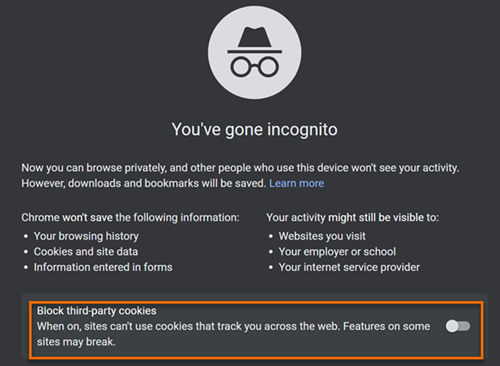
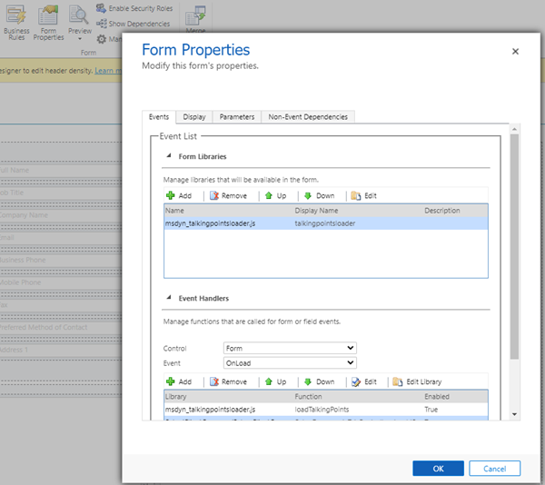
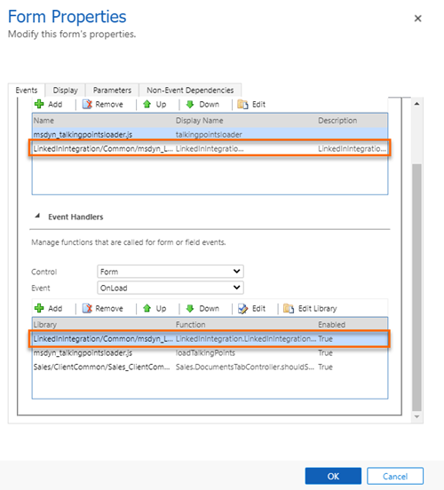

# Troubleshooting LinkedIn integration errors

This article helps you troubleshoot and resolve issues related to LinkedIn integrations in Dynamics 365 Sales.

## Error in enabling LinkedIn updates

**Reason**

When enabling the data validation option (**Enable LinkedIn updates**) in the **Sales Navigator Integration Settings** dialog box, you might see the status that data validation has failed. The possible errors are:  

- Data validation has failed because CRM sync is disabled in LinkedIn Sales Navigator.
- Data validation failed with some other error (for example, an "unexpected error").

For more information about the data validation capability of LinkedIn Sales Navigator, see [Data validation](https://docs.microsoft.com/dynamics365/linkedin/data-validation).

**Resolution**

- If you get the data validation failure because CRM sync was disabled, verify the following:

  - CRM sync is enabled in LinkedIn Sales Navigator.

  - The setting for data validation is enabled in LinkedIn Sales Navigator. If this setting isn't turned on, you'll see the CRM sync disabled status even though CRM sync is enabled. If you aren't able to see the data validation setting in LinkedIn Sales Navigator, ensure that you have an appropriate Sales Navigator license. More information: [Sales Navigator Data Validation - Overview](https://www.linkedin.com/help/sales-navigator/answer/a120992)

  - If you've turned on both the settings, ensure that you've turned on the **Enable LinkedIn updates** setting at least once.

- If the error is due to something other than CRM sync, you can try restarting data validation by first disabling it from the **Sales Navigator Integration Settings** dialog box, and then enabling it again.

## Unable to upgrade the LinkedInSalesNavigatorForUnifiedClient solution 

**Reason** 

You're unable to upgrade the **LinkedInSalesNavigatorForUnifiedClient** solution from 1.*x* to 3.*x*. This issue occurs because of the dependencies that exist for the solution: you can’t update the solution that has dependencies associated with it. 

**Resolution** 

To resolve this issue, you must remove the existing dependencies for the **LinkedInSalesNavigatorForUnifiedClient** solution. Follow these steps: 

1. For the current **LinkedInSalesNavigatorForUnifiedClient** solution, remove the dependencies and uninstall the solution. For more information, see step 4 in [Uninstall LinkedIn Sales Navigator](uninstall-sales-navigator.md).

2. Uninstall the **msdyn_LinkedInSalesNavigatorAnchor** solution. 

3. After the solutions are successfully deleted, install them again. More information: [Install and enable LinkedIn Sales Navigator](install-sales-navigator.md)

## LinkedIn Sales Navigator display widgets are not loading properly on different web browsers

**Reason**

When I try to sign in to LinkedIn Sales Navigator, errors are displayed. These errors occur due to the enablement of track protection in the browser. The following are the errors:

- Display widgets are showing the error&mdash;*LinkedIn Sales Navigator subscription not found. You need a LinkedIn Sales Navigator Team contract in order to gain access*.   
    > [!div class="mx-imgBorder"]  
    >     

-OR-    

- Display widgets are not loading on different browsers. The error is displayed as shown in the following sample image:   
    > [!div class="mx-imgBorder"]  
    >     

**Resolution**

To resolve this issue, you must disable the track protection in the browser ([Microsoft Edge](#microsoft-edge), [Mozilla FireFox](#mozilla-firefox), [Google Chrome](#google-chrome), and [Apple Safari](#apple-safari)). 

Microsoft Edge:    
1. Open the Microsoft Edge browser.   
2. Select the **More options** icon on the top-right and go to **Settings**.    
3. From the site map, go to **Privacy, search, and services**.    
4. In the **Tracking Prevention** section, select **Balanced** and disable the **Always use “Strict” tracking prevention when browsing InPrivate** option.    
    > [!div class="mx-imgBorder"]  
    > 

Mozilla FireFox:    
1. Open the Mozilla FireFox browse and open your organization.  
2. Before the address bar, select the shield icon and the Enhanced tracking protection details appears.   
3. Disable the **Enhanced tracking protection is ON for the site** option and refresh the browser.    
    > [!div class="mx-imgBorder"]  
    >     
4. Refresh the page and the display widgets start loading as expected.

Google Chrome:    
In the Chrome browser, the display widgets loading issue could occur in Incognito/Private mode.   
While browsing the org in Incognito/Private mode, disable the **Block third-party cookies** option. The display widgets load as expected.   
> [!div class="mx-imgBorder"]  
> 

Apple Safari:
1. Open the Apple Safari browse and open your organization.
2. Go to **Preferences** and configure the following options:
    - LinkedIn and your Dynamics 365 organization is not present in the block list of **Content Blockers**.    
    - Your Dynamics 365 organization allows pop-up windows.     
    - In **Privacy** tab, the **Prevent cross-site tracking** and **Block all Cookies** options are not selected. 

## Unable to view photos on custom contact and lead forms   
**Reason**    
By default, the photos from LinkedIn are displayed on the out-of-the-box Contact and Lead forms. For custom forms, you can't have the photos displayed by default. 

**Resolution**   
To resolve this issue, add the **msdyn_linkedinintegrationcommon.js** library and the **LinkedInIntegration.LinkedInIntegrationCommon.Instance.Form_OnLoad** function handler to your custom forms. Follow these steps:    
1. Sign in to your Dynamics 365 app.     
2. Go to **Advanced Settings** > **Customizations** > **Customize the System**.      
3. From the **Entities** site map, select the entity and then custom form for which you want to display the photo.   
    >[!NOTE]
    >In this procedure, we are using contact custom form.   
4. Select the **Form Properties** option.    
    The **Form Properties** dialog opens.   
    > [!div class="mx-imgBorder"]  
    >     
5. In the **Form Libraries** section, search and add the **msdyn_linkedinintegrationcommon.js** library to the form.   
6. In the **Event Handlers** section, search and add the **LinkedInIntegration.LinkedInIntegrationCommon.Instance.Form_OnLoad** function to the form.       
    > [!div class="mx-imgBorder"]  
    >     
7. Save and publish the form.    

### See also

[Dynamics 365 Sales troubleshooting guide](../sales-enterprise/troubleshooting.md)
