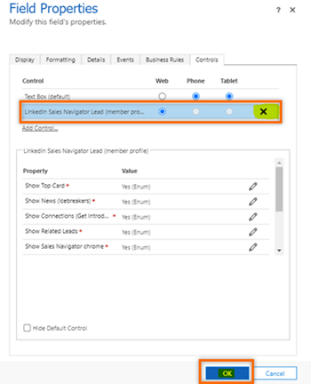
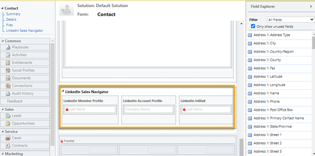

# Uninstall LinkedIn Sales Navigator

You can uninstall LinkedIn Sales Navigator if you don't want to use it in your organization. To uninstall, you must delete the following solutions in the following order:

1. LinkedInSalesNavigatorControlsForUnifiedClient
2. LinkedIn
3. msdyn_LinkedInSalesNavigatorAnchor

**To uninstall LinkedIn Sales Navigator**     
1. In your app, select **Settings** , and then select **Advanced Settings**.      
    > [!div class="mx-imgBorder"]  
    >      
2. Go to **Settings** > **Customizations** > **Solutions**.     
3. Select the **LinkedInSalesNavigatorControlsForUnifiedClient** solution.     
4. Select **Show Dependencies** to check whether there are any dependencies for the solution. If dependencies exist, you must remove them before you delete the solution. The following image shows an example of dependency details:     
    > [!div class="mx-imgBorder"]     
    >   
    These dependencies exist because LinkedIn controls are included in Account, Contact, Lead, or Opportunity forms. To remove the dependencies, follow these steps:   
      1. Open the form in the form editor.    
      2. Go to **LinkedIn Sales Navigator** section and remove the LinkedIn controls that are bound to form controls.      
          1.	Open bound fields (Last Name, Company Name) of LinkedIn Member, Account, and InMail Profile.       
          2.	On the **Field Properties** dialog box, go to the **Control** tab and remove the control binding.    
            > [!div class="mx-imgBorder"]     
            >                
      3. After removing the LinkedIn Member, Account, and InMail profile binding, select the **LinkedIn Sales Navigator** section, and then select **Remove**.   
          > [!div class="mx-imgBorder"]  
          >     
      4. Save and publish the form.  
      5. Repeat steps 1 through 4 for any other dependencies.      
5. After you've removed the all the dependencies, select **Delete**.      
6. Select **OK** in the confirmation message that appears.    
7. Repeat steps 3 through 6 for the **LinkedIn** and **msdyn_LinkedInSalesNavigatorAnchor** solutions.

### See also

[Install and enable LinkedIn Sales Navigator](install-sales-navigator.md)  
[Disable LinkedIn Sales Navigator](disable-sales-navigator.md)
